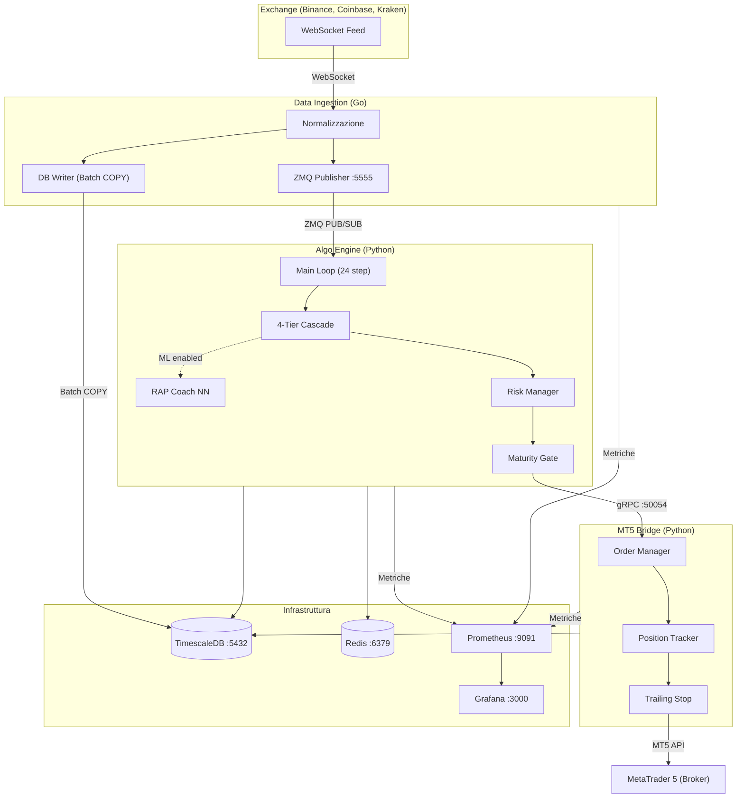

# MONEYMAKER V1 --- Ecosistema AI di Trading

**Autore:** Renan Augusto Macena
**Versione:** 1.0
**Licenza:** Proprietary --- All rights reserved

---

Sistema di trading algoritmico basato su intelligenza artificiale per MetaTrader 5.
Architettura a microservizi con pipeline di segnali a 4 livelli di fallback,
rete neurale RAP Coach opzionale (JEPA/GNN/MoE), gestione del rischio multi-livello,
e console operativa unificata TUI/CLI con 15 categorie di comandi.

MONEYMAKER opera in due modalita':
- **Rule-based** (default) --- strategie di analisi tecnica con routing basato sul regime di mercato
- **ML-augmented** --- quando il ML Training Lab e' deployato, le predizioni ML vengono provate per prime con fallback automatico al rule-based

---

## Indice della Documentazione

La documentazione completa del progetto e' organizzata in 8 guide tematiche nella cartella [`docs/`](docs/).
Ogni guida contiene diagrammi Mermaid, tabelle dettagliate, analogie esplicative e istruzioni operative.

| # | Documento | Contenuto | Link |
|---|-----------|-----------|------|
| 01 | **Architettura del Sistema** | Topologia servizi, flusso dati, protocolli, principi di design, dipendenze Docker | [01_ARCHITETTURA.md](docs/01_ARCHITETTURA.md) |
| 02 | **Installazione e Avvio** | Prerequisiti, setup Docker e manuale, configurazione .env e YAML, troubleshooting | [02_INSTALLAZIONE_E_AVVIO.md](docs/02_INSTALLAZIONE_E_AVVIO.md) |
| 03 | **Pipeline di Generazione Segnali** | Loop 24 step, cascade 4-tier, 20 moduli di intelligenza, maturity gate, regime detection | [03_PIPELINE_SEGNALI.md](docs/03_PIPELINE_SEGNALI.md) |
| 04 | **Training e Apprendimento** | RAP Coach (4 layer), walk-forward validation, shadow engine, feedback loop | [04_TRAINING_E_APPRENDIMENTO.md](docs/04_TRAINING_E_APPRENDIMENTO.md) |
| 05 | **MetaTrader 5 ed Esecuzione** | Flusso ordini, 7 validazioni pre-ordine, trailing stop, kill switch, circuit breaker | [05_METATRADER5_ESECUZIONE.md](docs/05_METATRADER5_ESECUZIONE.md) |
| 06 | **Console Operativa** | 15 categorie, 80+ comandi, modalita' TUI e CLI, flag, argomenti, esempi | [06_CONSOLE_OPERATIVA.md](docs/06_CONSOLE_OPERATIVA.md) |
| 07 | **Database e Storage** | Schema ER completo, hypertable TimescaleDB, audit log SHA-256, retention | [07_DATABASE_E_STORAGE.md](docs/07_DATABASE_E_STORAGE.md) |
| 08 | **Monitoraggio e Stabilita'** | 14 tool diagnostici, metriche Prometheus, checklist pre/post-deploy | [08_MONITORAGGIO_E_STABILITA.md](docs/08_MONITORAGGIO_E_STABILITA.md) |

---

## Architettura ad Alto Livello



### Flusso dei Dati in Sintesi

1. **Data Ingestion** riceve tick in tempo reale dagli exchange via WebSocket
2. I dati vengono normalizzati, scritti in TimescaleDB (batch COPY) e pubblicati via ZeroMQ
3. **Algo Engine** sottoscrive il feed ZMQ, esegue il loop principale a 24 step
4. La cascade a 4 livelli (COPER > Hybrid > Knowledge > Conservative) genera un segnale
5. Il segnale passa attraverso il maturity gate e la validazione rischio (10-point checklist)
6. Il segnale validato viene inviato via gRPC al **MT5 Bridge**
7. L'Order Manager esegue 7 validazioni pre-ordine prima di inviare l'ordine a MetaTrader 5
8. Il Position Tracker monitora le posizioni aperte con trailing stop adattivo

---

## Tech Stack

| Componente | Tecnologia | Versione | Scopo |
|-----------|-----------|---------|-------|
| Data Ingestion | Go | 1.22+ | Pipeline dati ad alte prestazioni |
| Algo Engine | Python | 3.11+ | Generazione segnali + rete neurale |
| MT5 Bridge | Python | 3.11+ | Esecuzione ordini su MetaTrader 5 |
| External Data | Python | 3.11+ | Dati macro (FRED, CBOE, CFTC) |
| Console | Python (Rich) | 3.11+ | Interfaccia operativa TUI/CLI |
| Database | TimescaleDB | PostgreSQL 16 | Serie temporali + audit trail |
| Cache | Redis | 7+ | Stato real-time + pub/sub |
| IPC | ZeroMQ | PUB/SUB | Streaming dati inter-processo |
| RPC | gRPC + Protobuf | 3 | Comunicazione tra servizi |
| Monitoring | Prometheus + Grafana | --- | Metriche e dashboard |
| Container | Docker Compose | 24+ | Orchestrazione servizi |
| CI/CD | GitHub Actions | --- | Lint, test, build, security scan |

---

## Quick Start

### Prerequisiti

- Docker 24+ e Docker Compose
- Python 3.10+ (3.11 raccomandato)
- Go 1.22+
- MetaTrader 5 (terminale installato)

### Avvio con Docker (Produzione)

```bash
# 1. Clona il repository
git clone https://github.com/renanaugustomacena-ux/trading-ecosystem.git
cd trading-ecosystem

# 2. Configura le variabili d'ambiente
cp .env.example .env
# Modifica .env con: credenziali MT5, API keys exchange, DB password

# 3. Avvia l'intero stack
cd program/infra/docker
docker-compose up -d

# 4. Verifica lo stato
docker-compose ps
```

### Avvio Manuale (Sviluppo)

```bash
# 1. Installa le dipendenze Python
cd program
pip install -e shared/python-common
pip install -e shared/proto
pip install -e services/algo-engine[dev]
pip install -e services/mt5-bridge[dev]

# 2. Avvia Data Ingestion (Go)
cd services/data-ingestion && go run cmd/server/main.go

# 3. Avvia Algo Engine (Python)
cd services/algo-engine && python -m algo_engine.main

# 4. Avvia MT5 Bridge (Python)
cd services/mt5-bridge && python -m mt5_bridge.main
```

> Per istruzioni dettagliate, troubleshooting e configurazione completa,
> consulta [02_INSTALLAZIONE_E_AVVIO.md](docs/02_INSTALLAZIONE_E_AVVIO.md).

---

## Porte e Servizi

| Servizio | Porta | Protocollo | Descrizione |
|----------|-------|------------|-------------|
| Data Ingestion | 5555 | ZMQ PUB | Stream dati di mercato |
| Data Ingestion | 8081 | HTTP | Health check |
| Data Ingestion | 9090 | HTTP | Metriche Prometheus |
| Algo Engine | 50054 | gRPC | API segnali di trading |
| Algo Engine | 8080 | HTTP | REST API + Health check |
| Algo Engine | 9093 | HTTP | Metriche Prometheus |
| MT5 Bridge | 50055 | gRPC | Esecuzione ordini MT5 |
| MT5 Bridge | 9094 | HTTP | Metriche Prometheus |
| External Data | 9095 | HTTP | Metriche Prometheus |
| TimescaleDB | 5432 | TCP | Database PostgreSQL |
| Redis | 6379 | TCP | Cache e stato in tempo reale |
| Prometheus | 9091 | HTTP | Raccolta metriche |
| Grafana | 3000 | HTTP | Dashboard di monitoraggio |

---

## Console Operativa

La MONEYMAKER Console e' un'interfaccia unificata TUI/CLI per gestire l'intero ecosistema.
Supporta 15 categorie di comandi con 80+ operazioni.

```bash
# Avvio TUI interattiva
python program/services/console/moneymaker_console.py

# Uso CLI diretto
python program/services/console/moneymaker_console.py brain status
python program/services/console/moneymaker_console.py risk kill-switch
python program/services/console/moneymaker_console.py test all
```

| Categoria | Comandi Principali | Descrizione |
|-----------|-------------------|-------------|
| `brain` | start, stop, status, eval, checkpoint | Controllo Algo Engine |
| `data` | start, stop, symbols, backfill, gaps | Gestione Data Ingestion |
| `mt5` | connect, positions, close-all | Operazioni MetaTrader 5 |
| `risk` | limits, kill-switch, circuit-breaker | Gestione del Rischio |
| `signal` | status, last, pending, confidence | Pipeline Segnali |
| `market` | regime, symbols, spread, calendar | Analisi Mercato |
| `test` | all, brain-verify, cascade, go | Test Suite |
| `build` | all, brain, ingestion, bridge | Build Docker |
| `sys` | status, resources, health, db, redis | Stato Sistema |
| `config` | broker, risk, view, validate | Configurazione |
| `svc` | up, down, restart, logs, scale | Lifecycle Servizi |
| `maint` | vacuum, reindex, backup, retention | Manutenzione DB |
| `tool` | logs, list | Utility Diagnostiche |

> Per la documentazione completa di ogni comando con flag, argomenti ed esempi,
> consulta [06_CONSOLE_OPERATIVA.md](docs/06_CONSOLE_OPERATIVA.md).

---

## Tool Diagnostici

14 tool specializzati in `program/services/algo-engine/tools/` garantiscono stabilita' e integrita':

| Tool | Scopo | Soglia Target |
|------|-------|---------------|
| `brain_verify.py` | Gate di deploy: 115 regole su 15 sezioni | 100% (0 failure) |
| `headless_validator.py` | Guard di regressione: 169 check | >= 98% |
| `ml_debugger.py` | Diagnostica neurale: stabilita' e qualita' | >= 87% |
| `dead_code_detector.py` | Scan codice morto: orfani e duplicati | >= 90% |
| `portability_check.py` | Portabilita' cross-platform | >= 83% |
| `moneymaker_hospital.py` | Salute sistema: 12 dipartimenti | 0 errori |
| `backend_validator.py` | Gate produzione: DB, modelli, coaching | >= 82% |
| `feature_audit.py` | Allineamento METADATA_DIM=60 | 100% |
| `integrity_manifest.py` | Manifesto SHA-256: drift detection | 100% |
| `build_tools.py` | Check pre/post-build | Pass |
| `db_health_diagnostic.py` | Diagnostica PostgreSQL: 10 sezioni | Pass |
| `dev_health.py` | Orchestratore pre-commit | Pass |
| `project_snapshot.py` | Snapshot sistema in <60 righe | Info |
| `context_gatherer.py` | Analisi AST: dipendenze e API pubblica | Info |

> Per descrizioni dettagliate, soglie, modalita' d'uso e interpretazione dei risultati,
> consulta [08_MONITORAGGIO_E_STABILITA.md](docs/08_MONITORAGGIO_E_STABILITA.md).

---

## Testing

```bash
# Test Algo Engine (321 test)
cd program/services/algo-engine
python -m pytest tests/ -v

# Test MT5 Bridge (5 test)
cd program/services/mt5-bridge
python -m pytest tests/ -v

# Test Data Ingestion (Go)
cd program/services/data-ingestion
go test ./...

# Tool diagnostici (verifica integrita')
cd program/services/algo-engine
python tools/headless_validator.py
python tools/ml_debugger.py
python tools/brain_verification/brain_verify.py
```

### Stato Attuale dei Test

| Suite | Test | Risultato |
|-------|------|-----------|
| Algo Engine (pytest) | 321/321 | PASS |
| MT5 Bridge (pytest) | 5/5 | PASS |
| brain_verify.py | 113/115 | 98.3% (2 NN red flag senza modello addestrato) |
| headless_validator.py | 167/169 | 98.8% (DB/Redis offline in dev) |
| ml_debugger.py | 8/8 | 100% |
| dead_code_detector.py | 10/11 | 90.9% |
| portability_check.py | 11/12 | 91.7% |

---

## CI/CD

Il progetto usa GitHub Actions con due workflow:

- **ci.yml** --- Lint (ruff + go vet) > Test (pytest + go test) > Build Docker (3 immagini)
- **security.yml** --- Audit dipendenze (pip audit + govulncheck) > Scan secrets

I workflow si attivano su push a `main` e su pull request.

---

## Struttura del Progetto

```
trading-ecosystem-main/
|-- program/
|   |-- services/
|   |   |-- algo-engine/          # Cervello AI (Python) - Pipeline segnali + RAP Coach NN
|   |   |   |-- src/algo_engine/  # Codice sorgente (main.py, 20 moduli)
|   |   |   |-- tests/         # 321 test (unit + integration + brain verification)
|   |   |   |-- tools/         # 14 tool diagnostici
|   |   |   |-- configs/       # Configurazioni YAML per ambiente
|   |   |   +-- Dockerfile
|   |   |-- data-ingestion/    # Data Ingestion (Go) - WebSocket + TimescaleDB
|   |   |   |-- cmd/server/    # Entry point Go
|   |   |   |-- internal/      # Adapters, DB writer, modelli
|   |   |   +-- Dockerfile
|   |   |-- mt5-bridge/        # MT5 Bridge (Python) - Esecuzione ordini
|   |   |   |-- src/mt5_bridge/ # Connector, OrderManager, PositionTracker
|   |   |   +-- Dockerfile
|   |   |-- external-data/     # Dati Macro (FRED, CBOE, CFTC)
|   |   |-- console/           # MONEYMAKER Console - TUI/CLI (15 categorie)
|   |   |-- ml-training/       # ML Training Lab (placeholder - macchina separata)
|   |   +-- monitoring/        # Grafana dashboard + Prometheus config
|   |-- shared/
|   |   |-- python-common/     # Libreria condivisa Python (logging, config, metrics)
|   |   |-- proto/             # Definizioni Protobuf + stub generati
|   |   +-- go-common/         # Libreria condivisa Go (decimal, config)
|   |-- infra/
|   |   +-- docker/            # docker-compose.yml + init-db/ (3 SQL)
|   |-- configs/               # YAML per-ambiente (development, production)
|   |-- scripts/               # Setup e utility operative
|   |-- tests/                 # Test E2E e fixture
|   |-- V1_Bot/                # Documentazione design (14 moduli di riferimento)
|   |-- Makefile               # Build, test, lint, deploy
|   +-- .github/workflows/     # CI/CD (ci.yml + security.yml)
|-- docs/                      # Documentazione completa (8 guide)
+-- .env.example               # Template variabili d'ambiente
```

---

## Principi di Design

1. **Decimal, mai float** --- Tutti i valori finanziari usano `decimal.Decimal` (Python) e `shopspring/decimal` (Go) per eliminare errori di arrotondamento
2. **Fail-safe** --- In caso di dubbio, il sistema tiene (HOLD). Circuit breaker, kill switch e max drawdown automatico proteggono il capitale
3. **ML opzionale** --- La pipeline di segnali funziona completamente in modalita' rule-based. Il ML augmenta ma non blocca mai il flusso operativo
4. **Observability** --- Ogni servizio espone metriche Prometheus, health check HTTP e logging strutturato JSON
5. **Immutabilita' dei trade** --- I record di trade sono append-only con hash chain SHA-256. Nessun UPDATE o DELETE e' possibile sulla tabella audit
6. **Credenziali da ambiente** --- Mai hardcoded. Tutte le credenziali provengono da variabili d'ambiente o file `.env`
7. **Cascade 4-tier** --- Se il tier principale (COPER) non raggiunge la soglia di confidenza, il sistema scala automaticamente ai tier successivi fino al Conservative
8. **Maturity gate** --- Il sistema deve dimostrare competenza (stato MATURE) prima di operare a piena capacita'. Inizia con sizing ridotto (DOUBT = 0%) e scala gradualmente

---

## Sicurezza

- **Kill switch multi-livello**: Console (`risk kill-switch`), circuit breaker automatico, MT5 Bridge (`mt5 close-all`)
- **Audit trail immutabile**: Hash chain SHA-256 con trigger anti-tampering su PostgreSQL
- **Scan secrets**: CI/CD include scan automatico per credenziali nel codice
- **Audit dipendenze**: `pip audit` e `govulncheck` in pipeline di sicurezza
- **PII scrubbing**: Sentry configurato con `_before_send` per rimuovere dati sensibili

---

## Accesso Localhost

Una volta avviato lo stack, i servizi sono accessibili localmente:

| Interfaccia | URL | Credenziali Default |
|-------------|-----|-------------------|
| Grafana Dashboard | http://localhost:3000 | admin / admin |
| Algo Engine REST API | http://localhost:8080 | --- |
| Algo Engine Health | http://localhost:8080/health | --- |
| Data Ingestion Health | http://localhost:8081/health | --- |
| Prometheus | http://localhost:9091 | --- |

---

## Come Contribuire allo Sviluppo

```bash
# 1. Crea un branch per la feature
git checkout -b feature/nome-feature

# 2. Esegui i test prima di ogni commit
cd program/services/algo-engine && python -m pytest tests/ -v

# 3. Esegui i tool diagnostici
python tools/headless_validator.py
python tools/brain_verification/brain_verify.py

# 4. Verifica lint e formato
cd program && make lint && make fmt

# 5. Commit e push
git add -A && git commit -m "feat: descrizione della modifica"
git push origin feature/nome-feature
```

> Per lo standard completo di code review, debugging e refactoring,
> consulta il file `.claude/CLAUDE.md`.

---

## Navigazione Rapida

### Per Operatori

- Come avviare il sistema: [02_INSTALLAZIONE_E_AVVIO.md](docs/02_INSTALLAZIONE_E_AVVIO.md)
- Come usare la console: [06_CONSOLE_OPERATIVA.md](docs/06_CONSOLE_OPERATIVA.md)
- Come monitorare le posizioni: [05_METATRADER5_ESECUZIONE.md](docs/05_METATRADER5_ESECUZIONE.md)
- Cosa fare in emergenza: [05_METATRADER5_ESECUZIONE.md](docs/05_METATRADER5_ESECUZIONE.md) (Capitolo Kill Switch)

### Per Sviluppatori

- Come funziona la pipeline: [03_PIPELINE_SEGNALI.md](docs/03_PIPELINE_SEGNALI.md)
- Come funziona il training: [04_TRAINING_E_APPRENDIMENTO.md](docs/04_TRAINING_E_APPRENDIMENTO.md)
- Schema del database: [07_DATABASE_E_STORAGE.md](docs/07_DATABASE_E_STORAGE.md)
- Come verificare la stabilita': [08_MONITORAGGIO_E_STABILITA.md](docs/08_MONITORAGGIO_E_STABILITA.md)

### Per Architetti

- Architettura completa: [01_ARCHITETTURA.md](docs/01_ARCHITETTURA.md)
- Principi di design e protocolli: [01_ARCHITETTURA.md](docs/01_ARCHITETTURA.md) (Capitolo Principi)
- Sicurezza e audit: [07_DATABASE_E_STORAGE.md](docs/07_DATABASE_E_STORAGE.md) (Capitolo Audit Log)
