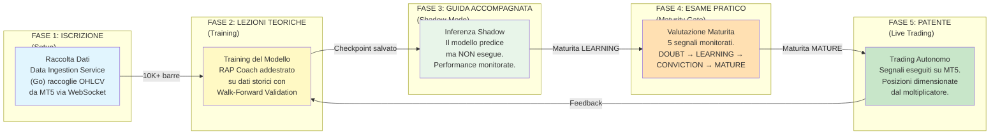
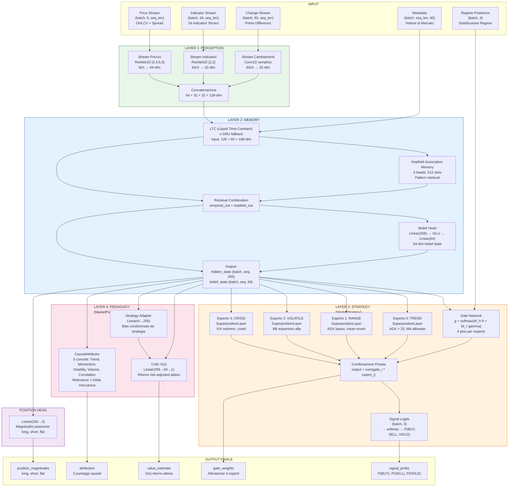
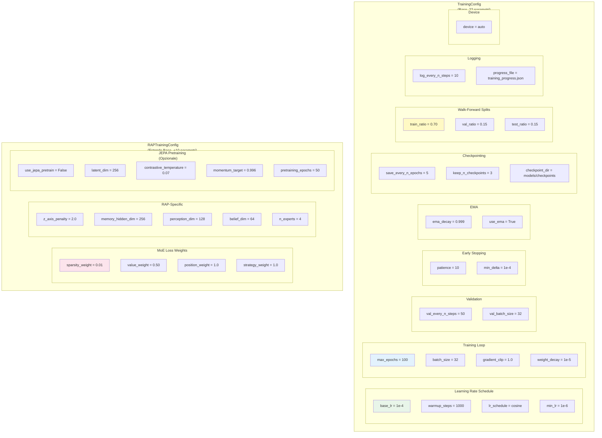
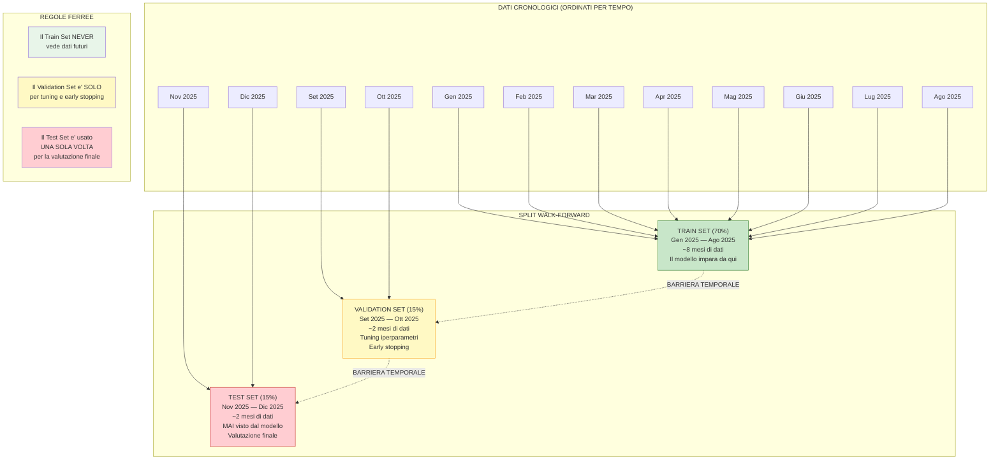
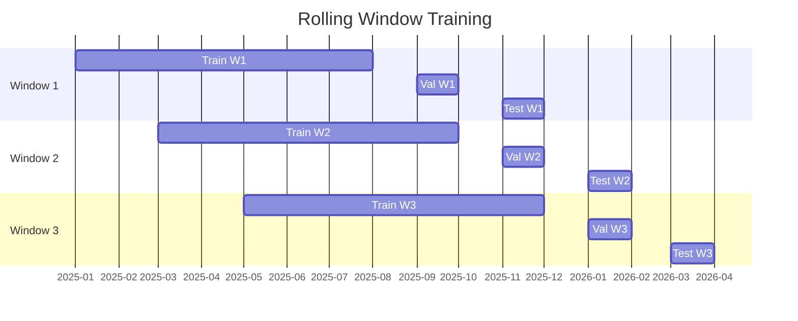
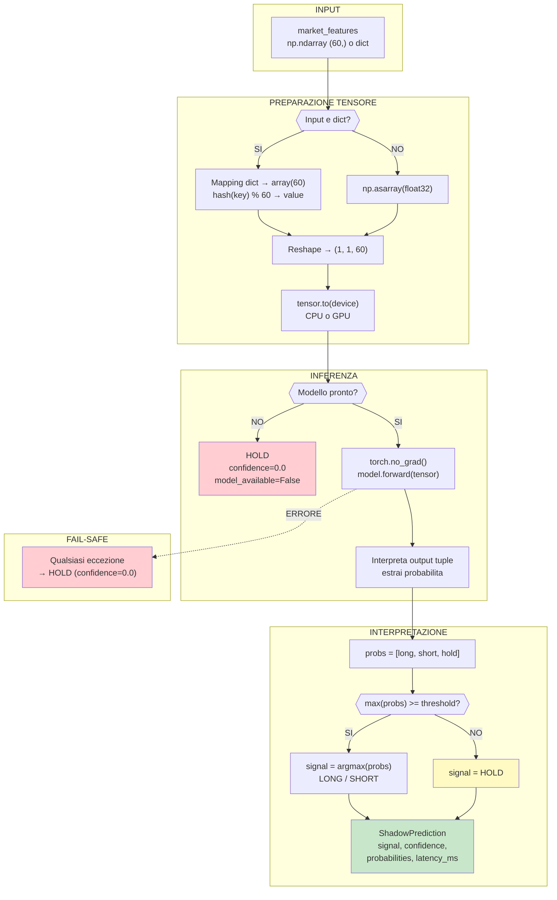
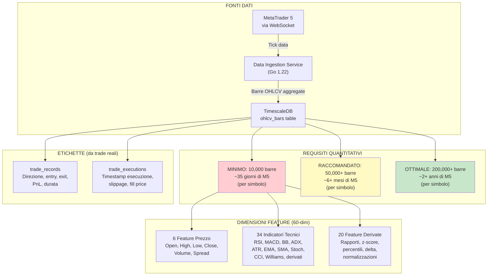
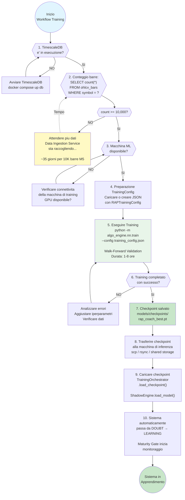
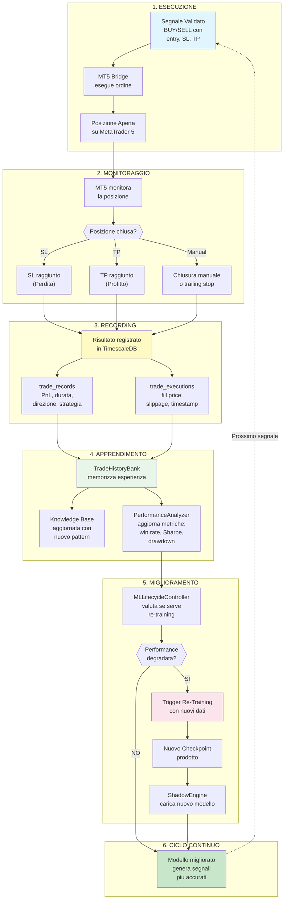

# Training e Apprendimento

**Progetto**: MONEYMAKER Trading Ecosystem
**Autore**: Renan Augusto Macena
**Data**: 2026-02-28
**Versione**: 1.0.0

---

## Indice

1. [Overview](#1-overview)
2. [Architettura del RAP Coach](#2-architettura-del-rap-coach)
3. [TrainingConfig -- Tutti i Parametri](#3-trainingconfig----tutti-i-parametri)
4. [Walk-Forward Validation](#4-walk-forward-validation)
5. [Shadow Engine (Inferenza Real-Time)](#5-shadow-engine-inferenza-real-time)
6. [Requisiti dei Dati per il Training](#6-requisiti-dei-dati-per-il-training)
7. [Quando il Sistema e Pronto per il Training](#7-quando-il-sistema-e-pronto-per-il-training)
8. [Feedback Loop](#8-feedback-loop)

---

## 1. Overview

Il sistema di training e apprendimento di MONEYMAKER funziona come una **scuola guida**. Esattamente come un aspirante conducente deve accumulare ore di guida, superare esami teorici e pratici, e dimostrare competenza prima di ricevere la patente, il sistema MONEYMAKER deve accumulare dati di mercato sufficienti, addestrare il suo modello neurale, superare validazioni rigorose, e dimostrare performance stabili prima di essere autorizzato a eseguire operazioni di trading con capitale reale.



L'analogia della scuola guida non e solo una metafora didattica: riflette una filosofia di design profonda. Un sistema di trading automatizzato che inizia a operare senza un adeguato periodo di apprendimento e validazione e come un neopatentato che guida in autostrada senza aver mai superato un esame: pericoloso per se e per gli altri. MONEYMAKER e progettato con la consapevolezza che i mercati finanziari sono un ambiente complesso e non stazionario, dove anche un modello ben addestrato puo diventare obsoleto se le condizioni di mercato cambiano radicalmente.

Il processo di apprendimento e ciclico, non lineare. Anche dopo aver raggiunto lo stato MATURE e ottenuto la "patente", il sistema continua a imparare dalle sue esperienze di trading reali. Ogni trade eseguito -- che sia un successo o un fallimento -- viene registrato nel database, analizzato, e incorporato nei successivi cicli di training. Questo crea un loop di feedback continuo che permette al sistema di adattarsi alle condizioni di mercato in evoluzione, come un guidatore esperto che migliora continuamente la sua abilita con l'esperienza.

La separazione fisica tra la macchina di training e la macchina di inferenza e una scelta architetturale deliberata. Il training richiede risorse computazionali significative (GPU, molta memoria, ore di calcolo), mentre l'inferenza deve essere leggera e veloce (millisecondi di latenza). In MONEYMAKER, il training avviene su una macchina dedicata con GPU (AMD RX 9070 XT), e il checkpoint risultante viene trasferito alla macchina di inferenza dove il ShadowEngine lo carica per le predizioni in tempo reale.

Il percorso completo, dalla prima barra di dati raccolta alla prima operazione di trading eseguita, richiede tipicamente diverse settimane. Non e un difetto: e una caratteristica di sicurezza. La pazienza durante la fase di apprendimento si traduce in capitale protetto durante la fase operativa. Come dice il proverbio nella scuola guida: "Meglio un giorno in piu di esercizio che un incidente al primo giro."

---

## 2. Architettura del RAP Coach

Il RAP Coach (Reasoning, Abstraction, and Pedagogy Coach) e il modello neurale al cuore del sistema di trading di MONEYMAKER. Derivato dall'architettura RAP del CS2 Analyzer (un sistema di coaching per il videogioco Counter-Strike 2), il RAP Coach e stato adattato al dominio finanziario mantenendo la stessa struttura a 4 strati che ha dimostrato la sua efficacia nell'analisi di situazioni tattiche complesse e nella generazione di raccomandazioni contestualizzate.



### Layer 1: PERCEPTION (MarketPerception)

Il primo strato del RAP Coach e la percezione, implementata nel modulo `market_perception.py`. La sua funzione e analoga alla corteccia visiva del cervello umano: trasforma i dati grezzi del mercato in una rappresentazione compressa e informativa che i livelli successivi possono elaborare efficientemente.

La percezione utilizza tre stream CNN 1D paralleli, ciascuno specializzato per un tipo diverso di dato di mercato:

**Stream 1 -- Prezzo (6 canali → 64 dimensioni)**: Questo e lo stream principale e piu profondo. I 6 canali di input corrispondono ai valori OHLCV (Open, High, Low, Close, Volume) piu lo Spread bid-ask. La rete e un ResNet1D con architettura [3, 4, 6, 3] -- la stessa profondita di un ResNet-50, adattata al dominio 1D. Ogni blocco residuale consiste in due convoluzioni 1D con kernel 3, batch normalization, ReLU, e shortcut connection. Il primo blocco usa stride=2 per il down-sampling. L'output passa attraverso un AdaptiveAvgPool1d(1) che produce un vettore a 64 dimensioni indipendente dalla lunghezza della sequenza di input.

La scelta di un ResNet cosi profondo per lo stream del prezzo riflette la complessita dei pattern di prezzo: breakout, pullback, consolidazione, gap, e pattern a candela richiedono livelli multipli di astrazione per essere catturati. Le connessioni residuali preservano la norma del gradiente attraverso la profondita, permettendo un training stabile anche con 16 blocchi.

**Stream 2 -- Indicatori (34 canali → 32 dimensioni)**: Questo stream processa i 34 indicatori tecnici calcolati dalla FeaturePipeline: RSI, MACD (signal line + istogramma), Bande di Bollinger (upper, middle, lower, width), ADX, +DI, -DI, ATR, EMA veloce, EMA lenta, SMA 20, SMA 50, SMA 200, Stochastic %K, Stochastic %D, CCI, Williams %R, e derivati. La rete e un ResNet1D piu leggero con architettura [2, 2], sufficiente perche gli indicatori sono gia pre-processati e normalizzati. L'output e un vettore a 32 dimensioni.

**Stream 3 -- Cambiamenti (60 canali → 32 dimensioni)**: Questo stream processa le prime differenze (delta) di tutte le 60 feature del METADATA_DIM. Le prime differenze catturano il tasso di cambiamento delle feature, informazione complementare ai valori assoluti processati dagli altri due stream. La rete e una semplice sequenza di due convoluzioni 1D (60→16→32 canali) con ReLU, seguita da AdaptiveAvgPool1d(1).

I tre stream vengono concatenati per produrre il **vettore di percezione a 128 dimensioni**: 64 (prezzo) + 32 (indicatori) + 32 (cambiamenti) = 128. Questo contratto dimensionale (128-dim) e preservato dall'architettura CS2 originale, dove la percezione visiva dei frame di gioco produceva un vettore della stessa dimensione.

### Layer 2: MEMORY (MarketMemory)

Il secondo strato e la memoria, implementata nel modulo `market_memory.py`. Questo strato e responsabile della modellazione delle dinamiche temporali del mercato: come le condizioni attuali sono collegate a quelle passate, quali pattern si stanno formando, e qual e la "credenza" del modello sullo stato corrente del mercato.

La memoria e composta da tre componenti principali:

**LTC (Liquid Time-Constant Network)**: Le reti LTC sono un tipo di rete neurale ricorrente biologicamente ispirata, dove le costanti temporali dei neuroni variano in base all'input. A differenza di un GRU o LSTM con costanti temporali fisse, un LTC puo adattare la velocita con cui "dimentica" e "ricorda" in base al contesto: durante periodi di alta volatilita, le costanti temporali si accorciano (il modello reagisce piu rapidamente), mentre durante mercati calmi, le costanti temporali si allungano (il modello da piu peso alla storia). L'input e la concatenazione del vettore di percezione (128-dim) e del vettore metadata (60-dim), per un totale di 188 dimensioni. L'output e un hidden state a 256 dimensioni.

Se la libreria `ncps` (Neural Circuit Policies) non e installata, il sistema esegue un fallback automatico a un GRU (Gated Recurrent Unit) standard, perdendo le costanti temporali adattive ma mantenendo la capacita di modellazione sequenziale.

Le costanti temporali dell'LTC sono inizializzate nell'intervallo [0.1, 100.0], coprendo dinamiche da sub-minuto a multi-giorno. Questo e un adattamento dal CS2, dove l'intervallo era [0.01, 10.0] per coprire da sub-secondo a decine di secondi.

**Hopfield Associative Memory**: Dopo l'elaborazione temporale, l'hidden state passa attraverso una rete di Hopfield moderna (`hflayers.py`), che funziona come una memoria associativa: dato il pattern corrente, richiama i pattern prototipici piu simili memorizzati nei 512 slot di memoria. Questo meccanismo e particolarmente utile per riconoscere situazioni di mercato gia incontrate: un breakout da consolidazione, un double top, una divergenza bullish. La memoria Hopfield usa 4 teste di attenzione per catturare diversi tipi di similarita simultaneamente.

L'output della Hopfield viene combinato con l'output del temporale tramite una connessione residuale (`combined_state = temporal_out + hopfield_out`), preservando sia le dinamiche temporali che i pattern associativi.

**Belief Head**: Lo stato combinato passa attraverso una testa di "credenza" (belief head) che produce un vettore a 64 dimensioni rappresentante la comprensione compressa del modello sullo stato del mercato. Questo vettore e usato internamente per il monitoraggio della maturita (la stabilita del belief state e uno dei 5 segnali di maturita). L'architettura e `Linear(256→256) → SiLU → Linear(256→64)`.

L'output completo del Layer 2 e: `hidden_state (batch, seq_len, 256)`, `belief_state (batch, seq_len, 64)`, e `hidden (stato ricorrente per la prossima chiamata)`.

### Layer 3: STRATEGY (MarketStrategy)

Il terzo strato e la strategia, implementata nel modulo `market_strategy.py`. Questo e il cuore decisionale del modello: un Mixture-of-Experts (MoE) con 4 esperti specializzati per diversi regimi di mercato, controllati da un gate network che determina quale esperto contribuisce di piu alla decisione finale.

**Gate Network**: Il gate calcola i pesi di attivazione per ciascun esperto usando la formula:

```
g = softmax(W_h * hidden_state + W_r * regime_posteriors)
```

dove `W_h` e `W_r` sono matrici di pesi apprendibili, `hidden_state` e l'output del Layer 2 (256-dim), e `regime_posteriors` e il vettore a 4 dimensioni con le probabilita posteriori di ciascun regime (TRENDING_UP, TRENDING_DOWN, RANGING, VOLATILE) prodotto dal RegimeEnsemble. Se i regime posteriors non sono disponibili, il gate usa solo l'hidden state.

**4 Esperti MoE**: Ogni esperto e un modulo identico nella struttura ma con pesi indipendenti:
- **Esperto 0 (Trend)**: Specializzato in mercati con trend chiaro. Favorisce segnali di continuazione del trend.
- **Esperto 1 (Range)**: Specializzato in mercati laterali. Favorisce segnali di mean-reversion.
- **Esperto 2 (Volatile)**: Specializzato in mercati ad alta volatilita. Approccio conservativo.
- **Esperto 3 (Crisis)**: Specializzato in condizioni estreme. Ultra-conservativo, favorisce HOLD.

Ogni esperto consiste in: `SuperpositionLayer(256→128, context=60) → ReLU → Linear(128→3)`. Il `SuperpositionLayer` e uno strato custom che modula i pesi della trasformazione lineare in base al vettore di contesto (il metadata vector a 60-dim), permettendo a ogni esperto di adattare il suo comportamento alla situazione specifica. La `gate_sparsity_loss()` L1 sulle attivazioni del gate incoraggia la specializzazione degli esperti: idealmente, per ogni situazione di mercato, solo uno o due esperti dovrebbero essere fortemente attivati.

L'output degli esperti viene combinato pesando i risultati di ciascun esperto per il corrispondente peso del gate:

```
output = sum(gate_weights[i] * expert_output[i]) per i in [0, 3]
```

Il risultato e un vettore a 3 dimensioni (logits per BUY, SELL, HOLD) che viene trasformato in probabilita tramite softmax.

### Layer 4: PEDAGOGY (MarketPedagogy + CausalAttributor)

Il quarto e ultimo strato e la pedagogia, implementata nei moduli `market_pedagogy.py` e nella classe `CausalAttributor`. Questo strato ha due funzioni: stimare il valore atteso del trade e spiegare *perche* il modello ha preso la decisione.

**Critic V(s)**: La rete critica stima il valore atteso risk-adjusted del trade corrente. L'architettura e: `Linear(256→64) → ReLU → Linear(64→1)`. L'output e uno scalare che rappresenta il rendimento atteso. Opzionalmente, uno `strategy_adapter` (Linear(4→256)) aggiunge un bias condizionato dal profilo strategico (momentum, mean-reversion, stat-arb, defensive) all'hidden state prima del calcolo del valore.

La funzione `calculate_advantage_gap(value_pred, actual_outcome)` calcola la differenza tra il rendimento reale e la stima V(s). Un gap positivo indica che il modello ha sottovalutato l'opportunita; un gap negativo indica sovrastima -- un segnale di allarme per la gestione del rischio.

**CausalAttributor**: L'attribuitore causale mappa l'hidden state a 5 punteggi di concetti di mercato interpretabili dall'uomo:

| Concetto | Indice | Delta Meccanica | Descrizione |
|----------|--------|-----------------|-------------|
| **Trend** | 0 | ADX normalizzato | Forza del trend direzionale |
| **Momentum** | 1 | RSI deviazione da 50 | Slancio del prezzo |
| **Volatility** | 2 | ATR z-score | Ampiezza dei movimenti |
| **Volume** | 3 | Volume ratio normalizzato | Attivita degli scambi |
| **Correlation** | 4 | Coefficiente di correlazione | Relazione con altri strumenti |

Per ogni concetto, l'attribuitore calcola: `attribution = relevance_weight * mechanical_delta`, dove `relevance_weight` e prodotto da una rete neurale (`Linear(256→32→5) → Sigmoid`) e `mechanical_delta` e il valore effettivo dell'indicatore corrispondente. Questo design separa l'"importanza contestuale" (appresa dalla rete) dalla "misura oggettiva" (calcolata dagli indicatori), producendo spiegazioni che sono sia contestualizzate che verificabili.

### Position Head

Oltre ai 4 strati principali, il RAP Coach include una testa di posizionamento separata: `Linear(256→3)` che produce le magnitudini delle posizioni per long, short, e flat. Queste magnitudini, combinate con le probabilita BUY/SELL/HOLD e il moltiplicatore di maturita, determinano la dimensione finale della posizione.

---

## 3. TrainingConfig -- Tutti i Parametri

La configurazione di training e centralizzata nelle dataclass `TrainingConfig` e `RAPTrainingConfig` definite nel modulo `training_config.py`. Queste classi sono serializzabili in JSON e vengono salvate accanto al checkpoint del modello per garantire la riproducibilita del training.



### Parametri Base (TrainingConfig)

**Learning Rate Schedule (4 parametri)**

| Parametro | Default | Descrizione |
|-----------|---------|-------------|
| `base_lr` | `1e-4` | Learning rate iniziale dopo il warmup. Valore scelto per bilanciare velocita di convergenza e stabilita: abbastanza alto per convergere in un numero ragionevole di epoche, abbastanza basso per evitare di saltare oltre i minimi. Per il trading, dove i segnali sono rumorosi, un LR piu basso e preferibile rispetto alla computer vision. |
| `warmup_steps` | `1000` | Numero di step di warmup lineare. Durante i primi 1000 step, il learning rate cresce linearmente da 0 a `base_lr`. Il warmup previene le instabilita iniziali quando i pesi sono random: senza warmup, i grandi gradienti dei primi batch possono "spingere" i pesi in regioni instabili dello spazio dei parametri. |
| `lr_schedule` | `"cosine"` | Tipo di schedule dopo il warmup. Opzioni: `cosine` (annealing cosinusoidale, il default e raccomandato), `linear` (decadimento lineare), `constant` (nessun decadimento). Il cosine schedule e preferito perche riduce gradualmente il LR, permettendo al modello di "raffinare" i pesi negli ultimi epoch senza grandi perturbazioni. |
| `min_lr` | `1e-6` | Learning rate minimo raggiunto alla fine dello schedule. Il LR non scende mai sotto questo valore per mantenere una capacita minima di aggiornamento. Un `min_lr` troppo basso (es. 0) puo causare stagnazione, mentre troppo alto (es. 1e-4) annullerebbe l'effetto dello schedule. |

**Training Loop (4 parametri)**

| Parametro | Default | Descrizione |
|-----------|---------|-------------|
| `max_epochs` | `100` | Numero massimo di epoche di training. In pratica, il training termina molto prima grazie all'early stopping (tipicamente 30-50 epoche). Il valore 100 e un upper bound di sicurezza. |
| `batch_size` | `32` | Dimensione del mini-batch. Con 60 feature e sequenze di 50-100 step temporali, un batch di 32 e sufficiente per stime stabili del gradiente senza richiedere eccessiva memoria GPU. Per la GPU AMD RX 9070 XT (16 GB VRAM), batch 32 lascia margine per le attivazioni intermedie. |
| `gradient_clip` | `1.0` | Norma L2 massima del gradiente. I gradienti vengono clippati a questa norma prima dell'aggiornamento dei pesi. Questo previene l'"esplosione del gradiente" comune nelle RNN e nei Mixture-of-Experts, dove combinazioni sfortunate di gate weights e expert outputs possono produrre gradienti enormi. |
| `weight_decay` | `1e-5` | Peso della regolarizzazione L2 (decadimento dei pesi). Un valore piccolo ma non zero previene l'overfitting penalizzando i pesi grandi. Per il trading, dove l'overfitting ai pattern storici e il rischio principale, il weight decay e essenziale. |

**Validation (2 parametri)**

| Parametro | Default | Descrizione |
|-----------|---------|-------------|
| `val_every_n_steps` | `50` | Frequenza di validazione in step di training. Ogni 50 step, il modello viene valutato sul set di validazione. Un valore troppo basso rallenta il training; troppo alto rischia di non catturare il punto ottimale. |
| `val_batch_size` | `32` | Dimensione del batch di validazione. Tipicamente uguale al batch di training. |

**Early Stopping (2 parametri)**

| Parametro | Default | Descrizione |
|-----------|---------|-------------|
| `patience` | `10` | Numero di validazioni consecutive senza miglioramento prima di fermare il training. Con `val_every_n_steps=50`, una patience di 10 corrisponde a 500 step senza miglioramento. Questo previene l'overfitting fermando il training quando il modello inizia a "memorizzare" i dati di training senza migliorare sulle performance di validazione. |
| `min_delta` | `1e-4` | Miglioramento minimo della metrica di validazione per considerarlo un "miglioramento". Un miglioramento inferiore a `1e-4` non resetta il contatore di patience. Questo previene il training infinito con miglioramenti infinitesimali. |

**EMA (2 parametri)**

| Parametro | Default | Descrizione |
|-----------|---------|-------------|
| `ema_decay` | `0.999` | Fattore di decadimento della media mobile esponenziale dei pesi. L'EMA mantiene una "copia smussata" dei pesi del modello, che tipicamente generalizza meglio della copia istantanea. Il valore 0.999 significa che l'EMA "ricorda" circa 1000 step precedenti. |
| `use_ema` | `True` | Se usare l'EMA per l'inferenza. Quando abilitato, il checkpoint salvato contiene sia i pesi EMA (usati per inferenza) sia i pesi istantanei (usati per il training). |

**Checkpointing (3 parametri)**

| Parametro | Default | Descrizione |
|-----------|---------|-------------|
| `save_every_n_epochs` | `5` | Frequenza di salvataggio del checkpoint in epoche. Ogni 5 epoche, un checkpoint completo viene salvato su disco. |
| `keep_n_checkpoints` | `3` | Numero massimo di checkpoint mantenuti. I checkpoint piu vecchi vengono eliminati per risparmiare spazio disco. Solo i migliori e i piu recenti vengono conservati. |
| `checkpoint_dir` | `"models/checkpoints"` | Directory dove vengono salvati i checkpoint. Relativa alla root del servizio algo-engine. |

**Walk-Forward Splits (3 parametri)**

| Parametro | Default | Descrizione |
|-----------|---------|-------------|
| `train_ratio` | `0.70` | Percentuale dei dati usati per il training. Il 70% dei dati (ordinati cronologicamente) costituisce il set di training. |
| `val_ratio` | `0.15` | Percentuale dei dati usati per la validazione. Il 15% dei dati immediatamente dopo il train set. |
| `test_ratio` | `0.15` | Percentuale dei dati usati per il test finale. L'ultimo 15% dei dati, mai visto durante training o validazione. |

**Logging (2 parametri)**

| Parametro | Default | Descrizione |
|-----------|---------|-------------|
| `log_every_n_steps` | `10` | Frequenza di logging delle metriche di training (loss, LR, gradienti). |
| `progress_file` | `"training_progress.json"` | File JSON dove viene scritto il progresso del training per monitoring esterno. |

**Device (1 parametro)**

| Parametro | Default | Descrizione |
|-----------|---------|-------------|
| `device` | `"auto"` | Dispositivo di training. Opzioni: `auto` (rileva automaticamente GPU disponibile), `cuda` (NVIDIA), `rocm` (AMD), `cpu`. Con l'AMD RX 9070 XT, il valore auto selezionera ROCm se disponibile, altrimenti CPU. |

### Parametri RAP Coach (RAPTrainingConfig, estende TrainingConfig)

**MoE Loss Weights (4 parametri)**

| Parametro | Default | Descrizione |
|-----------|---------|-------------|
| `sparsity_weight` | `0.01` | Peso della penalita L1 sulle attivazioni del gate del MoE. Incoraggia la specializzazione degli esperti: un valore piu alto forza il gate a scegliere un singolo esperto, un valore piu basso permette combinazioni morbide. Il valore 0.01 e un buon compromesso tra specializzazione e flessibilita. |
| `value_weight` | `0.50` | Peso della loss del critic V(s) nella funzione obiettivo complessiva. Il valore 0.50 bilancia l'importanza della predizione del valore con la predizione della direzione. |
| `position_weight` | `1.0` | Peso della loss del position sizing. Le posizioni ben dimensionate sono critiche per il rendimento risk-adjusted. |
| `strategy_weight` | `1.0` | Peso della loss della direzione del segnale (BUY/SELL/HOLD). Questa e la loss principale del modello. |

**RAP-Specific (5 parametri)**

| Parametro | Default | Descrizione |
|-----------|---------|-------------|
| `z_axis_penalty` | `2.0` | Penalita aggiuntiva per l'errore sull'asse Z (verticale). Ereditato dal CS2 dove l'asse Z era la posizione verticale del giocatore. Nel trading, rappresenta la penalita per errori nella stima della magnitudine del movimento di prezzo (non solo la direzione). |
| `memory_hidden_dim` | `256` | Dimensione dell'hidden state del modulo Memory. Deve corrispondere al parametro `hidden_dim` di MarketMemory. |
| `perception_dim` | `128` | Dimensione dell'output del modulo Perception. Deve corrispondere alla somma 64+32+32 dei tre stream. |
| `belief_dim` | `64` | Dimensione del belief state prodotto dalla belief head del modulo Memory. |
| `n_experts` | `4` | Numero di esperti nel Mixture-of-Experts. Corrisponde ai 4 regimi di mercato. |

**JEPA Pretraining (5 parametri, opzionali)**

| Parametro | Default | Descrizione |
|-----------|---------|-------------|
| `use_jepa_pretrain` | `False` | Se abilitare il pre-training in stile JEPA (Joint Embedding Predictive Architecture). Quando abilitato, il modello viene prima pre-addestrato con un obiettivo di self-supervised learning prima del fine-tuning supervisionato. |
| `latent_dim` | `256` | Dimensione dello spazio latente per il pre-training JEPA. |
| `contrastive_temperature` | `0.07` | Temperatura per la loss contrastiva nel pre-training. Un valore basso (0.07) produce distribuzioni piu "piccate", incoraggiando il modello a distinguere nettamente tra embedding simili e dissimili. |
| `momentum_target` | `0.996` | Momentum per l'aggiornamento della target network nel pre-training JEPA. La target network e aggiornata come EMA della online network. |
| `pretraining_epochs` | `50` | Numero di epoche di pre-training JEPA prima del fine-tuning supervisionato. |

---

## 4. Walk-Forward Validation

La Walk-Forward Validation e il protocollo di validazione adottato da MONEYMAKER per garantire che il modello non soffra di **temporal leakage** -- la contaminazione dei dati di training con informazioni dal futuro. Nei mercati finanziari, il temporal leakage e il peccato originale del backtesting: un modello che "vede" il futuro durante il training sembrera eccezionalmente performante in backtest ma fallira miserabilmente in produzione.



### Principio Fondamentale: No Temporal Leakage

La regola fondamentale della Walk-Forward Validation e semplice ma assoluta: **i dati di training NEVER vedono prezzi futuri**. Questo significa che:

1. Il split dei dati e **cronologico**, non casuale. Uno split casuale (come nel machine learning classico con `train_test_split(shuffle=True)`) contaminerebbe il training set con barre future, producendo un modello che "ricorda" il futuro invece di "predirlo".

2. Le barriere temporali sono **impermeabili**. Non c'e overlap tra train, validation, e test. Se il train set finisce il 31 agosto 2025, il validation set inizia il 1 settembre 2025. Non ci sono barre "condivise".

3. Le feature devono essere **causalmente valide**. Ogni feature usata nel training deve essere calcolabile usando solo dati disponibili al momento della barra. Feature come "media mobile futura" o "massimo dei prossimi 10 periodi" sarebbero temporal leakage.

### Rolling Window per Apprendimento Continuo

Oltre allo split statico descritto sopra, MONEYMAKER supporta un approccio a finestra scorrevole per l'apprendimento continuo. In questo schema, il modello viene periodicamente ri-addestrato con una finestra di dati che avanza nel tempo:



Ogni nuova finestra "dimentica" i dati piu vecchi e incorpora i dati piu recenti. Questo permette al modello di adattarsi ai cambiamenti strutturali del mercato (nuovi regimi, nuove correlazioni, cambio di volatilita) senza richiedere un training completo da zero. La frequenza di re-training dipende dalla stabilita del mercato: in condizioni normali, un re-training mensile e sufficiente; in condizioni di alta volatilita o cambio di regime, un re-training piu frequente puo essere necessario.

### Metriche di Valutazione sul Test Set

Il test set viene usato una sola volta, alla fine del training, per produrre le metriche finali di performance:

- **Accuracy direzionale**: Percentuale di barre in cui la direzione predetta (BUY/SELL/HOLD) corrisponde alla direzione reale del prezzo.
- **Profit factor**: Rapporto tra profitti totali e perdite totali delle operazioni simulate sul test set.
- **Sharpe ratio**: Rendimento medio diviso per la deviazione standard dei rendimenti, annualizzato. Un Sharpe > 1.0 e accettabile; > 2.0 e eccellente.
- **Max drawdown**: Il massimo calo percentuale dal picco di equity durante il test set.
- **Calibrazione della confidenza**: Quanto le probabilita predette corrispondono alle frequenze reali. Se il modello dice "70% BUY", il BUY dovrebbe essere corretto il 70% delle volte.

---

## 5. Shadow Engine (Inferenza Real-Time)

Il Shadow Engine e il motore di inferenza real-time che esegue il modello RAP Coach su ogni barra di mercato senza generare operazioni reali. Implementato nel modulo `shadow_engine.py`, il suo nome deriva dal concetto di "shadow trading" -- seguire il mercato come un'ombra, osservando e predendo senza intervenire.



### Architettura del Shadow Engine

Il Shadow Engine e progettato con tre principi fondamentali: **semplicita**, **robustezza**, e **latenza minima**.

**Semplicita**: L'interfaccia e volutamente semplice: una singola funzione `predict_tick(market_features)` che accetta un array numpy a 60 dimensioni (o un dizionario di feature) e restituisce un `ShadowPrediction` con segnale, confidenza, e probabilita. Non c'e bisogno di gestire sessioni, batch, o contesti -- il Shadow Engine gestisce tutto internamente.

**Robustezza (Fail-Safe)**: Il principio fondamentale e che il Shadow Engine non deve MAI crashare o produrre un'eccezione non gestita. Se il modello non e disponibile, restituisce HOLD con `model_available=False`. Se l'inferenza fallisce per qualsiasi motivo (tensore malformato, errore GPU, overflow numerico), restituisce HOLD con `model_available=True` (il modello c'e ma l'inferenza e fallita). Se PyTorch non e nemmeno installato (`_TORCH_AVAILABLE=False`), restituisce HOLD. In ogni caso, il chiamante riceve sempre un oggetto `ShadowPrediction` valido.

**Latenza minima**: L'inferenza avviene in contesto `torch.no_grad()` per disabilitare il calcolo dei gradienti, riducendo l'uso di memoria e la latenza. Su una GPU moderna, l'inferenza di un singolo tick richiede tipicamente 1-5 millisecondi. Su CPU, 10-50 millisecondi. Entrambi i valori sono ampiamente sotto il budget di latenza per il trading su timeframe M5 (5 minuti).

### ShadowPrediction

Il risultato dell'inferenza e un dataclass `ShadowPrediction` con i seguenti campi:

| Campo | Tipo | Descrizione |
|-------|------|-------------|
| `signal` | `str` | Direzione del segnale: `"LONG"`, `"SHORT"`, o `"HOLD"` |
| `confidence` | `float` | Confidenza della predizione, [0.0, 1.0] |
| `probabilities` | `dict` | Probabilita per ciascuna classe: `{"long": 0.6, "short": 0.1, "hold": 0.3}` |
| `latency_ms` | `float` | Latenza dell'inferenza in millisecondi |
| `model_available` | `bool` | Se il modello era disponibile per l'inferenza |

### Device-Aware Inference

All'inizializzazione, il Shadow Engine accetta un parametro `device` (default: `"cpu"`) che determina dove avviene l'inferenza. Il modello viene spostato sul dispositivo specificato con `model.to(device)` e messo in modalita eval con `model.eval()`. I tensori di input vengono spostati sullo stesso dispositivo prima dell'inferenza per evitare errori di mismatch.

Per il deployment di MONEYMAKER:
- La macchina di **training** usa la GPU (AMD RX 9070 XT via ROCm) per la velocita di training.
- La macchina di **inferenza** puo usare CPU (sufficiente per la latenza richiesta) o GPU se disponibile.

### Soglia di Confidenza

Il Shadow Engine utilizza una soglia di confidenza configurabile (default: 0.6) per determinare se una predizione e sufficientemente forte per essere considerata un segnale direzionale. Se la probabilita massima tra long, short, e hold e inferiore alla soglia, il segnale viene forzato a HOLD indipendentemente dalla classe con la probabilita piu alta. Questo previene segnali deboli basati su probabilita marginalmente superiori (es. long=0.35, short=0.33, hold=0.32).

---

## 6. Requisiti dei Dati per il Training

Il training del RAP Coach richiede una quantita significativa di dati di mercato di alta qualita. Questa sezione descrive i requisiti minimi e raccomandati, le fonti dei dati, e le dimensioni delle feature.



### Requisiti Quantitativi

**Minimo: 10,000 barre OHLCV per simbolo**: Con barre M5 (5 minuti) e circa 288 barre per giorno di trading (24 ore / 5 minuti), 10,000 barre corrispondono a circa 35 giorni di trading continuo. Questo e il minimo assoluto per produrre un modello che non sia completamente overfittato. Con 10,000 barre e un split 70/15/15, il train set contiene 7,000 barre -- sufficiente per coprire diversi regimi di mercato ma non per catturare eventi rari.

**Raccomandato: 50,000+ barre per simbolo**: Circa 6 mesi di dati M5. Questa quantita copre tipicamente tutti e 4 i regimi di mercato (trend rialzista, ribassista, laterale, volatile) e diversi cicli di sessione (Asian, London, New York). Il train set di 35,000 barre permette al modello di apprendere pattern robusti e generalizzabili.

**Ottimale: 200,000+ barre per simbolo**: Circa 2+ anni di dati M5. Questa quantita copre cicli macroeconomici completi (espansione, contrazione), eventi di stress (crisi finanziarie, pandemie), e cambiamenti strutturali del mercato. Con 200,000+ barre, il modello puo apprendere pattern di lungo termine e la robustezza dei segnali attraverso diversi regimi economici.

### Struttura delle 60 Feature (METADATA_DIM)

Le 60 feature che compongono il METADATA_DIM sono suddivise in tre categorie:

**6 Feature di Prezzo (indici 0-5)**:
- Open: prezzo di apertura della barra
- High: prezzo massimo della barra
- Low: prezzo minimo della barra
- Close: prezzo di chiusura della barra
- Volume: volume degli scambi nella barra
- Spread: differenza bid-ask al momento della chiusura

**34 Indicatori Tecnici (indici 6-39)**:
RSI (14 periodi), MACD line, MACD signal, MACD istogramma, Bollinger Band superiore, BB medio, BB inferiore, BB width, ADX, +DI, -DI, ATR (14 periodi), EMA veloce (12 periodi), EMA lenta (26 periodi), SMA 20, SMA 50, SMA 200, Stochastic %K, Stochastic %D, CCI (20 periodi), Williams %R, rate of change, momentum, OBV (On Balance Volume), VWAP, Parabolic SAR, Ichimoku Tenkan, Ichimoku Kijun, Ichimoku Senkou A, Ichimoku Senkou B, Chaikin Money Flow, Money Flow Index, force index, e ultimate oscillator.

**20 Feature Derivate (indici 40-59)**:
Rapporti tra EMA (ema_fast/ema_slow), rapporti tra SMA (sma_20/sma_50, sma_50/sma_200), z-score del prezzo rispetto a SMA 20, z-score del volume, percentile del RSI su 100 periodi, delta RSI (prima differenza), delta ADX, delta ATR normalizzato, range normalizzato (High-Low)/Close, body della candela normalizzato, shadow superiore normalizzata, shadow inferiore normalizzata, rapporto volume/volume medio, distanza dal VWAP normalizzata, angolo del trend (atan dell'EMA), forza relativa del settore, correlazione con indice di riferimento, e skewness dei rendimenti su 20 periodi.

### Fonti delle Etichette

Le etichette per il training supervisionato provengono da due tabelle del database TimescaleDB:

- **trade_records**: Contiene lo storico completo delle operazioni: simbolo, direzione (BUY/SELL), prezzo di ingresso, prezzo di uscita, PnL in pips e in valuta, durata del trade, strategia utilizzata, e stato di maturita al momento dell'apertura.

- **trade_executions**: Contiene i dettagli dell'esecuzione: timestamp esatto dell'esecuzione, prezzo di fill, slippage (differenza tra prezzo richiesto e prezzo ottenuto), e commento dell'esecuzione.

Queste etichette permettono al modello di apprendere non solo la direzione corretta (BUY vs SELL vs HOLD) ma anche la qualita dell'esecuzione (slippage atteso) e il rendimento risk-adjusted (PnL/rischio).

---

## 7. Quando il Sistema e Pronto per il Training

Il processo di avvio del training non e automatico: richiede che diverse precondizioni siano soddisfatte. Questa sezione descrive il workflow completo, dalla verifica dei dati disponibili al caricamento del checkpoint addestrato.



### Step 1-2: Verifica Dati

Il primo passo e verificare che TimescaleDB sia in esecuzione e contenga dati sufficienti. La query chiave e:

```sql
SELECT count(*) FROM ohlcv_bars WHERE symbol = 'EURUSD' AND timeframe = 'M5';
```

Se il conteggio e inferiore a 10,000, il sistema non ha dati sufficienti per produrre un modello affidabile. In questo caso, bisogna attendere che il Data Ingestion Service (Go) raccolga piu dati da MetaTrader 5. Con barre M5, servono circa 35 giorni di raccolta continua per raggiungere il minimo di 10,000 barre.

### Step 3: Disponibilita della Macchina ML

Il training richiede risorse computazionali significative. La macchina di training deve avere:
- GPU con almeno 8 GB di VRAM (MONEYMAKER usa AMD RX 9070 XT con 16 GB)
- Almeno 16 GB di RAM sistema
- Spazio disco sufficiente per i checkpoint (~500 MB per checkpoint)
- Connessione al database TimescaleDB (direttamente o via tunnel)

### Step 4-6: Esecuzione del Training

Il training viene eseguito con il `RAPTrainingConfig` che puo essere personalizzato via JSON. La durata tipica dipende dalla quantita di dati e dalla GPU:
- 10,000 barre: ~1 ora su GPU, ~4 ore su CPU
- 50,000 barre: ~4 ore su GPU, ~16 ore su CPU
- 200,000 barre: ~8 ore su GPU, ~32+ ore su CPU

Durante il training, il `MLLifecycleController` monitora la loss di training, la loss di validazione, il learning rate, e le metriche di performance. L'early stopping interrompe il training se non ci sono miglioramenti per 10 cicli di validazione consecutivi.

### Step 7-9: Trasferimento e Caricamento del Checkpoint

Il checkpoint salvato contiene:
- Pesi del modello (sia EMA che istantanei)
- Stato dell'optimizer
- TrainingConfig usata
- Metriche di training (loss finale, best validation loss)
- Epoch e step del best checkpoint

Il checkpoint viene trasferito alla macchina di inferenza e caricato dal `ShadowEngine` tramite `load_model()`. Dopo il caricamento, il ShadowEngine e pronto per l'inferenza real-time.

### Step 10: Transizione Automatica

Con il modello caricato, il sistema passa automaticamente dallo stato DOUBT allo stato LEARNING. Il Maturity Gate inizia a monitorare i 5 segnali di maturita, e il sistema opera al Tier 2 (Hybrid) della cascata. Le posizioni vengono dimensionate con il moltiplicatore 0.35 di LEARNING -- abbastanza piccole per limitare il rischio ma sufficienti per accumulare esperienza di trading reale che alimentera il feedback loop.

---

## 8. Feedback Loop

Il feedback loop e il meccanismo che chiude il cerchio dell'apprendimento, trasformando ogni operazione di trading in un'esperienza che migliora il modello nelle iterazioni successive. Senza un feedback loop efficace, il modello sarebbe statico -- addestrato una volta e mai piu aggiornato, destinato a diventare obsoleto man mano che le condizioni di mercato cambiano.



### Fase 1: Esecuzione del Trade

Quando un segnale supera tutti i 10 controlli di validazione e il rate limiting, viene inviato al MT5 Bridge via gRPC. Il MT5 Bridge traduce il segnale in un ordine MT5 nativo e lo esegue. L'ordine include tutti i parametri necessari: simbolo, direzione, volume (lot size), stop-loss, take-profit, e commento identificativo.

### Fase 2: Monitoraggio della Posizione

MetaTrader 5 monitora la posizione aperta in tempo reale. La posizione viene chiusa automaticamente quando:
- Il prezzo raggiunge lo **Stop-Loss**: la posizione viene chiusa in perdita. Il sistema registra la perdita e l'analisi post-hoc cerchera di capire se lo SL era troppo stretto, il timing era sbagliato, o il segnale era genuinamente errato.
- Il prezzo raggiunge il **Take-Profit**: la posizione viene chiusa in profitto. Il sistema analizza se il TP era ottimale (avrebbe potuto essere piu ambizioso?) o se il profitto era nella media.
- **Chiusura manuale** o trailing stop: per posizioni gestite attivamente o con trailing stop dinamico.

### Fase 3: Recording nel Database

Il risultato del trade viene registrato in due tabelle TimescaleDB:

**trade_records**: Contiene il riepilogo del trade: simbolo, direzione, prezzo di ingresso, prezzo di uscita, P&L in pips e in valuta base, durata in minuti, strategia attribuita (momentum, mean-reversion, stat-arb, defensive), stato di maturita al momento dell'apertura, confidenza del segnale, e tutti i 5 concetti causali dell'attribuzione.

**trade_executions**: Contiene i dettagli tecnici dell'esecuzione: timestamp di invio e di fill, prezzo richiesto vs prezzo ottenuto (slippage), commissioni, e eventuali errori di esecuzione.

### Fase 4: Apprendimento dall'Esperienza

I risultati dei trade alimentano tre sistemi di apprendimento:

**TradeHistoryBank**: Il banco storico memorizza ogni trade come un "caso" completo: vettore di mercato al momento dell'apertura (60-dim), direzione, risultato (profitto/perdita), durata, e attribuzione causale. Quando un nuovo segnale viene generato, il sistema cerca i casi piu simili nel banco storico per arricchire la decisione (Tier 1 COPER).

**Knowledge Base**: La knowledge base viene aggiornata con nuovi pattern: "In condizioni simili (regime TRENDING_UP, RSI > 60, ADX > 30), un BUY ha prodotto un profitto di X pips in Y minuti." Questi pattern vengono usati dal Tier 3 (Knowledge-Only) e dal Tier 2 (Hybrid) per informare le decisioni.

**PerformanceAnalyzer**: Le metriche di performance vengono aggiornate in tempo reale: win rate (percentuale di trade profittevoli), profit factor (profitti/perdite), Sharpe ratio (rendimento/rischio), max drawdown (massima perdita dal picco), e rendimento cumulativo. Queste metriche sono esposte a Prometheus per il monitoraggio su Grafana e sono usate dal MLLifecycleController per valutare la salute del modello.

### Fase 5: Trigger di Re-Training

Il `MLLifecycleController` valuta periodicamente (ogni 100 barre) se il modello corrente necessita di un aggiornamento. I trigger per il re-training includono:

- **Degradazione delle performance**: Win rate sceso sotto il 45% nelle ultime 100 operazioni. Profit factor sceso sotto 1.0. Sharpe ratio negativo.
- **Feature drift significativo**: Il DriftMonitor ha rilevato che la distribuzione delle feature si e spostata significativamente rispetto alla distribuzione di training. Il modello sta operando su dati "fuori distribuzione".
- **Cambio di regime prolungato**: Il regime di mercato e cambiato in modo persistente (es. da RANGING a VOLATILE per piu di 2 settimane) e il modello non si e adattato.
- **Nuovo dati disponibili**: Sono trascorsi piu di 30 giorni dall'ultimo training e ci sono almeno 5,000 nuove barre disponibili.

Quando un trigger si attiva, il MLLifecycleController notifica l'operatore (via Telegram) e, se configurato per il re-training automatico, avvia un nuovo ciclo di training sulla macchina ML. Il nuovo checkpoint viene trasferito e caricato, e il ciclo ricomincia.

### Fase 6: Miglioramento Continuo

Il modello migliorato genera segnali piu accurati, che producono trade migliori, che a loro volta alimentano il prossimo ciclo di training con esperienze piu rilevanti. Questo crea un **ciclo virtuoso** dove il sistema diventa progressivamente piu competente nel tempo.

Tuttavia, il ciclo virtuoso ha un rischio simmetrico: se il modello inizia a degradare e produce trade sbagliati, le esperienze negative possono contaminare il prossimo ciclo di training, creando un **ciclo vizioso**. Per prevenire questo scenario, MONEYMAKER implementa diverse protezioni:

1. **Maturity Gate**: Se le performance degradano, il sistema retrocede automaticamente da MATURE/CONVICTION a LEARNING o DOUBT, riducendo le dimensioni delle posizioni o fermandosi completamente.

2. **Kill Switch automatico**: Se le perdite giornaliere superano la soglia critica, tutta l'operativita viene fermata.

3. **Filtro delle esperienze**: Durante il re-training, le esperienze con risultati estremi (profitti o perdite molto grandi) vengono clippate per evitare che eventi anomali distorcano l'apprendimento.

4. **Walk-Forward rigoroso**: Ogni re-training usa lo split cronologico Walk-Forward, assicurando che il modello non possa "memorizzare" pattern temporanei.

5. **Confronto con il modello precedente**: Il nuovo checkpoint viene confrontato con il modello corrente sul test set. Se il nuovo modello non migliora significativamente le metriche, il modello corrente viene mantenuto (principio del "if it ain't broke, don't fix it").

Questo sistema di sicurezza multi-livello assicura che il feedback loop produca un miglioramento netto nel tempo, anche in presenza di periodi avversi e cambiamenti strutturali del mercato. Come nella scuola guida, l'esperienza rende migliori guidatori -- ma solo se si impara dai propri errori con disciplina e rigore analitico.
