# MetaTrader 5 ed Esecuzione Ordini

**Autore:** Renan Augusto Macena
**Data:** 2026-02-28
**Versione:** 1.0.0

---

## Indice

1. [Overview](#1-overview)
2. [Architettura MT5 Bridge](#2-architettura-mt5-bridge)
3. [Flusso degli Ordini](#3-flusso-degli-ordini)
4. [Le 7 Validazioni Pre-Ordine](#4-le-7-validazioni-pre-ordine)
5. [Tipologie di Ordine](#5-tipologie-di-ordine)
6. [Tracciamento Posizioni e Trailing Stop](#6-tracciamento-posizioni-e-trailing-stop)
7. [Kill Switch e Circuit Breaker](#7-kill-switch-e-circuit-breaker)
8. [Guida alla Configurazione MT5](#8-guida-alla-configurazione-mt5)
9. [Procedure di Emergenza](#9-procedure-di-emergenza)
10. [Riferimento Configurazione](#10-riferimento-configurazione)

---

## 1. Overview

Immaginate di trovarvi allo sportello di una banca. Ogni volta che un cliente richiede un'operazione finanziaria -- un prelievo, un bonifico, un investimento -- il cassiere non si limita a premere un pulsante e trasferire il denaro. Il cassiere verifica l'identita del cliente controllando il documento, verifica il saldo disponibile consultando il sistema, conferma l'importo chiedendo una seconda volta, controlla che la destinazione sia valida, e solo dopo aver superato tutti questi controlli procede all'esecuzione materiale della transazione. Se anche uno solo di questi controlli fallisce, l'operazione viene rifiutata con una spiegazione chiara del motivo.

Il modulo di esecuzione ordini del sistema MONEYMAKER funziona esattamente come questo cassiere di banca meticoloso. L'`OrderManager` e il nostro cassiere: riceve le richieste di trading dal cervello artificiale (Algo Engine), le sottopone a una serie rigorosa di controlli di sicurezza, e solo quando tutti e sette i controlli vengono superati con successo, invia l'ordine al terminale MetaTrader 5 per l'esecuzione effettiva sul mercato.

Questo approccio potrebbe sembrare eccessivamente prudente, ma nel trading algoritmico la prudenza non e mai troppa. Un singolo ordine errato, inviato con un lotto troppo grande o senza stop-loss, puo causare perdite catastrofiche in pochi secondi. Il mercato Forex opera con leva finanziaria, il che significa che un errore di sizing puo amplificare le perdite ben oltre il capitale investito. Per questo motivo, ogni segnale generato dall'intelligenza artificiale deve superare sette livelli di validazione prima di diventare un ordine reale.

Il modulo MT5 Bridge rappresenta il punto di contatto tra il mondo digitale delle decisioni algoritmiche e il mondo reale dei mercati finanziari. E il componente piu critico dell'intero ecosistema MONEYMAKER, perche e l'unico che muove denaro reale. Tutti gli altri servizi -- raccolta dati, analisi, generazione segnali -- sono operazioni di lettura e calcolo. Il MT5 Bridge e l'unico servizio che scrive sul mercato, e per questo merita il massimo livello di attenzione, validazione e monitoraggio.

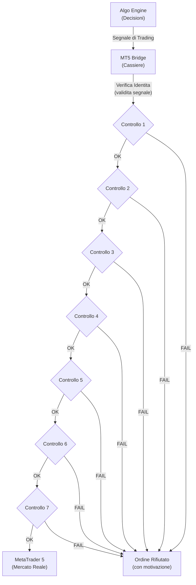
```mermaid
graph TD
    A["Algo Engine<br/>(Decisioni)"] -->|Segnale di Trading| B["MT5 Bridge<br/>(Cassiere)"]
    B -->|"Verifica Identita<br/>(validita segnale)"| C{Controllo 1}
    C -->|OK| D{Controllo 2}
    D -->|OK| E{Controllo 3}
    E -->|OK| F{Controllo 4}
    F -->|OK| G{Controllo 5}
    G -->|OK| H{Controllo 6}
    H -->|OK| I{Controllo 7}
    I -->|OK| J["MetaTrader 5<br/>(Mercato Reale)"]
    C -->|FAIL| K["Ordine Rifiutato<br/>(con motivazione)"]
    D -->|FAIL| K
    E -->|FAIL| K
    F -->|FAIL| K
    G -->|FAIL| K
    H -->|FAIL| K
    I -->|FAIL| K
```

In questo documento descriveremo in dettaglio ogni componente del modulo di esecuzione, partendo dall'architettura generale del MT5 Bridge, passando per il flusso completo degli ordini, le sette validazioni pre-ordine, le tipologie di ordine supportate, il sistema di tracciamento posizioni con trailing stop, i meccanismi di sicurezza (kill switch e circuit breaker), la guida alla configurazione iniziale, le procedure di emergenza e infine il riferimento completo di tutte le variabili di configurazione.

---

## 2. Architettura MT5 Bridge

Il MT5 Bridge e progettato come un microservizio gRPC indipendente che funge da intermediario tra l'Algo Engine e il terminale MetaTrader 5. L'architettura segue il principio della separazione delle responsabilita: ogni componente ha un ruolo ben definito e comunica con gli altri attraverso interfacce chiare.

### Componenti Principali

L'architettura del bridge si compone di cinque elementi fondamentali che collaborano in una catena di responsabilita ben definita.

L'**ExecutionServer** e il punto di ingresso del servizio. Si tratta di un server gRPC che ascolta sulla porta 50055 e espone il metodo `ExecuteTrade` al quale l'Algo Engine invia i segnali di trading. Il server gestisce la deserializzazione dei messaggi Protobuf, il routing verso il servicer appropriato, e la serializzazione delle risposte. Implementa anche un interceptor per il logging strutturato di ogni richiesta ricevuta, includendo timestamp, simbolo, direzione e confidence del segnale.

L'**ExecutionServicer** implementa la logica di business del servizio gRPC. Riceve il `TradingSignal` deserializzato dall'ExecutionServer e lo passa all'OrderManager per l'elaborazione. Gestisce le eccezioni, converte gli errori interni in codici di stato gRPC appropriati (INVALID_ARGUMENT per segnali malformati, RESOURCE_EXHAUSTED per limiti raggiunti, INTERNAL per errori imprevisti), e costruisce la risposta `TradeExecution` da restituire al chiamante.

L'**OrderManager** e il cuore del sistema di esecuzione. E il "cassiere" della nostra analogia bancaria. Riceve i segnali validati dal servicer, li sottopone alle sette validazioni pre-ordine, calcola il dimensionamento del lotto, costruisce la richiesta di ordine nel formato MT5, e la inoltra al connector per l'esecuzione effettiva. Mantiene anche lo stato della deduplicazione dei segnali e i contatori per il monitoraggio.

Il **MT5Connector** e l'interfaccia diretta con la libreria Python `MetaTrader5`. Si occupa della connessione e disconnessione dal terminale, dell'invio degli ordini tramite `order_send()`, della modifica delle posizioni esistenti tramite `order_check()` e `position_modify()`, e della lettura dello stato del conto (equity, margine libero, posizioni aperte). Implementa un meccanismo di retry con backoff esponenziale per gestire disconnessioni temporanee.

Il **PositionTracker** e un thread di background che monitora continuamente le posizioni aperte. Ogni 5 secondi interroga il terminale MT5 per ottenere la lista delle posizioni attive, calcola il profitto corrente di ciascuna, e applica la logica del trailing stop per proteggere i profitti accumulati. Opera in modo completamente indipendente dal flusso di esecuzione ordini.

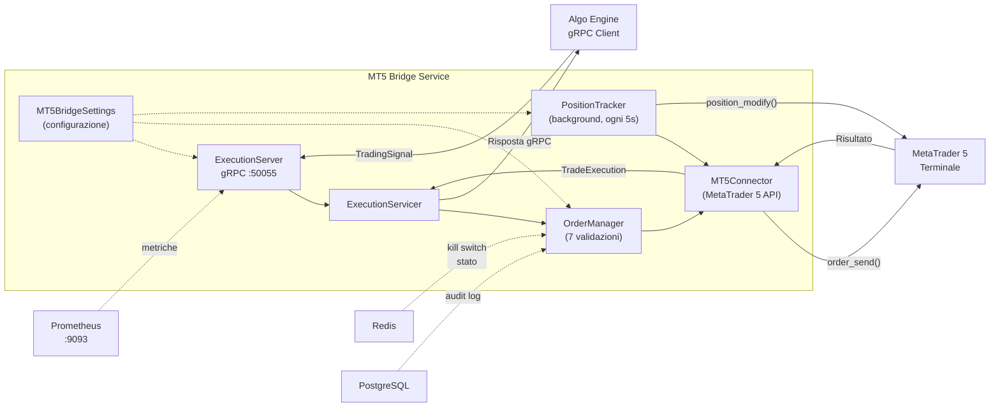
```mermaid
graph LR
    subgraph "MT5 Bridge Service"
        A["ExecutionServer<br/>gRPC :50055"] --> B["ExecutionServicer"]
        B --> C["OrderManager<br/>(7 validazioni)"]
        C --> D["MT5Connector<br/>(MetaTrader 5 API)"]
        E["PositionTracker<br/>(background, ogni 5s)"] --> D
        F["MT5BridgeSettings<br/>(configurazione)"] -.-> A
        F -.-> C
        F -.-> E
    end

    G["Algo Engine<br/>gRPC Client"] -->|"TradingSignal"| A
    D -->|"order_send()"| H["MetaTrader 5<br/>Terminale"]
    E -->|"position_modify()"| H
    H -->|"Risultato"| D
    D -->|"TradeExecution"| B
    B -->|"Risposta gRPC"| G

    I["Redis"] -.->|"kill switch<br/>stato"| C
    J["PostgreSQL"] -.->|"audit log"| C
    K["Prometheus<br/>:9093"] -.->|"metriche"| A
```

### Configurazione: MT5BridgeSettings

La configurazione del servizio e gestita tramite la classe `MT5BridgeSettings` che eredita da Pydantic `BaseSettings`. Questo permette di caricare i parametri sia da variabili d'ambiente che da file `.env`, con validazione automatica dei tipi e valori di default sensati. La configurazione e immutabile dopo l'inizializzazione: una volta che il servizio parte con determinati parametri, questi non cambiano durante l'esecuzione, garantendo comportamento prevedibile e auditabile.

Il server gRPC espone anche un endpoint di metriche Prometheus sulla porta configurata (default 9093), che fornisce contatori per ordini eseguiti, ordini rifiutati (suddivisi per motivo di rifiuto), latenza di esecuzione, e stato della connessione MT5. Queste metriche alimentano i dashboard Grafana del sistema di monitoraggio MONEYMAKER.

---

## 3. Flusso degli Ordini

Il flusso completo di un ordine, dal segnale generato dall'Algo Engine fino alla conferma di esecuzione sul mercato, attraversa una serie precisa di passaggi. Comprendere questo flusso e fondamentale per diagnosticare problemi, ottimizzare la latenza e garantire che ogni ordine venga tracciato correttamente nell'audit log.

### Sequenza Completa

Il processo inizia quando l'Algo Engine, dopo aver analizzato i dati di mercato e generato un segnale con sufficiente confidenza, invia una richiesta gRPC `ExecuteTrade` contenente un messaggio `TradingSignal`. Questo messaggio include il simbolo (es. EURUSD), la direzione (BUY o SELL), la confidenza (0.0-1.0), il prezzo suggerito di stop-loss, il prezzo suggerito di take-profit, e metadati aggiuntivi come il regime di mercato corrente e la strategia che ha generato il segnale.

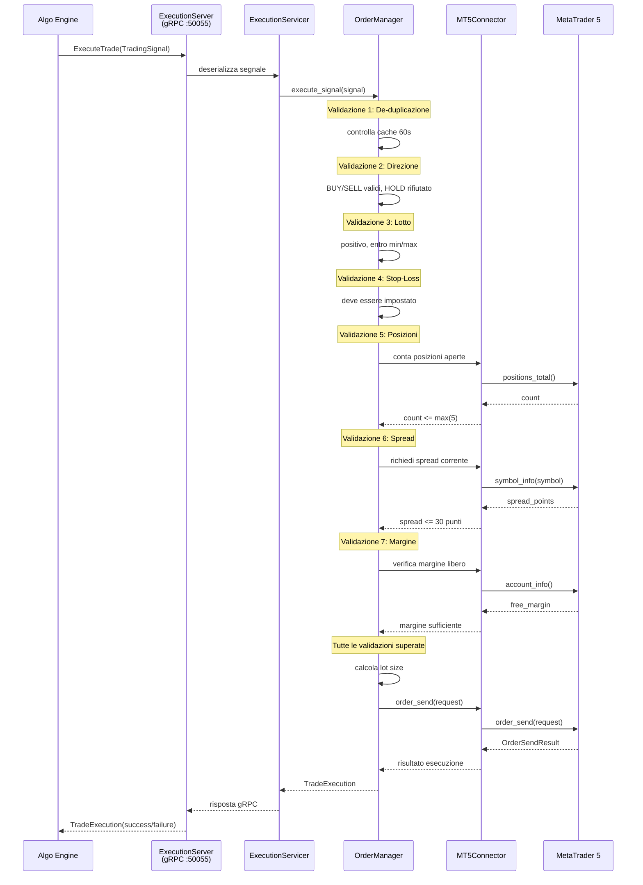
```mermaid
sequenceDiagram
    participant Brain as Algo Engine
    participant Server as ExecutionServer<br/>(gRPC :50055)
    participant Servicer as ExecutionServicer
    participant OM as OrderManager
    participant MT5C as MT5Connector
    participant MT5 as MetaTrader 5

    Brain->>Server: ExecuteTrade(TradingSignal)
    Server->>Servicer: deserializza segnale
    Servicer->>OM: execute_signal(signal)

    Note over OM: Validazione 1: De-duplicazione
    OM->>OM: controlla cache 60s

    Note over OM: Validazione 2: Direzione
    OM->>OM: BUY/SELL validi, HOLD rifiutato

    Note over OM: Validazione 3: Lotto
    OM->>OM: positivo, entro min/max

    Note over OM: Validazione 4: Stop-Loss
    OM->>OM: deve essere impostato

    Note over OM: Validazione 5: Posizioni
    OM->>MT5C: conta posizioni aperte
    MT5C->>MT5: positions_total()
    MT5-->>MT5C: count
    MT5C-->>OM: count <= max(5)

    Note over OM: Validazione 6: Spread
    OM->>MT5C: richiedi spread corrente
    MT5C->>MT5: symbol_info(symbol)
    MT5-->>MT5C: spread_points
    MT5C-->>OM: spread <= 30 punti

    Note over OM: Validazione 7: Margine
    OM->>MT5C: verifica margine libero
    MT5C->>MT5: account_info()
    MT5-->>MT5C: free_margin
    MT5C-->>OM: margine sufficiente

    Note over OM: Tutte le validazioni superate
    OM->>OM: calcola lot size
    OM->>MT5C: order_send(request)
    MT5C->>MT5: order_send(request)
    MT5-->>MT5C: OrderSendResult
    MT5C-->>OM: risultato esecuzione
    OM-->>Servicer: TradeExecution
    Servicer-->>Server: risposta gRPC
    Server-->>Brain: TradeExecution(success/failure)
```

### Dettaglio dei Passaggi

**Ricezione (< 1ms):** Il server gRPC riceve il messaggio Protobuf e lo deserializza. Il timestamp di ricezione viene registrato per il calcolo della latenza end-to-end.

**Routing (< 1ms):** Il servicer identifica il tipo di richiesta e invoca il metodo appropriato dell'OrderManager. In futuro questo layer supportera anche richieste di modifica e chiusura posizioni.

**Validazione (1-5ms):** L'OrderManager esegue le sette validazioni in sequenza. Le prime quattro sono validazioni locali (cache, formato del segnale) e richiedono microsecondi. Le ultime tre richiedono comunicazione con il terminale MT5 e quindi sono piu lente. Se una validazione fallisce, le successive non vengono eseguite (fail-fast) e viene restituito immediatamente il motivo del rifiuto.

**Calcolo Lotto (< 1ms):** Basandosi sull'equity corrente, la percentuale di rischio configurata e la distanza dello stop-loss in pips, l'OrderManager calcola il dimensionamento ottimale del lotto. Il risultato viene sempre clampato nell'intervallo [0.01, 1.0] per evitare sia ordini microscopici che ordini troppo grandi.

**Esecuzione (50-500ms):** Il MT5Connector invia l'ordine al terminale MetaTrader 5 tramite la funzione `order_send()`. La latenza di questo passaggio dipende dalla connessione al server del broker, dalle condizioni di mercato (alta volatilita = maggiore latenza) e dal tipo di ordine. Gli ordini a mercato sono generalmente piu rapidi degli ordini limite.

**Conferma (< 5ms):** Il risultato dell'esecuzione viene impacchettato in un messaggio `TradeExecution` che contiene: ticket dell'ordine, prezzo di esecuzione effettivo, volume eseguito, slippage, codice di errore MT5 (0 = successo), e timestamp di esecuzione. Questo messaggio viene restituito all'Algo Engine tramite la risposta gRPC.

**Audit (asincrono):** In parallelo alla risposta, l'OrderManager registra l'operazione completa nell'audit log su PostgreSQL, includendo tutti i dettagli del segnale originale, le validazioni superate, il risultato dell'esecuzione e la latenza misurata. Questo log e fondamentale per l'analisi post-trading e il miglioramento continuo del sistema.

---

## 4. Le 7 Validazioni Pre-Ordine

Le sette validazioni pre-ordine rappresentano il nucleo della sicurezza del sistema di esecuzione. Ogni validazione e stata progettata per prevenire una specifica categoria di errori o rischi. L'ordine delle validazioni non e casuale: le validazioni piu economiche (computazionalmente) e piu probabili di fallire vengono eseguite per prime, seguendo il principio del fail-fast.

### Validazione 1: De-duplicazione del Segnale

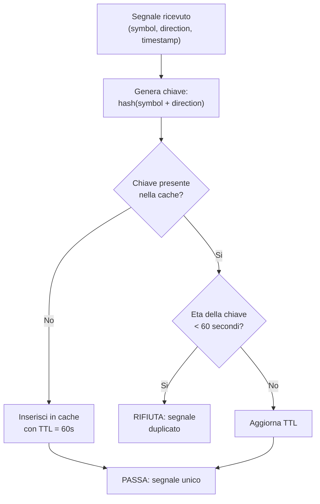
```mermaid
flowchart TD
    A["Segnale ricevuto<br/>(symbol, direction, timestamp)"] --> B["Genera chiave:<br/>hash(symbol + direction)"]
    B --> C{"Chiave presente<br/>nella cache?"}
    C -->|"No"| D["Inserisci in cache<br/>con TTL = 60s"]
    D --> E["PASSA: segnale unico"]
    C -->|"Si"| F{"Eta della chiave<br/>< 60 secondi?"}
    F -->|"Si"| G["RIFIUTA: segnale<br/>duplicato"]
    F -->|"No"| H["Aggiorna TTL"]
    H --> E
```

**Problema prevenuto:** L'Algo Engine potrebbe generare segnali multipli identici in rapida successione, ad esempio durante un picco di volatilita dove ogni tick conferma la stessa direzione. Senza deduplicazione, il sistema aprirebbe posizioni multiple sullo stesso strumento nella stessa direzione, amplificando involontariamente l'esposizione.

**Implementazione:** L'OrderManager mantiene un dizionario in memoria (cache locale) dove la chiave e composta dal simbolo e dalla direzione del segnale, e il valore e il timestamp dell'ultimo segnale accettato. Quando arriva un nuovo segnale, il sistema verifica se esiste gia una chiave corrispondente con eta inferiore a 60 secondi. Se si, il segnale viene rifiutato come duplicato. Il TTL di 60 secondi e configurabile tramite il parametro `signal_dedup_window_sec`.

**Nota importante:** La deduplicazione e per simbolo+direzione, non solo per simbolo. Questo significa che un BUY EURUSD e un SELL EURUSD non sono considerati duplicati, perche rappresentano decisioni di trading opposte che potrebbero essere entrambe valide (ad esempio, chiusura di una posizione e apertura di una posizione inversa).

### Validazione 2: Validazione della Direzione

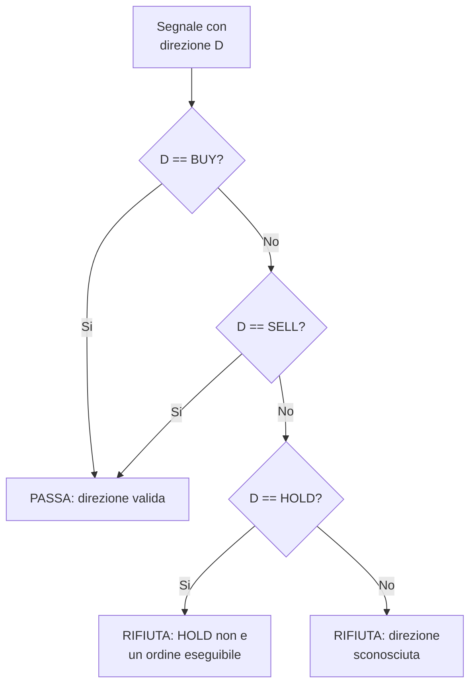
```mermaid
flowchart TD
    A["Segnale con<br/>direzione D"] --> B{"D == BUY?"}
    B -->|"Si"| C["PASSA: direzione valida"]
    B -->|"No"| D{"D == SELL?"}
    D -->|"Si"| C
    D -->|"No"| E{"D == HOLD?"}
    E -->|"Si"| F["RIFIUTA: HOLD non e<br/>un ordine eseguibile"]
    E -->|"No"| G["RIFIUTA: direzione<br/>sconosciuta"]
```

**Problema prevenuto:** Il modello di decisione dell'Algo Engine genera tre possibili output: BUY, SELL e HOLD. Mentre HOLD e una decisione perfettamente valida dal punto di vista del modello (significa "non fare nulla"), non ha senso come ordine di esecuzione. Inviare un HOLD al terminale MT5 causerebbe un errore. Inoltre, qualsiasi valore diverso da BUY/SELL indica un problema di comunicazione o un bug nel protocollo.

**Implementazione:** Semplice confronto di stringhe dopo normalizzazione (uppercase, strip whitespace). Se la direzione non e BUY o SELL, il segnale viene rifiutato con un messaggio che indica chiaramente il valore ricevuto e i valori accettati.

### Validazione 3: Validazione del Lotto

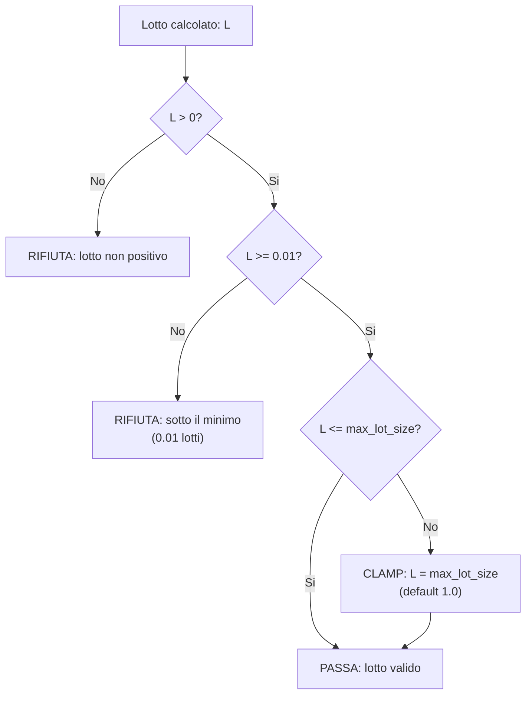
```mermaid
flowchart TD
    A["Lotto calcolato: L"] --> B{"L > 0?"}
    B -->|"No"| C["RIFIUTA: lotto non positivo"]
    B -->|"Si"| D{"L >= 0.01?"}
    D -->|"No"| E["RIFIUTA: sotto il minimo<br/>(0.01 lotti)"]
    D -->|"Si"| F{"L <= max_lot_size?"}
    F -->|"No"| G["CLAMP: L = max_lot_size<br/>(default 1.0)"]
    F -->|"Si"| H["PASSA: lotto valido"]
    G --> H
```

**Problema prevenuto:** Un calcolo errato del lotto (ad esempio a causa di dati di prezzo corrotti o una divisione per zero nel calcolo del pip value) potrebbe generare valori assurdi come 0, -5, o 1000000. Senza questa validazione, un lotto troppo grande potrebbe prosciugare il conto in un singolo trade, mentre un lotto nullo o negativo causerebbe un errore MT5.

**Implementazione:** Il lotto viene prima verificato come positivo (> 0). Poi viene controllato contro il minimo assoluto di 0.01 (il piu piccolo lotto consentito dalla maggior parte dei broker Forex). Infine viene confrontato con il massimo configurato (`max_lot_size`, default 1.0). Se il lotto supera il massimo, viene clampato al valore massimo piuttosto che rifiutato, perche un lotto leggermente piu grande del previsto e comunque un trade valido, semplicemente ridimensionato.

### Validazione 4: Requisito Stop-Loss

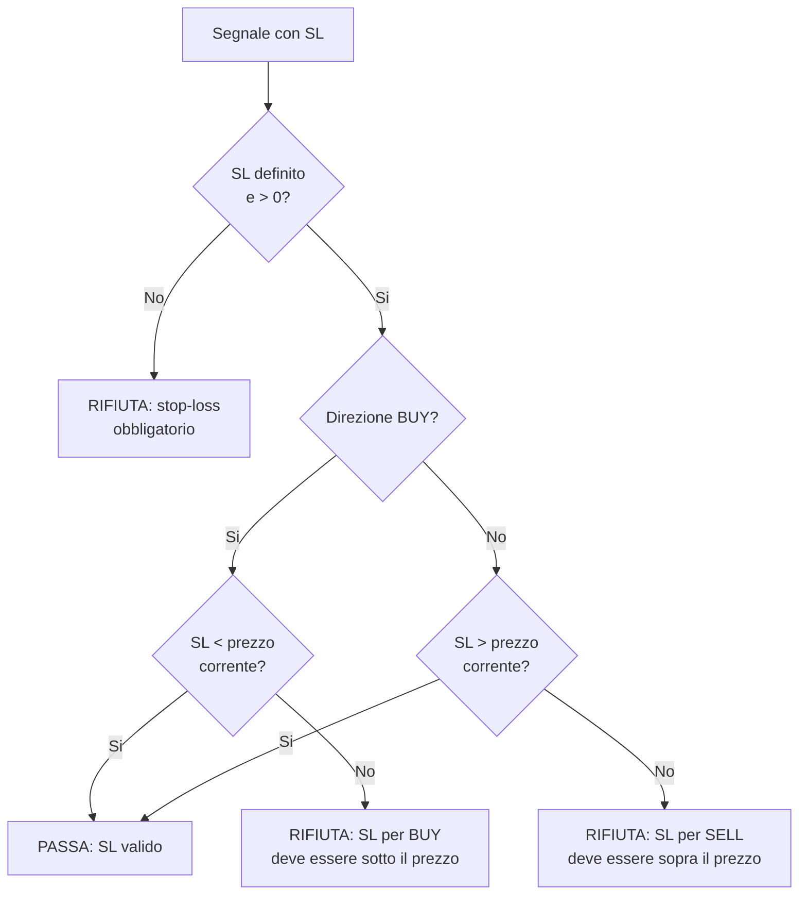
```mermaid
flowchart TD
    A["Segnale con SL"] --> B{"SL definito<br/>e > 0?"}
    B -->|"No"| C["RIFIUTA: stop-loss<br/>obbligatorio"]
    B -->|"Si"| D{"Direzione BUY?"}
    D -->|"Si"| E{"SL < prezzo<br/>corrente?"}
    D -->|"No"| F{"SL > prezzo<br/>corrente?"}
    E -->|"Si"| G["PASSA: SL valido"]
    E -->|"No"| H["RIFIUTA: SL per BUY<br/>deve essere sotto il prezzo"]
    F -->|"Si"| G
    F -->|"No"| I["RIFIUTA: SL per SELL<br/>deve essere sopra il prezzo"]
```

**Problema prevenuto:** Il trading senza stop-loss e la causa numero uno di perdite catastrofiche nel trading algoritmico. Un trade senza SL ha un rischio teoricamente illimitato: se il mercato si muove contro la posizione, le perdite continuano ad accumularsi fino al margin call o all'azzeramento del conto. Nel sistema MONEYMAKER, ogni singolo trade DEVE avere uno stop-loss. Non esistono eccezioni.

**Implementazione:** Il sistema verifica che il campo stop-loss del segnale sia definito (non nullo) e positivo. Inoltre verifica la coerenza direzionale: per un BUY, lo stop-loss deve essere sotto il prezzo corrente (perche si perde se il prezzo scende); per un SELL, deve essere sopra (perche si perde se il prezzo sale). Uno stop-loss dal lato sbagliato indica un errore nel calcolo del segnale.

### Validazione 5: Limite Posizioni Aperte

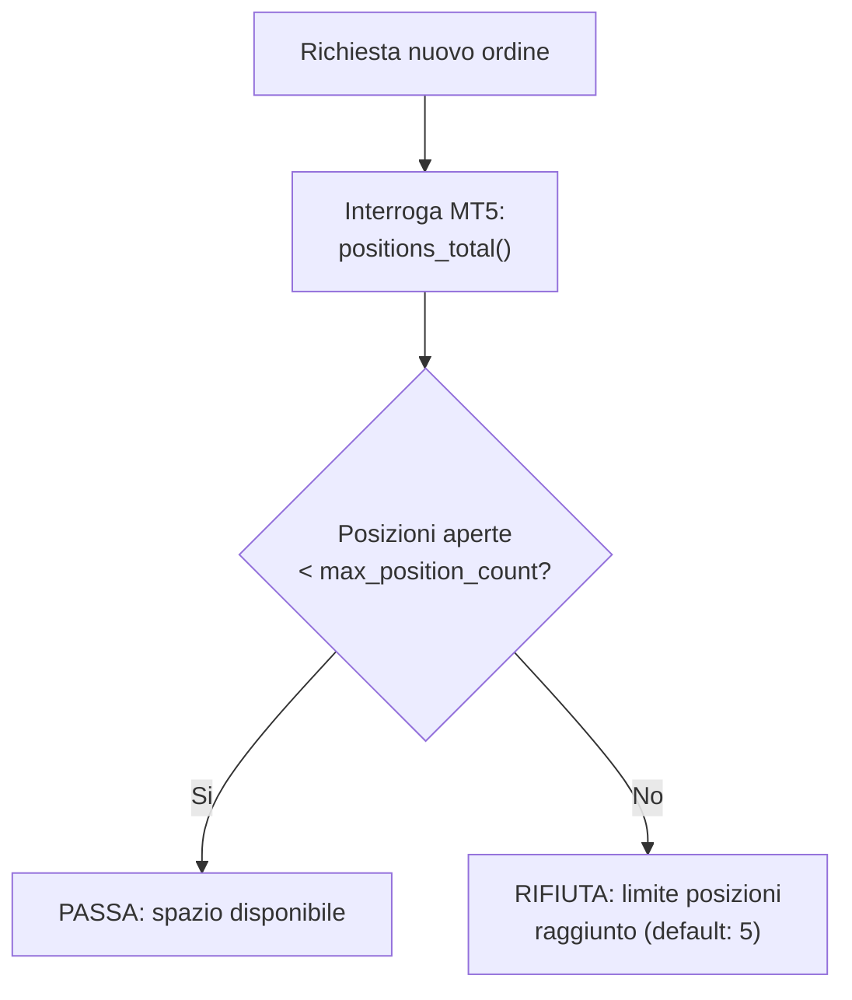
```mermaid
flowchart TD
    A["Richiesta nuovo ordine"] --> B["Interroga MT5:<br/>positions_total()"]
    B --> C{"Posizioni aperte<br/>< max_position_count?"}
    C -->|"Si"| D["PASSA: spazio disponibile"]
    C -->|"No"| E["RIFIUTA: limite posizioni<br/>raggiunto (default: 5)"]
```

**Problema prevenuto:** Senza un limite al numero di posizioni contemporanee, il sistema potrebbe aprire decine di trade durante un periodo di forte segnale, esponendo il conto a un rischio aggregato eccessivo. Anche se ogni singolo trade rispetta il limite di rischio, 20 trade aperti contemporaneamente nella stessa direzione rappresentano un rischio 20 volte superiore a quello previsto. Il limite di default e 5 posizioni simultanee, configurabile tramite `max_position_count`.

**Implementazione:** Prima di aprire un nuovo ordine, l'OrderManager interroga il terminale MT5 tramite `positions_total()` per ottenere il conteggio esatto delle posizioni attualmente aperte. Se il conteggio e uguale o superiore al limite configurato, il segnale viene rifiutato. Il conteggio include tutte le posizioni su tutti i simboli, non solo quelle sullo stesso simbolo del segnale corrente.

### Validazione 6: Controllo Spread

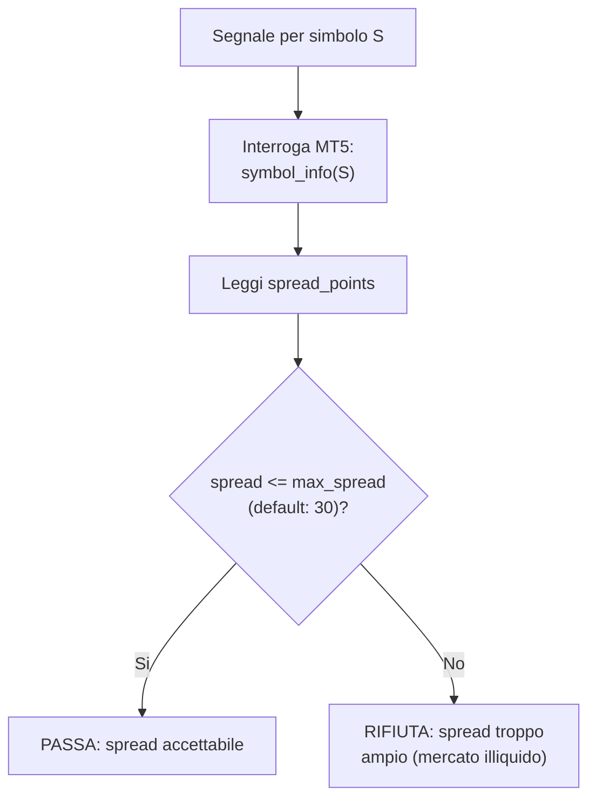
```mermaid
flowchart TD
    A["Segnale per simbolo S"] --> B["Interroga MT5:<br/>symbol_info(S)"]
    B --> C["Leggi spread_points"]
    C --> D{"spread <= max_spread<br/>(default: 30)?"}
    D -->|"Si"| E["PASSA: spread accettabile"]
    D -->|"No"| F["RIFIUTA: spread troppo<br/>ampio (mercato illiquido)"]
```

**Problema prevenuto:** Lo spread (differenza tra prezzo bid e ask) e il costo implicito di ogni trade. Durante periodi di bassa liquidita (ad esempio durante i rollover notturni, le festivita, o eventi di news ad alto impatto), lo spread puo allargarsi enormemente, rendendo il trade non profittevole ancor prima di iniziare. Uno spread di 50 punti su EURUSD, ad esempio, significa che il trade parte con 5 pips di svantaggio, il che puo rendere non profittevole anche un segnale con alta confidenza.

**Implementazione:** L'OrderManager interroga il terminale MT5 per ottenere lo spread corrente del simbolo in punti. Se lo spread supera il limite configurato (`max_spread_points`, default 30), il segnale viene rifiutato. Il limite di 30 punti (3 pips per le major Forex) e ragionevole per le coppie principali durante le ore di trading normali, ma potrebbe essere troppo stretto per coppie esotiche o durante la sessione asiatica.

### Validazione 7: Verifica Margine

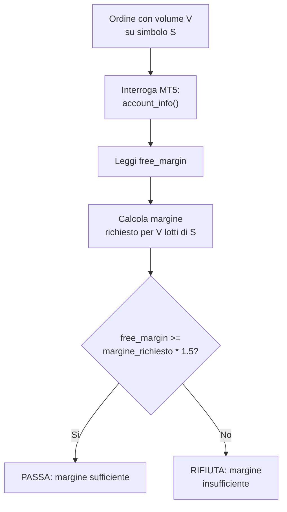
```mermaid
flowchart TD
    A["Ordine con volume V<br/>su simbolo S"] --> B["Interroga MT5:<br/>account_info()"]
    B --> C["Leggi free_margin"]
    C --> D["Calcola margine<br/>richiesto per V lotti di S"]
    D --> E{"free_margin >=<br/>margine_richiesto * 1.5?"}
    E -->|"Si"| F["PASSA: margine sufficiente"]
    E -->|"No"| G["RIFIUTA: margine<br/>insufficiente"]
```

**Problema prevenuto:** L'invio di un ordine senza margine sufficiente causerebbe un rifiuto da parte del broker, ma il rifiuto del broker potrebbe arrivare con ritardo e generare confusione nel sistema. Inoltre, e buona pratica non utilizzare tutto il margine disponibile, ma mantenere un buffer di sicurezza. Il sistema MONEYMAKER richiede che il margine libero sia almeno 1.5 volte il margine necessario per l'ordine, garantendo un cuscinetto del 50% per assorbire fluttuazioni avverse.

**Implementazione:** L'OrderManager interroga `account_info()` per ottenere il margine libero corrente, poi calcola il margine necessario per l'ordine basandosi sul volume e sul simbolo. Il fattore di sicurezza 1.5x garantisce che anche un movimento avverso immediato dopo l'apertura non causi un margin call. Se il margine e insufficiente, il segnale viene rifiutato con un messaggio che indica sia il margine disponibile che quello richiesto.

---

## 5. Tipologie di Ordine

Il sistema MONEYMAKER supporta due tipologie principali di ordine: ordini a mercato (market orders) per l'esecuzione immediata, e ordini limite (limit orders) per l'esecuzione a un prezzo specifico. La scelta tra le due tipologie dipende dalla strategia dell'Algo Engine e dalle condizioni di mercato.

### Ordini a Mercato (Market Orders)

Gli ordini a mercato vengono eseguiti immediatamente al miglior prezzo disponibile. Sono la tipologia piu comune nel sistema MONEYMAKER, utilizzata quando l'Algo Engine identifica un'opportunita che richiede azione immediata.

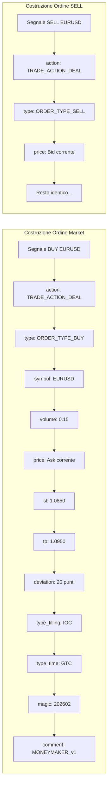
```mermaid
graph LR
    subgraph "Costruzione Ordine Market"
        A["Segnale BUY EURUSD"] --> B["action: TRADE_ACTION_DEAL"]
        B --> C["type: ORDER_TYPE_BUY"]
        C --> D["symbol: EURUSD"]
        D --> E["volume: 0.15"]
        E --> F["price: Ask corrente"]
        F --> G["sl: 1.0850"]
        G --> H["tp: 1.0950"]
        H --> I["deviation: 20 punti"]
        I --> J["type_filling: IOC"]
        J --> K["type_time: GTC"]
        K --> L["magic: 202602"]
        L --> M["comment: MONEYMAKER_v1"]
    end

    subgraph "Costruzione Ordine SELL"
        N["Segnale SELL EURUSD"] --> O["action: TRADE_ACTION_DEAL"]
        O --> P["type: ORDER_TYPE_SELL"]
        P --> Q["price: Bid corrente"]
        Q --> R["Resto identico..."]
    end
```

**Parametri chiave:**

- `TRADE_ACTION_DEAL`: indica un'operazione di trading immediata (non pending).
- `ORDER_TYPE_BUY` / `ORDER_TYPE_SELL`: direzione dell'ordine.
- `deviation: 20`: slippage massimo accettabile in punti. Se il prezzo si muove di piu di 2 pips dal momento della richiesta all'esecuzione, l'ordine viene rifiutato dal broker. Un valore di 20 punti e un buon compromesso tra probabilita di esecuzione e protezione dallo slippage.
- `type_filling: ORDER_FILLING_IOC` (Immediate or Cancel): se l'ordine non puo essere eseguito interamente al prezzo richiesto (entro la deviazione), viene cancellato piuttosto che eseguito parzialmente. Questo previene situazioni dove solo una parte dell'ordine viene eseguita.
- `magic: 202602`: numero identificativo che permette di distinguere gli ordini MONEYMAKER da ordini manuali o di altri EA nel terminale.

### Ordini Limite (Limit Orders)

Gli ordini limite vengono piazzati a un prezzo specifico e rimangono in attesa fino a quando il mercato non raggiunge quel prezzo. Sono utilizzati quando l'Algo Engine identifica un livello di prezzo favorevole ma il mercato non vi si trova ancora.

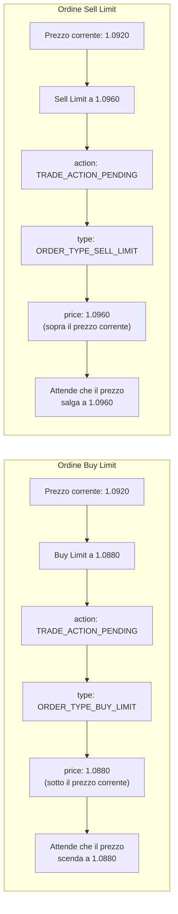
```mermaid
graph LR
    subgraph "Ordine Buy Limit"
        A["Prezzo corrente: 1.0920"] --> B["Buy Limit a 1.0880"]
        B --> C["action: TRADE_ACTION_PENDING"]
        C --> D["type: ORDER_TYPE_BUY_LIMIT"]
        D --> E["price: 1.0880<br/>(sotto il prezzo corrente)"]
        E --> F["Attende che il prezzo<br/>scenda a 1.0880"]
    end

    subgraph "Ordine Sell Limit"
        G["Prezzo corrente: 1.0920"] --> H["Sell Limit a 1.0960"]
        H --> I["action: TRADE_ACTION_PENDING"]
        I --> J["type: ORDER_TYPE_SELL_LIMIT"]
        J --> K["price: 1.0960<br/>(sopra il prezzo corrente)"]
        K --> L["Attende che il prezzo<br/>salga a 1.0960"]
    end
```

### Calcolo del Lot Sizing

Il dimensionamento del lotto e uno degli aspetti piu critici della gestione del rischio. La formula utilizzata dal sistema MONEYMAKER e:

```
lots = (equity * risk_percent) / (SL_distance_pips * pip_value)
lots = clamp(lots, 0.01, max_lot_size)
```

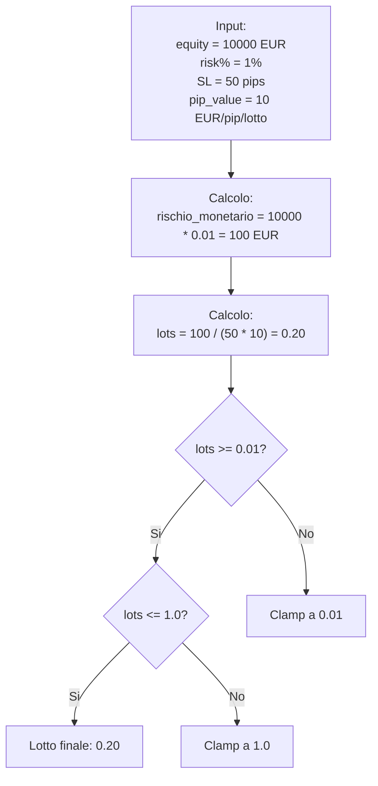
```mermaid
flowchart TD
    A["Input:<br/>equity = 10000 EUR<br/>risk% = 1%<br/>SL = 50 pips<br/>pip_value = 10 EUR/pip/lotto"] --> B["Calcolo:<br/>rischio_monetario = 10000 * 0.01 = 100 EUR"]
    B --> C["Calcolo:<br/>lots = 100 / (50 * 10) = 0.20"]
    C --> D{"lots >= 0.01?"}
    D -->|"Si"| E{"lots <= 1.0?"}
    E -->|"Si"| F["Lotto finale: 0.20"]
    E -->|"No"| G["Clamp a 1.0"]
    D -->|"No"| H["Clamp a 0.01"]
```

**Esempio pratico:** Con un'equity di 10.000 EUR, un rischio dell'1% per trade, uno stop-loss a 50 pips e un pip value di 10 EUR per pip per lotto standard, il calcolo produce: rischio monetario = 100 EUR, lotto = 100 / (50 * 10) = 0.20 lotti. Questo significa che se lo stop-loss viene colpito, la perdita sara esattamente di 100 EUR, ovvero l'1% dell'equity.

---

## 6. Tracciamento Posizioni e Trailing Stop

Il PositionTracker e un componente di background che opera indipendentemente dal flusso di esecuzione ordini. Il suo compito principale e monitorare le posizioni aperte e applicare la logica del trailing stop per proteggere i profitti accumulati. Il trailing stop e un meccanismo che sposta progressivamente lo stop-loss nella direzione del profitto, garantendo che una parte dei guadagni venga "bloccata" anche se il mercato inverte la sua direzione.

### Logica del Trailing Stop

Il trailing stop nel sistema MONEYMAKER si attiva solo quando una posizione ha raggiunto un profitto minimo configurabile (default: 30 pips). Una volta attivato, lo stop-loss viene spostato a una distanza fissa dal prezzo corrente (default: 50 pips). Lo stop-loss viene spostato solo nella direzione del profitto: non viene mai spostato indietro, nemmeno se il prezzo ritraccia temporaneamente.

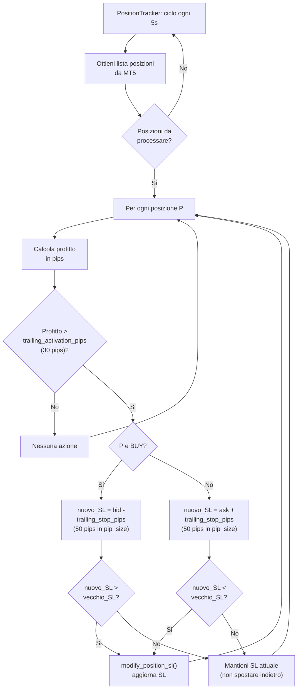
```mermaid
flowchart TD
    A["PositionTracker: ciclo ogni 5s"] --> B["Ottieni lista posizioni<br/>da MT5"]
    B --> C{"Posizioni da<br/>processare?"}
    C -->|"No"| A
    C -->|"Si"| D["Per ogni posizione P"]
    D --> E["Calcola profitto<br/>in pips"]
    E --> F{"Profitto ><br/>trailing_activation_pips<br/>(30 pips)?"}
    F -->|"No"| G["Nessuna azione"]
    G --> D
    F -->|"Si"| H{"P e BUY?"}
    H -->|"Si"| I["nuovo_SL = bid - <br/>trailing_stop_pips<br/>(50 pips in pip_size)"]
    H -->|"No"| J["nuovo_SL = ask + <br/>trailing_stop_pips<br/>(50 pips in pip_size)"]
    I --> K{"nuovo_SL ><br/>vecchio_SL?"}
    J --> L{"nuovo_SL <<br/>vecchio_SL?"}
    K -->|"Si"| M["modify_position_sl()<br/>aggiorna SL"]
    K -->|"No"| N["Mantieni SL attuale<br/>(non spostare indietro)"]
    L -->|"Si"| M
    L -->|"No"| N
    M --> D
    N --> D
```

### Calcolo del Pip Size

Il pip size varia a seconda dello strumento finanziario. Il sistema MONEYMAKER gestisce automaticamente questa differenza:

- **Forex standard** (EURUSD, GBPUSD, AUDUSD, ecc.): pip_size = 0.0001
- **Coppie JPY** (USDJPY, EURJPY, GBPJPY, ecc.): pip_size = 0.01
- **Oro** (XAUUSD): pip_size = 0.01
- **Indici**: pip_size variabile, letto da symbol_info()

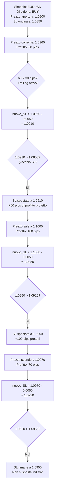
```mermaid
flowchart TD
    A["Simbolo: EURUSD<br/>Direzione: BUY<br/>Prezzo apertura: 1.0900<br/>SL originale: 1.0850"] --> B["Prezzo corrente: 1.0960<br/>Profitto: 60 pips"]
    B --> C{"60 > 30 pips?<br/>Trailing attivo!"}
    C --> D["nuovo_SL = 1.0960 - 0.0050<br/>= 1.0910"]
    D --> E{"1.0910 > 1.0850?<br/>(vecchio SL)"}
    E -->|"Si!"| F["SL spostato a 1.0910<br/>+60 pips di profitto protetto"]

    F --> G["Prezzo sale a 1.1000<br/>Profitto: 100 pips"]
    G --> H["nuovo_SL = 1.1000 - 0.0050<br/>= 1.0950"]
    H --> I{"1.0950 > 1.0910?"}
    I -->|"Si!"| J["SL spostato a 1.0950<br/>+100 pips protetti"]

    J --> K["Prezzo scende a 1.0970<br/>Profitto: 70 pips"]
    K --> L["nuovo_SL = 1.0970 - 0.0050<br/>= 1.0920"]
    L --> M{"1.0920 > 1.0950?"}
    M -->|"No!"| N["SL rimane a 1.0950<br/>Non si sposta indietro"]
```

### Regola Fondamentale: Mai Spostare Indietro

La regola piu importante del trailing stop e che lo stop-loss non viene mai spostato nella direzione contraria al profitto. Per una posizione BUY, lo SL puo solo salire; per una posizione SELL, lo SL puo solo scendere. Questa regola e implementata con un semplice confronto: il nuovo SL calcolato viene applicato solo se e "migliore" del precedente. Questo garantisce che i profitti una volta protetti non vengano mai esposti nuovamente al rischio.

---

## 7. Kill Switch e Circuit Breaker

Il sistema MONEYMAKER implementa due meccanismi di sicurezza di emergenza progettati per proteggere il capitale in situazioni anomale: il Kill Switch e il Circuit Breaker. Entrambi i meccanismi operano a livello globale, influenzando l'intero sistema di trading e non singoli strumenti o strategie.

### Diagramma di Stato

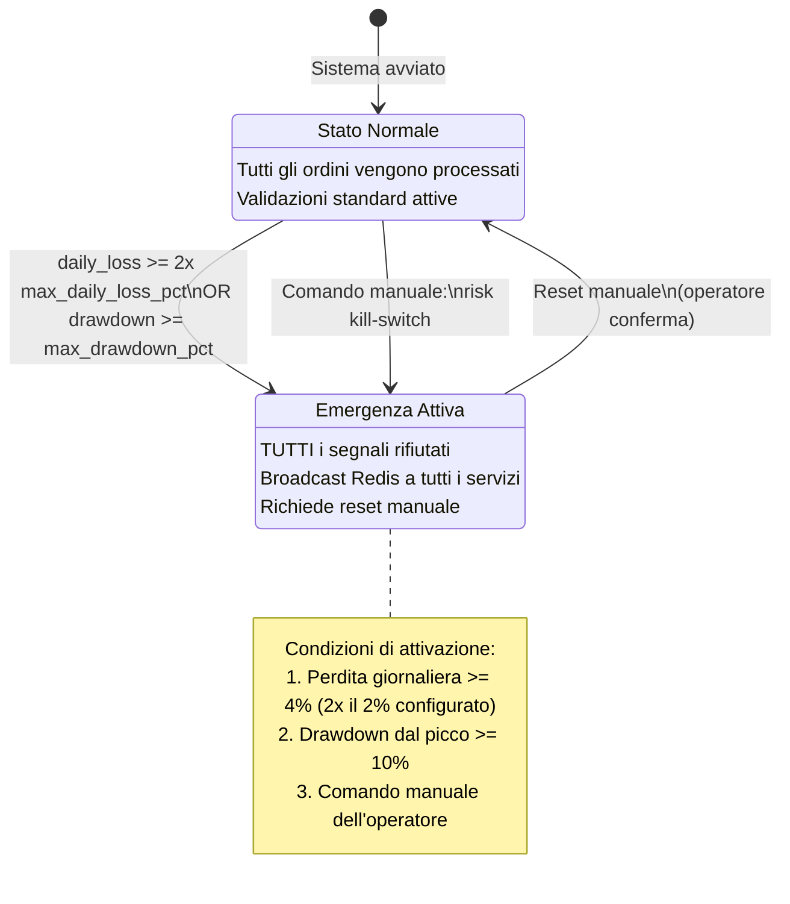
```mermaid
stateDiagram-v2
    [*] --> ARMED: Sistema avviato

    ARMED: Stato Normale
    ARMED: Tutti gli ordini vengono processati
    ARMED: Validazioni standard attive

    TRIGGERED: Emergenza Attiva
    TRIGGERED: TUTTI i segnali rifiutati
    TRIGGERED: Broadcast Redis a tutti i servizi
    TRIGGERED: Richiede reset manuale

    ARMED --> TRIGGERED: daily_loss >= 2x max_daily_loss_pct\nOR drawdown >= max_drawdown_pct
    ARMED --> TRIGGERED: Comando manuale:\nrisk kill-switch
    TRIGGERED --> ARMED: Reset manuale\n(operatore conferma)

    note right of TRIGGERED
        Condizioni di attivazione:
        1. Perdita giornaliera >= 4% (2x il 2% configurato)
        2. Drawdown dal picco >= 10%
        3. Comando manuale dell'operatore
    end note
```

### Kill Switch

Il Kill Switch e il meccanismo di emergenza piu drastico. Quando attivato, blocca immediatamente TUTTI i segnali di trading, impedendo l'apertura di nuove posizioni. Non chiude automaticamente le posizioni esistenti (questa e una decisione deliberata: la chiusura forzata durante un mercato volatile potrebbe causare piu danni che lasciare le posizioni con i loro stop-loss), ma impedisce qualsiasi nuova esposizione.

**Attivazione automatica:**
- Quando la perdita giornaliera raggiunge il doppio del limite configurato (`2 * max_daily_loss_pct`). Con il default del 2%, il Kill Switch si attiva a una perdita giornaliera del 4%.
- Quando il drawdown dal picco di equity raggiunge il limite configurato (`max_drawdown_pct`, default 10%).

**Attivazione manuale:**
- Tramite il comando della console: `risk kill-switch` (richiede conferma y/N).

**Meccanismo di comunicazione:**
Quando il Kill Switch viene attivato, viene pubblicato un messaggio su Redis (canale `moneymaker:kill_switch`) che tutti i servizi dell'ecosistema sottoscrivono. L'OrderManager controlla lo stato del Kill Switch come primissima operazione, prima ancora della validazione del segnale. Se il Kill Switch e attivo, il segnale viene rifiutato immediatamente con il codice `KILL_SWITCH_ACTIVE`.

**Reset:**
Il Kill Switch richiede un reset manuale esplicito da parte dell'operatore. Non si disattiva automaticamente, nemmeno il giorno successivo. Questo e intenzionale: dopo un evento che ha attivato il Kill Switch, e necessario che un essere umano analizzi la situazione e decida consapevolmente di riattivare il trading.

### Circuit Breaker

Il Circuit Breaker e un meccanismo piu graduato rispetto al Kill Switch. Opera a livello di singola strategia o di singolo simbolo, e implementa il pattern classico del circuit breaker con tre stati.

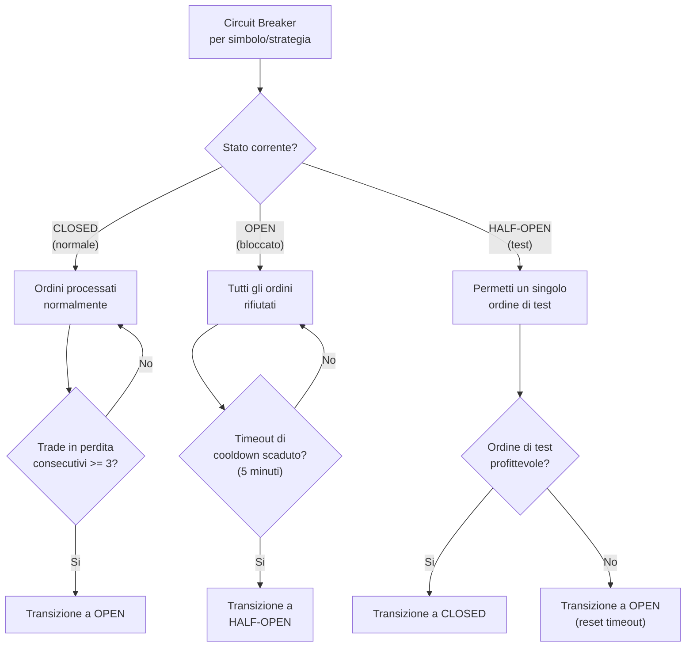
```mermaid
flowchart TD
    A["Circuit Breaker<br/>per simbolo/strategia"] --> B{"Stato corrente?"}
    B -->|"CLOSED<br/>(normale)"| C["Ordini processati<br/>normalmente"]
    C --> D{"Trade in perdita<br/>consecutivi >= 3?"}
    D -->|"Si"| E["Transizione a OPEN"]
    D -->|"No"| C

    B -->|"OPEN<br/>(bloccato)"| F["Tutti gli ordini<br/>rifiutati"]
    F --> G{"Timeout di<br/>cooldown scaduto?<br/>(5 minuti)"}
    G -->|"Si"| H["Transizione a<br/>HALF-OPEN"]
    G -->|"No"| F

    B -->|"HALF-OPEN<br/>(test)"| I["Permetti un singolo<br/>ordine di test"]
    I --> J{"Ordine di test<br/>profittevole?"}
    J -->|"Si"| K["Transizione a CLOSED"]
    J -->|"No"| L["Transizione a OPEN<br/>(reset timeout)"]
```

**Comandi della console:**
- `risk circuit-breaker`: mostra lo stato attuale di tutti i circuit breaker.
- `risk circuit-breaker reset SYMBOL`: resetta manualmente il circuit breaker per un simbolo specifico.

---

## 8. Guida alla Configurazione MT5

Questa sezione fornisce una guida passo-passo per configurare MetaTrader 5 per l'utilizzo con il sistema MONEYMAKER. La configurazione deve essere eseguita una sola volta, ma e fondamentale che ogni passaggio venga completato correttamente.

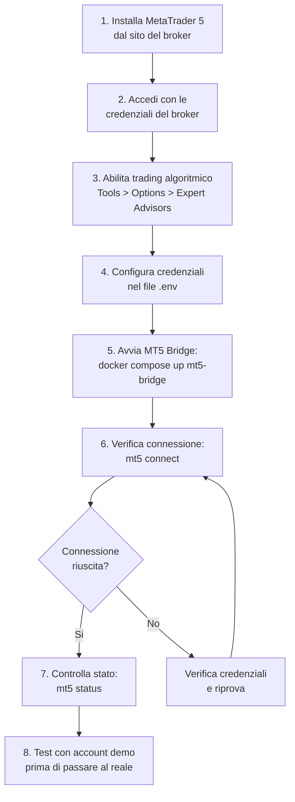
```mermaid
flowchart TD
    A["1. Installa MetaTrader 5<br/>dal sito del broker"] --> B["2. Accedi con le<br/>credenziali del broker"]
    B --> C["3. Abilita trading algoritmico<br/>Tools > Options > Expert Advisors"]
    C --> D["4. Configura credenziali<br/>nel file .env"]
    D --> E["5. Avvia MT5 Bridge:<br/>docker compose up mt5-bridge"]
    E --> F["6. Verifica connessione:<br/>mt5 connect"]
    F --> G{"Connessione<br/>riuscita?"}
    G -->|"Si"| H["7. Controlla stato:<br/>mt5 status"]
    G -->|"No"| I["Verifica credenziali<br/>e riprova"]
    I --> F
    H --> J["8. Test con account demo<br/>prima di passare al reale"]
```

### Passo 1: Installazione MetaTrader 5

Scaricare e installare MetaTrader 5 dal sito web del proprio broker. Ogni broker fornisce una versione personalizzata del terminale con i propri server di trading preconfigurati. E importante utilizzare la versione del broker e non la versione generica dal sito MetaQuotes, per garantire la compatibilita con i server di trading.

### Passo 2: Accesso al Terminale

Avviare MetaTrader 5 e accedere con le credenziali fornite dal broker. Selezionare il server corretto dalla lista (solitamente il broker ne fornisce diversi: demo, live, contest). Per i test iniziali, utilizzare SEMPRE un account demo.

### Passo 3: Abilitazione Trading Algoritmico

Navigare su Tools > Options > Expert Advisors e abilitare le seguenti opzioni:
- "Allow algorithmic trading" (obbligatorio)
- "Allow DLL imports" (necessario per la comunicazione con Python)
- Disabilitare "Allow algorithmic trading only for signed robots" se presente

### Passo 4: Configurazione Credenziali

Creare o modificare il file `.env` nella root del progetto con le seguenti variabili:

```
MT5_ACCOUNT=12345678
MT5_PASSWORD=your_password_here
MT5_SERVER=BrokerName-Demo
MT5_TIMEOUT_MS=10000
MONEYMAKER_MT5_BRIDGE_GRPC_PORT=50055
```

**ATTENZIONE:** Non committare mai il file `.env` nel repository Git. Verificare che `.env` sia presente nel `.gitignore`.

### Passo 5: Avvio del Servizio

Avviare il MT5 Bridge tramite Docker Compose o direttamente con Python. Il servizio tentera automaticamente la connessione al terminale MT5 all'avvio.

### Passo 6: Verifica Connessione

Utilizzare il comando della console `mt5 connect` per verificare che la connessione al terminale sia attiva. Il comando restituira lo stato della connessione, il numero del conto, il server e il saldo corrente.

### Passo 7: Controllo Stato

Il comando `mt5 status` fornisce un riepilogo completo dello stato del bridge: connessione al terminale, numero di posizioni aperte, equity corrente, margine libero, e stato del Kill Switch e Circuit Breaker.

### Passo 8: Test con Account Demo

**MAI** iniziare con un account reale. Eseguire almeno una settimana di test con l'account demo per verificare che tutti i componenti funzionino correttamente, che le validazioni siano appropriate, e che il trailing stop si comporti come previsto.

---

## 9. Procedure di Emergenza

Quando si verifica una situazione anomala -- una perdita improvvisa, un comportamento inaspettato del sistema, o una condizione di mercato estrema -- e fondamentale seguire una procedura strutturata piuttosto che agire impulsivamente. Le procedure di emergenza del sistema MONEYMAKER sono progettate per minimizzare i danni e garantire un ripristino sicuro.

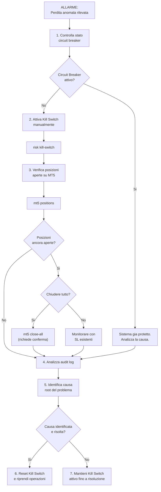
```mermaid
flowchart TD
    A["ALLARME:<br/>Perdita anomala rilevata"] --> B["1. Controlla stato<br/>circuit breaker"]
    B --> C{"Circuit Breaker<br/>attivo?"}
    C -->|"Si"| D["Sistema gia protetto.<br/>Analizza la causa."]
    C -->|"No"| E["2. Attiva Kill Switch<br/>manualmente"]
    E --> F["risk kill-switch"]
    F --> G["3. Verifica posizioni<br/>aperte su MT5"]
    G --> H["mt5 positions"]
    H --> I{"Posizioni<br/>ancora aperte?"}
    I -->|"Si"| J{"Chiudere tutto?"}
    J -->|"Si"| K["mt5 close-all<br/>(richiede conferma)"]
    J -->|"No"| L["Monitorare con<br/>SL esistenti"]
    I -->|"No"| M["4. Analizza audit log"]
    K --> M
    L --> M
    M --> N["5. Identifica causa<br/>root del problema"]
    N --> O{"Causa identificata<br/>e risolta?"}
    O -->|"Si"| P["6. Reset Kill Switch<br/>e riprendi operazioni"]
    O -->|"No"| Q["7. Mantieni Kill Switch<br/>attivo fino a risoluzione"]
    D --> M
```

### Scenario 1: Perdita Improvvisa su una Singola Posizione

Se una singola posizione mostra una perdita anomala (ad esempio, un gap improvviso oltre lo stop-loss), la procedura e:
1. Verificare che lo stop-loss sia ancora in posizione (`mt5 positions`)
2. Se lo SL e stato saltato (gap), valutare la chiusura manuale immediata
3. Controllare l'audit log per verificare che l'ordine originale fosse corretto
4. Verificare lo spread corrente del simbolo (`market spread SYMBOL`)

### Scenario 2: Perdite Multiple in Rapida Successione

Se piu posizioni vanno in perdita contemporaneamente:
1. Attivare immediatamente il Kill Switch (`risk kill-switch`)
2. Analizzare se c'e un evento di mercato in corso (news ad alto impatto)
3. Verificare se il regime di mercato e cambiato drasticamente
4. Non chiudere le posizioni impulsivamente se hanno SL ragionevoli

### Scenario 3: Disconnessione dal Broker

Se il terminale MT5 perde la connessione con il broker:
1. Le posizioni aperte rimangono sul server del broker con i loro SL/TP
2. Il PositionTracker non puo aggiornare i trailing stop
3. Tentare la riconnessione: `mt5 connect`
4. Se la riconnessione fallisce, contattare il supporto del broker
5. Le posizioni sono protette dagli SL server-side

### Scenario 4: Comportamento Anomalo dell'Algo Engine

Se l'Algo Engine genera segnali incoerenti o eccessivi:
1. Fermare l'Algo Engine: `brain stop`
2. Attivare il Kill Switch per sicurezza: `risk kill-switch`
3. Analizzare gli ultimi segnali: `signal last 20`
4. Verificare i dati di mercato: `data status`
5. Riavviare dopo l'analisi: `brain start`

---

## 10. Riferimento Configurazione

Questa sezione elenca tutte le variabili di configurazione del modulo MT5 Bridge con i relativi valori di default, descrizioni e vincoli di validazione.

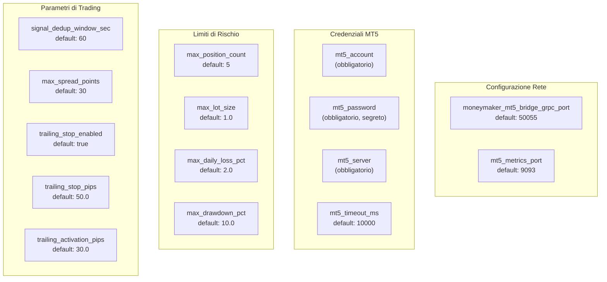
```mermaid
graph TD
    subgraph "Configurazione Rete"
        A["moneymaker_mt5_bridge_grpc_port<br/>default: 50055"]
        B["mt5_metrics_port<br/>default: 9093"]
    end

    subgraph "Credenziali MT5"
        C["mt5_account<br/>(obbligatorio)"]
        D["mt5_password<br/>(obbligatorio, segreto)"]
        E["mt5_server<br/>(obbligatorio)"]
        F["mt5_timeout_ms<br/>default: 10000"]
    end

    subgraph "Limiti di Rischio"
        G["max_position_count<br/>default: 5"]
        H["max_lot_size<br/>default: 1.0"]
        I["max_daily_loss_pct<br/>default: 2.0"]
        J["max_drawdown_pct<br/>default: 10.0"]
    end

    subgraph "Parametri di Trading"
        K["signal_dedup_window_sec<br/>default: 60"]
        L["max_spread_points<br/>default: 30"]
        M["trailing_stop_enabled<br/>default: true"]
        N["trailing_stop_pips<br/>default: 50.0"]
        O["trailing_activation_pips<br/>default: 30.0"]
    end
```

| Variabile | Default | Descrizione | Vincoli |
|-----------|---------|-------------|---------|
| `moneymaker_mt5_bridge_grpc_port` | `50055` | Porta del server gRPC per la ricezione dei segnali di trading dall'Algo Engine | Range: 1024-65535 |
| `mt5_account` | (obbligatorio) | Numero del conto MetaTrader 5 fornito dal broker | Intero positivo |
| `mt5_password` | (obbligatorio) | Password del conto MT5. MAI committare nel repository | Stringa non vuota |
| `mt5_server` | (obbligatorio) | Nome del server del broker (es. "ICMarkets-Demo") | Stringa non vuota |
| `mt5_timeout_ms` | `10000` | Timeout massimo per le operazioni MT5 in millisecondi | Range: 1000-60000 |
| `max_position_count` | `5` | Numero massimo di posizioni contemporaneamente aperte | Range: 1-20 |
| `max_lot_size` | `1.0` | Volume massimo per singolo ordine in lotti standard | Range: 0.01-100.0 |
| `max_daily_loss_pct` | `2.0` | Percentuale massima di perdita giornaliera rispetto all'equity iniziale | Range: 0.1-10.0 |
| `max_drawdown_pct` | `10.0` | Percentuale massima di drawdown dal picco di equity prima dell'attivazione del Kill Switch | Range: 1.0-50.0 |
| `signal_dedup_window_sec` | `60` | Finestra temporale in secondi per la deduplicazione dei segnali | Range: 5-600 |
| `max_spread_points` | `30` | Spread massimo accettabile in punti prima del rifiuto dell'ordine | Range: 1-200 |
| `trailing_stop_enabled` | `true` | Abilita o disabilita il trailing stop automatico | Booleano |
| `trailing_stop_pips` | `50.0` | Distanza del trailing stop dal prezzo corrente in pips | Range: 5.0-500.0 |
| `trailing_activation_pips` | `30.0` | Profitto minimo in pips prima dell'attivazione del trailing stop | Range: 5.0-500.0 |

### Note sulla Configurazione

Le variabili di configurazione vengono caricate all'avvio del servizio e non possono essere modificate a runtime senza un riavvio. Le credenziali MT5 sono le uniche variabili che devono essere necessariamente fornite dall'operatore; tutte le altre hanno valori di default sicuri e ragionevoli.

La relazione tra `trailing_activation_pips` e `trailing_stop_pips` e importante: l'attivazione deve essere raggiunta prima che il trailing stop inizi a operare, e la distanza del trailing deve essere inferiore all'attivazione per essere significativa. Nel default (attivazione a 30, distanza 50), una volta che la posizione raggiunge 30 pips di profitto, lo SL viene posizionato a 50 pips dal prezzo corrente. Questo significa che con 30 pips di profitto e lo SL a -50 pips dal prezzo corrente, si avrebbe uno SL a -20 pips dal prezzo di ingresso (30 - 50 = -20), il che implica che il trailing inizia a proteggere il profitto solo quando il profitto supera la distanza del trailing stop. Questa configurazione e conservativa e puo essere adattata in base alla strategia.

I limiti di rischio (`max_daily_loss_pct` e `max_drawdown_pct`) sono le variabili piu critiche dell'intera configurazione. Valori troppo permissivi espongono il conto a rischi eccessivi; valori troppo restrittivi causano attivazioni frequenti del Kill Switch che interrompono il trading. I valori di default (2% perdita giornaliera, 10% drawdown) sono considerati conservativi e adatti a un approccio di trading a rischio moderato. Per strategie ad alta frequenza, potrebbe essere necessario aumentare leggermente la perdita giornaliera mantenendo il drawdown invariato.

Il `max_spread_points` di 30 e calibrato per le coppie Forex major durante le ore di trading europee e americane. Per il trading durante la sessione asiatica o su coppie esotiche, potrebbe essere necessario aumentare questo valore. Tuttavia, aumentare troppo lo spread accettabile riduce la qualita dell'esecuzione e aumenta i costi impliciti di ogni trade.

Infine, il `signal_dedup_window_sec` di 60 secondi bilancia la necessita di evitare ordini duplicati con la possibilita che l'Algo Engine generi legittimamente un nuovo segnale sullo stesso strumento dopo un breve intervallo. Se l'Algo Engine opera a una frequenza molto alta (tick-by-tick), potrebbe essere necessario aumentare questo valore; se opera a frequenze piu basse (candele a 5 minuti), potrebbe essere ridotto.
