# Monitoraggio e Stabilita'

| Campo         | Valore                                     |
|---------------|--------------------------------------------|
| **Titolo**    | Monitoraggio e Stabilita'                  |
| **Autore**    | Renan Augusto Macena                       |
| **Data**      | 2026-02-28                                 |
| **Versione**  | 1.0.0                                      |
| **Progetto**  | MONEYMAKER Trading Ecosystem                  |

---

## Indice

1. [Capitolo 1: Overview — Il Check-Up Medico Annuale](#capitolo-1-overview--il-check-up-medico-annuale)
2. [Capitolo 2: Stack di Osservabilita'](#capitolo-2-stack-di-osservabilita)
3. [Capitolo 3: I 14 Strumenti Diagnostici](#capitolo-3-i-14-strumenti-diagnostici)
4. [Capitolo 4: Checklist Pre-Modifica](#capitolo-4-checklist-pre-modifica)
5. [Capitolo 5: Verifica Post-Modifica](#capitolo-5-verifica-post-modifica)
6. [Capitolo 6: Metriche Prometheus](#capitolo-6-metriche-prometheus)
7. [Capitolo 7: Endpoint Health Check](#capitolo-7-endpoint-health-check)
8. [Capitolo 8: Manifesto di Integrita'](#capitolo-8-manifesto-di-integrita)
9. [Capitolo 9: Accesso alle Dashboard Grafana](#capitolo-9-accesso-alle-dashboard-grafana)

---

## Capitolo 1: Overview — Il Check-Up Medico Annuale

### L'Analogia Fondamentale

Immaginate di sottoporvi a un check-up medico annuale completo in un ospedale all'avanguardia. Il medico di base non si limita a chiedervi "come state?": prescrive una batteria sistematica di esami che coprono ogni aspetto della vostra salute. Si misura la pressione arteriosa, si analizza il sangue con decine di parametri, si eseguono radiografie per guardare oltre la superficie, si consultano specialisti per aree di competenza specifica. Solo quando tutti questi esami convergono su un quadro coerente, il medico puo' dichiarare con confidenza che siete in buona salute — o identificare con precisione dove intervenire.

Il MONEYMAKER Trading Ecosystem adotta esattamente lo stesso approccio alla stabilita' del sistema. Non basta che "il servizio risponda" per dichiararlo sano. Un sistema di trading algoritmico opera con denaro reale in mercati che non perdonano errori. Un modello ML che genera predizioni con confidenza alta ma distribuzione di probabilita' incoerente puo' sembrare funzionante dall'esterno mentre prende decisioni finanziariamente catastrofiche. Un pipeline di dati che perde il 2% dei tick in silenzio puo' far passare mesi senza che nessuno se ne accorga, corrompendo gradualmente tutto il training.

Per questo motivo, il MONEYMAKER dispone di una **suite diagnostica completa di 14 strumenti specializzati**, ciascuno progettato per esaminare un aspetto specifico della salute del sistema:

- **`brain_verify.py`** e' la **misurazione della pressione arteriosa**: 115 regole automatiche che verificano l'intelligenza fondamentale del cervello AI, dalla percezione del mercato alla meta-cognizione. Come la pressione arteriosa e' il primo indicatore vitale che si controlla, brain_verify e' il primo test da eseguire per valutare lo stato del sistema decisionale.

- **`headless_validator.py`** e' l'**analisi del sangue completa**: 169 controlli che esaminano import dei moduli, schema del database, invarianti di configurazione, smoke test ML e installazione dei proto. Come l'emocromo rivela problemi nascosti che non si manifestano in sintomi evidenti, il validatore headless cattura regressioni invisibili prima che diventino bug in produzione.

- **`ml_debugger.py`** e' la **radiografia (RX)**: 8 controlli che guardano dentro la rete neurale, verificando il contratto METADATA_DIM, le forme degli input, il range delle feature, il determinismo dell'output, la validita' delle probabilita'. Come una radiografia mostra fratture invisibili dall'esterno, l'ML debugger rivela anomalie nelle profondita' della rete che nessun test funzionale potrebbe catturare.

- **`moneymaker_hospital.py`** e' la **consultazione specialistica**: 12 dipartimenti che esaminano aspetti specifici del sistema — dal Pronto Soccorso (errori critici) alla Cardiologia (battito del sistema) alla Neurologia (funzioni cognitive AI) all'Oncologia (codice morto che cresce come un tumore). Come un ospedale moderno ha reparti specializzati per ogni patologia, il MONEYMAKER hospital ha dipartimenti dedicati per ogni area di rischio.

Questa suite diagnostica non e' opzionale ne' decorativa. E' il meccanismo fondamentale attraverso cui il team garantisce che ogni modifica al codice mantenga o migliori la salute del sistema. Nessun commit viene considerato completo senza il passaggio attraverso le checklist pre e post-modifica documentate nei Capitoli 4 e 5.

### Principio: Misura Tutto, Non Fidarti di Niente

Il monitoraggio del MONEYMAKER si basa su un principio fondamentale: **non fidarti mai dello stato dichiarato di un componente; misuralo indipendentemente**. Questo principio si manifesta a ogni livello: le metriche Prometheus misurano il comportamento effettivo (non quello atteso), i tool diagnostici verificano le invarianti (non le assunzioni), i manifesti di integrita' hash controllano che il codice in esecuzione sia esattamente quello che si crede sia.

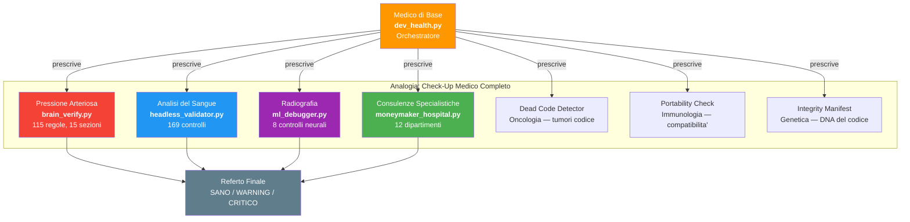

---

## Capitolo 2: Stack di Osservabilita'

### Architettura a Tre Pilastri

Lo stack di osservabilita' del MONEYMAKER si fonda su tre pilastri complementari: **metriche** (Prometheus + Grafana), **log strutturati** (JSON su stdout/file) e **health check** (endpoint HTTP). Ciascun pilastro cattura una dimensione diversa della salute del sistema:

- **Metriche** rispondono alla domanda "quanto?": quanti segnali al minuto, quale latenza del pipeline, quanti ordini aperti. Sono numeriche, aggregabili e ideali per trend e alerting.
- **Log strutturati** rispondono alla domanda "cosa e' successo?": quale errore specifico, con quali parametri, in quale contesto. Sono testuali, ricercabili e ideali per debugging.
- **Health check** rispondono alla domanda "funziona adesso?": il servizio e' raggiungibile, il database risponde, il modello e' caricato. Sono binari (UP/DOWN), istantanei e ideali per orchestrazione.

### Flusso delle Metriche

Ogni microservizio del MONEYMAKER espone un endpoint Prometheus in formato OpenMetrics su una porta dedicata:

| Servizio | Porta Metriche | Porta Servizio |
|----------|---------------|----------------|
| Data Ingestion (Go) | `:9090` | `:8081` |
| Algo Engine (Python) | `:9093` | `:8080` |
| MT5 Bridge (Python) | `:9094` | `:8082` |
| Console | `:9095` | N/A |

Il server Prometheus (`:9091`) effettua scraping di tutti gli endpoint a intervalli regolari (default: 15 secondi) e memorizza le serie temporali nel suo storage locale. Grafana (`:3000`) si connette a Prometheus come data source e visualizza le metriche attraverso dashboard pre-configurate.

### Log Strutturati

Tutti i servizi Python utilizzano la libreria `moneymaker_common.logging.get_logger()` che produce log in formato JSON strutturato. Ogni riga di log contiene:

```json
{
  "ts": "2026-02-28T14:30:00.123456Z",
  "level": "INFO",
  "service": "algo-engine",
  "module": "signal_generator",
  "event": "signal_generated",
  "symbol": "EURUSD",
  "direction": "BUY",
  "confidence": 0.87,
  "regime": "TRENDING",
  "latency_ms": 12.3
}
```

Il formato JSON consente l'indicizzazione e la ricerca strutturata tramite strumenti come `jq`, ELK stack o Loki. La presenza del campo `service` consente di correlare eventi tra microservizi diversi. Il campo `ts` in formato ISO-8601 con timezone UTC garantisce ordinamento cronologico corretto indipendentemente dal fuso orario del server.

Il servizio Data Ingestion in Go utilizza la libreria `zerolog` con output JSON equivalente, garantendo coerenza di formato con i servizi Python.

### Strumenti Diagnostici Python

Oltre ai tre pilastri standard, il MONEYMAKER dispone di 14 script Python diagnostici che eseguono verifiche profonde e specifiche del dominio. Questi strumenti non sono sostituibili da metriche o log: operano a un livello di astrazione superiore, verificando invarianti architetturali, contratti inter-modulo e proprieta' matematiche della rete neurale. Ciascuno e' documentato in dettaglio nel Capitolo 3.

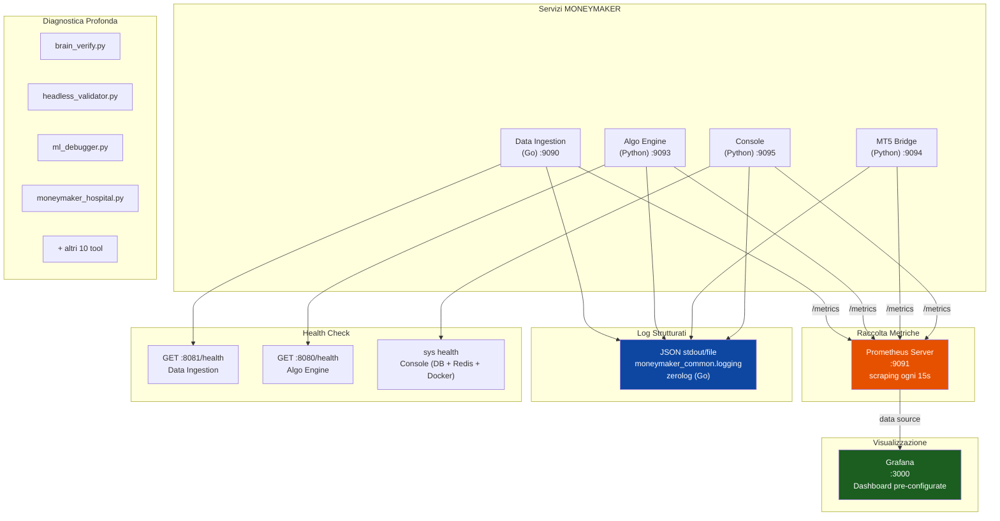

---

## Capitolo 3: I 14 Strumenti Diagnostici

### 3.1 brain_verify.py

**Percorso:** `tools/brain_verification/brain_verify.py`

**Scopo:** Gate di deploy con 115 regole automatiche distribuite su 15 sezioni. Questo e' lo strumento piu' completo dell'arsenale diagnostico: verifica che il cervello AI soddisfi i requisiti minimi di intelligenza, sicurezza, adattabilita' e robustezza prima di essere considerato pronto per il deploy.

**Le 15 Sezioni:**

1. **Foundational Intelligence** — Verifica che il sistema percepisca correttamente i dati di mercato, generi segnali coerenti e mantenga consistenza interna nelle decisioni
2. **Learning & Adaptation** — Controlla che il sistema sia in grado di apprendere da nuovi dati, adattarsi a cambiamenti di regime e non dimenticare conoscenze precedenti
3. **Utility** — Valuta che le decisioni del sistema abbiano valore pratico: profittabilita', gestione del rischio, timing appropriato
4. **Safety** — Verifica i meccanismi di sicurezza: kill switch, circuit breaker, limiti di posizione, protezione anti-spirale
5. **Architecture** — Controlla l'integrita' architetturale: modularita', separazione delle responsabilita', contratti inter-modulo
6. **Monitoring** — Verifica che il sistema emetta metriche e log sufficienti per il monitoraggio in produzione
7. **Market Domain** — Controlla la comprensione del dominio specifico: regimi di mercato, correlazioni tra asset, impatto degli eventi macroeconomici
8. **Human Interaction** — Verifica le interfacce per l'interazione umana: chiarezza dei report, interpretabilita' delle decisioni, qualita' degli alert
9. **Continuous Improvement** — Controlla i meccanismi di miglioramento continuo: feedback loop, retraining automatico, A/B testing
10. **Meta-Level Reasoning** — Valuta la capacita' del sistema di ragionare sul proprio ragionamento: calibrazione della confidenza, riconoscimento dei limiti
11. **Ethical Trading** — Verifica conformita' con principi etici: no manipolazione di mercato, no front-running, rispetto delle regolamentazioni
12. **Specialized Capabilities** — Controlla capacita' specializzate: gestione multi-timeframe, analisi cross-asset, integrazione notizie
13. **Deployment Readiness** — Valuta la prontezza per il deploy: configurazione completa, dipendenze soddisfatte, risorse sufficienti
14. **Benchmarking** — Confronta le performance con benchmark standard: buy&hold, random walk, strategie baseline
15. **Philosophical Limits** — Verifica che il sistema riconosca i propri limiti: incertezza irriducibile, limiti della predizione, regime inediti

**Target:** >= 98% (113/115 accettabile per modello non addestrato)

**Red flag noti:**
- **R13** (cosine similarity dopo cambio regime) — Atteso senza modello addestrato, perche' richiede pesi ottimizzati per misurare la distanza nello spazio latente tra regimi diversi
- **R79** (gradient flow) — Atteso senza modello addestrato, perche' i gradienti hanno senso solo dopo almeno un'epoca di training

**Comando:**
```bash
python tools/brain_verification/brain_verify.py
```

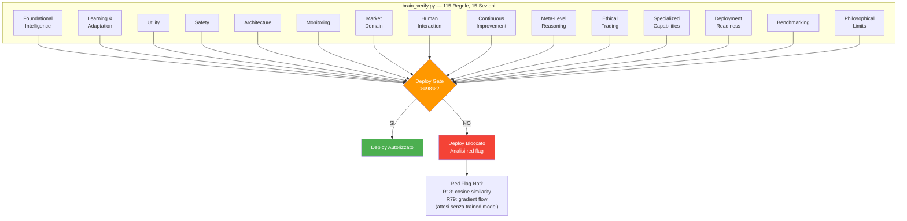

### 3.2 headless_validator.py

**Percorso:** `tools/headless_validator.py`

**Scopo:** Guardia di regressione con 169 controlli eseguibili senza interfaccia grafica e senza servizi esterni obbligatori. Questo strumento e' progettato per essere integrato nei pipeline CI/CD e nei pre-commit hook.

**Categorie di Test:**
- **Import di moduli** (100+ controlli) — Verifica che ogni modulo Python dell'Algo Engine sia importabile senza errori, che le classi e le funzioni attese esistano, che le firme dei costruttori corrispondano ai contratti documentati
- **Validazione schema DB** — Controlla che le definizioni SQLModel corrispondano allo schema atteso, che le migrazioni Alembic siano allineate, che gli indici critici esistano
- **Invarianti di configurazione** — Verifica che METADATA_DIM=60 sia rispettato in tutti i moduli, che le costanti condivise siano coerenti, che i parametri di default siano ragionevoli
- **Smoke test ML** — Esegue un forward pass con dati sintetici attraverso ogni modulo della rete, verificando che le forme di output siano corrette e che non ci siano NaN o Inf
- **Installazione proto** — Controlla che i file proto compilati siano presenti, importabili e contengano i messaggi e i servizi attesi

**Target:** >= 98% (167/169, Redis e DB offline accettabili)

**Comando:**
```bash
python tools/headless_validator.py
```

### 3.3 ml_debugger.py

**Percorso:** `tools/ml_debugger.py`

**Scopo:** Diagnostica della rete neurale con 8 controlli mirati che esaminano proprieta' matematiche e contratti del modello ML.

**Gli 8 Controlli:**

1. **Contratto METADATA_DIM** — Verifica che il valore `METADATA_DIM=60` sia coerente tra la definizione del modello, la configurazione e i dati di input. Una discrepanza qui causerebbe errori di dimensione nei tensori, o peggio, un modello che opera su feature sbagliate senza errore esplicito.

2. **Forma dell'Input** — Controlla che la forma del tensore di input (batch_size, sequence_length, features) corrisponda all'architettura attesa. Verifica ogni stream: price (6 canali), indicator (34 canali), change e metadata.

3. **Range delle Feature** — Verifica che le feature pre-processate cadano nel range atteso. Feature fuori range (es. prezzi negativi, volumi astronomici) indicano problemi nel preprocessing o dati corrotti.

4. **Determinismo dell'Output** — Con lo stesso input e lo stesso seed random, il modello deve produrre lo stesso output. La non-riproducibilita' indica operazioni non deterministiche (dropout attivo in eval mode, batch normalization con statistiche running non frozen).

5. **Varianza tra Seed** — Con seed diversi durante il training, le predizioni devono mostrare varianza ragionevole. Varianza zero indica che il modello ha collassato (produce la stessa predizione per ogni input). Varianza eccessiva indica instabilita' nel training.

6. **Validita' delle Probabilita' del Segnale** — Le probabilita' di output (BUY, SELL, HOLD) devono essere nell'intervallo [0, 1] e la loro somma deve approssimare 1.0. Violazioni indicano un softmax non applicato o corrotto.

7. **Limiti del Position Sizing** — I lotti suggeriti devono essere nell'intervallo configurato (tipicamente 0.01 - 10.0). Valori fuori range indicano un bug nel layer di sizing o un overflow numerico.

8. **Assenza di NaN e Inf** — Nessun tensore nell'intero forward pass deve contenere valori NaN o Infinito. La presenza di NaN e' quasi sempre indice di instabilita' numerica (divisione per zero, logaritmo di valore negativo, gradiente esploso).

**Target:** 100% (8/8) — Nessun controllo puo' fallire.

**Comando:**
```bash
python tools/ml_debugger.py
```

```mermaid
graph LR
    subgraph "ml_debugger.py — 8 Controlli"
        C1["1. METADATA_DIM<br/>= 60"]
        C2["2. Input Shape<br/>B x seq x 60"]
        C3["3. Feature Range<br/>[min, max]"]
        C4["4. Determinismo<br/>same seed = same out"]
        C5["5. Varianza Seeds<br/>0 < var < soglia"]
        C6["6. Probabilita'<br/>[0,1] sum ~= 1"]
        C7["7. Position Sizing<br/>0.01 - 10.0 lotti"]
        C8["8. No NaN/Inf<br/>tutti i tensori"]
    end

    IN["Input Sintetico<br/>batch=4, seq=60, feat=60"] --> C1
    C1 --> C2
    C2 --> C3
    C3 --> C4
    C4 --> C5
    C5 --> C6
    C6 --> C7
    C7 --> C8
    C8 --> RES{"8/8?"}

    RES -->|"SI"| OK["PASS"]
    RES -->|"NO"| FAIL["FAIL — Indagare"]

    style OK fill:#4CAF50,color:white
    style FAIL fill:#F44336,color:white
    style RES fill:#FF9800,color:white
```

### 3.4 dead_code_detector.py

**Percorso:** `tools/dead_code_detector.py`

**Scopo:** Scansione dell'intero progetto con 11 controlli per identificare codice morto, duplicato o orfano che accumula debito tecnico.

**Gli 11 Controlli:**
1. **Moduli orfani** — File Python non importati da nessun altro file del progetto
2. **Moduli vuoti/stub** — File che contengono solo `pass`, docstring o import senza codice sostanziale
3. **Simboli duplicati** — Funzioni o classi con lo stesso nome definite in moduli diversi, potenziale fonte di import ambigui
4. **Import di test stale** — Test che importano moduli rinominati o rimossi
5. **Drift di `__all__`** — Moduli con `__all__` che elenca simboli non esistenti o omette simboli pubblici
6. **Package Go orfani** — Directory Go senza import da altri package del progetto
7. **Messaggi proto non referenziati** — Definizioni proto non utilizzate in nessun file .go o .py
8. **RPC proto non implementati** — Servizi proto definiti ma senza implementazione server
9. **Riferimenti Dockerfile stale** — Dockerfile che copiano o referenziano file che non esistono piu'
10. **Riferimenti CI workflow** — Workflow GitHub Actions che referenziano script o path inesistenti
11. **Chiavi di configurazione morte** — Variabili d'ambiente o chiavi di config lette ma mai utilizzate nel codice

**Target:** >= 90% (10/11, il duplicato `format_compact` e' accettabile perche' presente intenzionalmente in moduli diversi con semantica diversa)

**Comando:**
```bash
python tools/dead_code_detector.py
```

### 3.5 portability_check.py

**Percorso:** `tools/portability_check.py`

**Scopo:** Scansione cross-platform con 12 controlli per garantire che il codice sia eseguibile su sistemi diversi senza modifiche.

**I 12 Controlli:**
1. **Path hardcoded** — Cerca path assoluti come `C:\Users\...` o `/home/user/...` nel codice sorgente
2. **Secret leakage (context-aware)** — Cerca pattern di credenziali nel codice, ma e' sufficientemente intelligente da ignorare quelli in docstring, commenti e file di documentazione dove appaiono come esempi
3. **Sicurezza Docker** — Verifica che i Dockerfile non eseguano come root, che le immagini base siano pinned a versione specifica, che le porte esposte siano documentate
4. **Host hardcoded** — Cerca IP o hostname hardcoded nel codice (es. `localhost`, `192.168.x.x`) che dovrebbero essere variabili d'ambiente
5. **Sicurezza import** — Verifica che non ci siano import condizionali problematici o import di moduli system-specific senza fallback
6. **File richiesti** (5 file) — Verifica la presenza di file essenziali: `.gitignore`, `requirements.txt` o `pyproject.toml`, `Dockerfile`, `docker-compose.yml`, `.env.example`
7. **Go filepath.Join** — Verifica che il codice Go utilizzi `filepath.Join()` invece di concatenazione di stringhe per i path
8. **Portabilita' configurazione** — Verifica che i file di configurazione utilizzino formati cross-platform (YAML, TOML, JSON) e non dipendano da feature OS-specific

**Target:** >= 90% (11/12, IP di Proxmox accettabili perche' infrastrutturali e non applicativi)

**Comando:**
```bash
python tools/portability_check.py
```

### 3.6 moneymaker_hospital.py

**Percorso:** `tools/moneymaker_hospital.py`

**Scopo:** Diagnostica organizzata in 12 dipartimenti ospedalieri, ciascuno specializzato in un aspetto del sistema.

**I 12 Dipartimenti:**

1. **Pronto Soccorso (Emergency Room)** — Controlla errori critici immediati: servizi crashati, connessioni interrotte, file mancanti, configurazioni invalide. Come il pronto soccorso, gestisce le emergenze che richiedono intervento immediato.

2. **Laboratorio di Patologia (Pathology Lab)** — Analizza i "tessuti" del codice: complessita' ciclomatica, copertura dei test, rapporto codice/commenti, lunghezza delle funzioni. Identifica "cellule malate" (funzioni troppo complesse) e "tessuti necrotici" (codice non coperto da test).

3. **Cardiologia (Cardiology)** — Monitora il "battito cardiaco" del sistema: frequenza dei segnali, latenza del pipeline, throughput dei dati, regolarita' del ciclo operativo. Un cuore sano batte regolarmente; un pipeline sano processa dati a frequenza costante.

4. **Neurologia (Neurology)** — Esamina le "funzioni cognitive" dell'AI: coerenza delle predizioni, stabilita' delle rappresentazioni latenti, qualita' dell'embedding, funzionamento dell'attention mechanism. Come un neurologo testa riflessi e coordinazione, questo dipartimento testa le capacita' cognitive della rete.

5. **Oncologia (Oncology)** — Cerca "tumori" nel codice: dead code che cresce, dipendenze inutili che si accumulano, file temporanei che non vengono mai puliti, log che crescono senza rotazione. I tumori del codice, se non rimossi, consumano risorse e complicano la manutenzione.

6. **Pediatria (Pediatrics)** — Esamina i componenti "giovani" del sistema: moduli aggiunti di recente, feature non ancora stabilizzate, codice in fase sperimentale. I componenti giovani richiedono attenzione extra perche' non hanno ancora superato la prova del tempo.

7. **Terapia Intensiva (ICU)** — Monitora i componenti critici ad alto rischio: il circuit breaker, il kill switch, il risk manager, il position sizer. Questi componenti sono in "terapia intensiva" permanente perche' un loro malfunzionamento ha conseguenze finanziarie dirette.

8. **Farmacia (Pharmacy)** — Verifica le "prescrizioni": dipendenze Python, dipendenze Go, versioni pinned, vulnerabilita' note. Come una farmacia controlla interazioni tra farmaci, questo dipartimento controlla conflitti tra dipendenze.

9. **Clinica degli Strumenti (Tool Clinic)** — Verifica che tutti i 14 strumenti diagnostici siano funzionanti e producano output coerente. Una clinica che cura gli strumenti diagnostici stessi.

10. **Sala di Trading (Trading Floor)** — Verifica il flusso end-to-end dal segnale all'esecuzione: generazione segnale, validazione risk, routing ordine, esecuzione, conferma. Come il floor di una borsa, verifica che le operazioni vengano processate correttamente.

11. **Pipeline Dati (Data Pipeline)** — Verifica il flusso dai tick grezzi alle barre aggregate: connessione WebSocket, normalizzazione, aggregazione, persistenza. Controlla la pipeline di ingestione dati descritta nel documento 07_DATABASE_E_STORAGE.

12. **Gestione del Rischio (Risk Management)** — Verifica i limiti di rischio: max drawdown, max posizioni, esposizione per simbolo, limiti giornalieri. Come il dipartimento compliance di una banca, garantisce il rispetto delle regole di gestione del rischio.

**Target:** WARNING o HEALTHY (0 errori critici)

**Comando:**
```bash
python tools/moneymaker_hospital.py
```

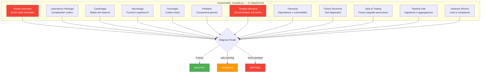

### 3.7 backend_validator.py

**Percorso:** `tools/backend_validator.py`

**Scopo:** Validazione del backend con 7 sezioni: Environment (variabili d'ambiente e path), Database (connessione e schema), Model Zoo (modelli registrati e checkpoint), Analysis (pipeline di analisi), Coaching (sistema di apprendimento), Resource Integrity (file e risorse), Service Health (stato dei microservizi).

### 3.8 feature_audit.py

**Percorso:** `tools/feature_audit.py`

**Scopo:** Verifica l'allineamento del contratto METADATA_DIM=60 tra il codice Go di ingestione (che produce 40 feature tecniche) e il codice Python del brain (che le consuma). Le 40 feature devono avere lo stesso nome, lo stesso ordine e lo stesso tipo numerico in entrambi i linguaggi. Una discrepanza qui significherebbe che il modello ML viene addestrato e inferisce su feature diverse, con conseguenze catastrofiche sulla qualita' delle predizioni.

### 3.9 integrity_manifest.py

**Percorso:** `tools/integrity_manifest.py`

**Scopo:** Genera e verifica un manifesto crittografico SHA-256 di ogni file sorgente del progetto. Documentato in dettaglio nel Capitolo 8.

### 3.10 build_tools.py

**Percorso:** `tools/build_tools.py`

**Scopo:** Controlli pre e post build: verifica che le dipendenze siano installate, che i proto siano compilati, che i Docker image vengano costruiti senza errori, che i test passino dopo il build.

### 3.11 db_health_diagnostic.py

**Percorso:** `tools/db_health_diagnostic.py`

**Scopo:** Diagnostica PostgreSQL completa con 10 sezioni: connessione, versione ed estensioni, dimensione database e tabelle, stato delle hypertable, chunk e compressione, indici e bloat, connessioni attive, lock e deadlock, tempi di query, configurazione del autovacuum.

### 3.12 dev_health.py

**Percorso:** `tools/dev_health.py`

**Scopo:** Orchestratore pre-commit che coordina l'esecuzione di piu' strumenti diagnostici in sequenza. Supporta tre modalita':
- `--quick` — Solo headless_validator e ml_debugger (30 secondi)
- `--full` — Tutti e 14 gli strumenti (5-10 minuti)
- `--ci` — Subset ottimizzato per CI/CD (2-3 minuti)

### 3.13 project_snapshot.py

**Percorso:** `tools/project_snapshot.py`

**Scopo:** Genera uno stato compatto del sistema in meno di 60 righe. Utile per comunicare rapidamente lo stato del progetto in issue, chat o report. Include: conteggio file per linguaggio, conteggio test e tasso di successo, dimensione del database, ultimo commit, stato dei servizi.

### 3.14 context_gatherer.py

**Percorso:** `tools/context_gatherer.py`

**Scopo:** Analisi delle dipendenze basata su AST (Abstract Syntax Tree). Dato un modulo Python, produce il grafo completo delle sue dipendenze interne ed esterne, utile per capire l'impatto potenziale di una modifica e per identificare accoppiamenti indesiderati.

---

## Capitolo 4: Checklist Pre-Modifica

### Procedura Obbligatoria

Prima di apportare QUALSIASI modifica al codice del MONEYMAKER — che si tratti di un bug fix di una riga, di un refactoring di un modulo o dell'aggiunta di una nuova feature — e' obbligatorio eseguire la checklist pre-modifica. Questa procedura stabilisce una baseline di salute del sistema prima della modifica, consentendo di identificare con certezza se eventuali problemi post-modifica sono stati introdotti dalla modifica stessa.

### I 4 Passaggi

**Passaggio 1: Stato Git Pulito**

```bash
git status
```

L'albero di lavoro deve essere pulito (nessun file modificato, nessun file untracked non intenzionale). Se ci sono modifiche non committate, devono essere committate o stashed prima di procedere. Lavorare su un albero sporco rende impossibile isolare l'impatto della nuova modifica.

**Passaggio 2: Test Suite Verde**

```bash
pytest tests/ -x -q
```

Tutti i test devono passare. Il flag `-x` interrompe al primo fallimento per risparmiare tempo. Se ci sono test che falliscono prima della modifica, devono essere corretti o documentati come known failures prima di introdurre nuove modifiche.

**Passaggio 3: Validazione Headless**

```bash
python tools/headless_validator.py
```

Il validatore headless deve raggiungere il target >= 98% (167/169). Se il punteggio e' inferiore, significa che ci sono problemi preesistenti che devono essere risolti prima di introdurre nuove modifiche.

**Passaggio 4: Baseline SHA Manifest**

```bash
python tools/integrity_manifest.py --generate
```

Questo genera un manifesto SHA-256 di tutti i file sorgente. Dopo la modifica, il manifesto verra' utilizzato per verificare che solo i file intenzionalmente modificati siano cambiati, catturando modifiche accidentali a file non correlati.

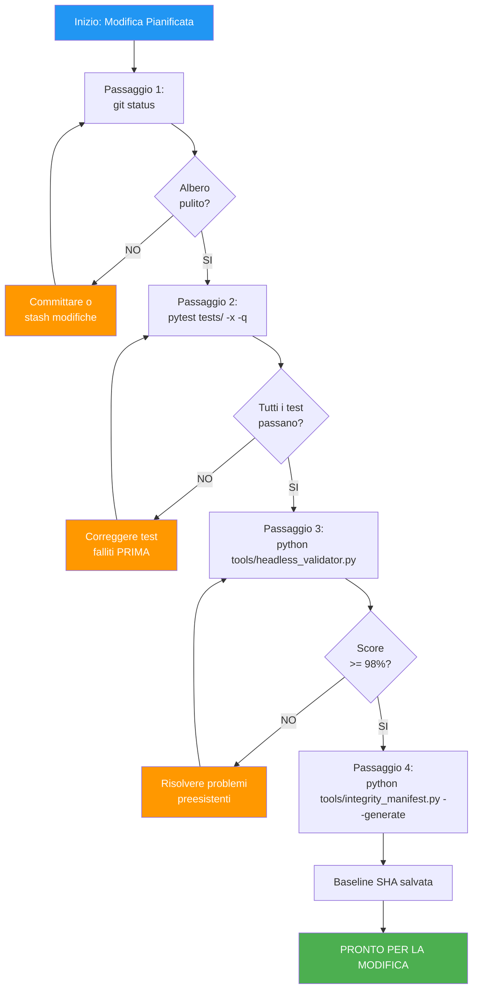

---

## Capitolo 5: Verifica Post-Modifica

### Procedura Obbligatoria

Dopo ogni modifica al codice, prima di committare e pushare, e' obbligatorio eseguire la verifica post-modifica. Questa procedura confronta lo stato del sistema con la baseline pre-modifica e verifica che la modifica non abbia introdotto regressioni.

### I 6 Passaggi

**Passaggio 1: Test Suite Ancora Verde**

```bash
pytest tests/ -x -q
```

Tutti i test che passavano prima devono ancora passare. Se un test che passava ora fallisce, la modifica ha introdotto una regressione che deve essere corretta prima di committare.

**Passaggio 2: Validazione Headless Ancora Sopra Soglia**

```bash
python tools/headless_validator.py
```

Il punteggio deve essere >= 98%. Se il punteggio e' sceso rispetto alla baseline, la modifica ha introdotto un problema che il validatore ha catturato.

**Passaggio 3: Diagnostica ML Perfetta**

```bash
python tools/ml_debugger.py
```

Il target e' 100% (8/8). Qualsiasi modifica che tocca il codice ML, i modelli, le feature o il preprocessing deve essere seguita da una verifica ML completa.

**Passaggio 4: Nessun Nuovo Codice Morto**

```bash
python tools/dead_code_detector.py
```

Il punteggio deve essere >= 90% e non deve essere inferiore alla baseline. Se la modifica ha introdotto nuovo codice morto (funzioni non chiamate, import non utilizzati), deve essere pulito prima di committare.

**Passaggio 5: Verifica Integrita' SHA**

```bash
python tools/integrity_manifest.py --verify
```

Il manifesto SHA deve mostrare che solo i file intenzionalmente modificati sono cambiati. Se file non correlati alla modifica risultano alterati, potrebbe indicare un side effect indesiderato (es. un formatter che ha riformattato file non toccati, un tool che ha modificato cache o file generati).

**Passaggio 6: Commit e Push**

```bash
git add <file_modificati>
git commit -m "descrizione chiara della modifica"
git push
```

Solo dopo aver superato tutti e 5 i passaggi precedenti, la modifica viene committata e pushata. Il messaggio di commit deve descrivere chiaramente cosa e' stato modificato e perche'.

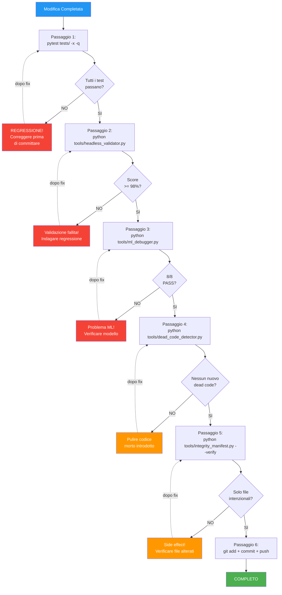

---

## Capitolo 6: Metriche Prometheus

### Catalogo Completo delle Metriche

Il MONEYMAKER espone metriche Prometheus organizzate per microservizio. Tutte le metriche seguono la convenzione di naming Prometheus: `namespace_subsystem_name_unit`, dove il namespace e' sempre `moneymaker`.

### Algo Engine — Metriche del Cervello Decisionale

| Metrica | Tipo | Descrizione |
|---------|------|-------------|
| `moneymaker_signals_generated_total` | Counter | Numero totale di segnali di trading generati dall'avvio del servizio. Label: `symbol`, `direction`, `tier` |
| `moneymaker_pipeline_latency_seconds` | Histogram | Latenza del pipeline decisionale dal ricevimento dei dati alla generazione del segnale. Bucket: 0.01, 0.05, 0.1, 0.25, 0.5, 1.0, 2.5, 5.0, 10.0 secondi |
| `moneymaker_regime_current` | Gauge | Regime di mercato corrente codificato numericamente: 0=UNKNOWN, 1=TRENDING, 2=RANGING, 3=VOLATILE, 4=QUIET |
| `moneymaker_maturity_state` | Gauge | Stato di maturita' del sistema: 0=COLD_START, 1=LEARNING, 2=OPERATIONAL, 3=MATURE |

### Data Ingestion — Metriche del Flusso Dati

| Metrica | Tipo | Descrizione |
|---------|------|-------------|
| `moneymaker_ticks_received_total` | Counter | Numero totale di tick ricevuti dal WebSocket. Label: `symbol`, `source` |
| `moneymaker_bars_published_total` | Counter | Numero totale di barre OHLCV pubblicate su ZMQ. Label: `symbol`, `timeframe` |
| `moneymaker_zmq_messages_sent_total` | Counter | Numero totale di messaggi inviati tramite ZMQ Publisher. Label: `topic` |

### MT5 Bridge — Metriche dell'Esecuzione

| Metrica | Tipo | Descrizione |
|---------|------|-------------|
| `moneymaker_mt5_orders_submitted_total` | Counter | Numero totale di ordini inviati a MetaTrader 5. Label: `symbol`, `direction` |
| `moneymaker_mt5_orders_filled_total` | Counter | Numero totale di ordini eseguiti con successo. Label: `symbol`, `direction` |
| `moneymaker_mt5_order_execution_seconds` | Histogram | Tempo di esecuzione degli ordini dal submit al fill. Bucket: 0.01, 0.05, 0.1, 0.25, 0.5, 1.0, 2.5 secondi |
| `moneymaker_mt5_open_positions` | Gauge | Numero di posizioni attualmente aperte. Label: `symbol` |
| `moneymaker_mt5_unrealized_pnl` | Gauge | Profitto/perdita non realizzato delle posizioni aperte. Label: `symbol`, `currency` |

### Regole di Alerting Raccomandate

Le seguenti regole di alerting Prometheus sono raccomandate per il monitoraggio proattivo:

```yaml
groups:
  - name: moneymaker_alerts
    rules:
      - alert: SignalRateTooLow
        expr: rate(moneymaker_signals_generated_total[5m]) == 0
        for: 15m
        labels:
          severity: warning
        annotations:
          summary: "Nessun segnale generato negli ultimi 15 minuti"

      - alert: PipelineLatencyHigh
        expr: histogram_quantile(0.95, moneymaker_pipeline_latency_seconds_bucket) > 5
        for: 5m
        labels:
          severity: critical
        annotations:
          summary: "Latenza pipeline p95 superiore a 5 secondi"

      - alert: TickGap
        expr: rate(moneymaker_ticks_received_total[5m]) == 0
        for: 5m
        labels:
          severity: critical
        annotations:
          summary: "Nessun tick ricevuto negli ultimi 5 minuti"
```

```mermaid
graph TD
    subgraph "Algo Engine Metriche :9093"
        M1["moneymaker_signals_generated_total<br/>Counter"]
        M2["moneymaker_pipeline_latency_seconds<br/>Histogram"]
        M3["moneymaker_regime_current<br/>Gauge"]
        M4["moneymaker_maturity_state<br/>Gauge"]
    end

    subgraph "Data Ingestion Metriche :9090"
        M5["moneymaker_ticks_received_total<br/>Counter"]
        M6["moneymaker_bars_published_total<br/>Counter"]
        M7["moneymaker_zmq_messages_sent_total<br/>Counter"]
    end

    subgraph "MT5 Bridge Metriche :9094"
        M8["moneymaker_mt5_orders_submitted_total<br/>Counter"]
        M9["moneymaker_mt5_orders_filled_total<br/>Counter"]
        M10["moneymaker_mt5_order_execution_seconds<br/>Histogram"]
        M11["moneymaker_mt5_open_positions<br/>Gauge"]
        M12["moneymaker_mt5_unrealized_pnl<br/>Gauge"]
    end

    PM["Prometheus :9091"]
    M1 --> PM
    M2 --> PM
    M3 --> PM
    M4 --> PM
    M5 --> PM
    M6 --> PM
    M7 --> PM
    M8 --> PM
    M9 --> PM
    M10 --> PM
    M11 --> PM
    M12 --> PM

    PM --> GR["Grafana :3000"]
    PM --> AL["Alertmanager<br/>Notifiche"]

    style PM fill:#E65100,color:white
    style GR fill:#1B5E20,color:white
    style AL fill:#F44336,color:white
```

---

## Capitolo 7: Endpoint Health Check

### Architettura degli Health Check

Gli health check del MONEYMAKER seguono il pattern dei readiness e liveness probe di Kubernetes, sebbene il sistema attuale utilizzi Docker Compose. Ogni servizio espone un endpoint HTTP che restituisce lo stato di salute con i dettagli delle dipendenze verificate.

### Data Ingestion — Health Check

**Endpoint:** `GET http://localhost:8081/health`

**Risposta (200 OK):**
```json
{
  "status": "healthy",
  "service": "data-ingestion",
  "version": "1.0.0",
  "uptime_seconds": 86400,
  "checks": {
    "websocket": "connected",
    "postgresql": "connected",
    "zmq_publisher": "bound",
    "symbols_active": 12
  }
}
```

**Risposta (503 Service Unavailable):**
```json
{
  "status": "unhealthy",
  "service": "data-ingestion",
  "checks": {
    "websocket": "disconnected",
    "postgresql": "connected",
    "zmq_publisher": "bound",
    "symbols_active": 0
  }
}
```

### Algo Engine — Health Check

**Endpoint:** `GET http://localhost:8080/health`

**Risposta (200 OK):**
```json
{
  "status": "healthy",
  "service": "algo-engine",
  "version": "1.0.0",
  "model_loaded": true,
  "model_version": "v2.3.1",
  "checks": {
    "postgresql": "connected",
    "redis": "connected",
    "model": "loaded",
    "zmq_subscriber": "connected"
  }
}
```

### Console — sys health

Il comando `sys health` della console MONEYMAKER esegue un health check composito che verifica tre dipendenze infrastrutturali:

1. **Database (SELECT 1)** — Esegue una query triviale per verificare che la connessione PostgreSQL sia attiva e il database risponda. Se la connessione fallisce, il database e' marcato come NON CONNESSO.

2. **Redis (PING)** — Invia il comando PING al server Redis e attende la risposta PONG. Se la risposta non arriva entro il timeout, Redis e' marcato come NON CONNESSO.

3. **Docker (docker info)** — Esegue `docker info` per verificare che il daemon Docker sia in esecuzione e accessibile. Se il comando fallisce, Docker e' marcato come NON DISPONIBILE.

```
MONEYMAKER> sys health
Health Check:
  PostgreSQL:   OK
  Redis:        OK
  Docker:       OK
```

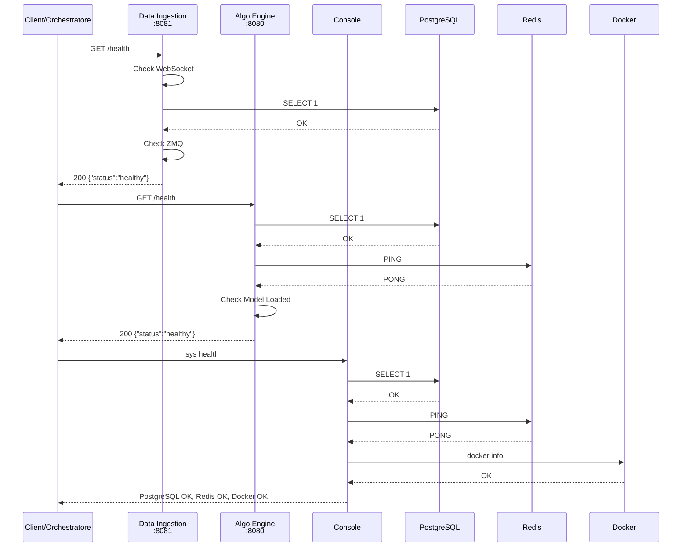

---

## Capitolo 8: Manifesto di Integrita'

### Scopo del Manifesto

Il manifesto di integrita' e' un meccanismo di rilevamento di modifiche non autorizzate al codice sorgente. Genera un hash SHA-256 per ogni file sorgente del progetto e memorizza il risultato in un file manifesto. Confrontando il manifesto generato con quello di riferimento, e' possibile identificare con precisione quali file sono stati modificati, aggiunti o rimossi rispetto alla baseline nota.

### Casi d'Uso

1. **Verifica post-modifica** — Dopo una modifica pianificata, verificare che solo i file intenzionalmente toccati risultino cambiati (Capitolo 5, Passaggio 5)
2. **Rilevamento intrusioni** — In ambienti di produzione, una verifica periodica del manifesto puo' rilevare modifiche non autorizzate al codice (es. compromissione del server, insider threat)
3. **Audit di compliance** — Dimostrare che il codice in esecuzione corrisponde esattamente alla versione rilasciata, senza patch non documentate
4. **Debugging di "works on my machine"** — Confrontare il manifesto tra ambienti diversi per identificare discrepanze nei file sorgente

### Generazione del Manifesto

```bash
python tools/integrity_manifest.py --generate
```

Questo comando scandisce ricorsivamente tutti i file sorgente del progetto (escludendo `.venv`, `__pycache__`, `.git`, `node_modules` e altri pattern configurati) e genera un file manifesto con il formato:

```
SHA256  percorso/relativo/al/file.py
a1b2c3d4e5f6...  program/services/algo-engine/src/algo_engine/main.py
f6e5d4c3b2a1...  program/services/algo-engine/src/algo_engine/models/perception.py
...
```

### Verifica del Manifesto

```bash
python tools/integrity_manifest.py --verify
```

Questo comando ricalcola gli hash di tutti i file e li confronta con il manifesto di riferimento. L'output riporta tre categorie:

- **MODIFIED** — File presenti in entrambi i manifesti ma con hash diverso
- **ADDED** — File presenti nel filesystem ma non nel manifesto di riferimento
- **REMOVED** — File presenti nel manifesto di riferimento ma non nel filesystem

Se la verifica non rileva discrepanze, il comando restituisce exit code 0 e un messaggio di successo. Se rileva discrepanze, restituisce exit code 1 e l'elenco dettagliato dei file coinvolti.

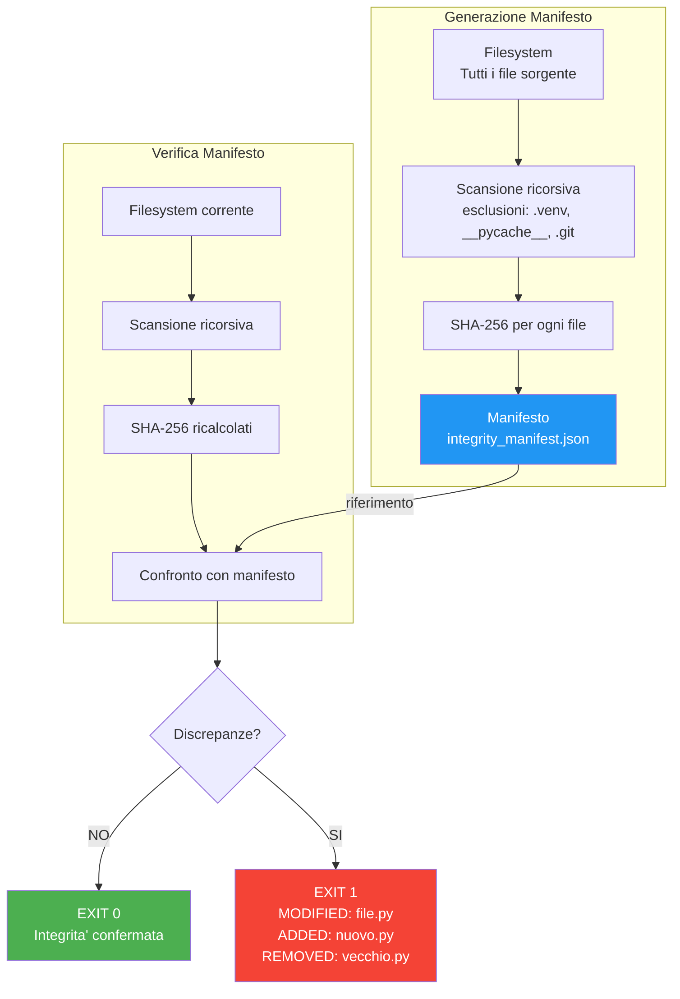

### Integrazione nel Workflow

Il manifesto di integrita' si integra nel workflow di sviluppo in due punti:

1. **Pre-modifica (Capitolo 4):** `--generate` crea la baseline
2. **Post-modifica (Capitolo 5):** `--verify` confronta con la baseline

In ambiente CI/CD, il manifesto puo' essere generato al momento del rilascio e verificato periodicamente in produzione per rilevare drift o manomissioni.

---

## Capitolo 9: Accesso alle Dashboard Grafana

### Configurazione di Base

Grafana e' il layer di visualizzazione che trasforma le metriche Prometheus in dashboard interattive. Nel contesto del MONEYMAKER, Grafana viene deployato come parte dello stack Docker Compose e si connette automaticamente al server Prometheus.

**URL di accesso:** `http://localhost:3000`

**Credenziali di default:** `admin` / `admin` (da cambiare al primo accesso)

### Dashboard Pre-Configurate

Quando il MONEYMAKER viene deployato con `docker-compose up`, le seguenti dashboard vengono automaticamente provisionate tramite il meccanismo di provisioning di Grafana (file JSON nella directory `provisioning/dashboards/`):

**1. MONEYMAKER Overview** — Dashboard principale con vista d'insieme di tutto il sistema:
- Signal rate (segnali/minuto) con trend delle ultime 24 ore
- Pipeline latency p50/p95/p99 con soglie di alerting visualizzate
- Regime di mercato corrente con timeline storica
- Stato di maturita' del sistema

**2. Data Pipeline** — Dettaglio del flusso dati:
- Tick rate per simbolo con heatmap temporale
- Bar publication rate per timeframe
- Gap detection (bucket con conteggio tick anomalo)
- Throughput ZMQ messages/secondo

**3. Execution Quality** — Qualita' dell'esecuzione degli ordini:
- Slippage distribution (istogramma) per simbolo
- Fill rate (ordini eseguiti / ordini inviati) con trend
- Execution latency p50/p95 con confronto tra simboli
- Rejection rate con breakdown per motivo

**4. Risk & PnL** — Gestione del rischio e profitto:
- Open positions gauge con breakdown per simbolo
- Unrealized PnL curve in tempo reale
- Daily realized PnL con barre giornaliere
- Drawdown corrente vs max drawdown storico
- Circuit breaker status indicator

**5. ML Model Health** — Salute dei modelli ML:
- Confidence distribution delle predizioni (istogramma)
- Prediction accuracy rolling (finestra 100 trade)
- Feature drift alert timeline
- Model version deployment history

### Pannelli Chiave

I pannelli piu' critici per il monitoraggio operativo quotidiano sono:

**Signal Rate** — Un pannello timeseries che mostra `rate(moneymaker_signals_generated_total[5m])`. Un tasso costantemente zero per piu' di 15 minuti durante le ore di mercato indica un problema nel pipeline decisionale.

**Pipeline Latency** — Un pannello con le percentili p50, p95 e p99 della latenza del pipeline. La latenza p95 non dovrebbe superare i 5 secondi; se lo fa, il sistema potrebbe operare su dati stale.

**Open Positions** — Un gauge che mostra il numero di posizioni aperte con soglie colorate: verde (0-3), giallo (4-6), rosso (7+). Troppe posizioni simultanee indicano un position sizer malfunzionante o un regime di mercato non riconosciuto.

**PnL Curve** — Un pannello timeseries che mostra la curva di equity cumulativa. Una discesa rapida attiva visivamente l'attenzione dell'operatore prima che il circuit breaker automatico intervenga.

**Regime Distribution** — Un pie chart che mostra la distribuzione temporale dei regimi di mercato nell'ultima settimana. Una distribuzione fortemente sbilanciata (es. 95% UNKNOWN) indica un problema nel classificatore di regime.

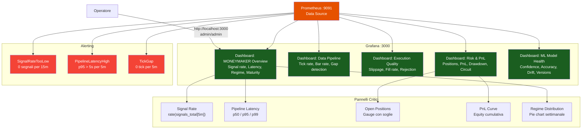

### Configurazione Avanzata

Per ambienti di produzione, le seguenti configurazioni aggiuntive sono raccomandate:

1. **Autenticazione** — Cambiare le credenziali di default e configurare OAuth2 o LDAP per l'autenticazione
2. **Alert channels** — Configurare canali di notifica (email, Slack, Telegram) per gli alert di Grafana
3. **Retention** — Configurare la retention di Prometheus (default 15 giorni) in base allo spazio disco disponibile
4. **Backup dashboard** — Esportare periodicamente le dashboard come JSON per backup e version control
5. **Read-only** — Configurare utenti read-only per visualizzazione senza possibilita' di modificare dashboard o data source
