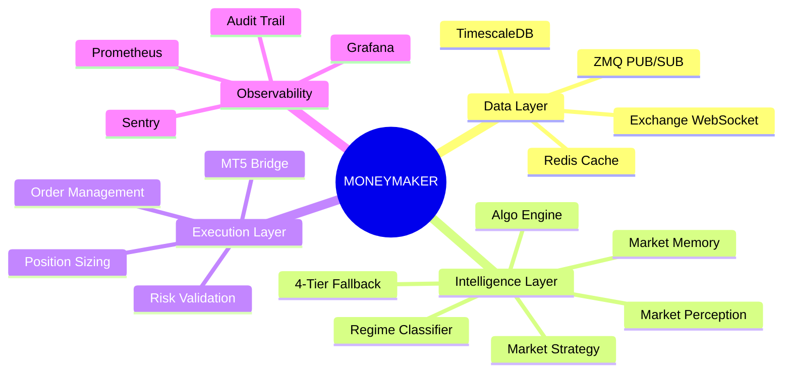
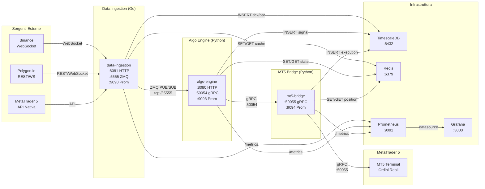
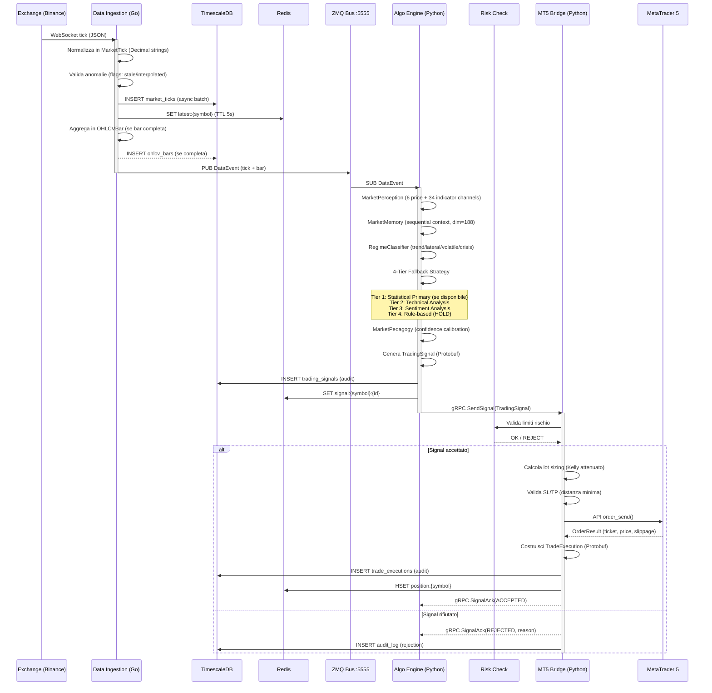
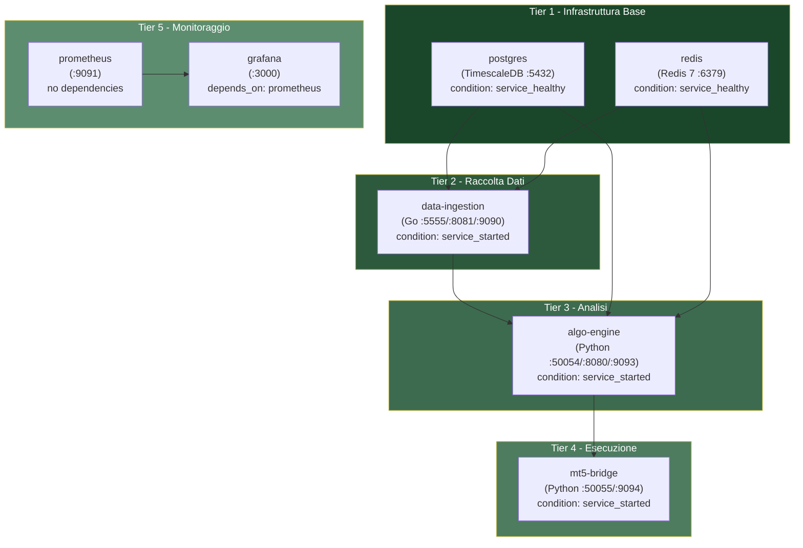
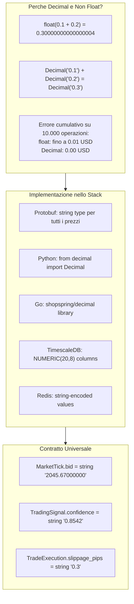
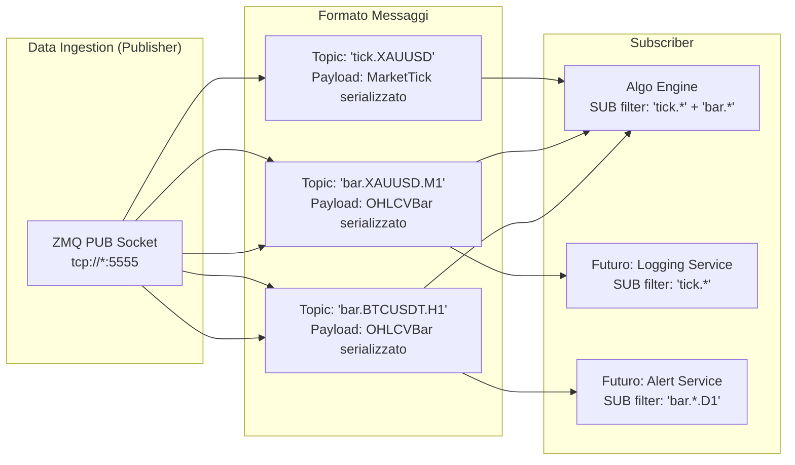
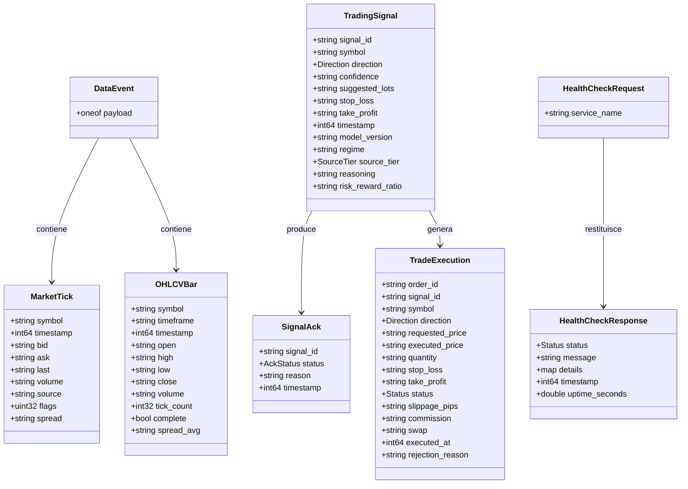
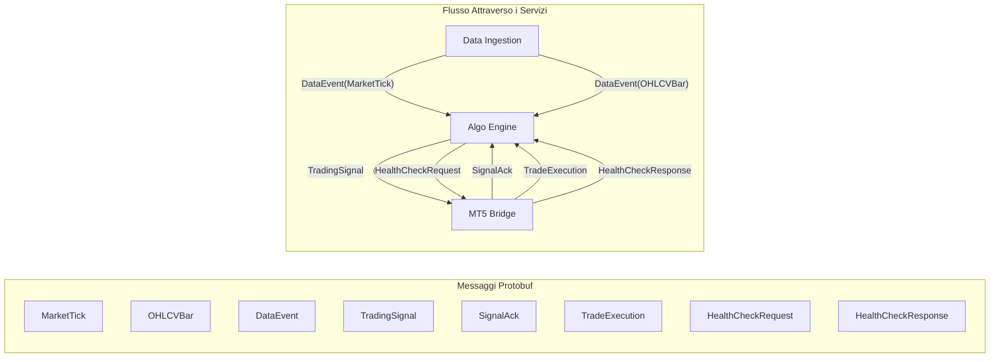

# Architettura del Sistema MONEYMAKER

| Campo | Valore |
|-------|--------|
| **Titolo** | Architettura del Sistema MONEYMAKER |
| **Autore** | Renan Augusto Macena |
| **Data** | 2026-02-28 |
| **Versione** | 1.0.0 |

---

## Indice

1. [Capitolo 1 -- Panoramica Generale](#capitolo-1----panoramica-generale)
2. [Capitolo 2 -- Topologia dei Servizi](#capitolo-2----topologia-dei-servizi)
3. [Capitolo 3 -- Flusso Dati Completo](#capitolo-3----flusso-dati-completo)
4. [Capitolo 4 -- Grafo delle Dipendenze Docker Compose](#capitolo-4----grafo-delle-dipendenze-docker-compose)
5. [Capitolo 5 -- Riferimento Porte e Protocolli](#capitolo-5----riferimento-porte-e-protocolli)
6. [Capitolo 6 -- Principi di Progettazione](#capitolo-6----principi-di-progettazione)
7. [Capitolo 7 -- Protocolli di Comunicazione](#capitolo-7----protocolli-di-comunicazione)
8. [Capitolo 8 -- Contratti Inter-Servizio](#capitolo-8----contratti-inter-servizio)

---

## Capitolo 1 -- Panoramica Generale

### 1.1 Che cos'e MONEYMAKER

MONEYMAKER e un ecosistema di trading algoritmico costruito secondo un'architettura a microservizi. L'obiettivo principale del sistema e raccogliere dati di mercato in tempo reale, elaborarli attraverso un motore algoritmico multi-stadio, generare segnali di trading con livelli di confidenza misurabili e, infine, eseguire ordini sul mercato reale tramite MetaTrader 5. Ogni componente del sistema e stato progettato per essere indipendente, testabile in isolamento e sostituibile senza impattare gli altri servizi. L'intero ecosistema vive in container Docker orchestrati da Docker Compose, con monitoraggio continuo garantito da Prometheus e Grafana.

Il nome MONEYMAKER non e casuale: il sistema e concepito per affrontare la complessita dei mercati finanziari con una forza strutturale massiccia, dove ogni "muscolo" e un servizio specializzato che contribuisce alla potenza complessiva dell'organismo. A differenza dei bot di trading monolitici tradizionali, MONEYMAKER separa rigorosamente le responsabilita: la raccolta dati non sa nulla dell'esecuzione ordini, il motore algoritmico non conosce i dettagli del protocollo MetaTrader, e il bridge di esecuzione non ha alcuna logica di decisione. Questa separazione e la chiave dell'affidabilita e della manutenibilita del sistema.

### 1.2 L'Analogia della Fabbrica di Automobili

Per comprendere l'architettura di MONEYMAKER nella sua interezza, immaginiamo di visitare una fabbrica di automobili moderna e altamente automatizzata. Ogni reparto della fabbrica ha una responsabilita ben definita, comunica con gli altri reparti attraverso canali prestabiliti e produce un output che diventa l'input del reparto successivo. Se un reparto si ferma, gli altri possono continuare a operare in modo degradato grazie ai buffer intermedi.

**Data Ingestion = Reparto Approvvigionamento.** Proprio come il reparto approvvigionamento di una fabbrica automobilistica riceve materie prime da molteplici fornitori (acciaio dalla Germania, gomma dal Brasile, componenti elettronici dal Giappone), il servizio Data Ingestion di MONEYMAKER raccoglie dati da exchange multipli tramite WebSocket. Il reparto approvvigionamento non costruisce automobili: si limita a verificare la qualita delle materie prime, catalogarle, stoccarle nel magazzino (TimescaleDB) e smistarle verso la linea di produzione (ZMQ PUB/SUB). Allo stesso modo, Data Ingestion normalizza i tick di mercato, li valida per anomalie, li persiste nel database e li pubblica sul bus dati. Se un fornitore (exchange) e temporaneamente non raggiungibile, il reparto ha scorte di sicurezza (cache Redis) e procedure di fallback. Il servizio e scritto in Go per sfruttare la concorrenza nativa del linguaggio: le goroutine gestiscono centinaia di connessioni WebSocket simultanee con un overhead di memoria minimo, esattamente come un magazzino automatizzato gestisce piu linee di ricezione merci in parallelo.

**Algo Engine = Centro di Ricerca e Sviluppo.** Il centro R&D della fabbrica e dove avviene tutta l'innovazione. Gli ingegneri analizzano le materie prime ricevute, progettano nuovi modelli, eseguono simulazioni al computer e decidono quale configurazione di veicolo produrre. L'Algo Engine di MONEYMAKER svolge esattamente questo ruolo: riceve i dati di mercato normalizzati, li processa attraverso una pipeline di percezione (MarketPerception), li memorizza in una memoria contestuale (MarketMemory), classifica il regime di mercato corrente (trend, laterale, volatile) e genera segnali di trading attraverso una strategia multi-esperto (MarketStrategy). Il centro R&D non monta fisicamente le automobili, cosi come il Brain non esegue ordini: produce istruzioni dettagliate (TradingSignal) che includono direzione, lotti suggeriti, stop loss, take profit, livello di confidenza e motivazione testuale. Il sistema di fallback a 4 livelli (Statistical Primary, Technical, Sentiment, Rule-based) garantisce operativita anche quando i modelli statistici avanzati non sono disponibili.

**MT5 Bridge = Sportello Bancario / Concessionaria.** Lo sportello bancario e il punto dove il cliente finale interagisce con il sistema finanziario. Il cassiere riceve istruzioni precise (un assegno firmato, un ordine di bonifico), le valida, le esegue sul sistema bancario e restituisce una ricevuta. Il MT5 Bridge di MONEYMAKER funziona allo stesso modo: riceve un TradingSignal dal Brain tramite gRPC, lo valida contro i limiti di rischio, lo traduce nelle API native di MetaTrader 5, lo esegue e restituisce un TradeExecution con tutti i dettagli dell'operazione (prezzo eseguito, slippage, commissioni). Lo sportello non decide mai autonomamente se fare un'operazione: si limita a eseguire gli ordini che arrivano dal centro direzionale, con il potere di rifiutare quelli che violano le policy di sicurezza.

**TimescaleDB = Archivio Storico.** Il magazzino documentale della fabbrica conserva ogni singolo documento: ordini di acquisto, report di qualita, disegni tecnici, verbali di collaudo. TimescaleDB svolge questo ruolo per MONEYMAKER, conservando ogni tick, ogni candela OHLCV, ogni segnale generato e ogni ordine eseguito. Grazie alle hypertable e alla compressione nativa, puo gestire miliardi di righe senza degradazione delle performance.

**Redis = Lavagna degli Annunci.** Nella fabbrica, la lavagna degli annunci nella sala riunioni contiene le informazioni che devono essere immediatamente disponibili a tutti: lo stato della produzione, gli allarmi in corso, le metriche del turno corrente. Redis e la cache in-memory di MONEYMAKER: mantiene lo stato corrente dei mercati, i segnali piu recenti, le posizioni aperte e i flag operativi. Ogni servizio puo leggere e scrivere su Redis in microsecondi.

**Prometheus + Grafana = Pannello di Controllo della Fabbrica.** Il pannello di controllo centrale mostra in tempo reale il battito cardiaco della fabbrica: temperature dei forni, velocita dei nastri trasportatori, livello delle scorte, tasso di scarti. Prometheus raccoglie metriche da ogni servizio MONEYMAKER (latenza, throughput, errori, dimensione delle code), mentre Grafana le visualizza su dashboard interattive con soglie di allarme configurabili.

### 1.3 Principi Fondamentali dell'Ecosistema

L'intero ecosistema MONEYMAKER e stato costruito attorno a cinque principi architetturali non negoziabili che permeano ogni decisione di design, dalla scelta del formato dei numeri alla configurazione dei circuit breaker:

1. **Precisione Finanziaria Assoluta**: nessun valore monetario viene mai rappresentato come floating-point. Si utilizzano esclusivamente stringhe decimali (`Decimal` in Python, `string` nei protobuf). Questo principio e radicato nella consapevolezza che un errore di arrotondamento su un prezzo dell'oro (XAUUSD) puo causare perdite reali.

2. **Fail-Safe per Default**: quando il sistema e in dubbio, la risposta e sempre HOLD (mantieni posizione). Un segnale con confidenza insufficiente viene scartato. Un modello statistico non raggiungibile attiva il fallback. Un ordine che viola i limiti di rischio viene rifiutato. La prudenza e codificata nell'architettura, non delegata alla disciplina umana.

3. **Osservabilita Totale**: ogni decisione, ogni calcolo, ogni errore viene tracciato. I segnali di trading includono un campo `reasoning` che spiega in linguaggio naturale perche il Brain ha preso quella decisione. Ogni trade ha una catena di audit con hash SHA-256. Le metriche Prometheus coprono latenza, throughput e tasso di errore di ogni singolo endpoint.

4. **Analisi Statistica Opzionale con Fallback Deterministico**: l'analisi statistica avanzata e un acceleratore, non una dipendenza. Se il modello statistico e offline, il sistema continua a operare con strategie tecniche, sentiment-based o rule-based. Questo approccio a 4 livelli garantisce che MONEYMAKER non sia mai "cieco".

5. **Sicurezza Defense-in-Depth**: le credenziali vengono esclusivamente da variabili d'ambiente, mai dal codice. Le connessioni tra servizi utilizzano protocolli autenticati. I log sono protetti da manomissioni. Le API esterne sono rate-limited. Ogni superficie di attacco e stata analizzata secondo OWASP Top 10.

---

## Capitolo 2 -- Topologia dei Servizi

### 2.1 Mappa dei Servizi

La topologia di MONEYMAKER segue un pattern pipeline lineare con arricchimento laterale. I dati fluiscono da sinistra (sorgenti esterne) a destra (esecuzione), con i servizi infrastrutturali che forniscono supporto trasversale a tutti i nodi della pipeline. Il diagramma seguente mostra l'intera topologia con i protocolli di comunicazione e le porte associate.

### 2.2 Responsabilita di Ogni Servizio

Ogni servizio ha un perimetro di responsabilita rigoroso e ben definito. Nessun servizio invade il territorio dell'altro. Questa separazione e garantita dall'uso di contratti Protobuf che fungono da "muro legale" tra i servizi: se un servizio vuole comunicare con un altro, deve farlo attraverso i messaggi definiti nei file `.proto`, senza eccezioni.

**Data Ingestion (Go)** gestisce tre responsabilita principali: connessione e mantenimento delle sorgenti dati (reconnect automatico con backoff esponenziale), normalizzazione dei dati grezzi in formato standard (`MarketTick` e `OHLCVBar`), e distribuzione dei dati normalizzati tramite ZMQ PUB/SUB. Il servizio e scritto in Go perche la gestione di centinaia di connessioni WebSocket concorrenti richiede un modello di concorrenza leggero (goroutine + channel). Ogni connessione WebSocket vive in una goroutine dedicata, e i messaggi vengono instradati attraverso una pipeline di channel che implementa validazione, normalizzazione, aggregazione in candele e pubblicazione sul bus ZMQ. Il servizio espone metriche Prometheus dettagliate: numero di tick al secondo per simbolo, latenza media di processamento, numero di reconnect, dimensione delle code interne.

**Algo Engine (Python)** e il cuore decisionale dell'ecosistema. Sottoscrive i dati di mercato dal bus ZMQ, li elabora attraverso una pipeline algoritmica multi-stadio (MarketPerception -> MarketMemory -> RegimeClassifier -> MarketStrategy -> MarketPedagogy) e produce segnali di trading (`TradingSignal`). Il Brain implementa il sistema di fallback a 4 livelli (Statistical Primary, Technical, Sentiment, Rule-based) che garantisce operativita anche quando i modelli statistici avanzati non sono disponibili. Ogni segnale generato include un campo `reasoning` che spiega la logica della decisione, un livello di confidenza numerico e l'identificazione della sorgente che ha prodotto il segnale (tramite il campo `source_tier`). Il Brain espone un endpoint gRPC sulla porta 50054 per la comunicazione con il MT5 Bridge e un endpoint REST sulla porta 8080 per health check e interrogazioni diagnostiche.

**MT5 Bridge (Python)** traduce i segnali di trading in ordini MetaTrader 5 reali. Il servizio riceve i `TradingSignal` tramite gRPC, li valida contro i limiti di rischio configurati (esposizione massima, perdita massima giornaliera, correlazione tra posizioni), calcola il dimensionamento della posizione (lot sizing) secondo il criterio di Kelly attenuato, e infine esegue l'ordine tramite le API native di MT5. Dopo l'esecuzione, il Bridge produce un messaggio `TradeExecution` che contiene il prezzo effettivo di esecuzione, lo slippage in pip, le commissioni e lo swap. Questo messaggio viene restituito al Brain come conferma e persistito su TimescaleDB per l'audit trail.

### 2.3 Servizi Infrastrutturali

**TimescaleDB (PostgreSQL 16 con estensione TimescaleDB)** e il database primario dell'ecosistema. Le tabelle principali sono organizzate in hypertable partizionate per tempo, il che consente query efficienti su serie temporali con miliardi di righe. Il database ospita: tick di mercato (`market_ticks`), candele OHLCV (`ohlcv_bars`), segnali di trading (`trading_signals`), esecuzioni (`trade_executions`), metriche di performance (`performance_metrics`) e log di audit (`audit_log`). La retention policy e configurata per mantenere i tick grezzi per 90 giorni e le candele aggregate indefinitamente, con compressione automatica dopo 7 giorni.

**Redis 7** serve come cache distribuita e bus di stato. I pattern di utilizzo principali sono: cache delle ultime quotazioni per simbolo (TTL 5 secondi), stato delle posizioni aperte (hash per symbol), flag operativi (circuit breaker, kill switch, pausa trading), e pub/sub per notifiche in tempo reale tra servizi. Redis e configurato con autenticazione password e persistence AOF per sopravvivere ai restart.

**Prometheus** scrape le metriche da tutti i servizi ogni 15 secondi tramite endpoint `/metrics` HTTP. Le metriche vengono conservate per 30 giorni con compaction automatico. Le recording rules precalcolano aggregazioni comuni (P99 latency, error rate 5m, throughput).

**Grafana** fornisce dashboard interattive per operatori e sviluppatori. Le dashboard principali sono: Trading Overview (segnali generati, ordini eseguiti, P&L), System Health (CPU, memoria, latenza per servizio), Data Pipeline (tick/sec, candele completate, lag), e Risk Monitor (esposizione corrente, drawdown, limiti avvicinati).

---

## Capitolo 3 -- Flusso Dati Completo

### 3.1 Ciclo di Vita di un Trade

Il flusso dati completo in MONEYMAKER segue un percorso deterministico dal tick di mercato all'ordine eseguito. Ogni passaggio e tracciabile, misurabile e reversibile. Il diagramma seguente illustra il ciclo di vita completo di un singolo trade, dalla ricezione del tick dall'exchange fino alla conferma dell'esecuzione su MetaTrader 5.

### 3.2 Dettaglio del Flusso di Normalizzazione

Quando un tick arriva dall'exchange, il servizio Data Ingestion esegue una serie di trasformazioni che garantiscono l'integrita del dato prima di distribuirlo al resto dell'ecosistema. Il processo e il seguente:

1. **Ricezione grezza**: il tick arriva come JSON dal WebSocket dell'exchange. Ogni exchange ha un formato diverso (Binance usa `"p"` per il prezzo, Polygon usa `"price"`, MT5 usa `bid`/`ask`). L'adapter specifico dell'exchange converte il JSON grezzo in un formato intermedio comune.

2. **Normalizzazione**: il formato intermedio viene convertito in un messaggio `MarketTick` Protobuf. I prezzi vengono convertiti in stringhe decimali con precisione totale (nessun arrotondamento). Il timestamp viene normalizzato in millisecondi Unix UTC. Il simbolo viene normalizzato nel formato MONEYMAKER standard (es. `"XAUUSD"`, `"BTCUSDT"`).

3. **Validazione**: il tick normalizzato viene sottoposto a controlli di qualita. Il campo `flags` viene impostato con bit flag: `0x01` se il prezzo e anomalo (deviazione > 3 sigma dal moving average), `0x02` se il tick e stale (timestamp troppo vecchio), `0x04` se il tick e stato interpolato (gap filling). I tick con flag anomalia vengono comunque distribuiti ma marcati, in modo che i consumatori possano decidere come trattarli.

4. **Aggregazione**: il tick viene accumulato nell'aggregatore di candele. Quando una candela e completa (es. fine del minuto per M1), viene prodotto un messaggio `OHLCVBar` con il flag `complete=true`. Le candele incomplete vengono pubblicate periodicamente con `complete=false` per consentire ai consumatori di avere una visione aggiornata anche durante la formazione della candela.

5. **Distribuzione**: il `DataEvent` (che contiene sia il tick che l'eventuale bar completa) viene pubblicato sul bus ZMQ. Tutti i subscriber (Algo Engine, eventuali servizi futuri) ricevono il messaggio in tempo reale con latenza sub-millisecondo.

### 3.3 Latenze Tipiche del Pipeline

Il pipeline MONEYMAKER e ottimizzato per latenze ridotte, anche se il trading su MetaTrader 5 non richiede latenze ultra-basse come nel HFT. Le latenze tipiche misurate sono: ricezione tick da exchange (1-5 ms), normalizzazione e validazione (< 1 ms), pubblicazione su ZMQ (< 0.5 ms), elaborazione Brain completa (10-50 ms), comunicazione gRPC Brain-Bridge (< 2 ms), esecuzione ordine su MT5 (50-200 ms). La latenza totale end-to-end tipica e compresa tra 65 ms e 260 ms, ampiamente sufficiente per il trading di posizione e swing trading per cui MONEYMAKER e progettato.

---

## Capitolo 4 -- Grafo delle Dipendenze Docker Compose

### 4.1 Ordine di Avvio

L'orchestrazione Docker Compose definisce un grafo aciclico diretto (DAG) di dipendenze che determina l'ordine di avvio dei servizi. Questo ordine e critico per evitare errori di connessione durante lo startup. Il grafo seguente mostra le dipendenze con le condizioni di salute richieste.

### 4.2 Strategia di Health Check

Ogni servizio infrastrutturale implementa un health check che Docker utilizza per determinare quando il servizio e "pronto" a ricevere connessioni. I servizi applicativi (data-ingestion, algo-engine, mt5-bridge) utilizzano la condizione `service_started` anziche `service_healthy` perche il loro health check interno e piu complesso e viene gestito a livello applicativo.

**PostgreSQL**: il health check esegue `pg_isready -U moneymaker -d moneymaker` ogni 10 secondi con timeout di 5 secondi e 5 retry massimi. Questo comando verifica che il server PostgreSQL sia in grado di accettare connessioni per il database `moneymaker` con l'utente `moneymaker`. Solo quando questo check restituisce successo, i servizi dipendenti possono avviarsi.

**Redis**: il health check esegue `redis-cli -a <password> ping` ogni 10 secondi con timeout di 5 secondi e 3 retry. La risposta attesa e `PONG`. Se Redis non risponde entro i retry configurati, Docker lo considera unhealthy e i servizi dipendenti non vengono avviati.

**Servizi applicativi**: data-ingestion, algo-engine e mt5-bridge espongono endpoint `/health` HTTP che restituiscono lo stato dettagliato del servizio, incluso lo stato delle connessioni a PostgreSQL e Redis. Questi endpoint vengono interrogati da Prometheus come parte del monitoraggio continuo, e possono essere utilizzati da script di verifica manuali.

### 4.3 Volume e Persistenza

Il file docker-compose.yml definisce quattro volumi Docker named per la persistenza dei dati tra restart dei container: `postgres-data` (dati TimescaleDB), `redis-data` (snapshot AOF di Redis), `prometheus-data` (serie temporali delle metriche), `grafana-data` (configurazione dashboard e utenti Grafana). Questi volumi sono gestiti da Docker e sopravvivono ai `docker-compose down` (ma non ai `docker-compose down -v`). Per il backup, si utilizzano script dedicati che eseguono `pg_dump` per PostgreSQL e copiano i volumi Docker.

---

## Capitolo 5 -- Riferimento Porte e Protocolli

### 5.1 Tabella Completa delle Porte

La tabella seguente elenca tutte le porte utilizzate dall'ecosistema MONEYMAKER, con il servizio associato, il protocollo e una descrizione del traffico.

```mermaid
graph LR
    subgraph Porte["Mappa delle Porte MONEYMAKER"]
        direction TB
        P5555["5555 - ZMQ PUB/SUB\nMarket Data Bus"]
        P8080["8080 - HTTP REST\nAlgo Engine Health"]
        P8081["8081 - HTTP REST\nData Ingestion Health"]
        P9090["9090 - HTTP\nData Ingestion Metrics"]
        P9091["9091 - HTTP\nPrometheus UI/API"]
        P9093["9093 - HTTP\nAlgo Engine Metrics"]
        P9094["9094 - HTTP\nMT5 Bridge Metrics"]
        P9095["9095 - HTTP\nFuturo (placeholder)"]
        P50054["50054 - gRPC\nTradingSignalService"]
        P50055["50055 - gRPC\nExecutionBridgeService"]
        P5432["5432 - TCP\nPostgreSQL/TimescaleDB"]
        P6379["6379 - TCP\nRedis"]
        P3000["3000 - HTTP\nGrafana Dashboard"]
    end
```

| Porta | Servizio | Protocollo | Direzione | Descrizione |
|-------|----------|------------|-----------|-------------|
| **5555** | Data Ingestion | ZMQ PUB/SUB | DI -> Brain | Bus dati di mercato in tempo reale. Pubblica `DataEvent` (tick + candele). Pattern PUB/SUB: un publisher, N subscriber. |
| **8080** | Algo Engine | HTTP REST | Esterno -> Brain | Health check, diagnostica, interrogazioni stato. Endpoint: `/health`, `/status`, `/signals/recent`. |
| **8081** | Data Ingestion | HTTP REST | Esterno -> DI | Health check e metriche operative. Endpoint: `/health`, `/status`, `/symbols`. Mappato da porta interna 8080. |
| **9090** | Data Ingestion | HTTP | Prometheus -> DI | Endpoint `/metrics` in formato Prometheus. Metriche: `moneymaker_di_ticks_total`, `moneymaker_di_latency_seconds`, ecc. |
| **9091** | Prometheus | HTTP | Esterno -> Prometheus | Interfaccia web Prometheus e API di query PromQL. Mappato da porta interna 9090. |
| **9093** | Algo Engine | HTTP | Prometheus -> Brain | Endpoint `/metrics`. Metriche: `moneymaker_brain_signals_total`, `moneymaker_brain_confidence_histogram`, ecc. |
| **9094** | MT5 Bridge | HTTP | Prometheus -> Bridge | Endpoint `/metrics`. Metriche: `moneymaker_mt5_executions_total`, `moneymaker_mt5_slippage_pips`, ecc. |
| **9095** | Futuro (placeholder) | HTTP | Prometheus -> Futuro | Endpoint `/metrics` riservato per servizi futuri (attualmente placeholder). |
| **50054** | Algo Engine | gRPC (Protobuf) | Brain -> Bridge | Servizio `TradingSignalService`: `SendSignal(TradingSignal)`, `StreamSignals(stream TradingSignal)`. |
| **50055** | MT5 Bridge | gRPC (Protobuf) | Bridge -> MT5 | Servizio `ExecutionBridgeService`: `ExecuteTrade(TradingSignal)`, `StreamTradeUpdates(...)`, `CheckHealth(...)`. |
| **5432** | TimescaleDB | PostgreSQL | Tutti -> DB | Database relazionale con estensione TimescaleDB. Accesso da tutti i servizi applicativi. |
| **6379** | Redis | Redis Protocol | Tutti -> Redis | Cache distribuita e state store. Accesso da tutti i servizi applicativi. Protetto da password. |
| **3000** | Grafana | HTTP | Esterno -> Grafana | Dashboard di monitoraggio. Autenticazione con password configurabile tramite `GRAFANA_PASSWORD`. |

### 5.2 Regole di Firewall Consigliate

In un ambiente di produzione, le porte dovrebbero essere esposte con le seguenti regole: le porte 3000, 8080, 8081 e 9091 possono essere esposte alla rete locale per accesso operatore. Le porte 5432, 6379 e 5555 dovrebbero essere accessibili solo dalla rete Docker interna. Le porte gRPC (50054, 50055) dovrebbero essere accessibili solo tra i container. Le porte metriche (9090, 9093, 9094) dovrebbero essere accessibili solo da Prometheus.

---

## Capitolo 6 -- Principi di Progettazione

### 6.1 Decimal: Mai Float per il Denaro

Il principio piu critico dell'architettura MONEYMAKER e l'uso esclusivo di tipi `Decimal` (Python) e stringhe decimali (Protobuf, JSON, database) per tutti i valori monetari. Questo principio e codificato in ogni livello dello stack:

In Python, ogni modulo che gestisce valori finanziari importa `from decimal import Decimal, ROUND_HALF_UP` e opera esclusivamente con oggetti `Decimal`. Le conversioni da float sono vietate: se un dato arriva come float (ad esempio da un'API esterna), viene immediatamente convertito in stringa e poi in `Decimal` per preservare la precisione originale. Nei file Protobuf, tutti i campi che rappresentano prezzi, quantita, confidenze o commissioni sono definiti come `string`, mai come `double` o `float`. Questa scelta aggiunge un overhead trascurabile nella serializzazione ma elimina completamente il rischio di errori di arrotondamento nella comunicazione inter-servizio.

### 6.2 Fail-Safe: HOLD Quando in Dubbio

MONEYMAKER implementa il principio fail-safe attraverso la costante `Direction.DIRECTION_HOLD` definita nel file `trading_signal.proto`. Ogni punto decisionale del sistema ha una clausola di default che produce HOLD. Se il modello statistico non e raggiungibile, il fallback produce HOLD. Se la confidenza del segnale e sotto la soglia minima (tipicamente 0.60), il segnale viene convertito in HOLD. Se il risk check rileva una violazione, l'ordine viene rifiutato e la posizione rimane invariata. Se il MT5 Bridge non riesce a connettersi a MetaTrader, tutti i segnali vengono messi in coda e il sistema opera in modalita HOLD fino al ripristino della connessione. Questo approccio garantisce che in nessun caso il sistema prenda una decisione aggressiva in condizioni di incertezza. La perdita di un'opportunita di profitto e sempre preferibile a un trade errato.

### 6.3 Analisi Statistica Opzionale: Fallback a 4 Livelli

Il sistema di fallback a 4 livelli e uno dei design pattern piu importanti di MONEYMAKER. Garantisce che il Brain produca sempre un segnale, indipendentemente dalla disponibilita dei componenti avanzati. I quattro livelli sono definiti nell'enum `SourceTier` del file `trading_signal.proto` e ogni segnale prodotto dal Brain include l'indicazione di quale livello lo ha generato.

Il **Tier 1 (Statistical Primary)** e il livello piu avanzato: utilizza modelli statistici avanzati calibrati sui dati storici per generare predizioni direzionali. Quando il modello statistico e operativo e supera le soglie di validazione, questo e il tier preferito.

Il **Tier 2 (Technical)** utilizza indicatori tecnici classici (RSI, MACD, ATR, Bollinger Bands, EMA crossover) per generare segnali. Questo livello non richiede modelli statistici avanzati ed e completamente deterministico.

Il **Tier 3 (Sentiment)** analizza dati di sentiment (quando disponibili) per generare segnali basati sul posizionamento del mercato.

Il **Tier 4 (Rule-based)** e il livello di ultima istanza: produce sempre HOLD. Se nessuno dei livelli superiori e in grado di generare un segnale con confidenza sufficiente, il sistema si rifugia nella posizione difensiva.

### 6.4 Audit Trail con SHA-256

Ogni segnale di trading generato dal Brain e ogni ordine eseguito dal Bridge vengono registrati nel database con un hash SHA-256 che collega ogni record al precedente, formando una catena di audit immutabile. Questo pattern, ispirato alla blockchain, garantisce che qualsiasi manomissione dei dati storici sia rilevabile. L'hash include: signal_id, symbol, direction, confidence, timestamp, e l'hash del record precedente. Questa catena puo essere verificata in qualsiasi momento per dimostrare l'integrita temporale delle decisioni del sistema.

### 6.5 Credenziali da Environment

Nessuna credenziale, chiave API, password o segreto e mai codificato nel codice sorgente o nei file di configurazione committati nel repository. Tutte le credenziali vengono iniettate tramite variabili d'ambiente, definite in un file `.env` locale (che e in `.gitignore`) o tramite il sistema di secrets management dell'infrastruttura di deployment. Il docker-compose.yml utilizza la sintassi `${VARIABILE:-default}` per fornire valori di sviluppo sicuri (es. `moneymaker_dev` come password del database) che non dovrebbero mai essere usati in produzione.

---

## Capitolo 7 -- Protocolli di Comunicazione

### 7.1 ZMQ PUB/SUB per Dati di Mercato

La comunicazione dei dati di mercato in tempo reale utilizza ZeroMQ con il pattern PUB/SUB. Questo pattern e stato scelto per diverse ragioni architetturali: disaccoppiamento totale tra produttore e consumatori (il Data Ingestion non conosce e non si cura di quanti subscriber ci sono), latenza minima (zero-copy message passing quando possibile), e scalabilita naturale (aggiungere un nuovo consumatore non richiede modifiche al produttore).

Il Data Ingestion pubblica messaggi con topic gerarchici: `tick.{symbol}` per i tick e `bar.{symbol}.{timeframe}` per le candele. I subscriber possono filtrare per topic prefix, ricevendo solo i messaggi che li interessano. Il payload di ogni messaggio e un `DataEvent` Protobuf serializzato, che contiene o un `MarketTick` o un `OHLCVBar` nel campo `oneof`. La serializzazione Protobuf garantisce efficienza (dimensione del messaggio ridotta rispetto a JSON) e type-safety (il deserializzatore verificala struttura del messaggio).

### 7.2 gRPC + Protobuf per Comandi

La comunicazione di comandi e risposte tra Algo Engine e MT5 Bridge utilizza gRPC con messaggi Protobuf. gRPC e stato scelto per i seguenti vantaggi: contratti tipizzati (i file `.proto` definiscono esattamente la struttura di ogni messaggio e servizio), generazione automatica di client e server in Python e Go, supporto nativo per streaming bidirezionale (il servizio `StreamSignals` e `StreamTradeUpdates`), e compressione HTTP/2 per ridurre la banda utilizzata.

I due servizi gRPC definiti nell'ecosistema sono:

**TradingSignalService** (porta 50054, definito in `trading_signal.proto`): espone `SendSignal(TradingSignal) -> SignalAck` per segnali singoli e `StreamSignals(stream TradingSignal) -> stream SignalAck` per streaming bidirezionale. Il Brain agisce come server gRPC e il Bridge come client, ma il flusso logico dei dati va dal Brain al Bridge.

**ExecutionBridgeService** (porta 50055, definito in `execution.proto`): espone `ExecuteTrade(TradingSignal) -> TradeExecution` per l'esecuzione di ordini, `StreamTradeUpdates(HealthCheckRequest) -> stream TradeExecution` per ricevere aggiornamenti sullo stato degli ordini, e `CheckHealth(HealthCheckRequest) -> HealthCheckResponse` per verificare lo stato del Bridge.

### 7.3 REST per Health Check

Ogni servizio espone endpoint REST HTTP per health check e diagnostica. Questi endpoint non trasportano dati di business ma servono per monitoraggio, debugging e integrazione con sistemi esterni (load balancer, orchestratori, script di verifica). Gli endpoint standard sono: `GET /health` (ritorna lo stato del servizio con dettagli sulle dipendenze), `GET /status` (ritorna informazioni operative: uptime, versione, configurazione), `GET /metrics` (ritorna metriche in formato Prometheus text exposition).

---

## Capitolo 8 -- Contratti Inter-Servizio

### 8.1 Panoramica dei Messaggi Protobuf

I contratti inter-servizio sono definiti in 5 file `.proto` nella directory `program/shared/proto/`. Questi file costituiscono la "legge" della comunicazione tra servizi: nessun servizio puo inviare o ricevere dati in un formato diverso da quello definito nei proto. Questa rigidita e intenzionale e previene un'intera classe di bug legati a incompatibilita di formato.

### 8.2 Enumerazioni Condivise

I file proto definiscono diverse enumerazioni condivise tra servizi:

**Direction** (`trading_signal.proto`): definisce le tre possibili direzioni di un segnale di trading. `DIRECTION_UNSPECIFIED (0)` e il valore di default protobuf e non dovrebbe mai apparire in un segnale valido. `DIRECTION_BUY (1)` indica un'operazione long. `DIRECTION_SELL (2)` indica un'operazione short. `DIRECTION_HOLD (3)` indica la decisione di non operare. La presenza esplicita di HOLD come valore dell'enum (anziche l'assenza di segnale) e una scelta architetturale deliberata: il sistema distingue tra "non ho generato un segnale" e "ho generato un segnale che dice di non fare nulla". Quest'ultimo e un atto decisionale positivo che viene registrato nell'audit trail.

**SourceTier** (`trading_signal.proto`): identifica quale livello del sistema di fallback ha prodotto il segnale. `SOURCE_TIER_STATISTICAL_PRIMARY (1)` e il modello statistico principale. `SOURCE_TIER_TECHNICAL (2)` sono gli indicatori tecnici. `SOURCE_TIER_SENTIMENT (3)` e l'analisi del sentiment. `SOURCE_TIER_RULE_BASED (4)` e la strategia difensiva di base. Questa informazione e preziosa per l'analisi delle performance: permette di valutare separatamente l'efficacia di ogni tier e di identificare periodi in cui il sistema ha operato in modalita degradata.

**AckStatus** (`trading_signal.proto`): lo stato della conferma di un segnale. `ACK_STATUS_ACCEPTED (1)` indica che il Bridge ha accettato il segnale e procedera con l'esecuzione. `ACK_STATUS_REJECTED (2)` indica che il segnale e stato rifiutato per motivi di rischio o validazione. `ACK_STATUS_ERROR (3)` indica un errore tecnico nell'elaborazione del segnale.

**TradeExecution.Status** (`execution.proto`): il ciclo di vita completo di un ordine eseguito. I valori possibili sono: `PENDING (1)` ordine inviato ma non ancora eseguito, `FILLED (2)` ordine completamente eseguito, `PARTIALLY_FILLED (3)` ordine parzialmente eseguito, `REJECTED (4)` ordine rifiutato dal broker, `CANCELLED (5)` ordine cancellato, `EXPIRED (6)` ordine scaduto.

**HealthCheckResponse.Status** (`health.proto`): lo stato di salute di un servizio. `HEALTHY (1)` indica che il servizio e pienamente operativo. `DEGRADED (2)` indica che il servizio funziona ma con limitazioni (ad esempio, una dipendenza non e disponibile ma il servizio puo operare in modalita fallback). `UNHEALTHY (3)` indica che il servizio non e in grado di svolgere le sue funzioni principali.

### 8.3 Servizi gRPC

I tre servizi gRPC definiti nell'ecosistema formano la spina dorsale della comunicazione inter-servizio per le operazioni di business (a differenza di REST che e usato solo per monitoraggio).

**TradingSignalService** e il contratto tra Algo Engine e MT5 Bridge per la trasmissione dei segnali di trading. La RPC `SendSignal` e sincrona e restituisce un `SignalAck` che conferma o rifiuta il segnale. La RPC `StreamSignals` e un flusso bidirezionale che permette al Brain di inviare segnali in modo continuo e ricevere conferme in tempo reale.

**ExecutionBridgeService** e il contratto del MT5 Bridge per l'esecuzione degli ordini. La RPC `ExecuteTrade` accetta un `TradingSignal` e restituisce un `TradeExecution` con tutti i dettagli dell'operazione. La RPC `StreamTradeUpdates` permette ai client di ricevere aggiornamenti sullo stato degli ordini in tempo reale. La RPC `CheckHealth` verifica lo stato del Bridge e della connessione a MetaTrader 5.

### 8.4 Flusso dei Contratti attraverso il Sistema

Il seguente diagramma riassume come i messaggi Protobuf fluiscono attraverso l'intero sistema, dalla sorgente dati all'esecuzione finale.

L'uso coerente di Protobuf attraverso tutto il sistema garantisce che ogni servizio possa essere sviluppato, testato e deployato indipendentemente, purche rispetti i contratti definiti nei file `.proto`. Quando un contratto deve essere modificato, le regole di compatibilita di Protobuf 3 (non rimuovere campi, non cambiare numeri di campo, aggiungere solo campi nuovi) garantiscono che le modifiche siano retrocompatibili e non rompano i servizi esistenti.
