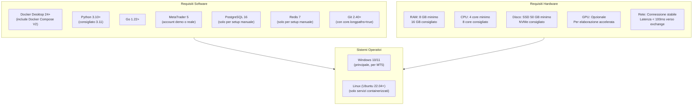
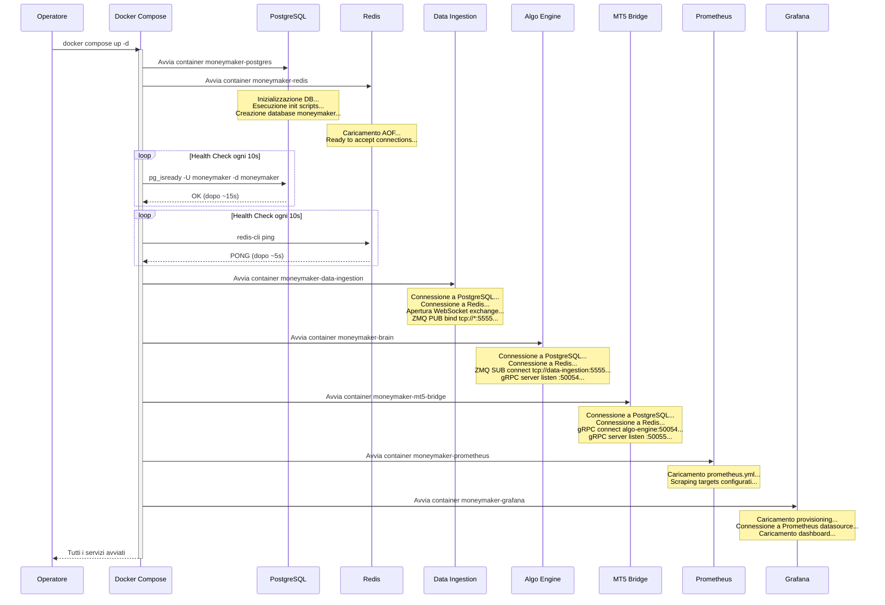
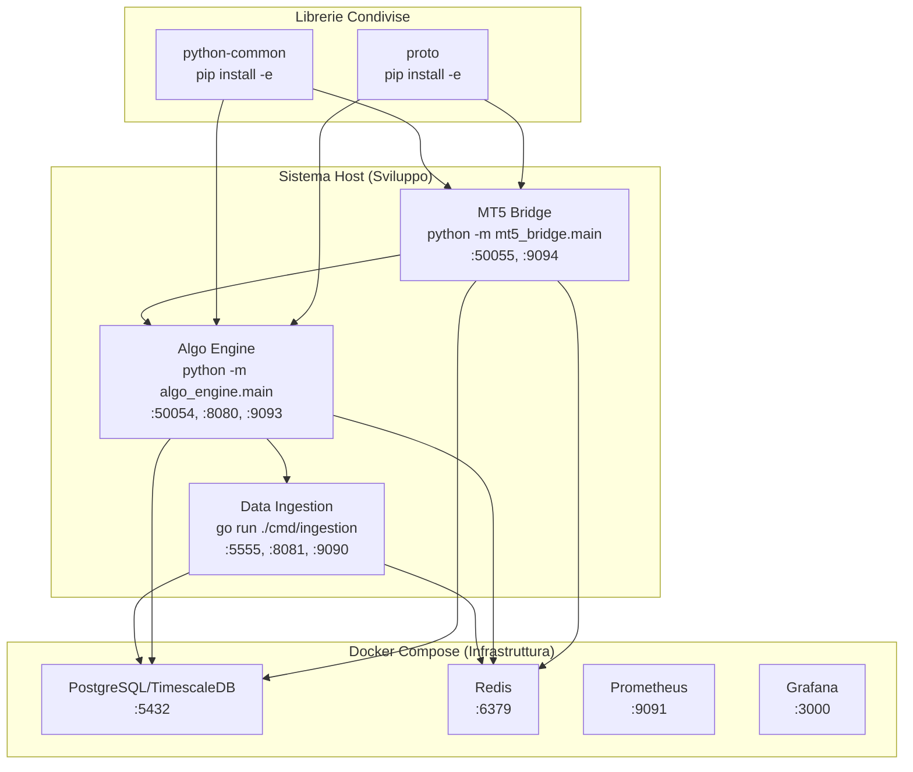
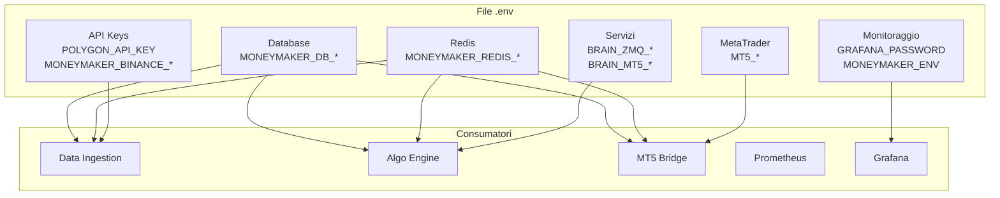
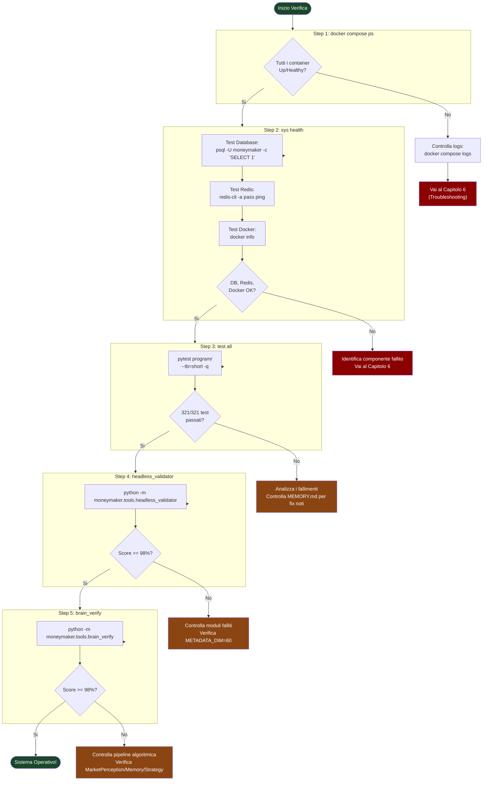
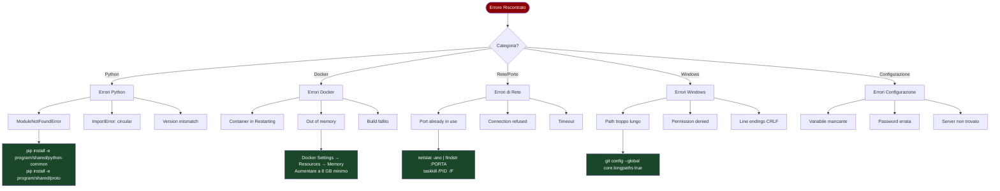

# Installazione e Avvio

| Campo | Valore |
|-------|--------|
| **Titolo** | Installazione e Avvio |
| **Autore** | Renan Augusto Macena |
| **Data** | 2026-02-28 |
| **Versione** | 1.0.0 |

---

## Indice

1. [Capitolo 1 -- Prerequisiti](#capitolo-1----prerequisiti)
2. [Capitolo 2 -- Setup con Docker Compose](#capitolo-2----setup-con-docker-compose)
3. [Capitolo 3 -- Setup Manuale per Sviluppo](#capitolo-3----setup-manuale-per-sviluppo)
4. [Capitolo 4 -- Configurazione delle Variabili d'Ambiente](#capitolo-4----configurazione-delle-variabili-dambiente)
5. [Capitolo 5 -- Verifica del Primo Avvio](#capitolo-5----verifica-del-primo-avvio)
6. [Capitolo 6 -- Risoluzione dei Problemi](#capitolo-6----risoluzione-dei-problemi)

---

## Capitolo 1 -- Prerequisiti

### 1.1 Panoramica dei Requisiti

Prima di procedere con l'installazione di MONEYMAKER, e necessario verificare che il sistema ospitante soddisfi una serie di requisiti software e hardware. L'ecosistema MONEYMAKER e stato progettato per funzionare principalmente su sistemi Windows (a causa della dipendenza da MetaTrader 5, che e disponibile solo per Windows), ma i servizi containerizzati possono girare su qualsiasi sistema operativo che supporti Docker. In questa guida assumeremo un ambiente Windows 10/11 con Docker Desktop installato, che e la configurazione di riferimento per lo sviluppo.

L'installazione di MONEYMAKER segue due percorsi possibili: il percorso **Docker Compose** (consigliato per la maggior parte degli utenti) che avvia tutti i servizi in container isolati con un singolo comando, e il percorso **manuale** (consigliato per gli sviluppatori) che installa ogni servizio direttamente sul sistema host per facilitare il debugging e lo sviluppo iterativo. Entrambi i percorsi richiedono gli stessi prerequisiti di base, con alcune differenze specifiche che verranno evidenziate.



### 1.2 Requisiti Software Dettagliati

**Docker Desktop 24+** e il componente fondamentale per il percorso di installazione consigliato. Docker Desktop per Windows include Docker Engine, Docker Compose V2 e l'integrazione con WSL2 (Windows Subsystem for Linux 2). La versione minima richiesta e la 24.0, che introduce miglioramenti significativi nella gestione della memoria dei container e nel supporto per health check. Per verificare la versione installata, eseguire `docker --version` da un terminale. Docker Compose V2 e integrato in Docker Desktop e non richiede installazione separata; e invocabile con `docker compose` (senza trattino). La configurazione di Docker Desktop deve allocare almeno 4 GB di RAM ai container (consigliato 8 GB), configurabile da Settings -> Resources -> Memory.

**Python 3.10+** e richiesto per i servizi Algo Engine e MT5 Bridge, nonche per le librerie condivise (`python-common`, `proto`). La versione consigliata e Python 3.11, che offre migliori performance (fino al 25% piu veloce di 3.10) e messaggi di errore piu informativi. Python 3.12 e supportato ma non ancora testato completamente. Per verificare la versione: `python --version`. Su Windows, si consiglia di installare Python dal sito ufficiale (python.org) e di aggiungere Python al PATH durante l'installazione. E importante che `pip` sia aggiornato: `python -m pip install --upgrade pip`.

**Go 1.22+** e richiesto per il servizio Data Ingestion. Go 1.22 introduce miglioramenti nel garbage collector e nel supporto per WebSocket che sono sfruttati dal servizio. Per verificare la versione: `go version`. L'installazione di Go su Windows avviene tramite il pacchetto MSI scaricabile dal sito ufficiale (go.dev). Dopo l'installazione, verificare che `GOPATH` sia configurato correttamente: tipicamente `%USERPROFILE%\go`.

**MetaTrader 5** e il terminale di trading attraverso cui MONEYMAKER esegue gli ordini sul mercato reale. E necessario un account MT5 (demo o reale) presso un broker che supporti la piattaforma. L'account MT5 deve avere abilitato il trading algoritmico (Options -> Expert Advisors -> Allow automated trading). Le credenziali dell'account (numero account, password, server) verranno configurate nelle variabili d'ambiente. MetaTrader 5 e disponibile solo per Windows, il che e uno dei motivi per cui l'ambiente di sviluppo principale e Windows.

**PostgreSQL 16 con TimescaleDB** e richiesto solo per il setup manuale. Nel percorso Docker Compose, il database viene avviato automaticamente dal container `timescale/timescaledb:latest-pg16`. Per il setup manuale, installare PostgreSQL 16 dal sito ufficiale e poi aggiungere l'estensione TimescaleDB seguendo le istruzioni di installazione per Windows sul sito di Timescale.

**Redis 7** e richiesto solo per il setup manuale. Nel percorso Docker Compose, Redis viene avviato dal container `redis:7-alpine`. Per il setup manuale su Windows, Redis non e ufficialmente supportato, ma e disponibile tramite WSL2 o tramite la distribuzione Memurai (alternativa Redis per Windows). La configurazione minima richiede l'abilitazione dell'autenticazione con password.

**Git 2.40+** con la configurazione `core.longpaths=true` e necessario per clonare e lavorare con il repository MONEYMAKER, che contiene alcuni path molto lunghi nella directory `AI_Trading_Brain_Concepts`. La configurazione dei long paths e obbligatoria su Windows: `git config --global core.longpaths true`.

### 1.3 Requisiti Hardware Dettagliati

**RAM**: il minimo assoluto per far girare tutti i servizi MONEYMAKER e 8 GB, ma questa configurazione lascera poco margine per altre applicazioni. Con 8 GB, i container Docker utilizzeranno circa 4-5 GB (TimescaleDB 1 GB, Redis 512 MB, Data Ingestion 256 MB, Algo Engine 1-2 GB, MT5 Bridge 256 MB, Prometheus 512 MB, Grafana 256 MB), lasciando 3-4 GB per il sistema operativo, MetaTrader 5 e altri processi. La configurazione consigliata e 16 GB, che permette di eseguire contemporaneamente tutti i servizi, MetaTrader 5, un IDE e un browser per Grafana senza problemi di memoria.

**CPU**: MONEYMAKER utilizza concorrenza significativa in tutti i servizi. Data Ingestion (Go) sfrutta le goroutine per gestire centinaia di connessioni WebSocket simultanee. Algo Engine (Python) utilizza multiprocessing per il calcolo degli indicatori tecnici e l'elaborazione dei modelli statistici. Il minimo e 4 core (fisici), consigliato 8 core. Processori moderni AMD Ryzen 7/9 o Intel i7/i9 sono ideali.

**Disco**: un SSD e fortemente consigliato per le performance di TimescaleDB. Il database puo crescere significativamente con il tempo: ogni giorno di trading attivo genera circa 100-500 MB di tick grezzi (dipende dal numero di simboli monitorati) e 10-50 MB di candele aggregate. Un disco NVMe da 256 GB e sufficiente per mesi di operativita. L'uso di dischi HDD tradizionali degradera significativamente le performance delle query sul database, rendendo lente le operazioni di backtesting e analisi storica.

**GPU**: la GPU e opzionale e puo essere utilizzata per accelerare elaborazioni computazionali intensive. Per le operazioni standard di analisi e generazione segnali, la CPU e sufficiente: i modelli statistici di MONEYMAKER sono ottimizzati per elaborazione CPU con latenze di 10-50 ms.

**Rete**: una connessione internet stabile e essenziale per ricevere dati di mercato in tempo reale e eseguire ordini. La latenza verso gli exchange dovrebbe essere inferiore a 100 ms. Una connessione in fibra o cavo e consigliata; connessioni WiFi instabili possono causare disconnessioni frequenti che attivano i meccanismi di reconnect del Data Ingestion, introducendo gap nei dati.

---

## Capitolo 2 -- Setup con Docker Compose

### 2.1 Ordine di Avvio dei Servizi

Docker Compose orchestra l'avvio dei servizi MONEYMAKER rispettando un ordine preciso di dipendenze. Il diagramma seguente illustra la sequenza temporale di avvio, con le verifiche di salute che devono passare prima che il servizio successivo possa avviarsi.



### 2.2 Procedura Passo-Passo

La procedura di avvio con Docker Compose e la seguente. Ogni passo include il comando esatto da eseguire e una spiegazione di cio che avviene.

**Passo 1: Clonare il repository.**

```bash
git config --global core.longpaths true
git clone https://github.com/moneymaker-v1/trading-ecosystem-main.git
cd trading-ecosystem-main
```

Il flag `core.longpaths=true` e obbligatorio su Windows perche il repository contiene path che superano il limite di 260 caratteri di Windows (principalmente nella directory `AI_Trading_Brain_Concepts`). Senza questo flag, il clone fallira con errori di path troppo lungo.

**Passo 2: Creare il file `.env`.**

```bash
cp program/infra/docker/.env.example program/infra/docker/.env
```

Se il file `.env.example` non esiste, creare manualmente il file `.env` nella directory `program/infra/docker/` con il contenuto descritto nel Capitolo 4. Il file `.env` contiene tutte le credenziali e configurazioni specifiche dell'ambiente. Non viene mai committato nel repository (e in `.gitignore`).

**Passo 3: Costruire le immagini Docker.**

```bash
cd program/infra/docker
docker compose build
```

Questo comando costruisce le immagini Docker per i tre servizi applicativi (data-ingestion, algo-engine, mt5-bridge) utilizzando i Dockerfile nelle rispettive directory. Il build context e `program/` (due livelli sopra il docker-compose.yml), il che permette ai Dockerfile di accedere alle librerie condivise. Il primo build puo richiedere 5-15 minuti a seconda della velocita della connessione internet (download delle dipendenze Python e Go). I build successivi saranno significativamente piu veloci grazie alla cache dei layer Docker.

**Passo 4: Avviare i servizi.**

```bash
docker compose up -d
```

Il flag `-d` avvia i servizi in modalita detached (background). Docker Compose avviera i servizi nell'ordine determinato dal grafo delle dipendenze: prima PostgreSQL e Redis (in parallelo), poi Data Ingestion (dopo che entrambi sono healthy), poi Algo Engine, poi MT5 Bridge, e infine Prometheus e Grafana. L'intero processo di avvio richiede tipicamente 30-60 secondi, dominato dal tempo di inizializzazione di PostgreSQL (creazione database, esecuzione script di init).

**Passo 5: Verificare lo stato dei servizi.**

```bash
docker compose ps
```

Questo comando mostra lo stato di tutti i container. Tutti i container dovrebbero essere nello stato `Up` (o `Up (healthy)` per quelli con health check configurato). Se un container e nello stato `Restarting` o `Exit`, consultare i log: `docker compose logs <nome-servizio>`.

**Passo 6: Verificare i log.**

```bash
docker compose logs -f --tail=50
```

Questo comando mostra gli ultimi 50 messaggi di log di tutti i servizi e continua a seguire i nuovi log in tempo reale. Premere `Ctrl+C` per interrompere. Per vedere i log di un singolo servizio: `docker compose logs -f algo-engine`.

### 2.3 Comandi Utili di Gestione

Dopo l'avvio iniziale, i seguenti comandi sono utili per la gestione quotidiana dell'ecosistema:

```bash
# Fermare tutti i servizi (preserva i volumi)
docker compose down

# Fermare tutti i servizi e cancellare i volumi (ATTENZIONE: cancella tutti i dati)
docker compose down -v

# Ricostruire e riavviare un singolo servizio
docker compose up -d --build algo-engine

# Scalare un servizio (utile per test di carico)
docker compose up -d --scale data-ingestion=2

# Vedere le risorse utilizzate da ogni container
docker stats

# Accedere alla shell di un container
docker compose exec algo-engine bash

# Eseguire un comando nel container del database
docker compose exec postgres psql -U moneymaker -d moneymaker -c "SELECT count(*) FROM market_ticks;"
```

### 2.4 Override per Sviluppo

Per lo sviluppo locale, e disponibile un file di override `docker-compose.dev.yml` che abilita logging di debug per tutti i servizi. Per utilizzarlo, avviare Docker Compose con entrambi i file di configurazione:

```bash
docker compose -f docker-compose.yml -f docker-compose.dev.yml up -d
```

L'override di sviluppo imposta `MONEYMAKER_ENV=development` e `MONEYMAKER_LOG_LEVEL=DEBUG` per tutti i servizi applicativi. Questo produce log molto piu dettagliati, utili per il debugging ma non consigliati in produzione per via del volume di dati generato.

---

## Capitolo 3 -- Setup Manuale per Sviluppo

### 3.1 Panoramica del Setup Manuale

Il setup manuale e consigliato per gli sviluppatori che devono modificare frequentemente il codice e hanno bisogno di un ciclo di sviluppo rapido (modifica -> test -> debug) senza dover ricostruire i container Docker ad ogni modifica. In questo scenario, i servizi infrastrutturali (PostgreSQL, Redis, Prometheus, Grafana) vengono eseguiti tramite Docker Compose, mentre i servizi applicativi (Data Ingestion, Algo Engine, MT5 Bridge) vengono eseguiti direttamente sul sistema host.



### 3.2 Avvio dell'Infrastruttura

Il primo passo e avviare i servizi infrastrutturali tramite Docker Compose. E possibile utilizzare un file compose ridotto o avviare solo i servizi necessari dal file completo:

```bash
cd program/infra/docker
docker compose up -d postgres redis prometheus grafana
```

Questo comando avvia solo i quattro servizi infrastrutturali, escludendo i servizi applicativi (data-ingestion, algo-engine, mt5-bridge) che verranno eseguiti direttamente sull'host. Verificare che PostgreSQL e Redis siano healthy prima di procedere:

```bash
docker compose ps
# Attendere che postgres e redis mostrino "healthy"
```

### 3.3 Setup dell'Ambiente Python

I servizi Algo Engine e MT5 Bridge, insieme alle librerie condivise, richiedono un ambiente Python configurato correttamente. La procedura consigliata utilizza virtualenv per isolare le dipendenze.

**Passo 1: Creare il virtual environment.**

```bash
cd d:\BOT\trading-ecosystem-main\program\services\algo-engine
python -m venv .venv
```

**Passo 2: Attivare il virtual environment.**

Su Windows (PowerShell):
```powershell
.\.venv\Scripts\Activate.ps1
```

Su Windows (Command Prompt):
```cmd
.\.venv\Scripts\activate.bat
```

Su Windows (Git Bash):
```bash
source .venv/Scripts/activate
```

**Passo 3: Installare le librerie condivise in modalita editable.**

La modalita editable (`-e`) permette di modificare il codice delle librerie senza dover reinstallarle ad ogni modifica. L'ordine di installazione e importante: prima le librerie condivise (che non hanno dipendenze tra loro), poi i servizi applicativi.

```bash
# Librerie condivise (dal root del progetto)
pip install -e program/shared/python-common
pip install -e program/shared/proto

# Servizi applicativi
pip install -e program/services/algo-engine
pip install -e program/services/mt5-bridge
```

Ogni pacchetto ha un file `setup.py` o `pyproject.toml` che definisce le dipendenze. L'installazione in modalita editable scarichera automaticamente tutte le dipendenze richieste (numpy, pandas, scikit-learn, torch, grpcio, zmq, psycopg2, redis, prometheus-client, ecc.).

**Passo 4: Verificare l'installazione.**

```bash
python -c "from moneymaker.common import __version__; print(f'python-common: {__version__}')"
python -c "from moneymaker.proto import trading_signal_pb2; print('proto: OK')"
python -c "from algo_engine import __version__; print(f'algo-engine: {__version__}')"
```

Se tutti e tre i comandi producono output senza errori, l'ambiente Python e configurato correttamente.

### 3.4 Setup dell'Ambiente Go

Il servizio Data Ingestion e scritto in Go e richiede il download dei moduli Go prima di poter essere compilato o eseguito.

```bash
cd d:\BOT\trading-ecosystem-main\program\services\data-ingestion
go mod download
go build ./...
```

Il comando `go mod download` scarica tutte le dipendenze definite in `go.mod` e `go.sum`. Il comando `go build ./...` compila tutti i pacchetti per verificare che il codice sia corretto. Se la compilazione ha successo, il servizio puo essere avviato con:

```bash
go run ./cmd/ingestion
```

### 3.5 Avvio dei Servizi in Modalita Sviluppo

Una volta configurati tutti gli ambienti, i servizi applicativi possono essere avviati manualmente. E importante configurare le variabili d'ambiente prima dell'avvio (vedere Capitolo 4). Su Windows, le variabili d'ambiente possono essere impostate in PowerShell con `$env:VARIABILE = "valore"` o tramite un file `.env` caricato dallo script di avvio.

L'ordine di avvio manuale deve rispettare le dipendenze: prima Data Ingestion, poi Algo Engine, poi MT5 Bridge. Ogni servizio deve essere avviato in un terminale separato:

**Terminale 1 - Data Ingestion:**
```bash
cd d:\BOT\trading-ecosystem-main\program\services\data-ingestion
set MONEYMAKER_DB_HOST=localhost
set MONEYMAKER_DB_PORT=5432
set MONEYMAKER_REDIS_HOST=localhost
go run ./cmd/ingestion
```

**Terminale 2 - Algo Engine:**
```bash
cd d:\BOT\trading-ecosystem-main\program\services\algo-engine
.\.venv\Scripts\activate.bat
set MONEYMAKER_DB_HOST=localhost
set BRAIN_ZMQ_DATA_FEED=tcp://localhost:5555
python -m algo_engine.main
```

**Terminale 3 - MT5 Bridge:**
```bash
cd d:\BOT\trading-ecosystem-main\program\services\algo-engine
.\.venv\Scripts\activate.bat
set MONEYMAKER_DB_HOST=localhost
set MT5_ACCOUNT=12345678
set MT5_PASSWORD=password
set MT5_SERVER=BrokerName-Server
python -m mt5_bridge.main
```

### 3.6 Hot Reload per Sviluppo Rapido

Per i servizi Python, e possibile utilizzare strumenti di hot-reload che riavviano automaticamente il servizio quando il codice viene modificato. Un'opzione popolare e `watchdog` con `watchmedo`:

```bash
pip install watchdog
watchmedo auto-restart --directory=./src --pattern="*.py" --recursive -- python -m algo_engine.main
```

Per il servizio Go, l'equivalente e `air`:

```bash
go install github.com/cosmtrek/air@latest
air
```

Questi strumenti monitorano le modifiche ai file sorgente e riavviano automaticamente il servizio, riducendo significativamente il tempo del ciclo di sviluppo. Non sono consigliati per ambienti di produzione.

---

## Capitolo 4 -- Configurazione delle Variabili d'Ambiente

### 4.1 Panoramica

MONEYMAKER utilizza variabili d'ambiente per tutta la configurazione che varia tra ambienti (sviluppo, staging, produzione). Questo approccio segue il principio dei Twelve-Factor App ed elimina il rischio di committare credenziali nel repository. Tutte le variabili sono definite in un file `.env` nella directory `program/infra/docker/` per Docker Compose, o impostate direttamente nel sistema operativo per il setup manuale.



### 4.2 Variabili TimescaleDB (Database)

Queste variabili configurano la connessione al database TimescaleDB. Sono utilizzate da tutti e tre i servizi applicativi.

| Variabile | Valore Default | Descrizione |
|-----------|---------------|-------------|
| `MONEYMAKER_DB_HOST` | `postgres` (Docker) / `localhost` (manuale) | Hostname del server PostgreSQL/TimescaleDB. In Docker, utilizza il nome del servizio (`postgres`) che viene risolto dalla rete Docker interna. Nel setup manuale, utilizza `localhost` se il database gira sullo stesso host, oppure l'IP/hostname del server database remoto. |
| `MONEYMAKER_DB_PORT` | `5432` | Porta TCP del server PostgreSQL. Il valore standard e 5432. Cambiare solo se il database e configurato su una porta non standard (ad esempio per evitare conflitti con un'altra installazione PostgreSQL esistente sull'host). |
| `MONEYMAKER_DB_NAME` | `moneymaker` | Nome del database. Il container PostgreSQL crea automaticamente questo database durante la prima inizializzazione tramite la variabile `POSTGRES_DB`. Nel setup manuale, il database deve essere creato manualmente con `CREATE DATABASE moneymaker;`. |
| `MONEYMAKER_DB_USER` | `moneymaker` | Username per la connessione al database. Il container crea automaticamente questo utente con la variabile `POSTGRES_USER`. L'utente deve avere permessi completi sul database `moneymaker` (CREATE, INSERT, UPDATE, DELETE, SELECT su tutte le tabelle). |
| `MONEYMAKER_DB_PASSWORD` | `moneymaker_dev` | Password dell'utente database. **CRITICO**: il valore di default `moneymaker_dev` e adatto SOLO per lo sviluppo locale. In produzione, utilizzare una password forte (almeno 32 caratteri, generata casualmente). Non committare mai la password di produzione nel repository. |

### 4.3 Variabili Redis

Queste variabili configurano la connessione a Redis. Redis e utilizzato come cache distribuita e state store da tutti e tre i servizi applicativi.

| Variabile | Valore Default | Descrizione |
|-----------|---------------|-------------|
| `MONEYMAKER_REDIS_HOST` | `redis` (Docker) / `localhost` (manuale) | Hostname del server Redis. In Docker, il nome del servizio viene risolto automaticamente. Nel setup manuale, utilizzare `localhost` o l'indirizzo del server Redis. |
| `MONEYMAKER_REDIS_PORT` | `6379` | Porta TCP del server Redis. Il valore standard e 6379. |
| `MONEYMAKER_REDIS_PASSWORD` | `moneymaker_dev` | Password per l'autenticazione a Redis. Redis e configurato con `requirepass` nel docker-compose, quindi la password e obbligatoria. **CRITICO**: cambiare in produzione con una password forte. Senza password, Redis accetta connessioni da qualsiasi client sulla rete, esponendo potenzialmente dati sensibili come posizioni aperte e segnali recenti. |

### 4.4 Variabili MetaTrader 5

Queste variabili sono utilizzate esclusivamente dal servizio MT5 Bridge per connettersi al terminale MetaTrader 5 ed eseguire ordini.

| Variabile | Valore Default | Descrizione |
|-----------|---------------|-------------|
| `MT5_ACCOUNT` | (nessuno) | Numero dell'account MetaTrader 5. E un numero intero fornito dal broker (ad esempio `12345678`). Per lo sviluppo, e consigliato utilizzare un account demo. Per la produzione, utilizzare l'account reale con le credenziali di produzione. |
| `MT5_PASSWORD` | (nessuno) | Password dell'account MetaTrader 5. Questa e la password di trading (non la password investor, che e di sola lettura). **CRITICO**: questa password da accesso completo al conto di trading, inclusa la possibilita di eseguire ordini e prelevare fondi. Proteggerla con la massima cura. Non loggarla, non stamparla, non includerla in messaggi di errore. |
| `MT5_SERVER` | (nessuno) | Nome del server del broker MetaTrader 5. Il formato e tipicamente `NomeBroker-Tipo` (ad esempio `ICMarkets-Demo`, `Pepperstone-Live`). Il nome esatto e visibile nella finestra di login di MetaTrader 5 e viene fornito dal broker. Un server errato impedira la connessione. |

### 4.5 Variabili API Keys (Sorgenti Dati)

Queste variabili configurano le credenziali per le sorgenti dati esterne.

| Variabile | Valore Default | Descrizione |
|-----------|---------------|-------------|
| `POLYGON_API_KEY` | (nessuno) | Chiave API per Polygon.io, utilizzata per dati di mercato storici e in tempo reale per azioni e forex USA. Ottenibile registrandosi su polygon.io (piano gratuito disponibile con limitazioni). Se non configurata, il Data Ingestion non utilizzerà Polygon come sorgente dati. |
| `MONEYMAKER_BINANCE_API_KEY` | (nessuno) | Chiave API per Binance, utilizzata per dati di mercato crypto in tempo reale tramite WebSocket. Ottenibile dalla sezione API Management del proprio account Binance. Se non configurata, il Data Ingestion non aprirà connessioni WebSocket verso Binance. |
| `MONEYMAKER_BINANCE_API_SECRET` | (nessuno) | Secret della chiave API Binance. Necessaria in coppia con `MONEYMAKER_BINANCE_API_KEY`. **CRITICO**: la API secret di Binance puo dare accesso al conto di trading. Assicurarsi di creare chiavi API con permessi minimi (solo lettura dati, nessun permesso di trading o prelievo). |

### 4.6 Variabili di Servizio e Comunicazione

Queste variabili configurano gli indirizzi di comunicazione inter-servizio.

| Variabile | Valore Default | Descrizione |
|-----------|---------------|-------------|
| `BRAIN_ZMQ_DATA_FEED` | `tcp://data-ingestion:5555` | Indirizzo ZMQ SUB a cui il Brain si connette per ricevere dati di mercato. Il formato e `tcp://hostname:porta`. In Docker, `data-ingestion` viene risolto automaticamente. Nel setup manuale, utilizzare `tcp://localhost:5555`. |
| `BRAIN_MT5_BRIDGE_TARGET` | `mt5-bridge:50055` | Endpoint gRPC del MT5 Bridge a cui il Brain invia i segnali di trading. Il formato e `hostname:porta`. In Docker, `mt5-bridge` viene risolto automaticamente. Nel setup manuale, utilizzare `localhost:50055`. |
| `MONEYMAKER_ZMQ_PUB_ADDR` | `tcp://*:5555` | Indirizzo ZMQ PUB su cui il Data Ingestion pubblica i dati di mercato. Il `*` indica che il socket accetta connessioni da qualsiasi interfaccia. Cambiare solo in ambienti con requisiti di sicurezza di rete specifici (ad esempio `tcp://10.0.0.5:5555` per limitare il binding a una sola interfaccia). |
| `MONEYMAKER_ENV` | `development` | Ambiente corrente. Valori possibili: `development`, `staging`, `production`. Influenza il livello di logging (DEBUG in development, INFO in production), l'abilitazione dei check di sicurezza e il comportamento dei circuit breaker. In produzione, i messaggi di errore sono generici (nessun stack trace esposto). |
| `MONEYMAKER_LOG_LEVEL` | (auto da MONEYMAKER_ENV) | Override manuale del livello di logging. Valori possibili: `DEBUG`, `INFO`, `WARNING`, `ERROR`, `CRITICAL`. Se non specificato, viene determinato automaticamente da `MONEYMAKER_ENV`. |
| `GRAFANA_PASSWORD` | `admin` | Password dell'utente amministratore di Grafana. **Cambiare in produzione.** L'utente di default e `admin`. Al primo accesso, Grafana chiede di cambiare la password; questa variabile imposta la password iniziale. |

### 4.7 File .env di Esempio Completo

Il seguente file `.env` mostra tutte le variabili configurate per un ambiente di sviluppo locale tipico. Copiare questo contenuto nel file `program/infra/docker/.env` e modificare i valori secondo la propria configurazione:

```env
# === Ambiente ===
MONEYMAKER_ENV=development
MONEYMAKER_LOG_LEVEL=DEBUG

# === TimescaleDB ===
MONEYMAKER_DB_HOST=postgres
MONEYMAKER_DB_PORT=5432
MONEYMAKER_DB_NAME=moneymaker
MONEYMAKER_DB_USER=moneymaker
MONEYMAKER_DB_PASSWORD=moneymaker_dev

# === Redis ===
MONEYMAKER_REDIS_HOST=redis
MONEYMAKER_REDIS_PORT=6379
MONEYMAKER_REDIS_PASSWORD=moneymaker_dev

# === MetaTrader 5 ===
MT5_ACCOUNT=12345678
MT5_PASSWORD=your_mt5_password_here
MT5_SERVER=BrokerName-Demo

# === Sorgenti Dati ===
POLYGON_API_KEY=your_polygon_key_here
MONEYMAKER_BINANCE_API_KEY=your_binance_key_here
MONEYMAKER_BINANCE_API_SECRET=your_binance_secret_here

# === Monitoraggio ===
GRAFANA_PASSWORD=admin
```

---

## Capitolo 5 -- Verifica del Primo Avvio

### 5.1 Sequenza di Verifica

Dopo aver avviato tutti i servizi (tramite Docker Compose o manualmente), e necessario eseguire una serie di verifiche per confermare che l'ecosistema MONEYMAKER sia pienamente operativo. La sequenza di verifica segue un approccio bottom-up: prima si verificano i componenti infrastrutturali, poi i servizi applicativi, e infine l'integrita complessiva del sistema.



### 5.2 Step 1: Verifica dei Container

Il primo controllo verifica che tutti i container Docker siano in esecuzione e in stato sano.

```bash
docker compose ps
```

L'output atteso e simile al seguente:

```
NAME                     STATUS                   PORTS
moneymaker-postgres         Up (healthy)             0.0.0.0:5432->5432/tcp
moneymaker-redis            Up (healthy)             0.0.0.0:6379->6379/tcp
moneymaker-data-ingestion   Up                       0.0.0.0:5555->5555/tcp, 0.0.0.0:8081->8080/tcp, 0.0.0.0:9090->9090/tcp
moneymaker-brain            Up                       0.0.0.0:8080->8080/tcp, 0.0.0.0:50054->50054/tcp, 0.0.0.0:9093->9093/tcp
moneymaker-mt5-bridge       Up                       0.0.0.0:50055->50055/tcp, 0.0.0.0:9094->9094/tcp
moneymaker-prometheus       Up                       0.0.0.0:9091->9090/tcp
moneymaker-grafana          Up                       0.0.0.0:3000->3000/tcp
```

Se un container non e nello stato `Up`, il prossimo passo e esaminare i suoi log: `docker compose logs <nome>`. Le cause piu comuni di fallimento sono: porta gia in uso (un altro processo occupa la porta), memoria insufficiente (Docker Desktop ha limiti troppo bassi), e errori di connessione al database (PostgreSQL non ancora pronto quando il servizio ha provato a connettersi).

### 5.3 Step 2: Verifica della Salute del Sistema

Il secondo controllo verifica che i componenti infrastrutturali rispondano correttamente.

**Test del Database:**
```bash
docker compose exec postgres psql -U moneymaker -d moneymaker -c "SELECT version();"
```
Questo comando deve restituire la versione di PostgreSQL (es. `PostgreSQL 16.x`) senza errori.

**Test di Redis:**
```bash
docker compose exec redis redis-cli -a moneymaker_dev ping
```
Questo comando deve restituire `PONG`. Se restituisce un errore di autenticazione, verificare che la password nel file `.env` corrisponda a quella configurata nel comando `redis-server`.

**Test degli Health Endpoint:**
```bash
curl http://localhost:8081/health
curl http://localhost:8080/health
```
Entrambi i comandi devono restituire una risposta JSON con `"status": "HEALTHY"`. Se il primo (Data Ingestion) restituisce un errore, verificare la connessione ai WebSocket degli exchange. Se il secondo (Algo Engine) restituisce un errore, verificare la sottoscrizione ZMQ.

### 5.4 Step 3: Esecuzione della Suite di Test

Il terzo controllo esegue l'intera suite di test per verificare la correttezza del codice. La suite attuale comprende 321 test (298 originali + 18 E2E cascade + 5 aggiunti durante audit) che devono tutti passare.

```bash
cd d:\BOT\trading-ecosystem-main
python -m pytest program/ --tb=short -q
```

L'output atteso e:
```
321 passed in XXs
```

Se uno o piu test falliscono, le cause piu comuni sono: dipendenze non installate (eseguire `pip install -e` per tutti i pacchetti), signature mismatch (i test furono scritti prima dei moduli, le signature dei costruttori potrebbero non corrispondere), e import circolari (verificare l'ordine degli import nei moduli coinvolti).

### 5.5 Step 4: Headless Validator

Il quarto controllo esegue il validatore headless, che verifica l'integrita strutturale di tutti i moduli dell'Algo Engine senza richiedere dati di mercato reali. Il validatore crea input sintetici e verifica che ogni modulo produca output con le dimensioni e i tipi attesi.

```bash
python -m moneymaker.tools.headless_validator
```

Il risultato atteso e un punteggio pari o superiore al 98%. Un punteggio inferiore indica che uno o piu moduli hanno problemi strutturali (dimensioni dei tensori non corrispondenti, parametri mancanti, ecc.). Verificare in particolare che `METADATA_DIM=60` sia consistente in tutti i moduli (e il contratto universale dell'ecosistema).

### 5.6 Step 5: Brain Verify

Il quinto e ultimo controllo esegue una verifica completa della pipeline algoritmica dell'Algo Engine, includendo la propagazione forward di dati sintetici attraverso tutti gli stadi della pipeline.

```bash
python -m moneymaker.tools.brain_verify
```

Il risultato atteso e un punteggio pari o superiore al 98%. Questo strumento verifica: MarketPerception (6 price + 34 indicator channels = 60 total), MarketMemory (input dim 188, sequential processing), RegimeClassifier (4 regimi), MarketStrategy (4 esperti, output dim 3), e MarketPedagogy (calibrazione della confidenza). Se la verifica fallisce, il report indica quale modulo ha prodotto output inattesi e suggerisce la causa probabile.

---

## Capitolo 6 -- Risoluzione dei Problemi

### 6.1 Panoramica degli Errori Comuni

Questa sezione cataloga gli errori piu comuni riscontrati durante l'installazione e l'avvio di MONEYMAKER, con le relative soluzioni. Gli errori sono organizzati per categoria: errori Python, errori Docker, errori di rete, errori di configurazione e errori specifici di Windows.



### 6.2 Errori Python

**ModuleNotFoundError: No module named 'moneymaker'**

Questo e l'errore piu comune ed e causato dalla mancata installazione delle librerie condivise in modalita editable. La soluzione e:

```bash
# Attivare il virtual environment
.\.venv\Scripts\activate.bat

# Installare le librerie condivise
pip install -e program/shared/python-common
pip install -e program/shared/proto

# Installare i servizi
pip install -e program/services/algo-engine
pip install -e program/services/mt5-bridge
```

Se l'errore persiste dopo l'installazione, verificare di aver attivato il virtual environment corretto. Un errore comune e avere piu virtual environment e attivare quello sbagliato. Verificare con `which python` (Linux/Mac) o `where python` (Windows) che il Python attivo sia quello del virtual environment del progetto.

**ModuleNotFoundError: No module named 'MetaTrader5'**

Il pacchetto `MetaTrader5` e disponibile solo per Windows e richiede che il terminale MetaTrader 5 sia installato sul sistema. Installare con:

```bash
pip install MetaTrader5
```

Se l'installazione fallisce, verificare che la versione di Python sia compatibile (MT5 supporta Python 3.8-3.12) e che l'architettura sia 64-bit.

**ImportError: cannot import name 'X' from 'Y' (circular import)**

Gli import circolari si verificano quando due moduli si importano a vicenda. La soluzione tipica e spostare l'import all'interno della funzione che lo utilizza (lazy import) anziche a livello di modulo. Se l'errore appare in moduli che non sono stati modificati, potrebbe essere causato da un pacchetto installato in modalita non-editable che non riflette le ultime modifiche. Reinstallare con `pip install -e`.

**Python version mismatch: richiesto 3.10+, installato 3.9**

Verificare la versione di Python con `python --version`. Su Windows, potrebbe essere necessario specificare il percorso completo dell'eseguibile Python 3.11 se sono installate piu versioni. Utilizzare `py -3.11` per invocare una versione specifica tramite il launcher Python per Windows. Quando si crea il virtual environment, specificare la versione: `py -3.11 -m venv .venv`.

### 6.3 Errori Docker

**Container in stato "Restarting"**

Un container che continua a riavviarsi indica che il processo principale fallisce poco dopo l'avvio. Esaminare i log per identificare la causa:

```bash
docker compose logs --tail=100 <nome-servizio>
```

Le cause piu comuni sono: la variabile d'ambiente e assente o errata (il servizio non riesce a connettersi al database perche la password e sbagliata), una dipendenza non e pronta (il servizio si avvia prima che PostgreSQL sia healthy, nonostante la condizione `service_healthy`), o il codice ha un bug che causa un crash all'avvio.

**Docker: insufficient memory**

Docker Desktop su Windows ha limiti di memoria configurabili. Se i container vengono uccisi con `OOMKilled`, e necessario aumentare la memoria allocata. Andare in Docker Desktop -> Settings -> Resources -> Memory e impostare almeno 6 GB (consigliato 8 GB). Dopo la modifica, Docker Desktop si riavviera. Verificare con `docker info | findstr Memory` che il nuovo limite sia attivo.

**Docker build fallito: COPY failed**

Questo errore indica che Docker non riesce a trovare un file durante il build. La causa piu comune e un build context errato. Verificare che il build context nel docker-compose.yml punti a `../..` (che corrisponde a `program/`) e che il Dockerfile faccia COPY di percorsi relativi al build context, non alla posizione del Dockerfile.

**Docker build fallito: pip install requirements.txt errore di rete**

Se il build fallisce durante il download delle dipendenze Python, potrebbe essere un problema di rete (proxy, firewall, DNS). Provare a configurare Docker per usare i DNS di Google: Docker Desktop -> Settings -> Docker Engine -> aggiungere `"dns": ["8.8.8.8", "8.8.4.4"]`.

### 6.4 Errori di Rete e Porte

**Port already in use (bind: address already in use)**

Questo errore indica che un altro processo sta gia utilizzando la porta richiesta. Su Windows, identificare il processo colpevole e terminarlo:

```bash
# Trovare il PID del processo che usa la porta
netstat -ano | findstr :5432

# Terminare il processo
taskkill /PID <pid> /F
```

Le porte piu frequentemente in conflitto sono: 5432 (un'altra installazione PostgreSQL locale), 6379 (un'altra installazione Redis), 3000 (altri servizi web, spesso frontend React in sviluppo), 8080 (altri server web). Se non e possibile terminare il processo esistente, e possibile cambiare il mapping delle porte nel docker-compose.yml. Ad esempio, per PostgreSQL: cambiare `"5432:5432"` in `"15432:5432"` per esporre il database sulla porta 15432 dell'host.

**Connection refused quando si tenta di connettersi a un servizio**

Se un servizio risponde con "Connection refused", verificare: che il servizio sia effettivamente in esecuzione (`docker compose ps`), che la porta sia mappata correttamente (`docker compose port <servizio> <porta>`), e che non ci sia un firewall che blocca la connessione (Windows Firewall puo bloccare le connessioni locali). In caso di setup manuale, verificare che il servizio stia ascoltando sull'indirizzo corretto: se il servizio ascolta su `127.0.0.1`, sara raggiungibile solo da `localhost`, non dall'IP della macchina.

**Timeout nelle connessioni WebSocket**

Se il Data Ingestion non riesce a connettersi agli exchange, le cause possibili sono: l'API key e assente o invalida, il firewall blocca le connessioni WebSocket in uscita (porta 443), o l'exchange e temporaneamente non raggiungibile. Verificare i log del servizio per messaggi di errore specifici. Il Data Ingestion implementa reconnect automatico con backoff esponenziale, quindi la connessione verra ritentata automaticamente.

### 6.5 Errori Specifici di Windows

**Filename too long (errore durante git clone)**

Windows ha un limite di 260 caratteri per i path dei file. Il repository MONEYMAKER contiene path piu lunghi, specialmente nella directory `AI_Trading_Brain_Concepts`. La soluzione e abilitare i long paths sia in Git che in Windows:

```bash
# Git: abilitare long paths
git config --global core.longpaths true

# Windows: abilitare long paths (richiede riavvio)
# Eseguire come amministratore in PowerShell:
New-ItemProperty -Path "HKLM:\SYSTEM\CurrentControlSet\Control\FileSystem" -Name "LongPathsEnabled" -Value 1 -PropertyType DWORD -Force
```

Dopo aver abilitato i long paths in Windows, e necessario riavviare il sistema. Dopo il riavvio, riprovare il `git clone`.

**Permission denied quando si accede a file nei volumi Docker**

Su Windows con Docker Desktop e WSL2, i volumi Docker possono avere problemi di permessi quando si accede ai file dal sistema host. La soluzione e utilizzare volumi named (come fa il docker-compose di MONEYMAKER) anziche bind mounts, oppure configurare i permessi in WSL2 tramite `/etc/wsl.conf`.

**Line endings CRLF vs LF**

Windows utilizza `\r\n` (CRLF) come terminatore di riga, mentre Linux (nei container Docker) utilizza `\n` (LF). Questo puo causare problemi con gli script shell e i file di configurazione copiati nei container. La soluzione e configurare Git per gestire automaticamente la conversione:

```bash
git config --global core.autocrlf true
```

E assicurarsi che il file `.gitattributes` del repository specifichi `* text=auto`. In caso di problemi persistenti, verificare i file specifici con `file <nomefile>` in Git Bash per controllare il tipo di line ending.

**Python non trovato (python non riconosciuto come comando)**

Su Windows, Python potrebbe non essere nel PATH. Verificare con `where python`. Se non viene trovato, le opzioni sono: reinstallare Python selezionando "Add Python to PATH" durante l'installazione, aggiungere manualmente la directory di Python al PATH di sistema (tipicamente `C:\Users\<utente>\AppData\Local\Programs\Python\Python311\`), oppure utilizzare il launcher Python con `py -3.11`.

### 6.6 Errori di Configurazione

**Variabile d'ambiente mancante: KeyError 'MT5_ACCOUNT'**

Se un servizio fallisce all'avvio con un `KeyError` su una variabile d'ambiente, significa che la variabile non e stata definita. Verificare il file `.env` nella directory `program/infra/docker/` e assicurarsi che tutte le variabili richieste siano presenti. Per il setup manuale, verificare che le variabili siano state esportate nel terminale corrente. Su Windows, utilizzare `set VARIABILE=valore` (Command Prompt) o `$env:VARIABILE = "valore"` (PowerShell).

**Password errata: FATAL: password authentication failed for user "moneymaker"**

Questo errore indica che la password configurata nel servizio non corrisponde a quella del database. Verificare che `MONEYMAKER_DB_PASSWORD` nel file `.env` corrisponda a `POSTGRES_PASSWORD` usata dal container PostgreSQL. Se il database e stato inizializzato con una password diversa, e necessario cancellare il volume e reinizializzare: `docker compose down -v && docker compose up -d`.

**MT5 Server non trovato: "Connection to MT5 failed: server not found"**

Il nome del server MT5 deve corrispondere esattamente a quello configurato nel terminale MetaTrader 5. Aprire MT5, andare su File -> Login, e copiare il nome del server esattamente come appare. Attenzione a spazi, trattini e maiuscole: `ICMarkets-Demo` e diverso da `ICMarkets - Demo` o `icmarkets-demo`. Se il problema persiste, verificare che MetaTrader 5 sia installato e che il terminale sia in esecuzione (il pacchetto Python `MetaTrader5` richiede che il terminale MT5 sia aperto e loggato).

### 6.7 Procedura di Reset Completo

Se i problemi persistono e non si riesce a identificare la causa, e possibile eseguire un reset completo dell'ambiente:

```bash
# Fermare tutto e cancellare volumi
cd program/infra/docker
docker compose down -v

# Rimuovere immagini costruite
docker compose rm -f
docker image prune -a --filter "label=com.docker.compose.project=docker"

# Rimuovere il virtual environment Python
cd d:\BOT\trading-ecosystem-main\program\services\algo-engine
rmdir /s /q .venv

# Ricreare tutto da zero
python -m venv .venv
.\.venv\Scripts\activate.bat
pip install --upgrade pip
pip install -e ..\..\shared\python-common
pip install -e ..\..\shared\proto
pip install -e .
pip install -e ..\mt5-bridge

# Ricostruire e avviare Docker
cd ..\..\infra\docker
docker compose build --no-cache
docker compose up -d
```

Questa procedura rimuove tutti i dati persistenti (database, cache, metriche) e ricostruisce tutto da zero. Utilizzarla solo come ultima risorsa, poiche cancella l'intera storia dei dati di mercato e delle operazioni.

### 6.8 Checklist di Verifica Rapida

Per una verifica rapida dell'ambiente dopo l'installazione o dopo la risoluzione di un problema, eseguire i seguenti comandi in sequenza. Tutti devono avere successo:

```bash
# 1. Git configurato correttamente
git config --get core.longpaths    # Deve mostrare "true"

# 2. Python corretto
python --version                   # Deve essere 3.10+

# 3. Go corretto
go version                         # Deve essere 1.22+

# 4. Docker funzionante
docker --version                   # Deve essere 24+
docker compose version             # Deve mostrare versione V2

# 5. Container in esecuzione
docker compose ps                  # Tutti "Up" o "Up (healthy)"

# 6. Database raggiungibile
docker compose exec postgres pg_isready -U moneymaker    # Deve accettare connessioni

# 7. Redis raggiungibile
docker compose exec redis redis-cli -a moneymaker_dev ping   # Deve rispondere PONG

# 8. Health check dei servizi
curl -s http://localhost:8081/health | python -m json.tool  # Data Ingestion OK
curl -s http://localhost:8080/health | python -m json.tool  # Algo Engine OK

# 9. Grafana raggiungibile
curl -s -o /dev/null -w "%{http_code}" http://localhost:3000/api/health  # Deve essere 200

# 10. Suite di test
python -m pytest program/ --tb=short -q     # 321 passed
```

Se tutti e dieci i controlli hanno successo, l'ecosistema MONEYMAKER e pienamente operativo e pronto per il trading.
