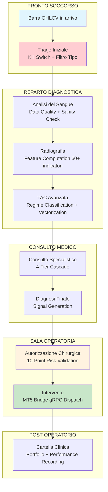
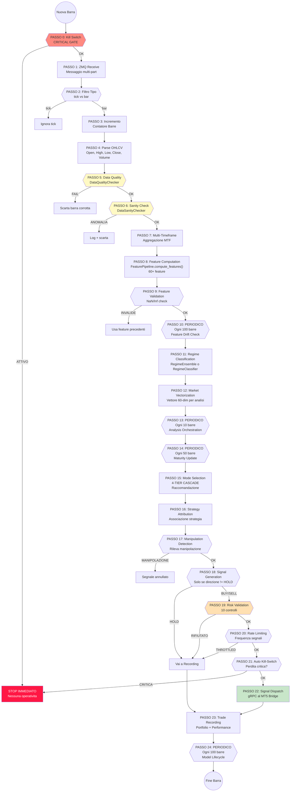
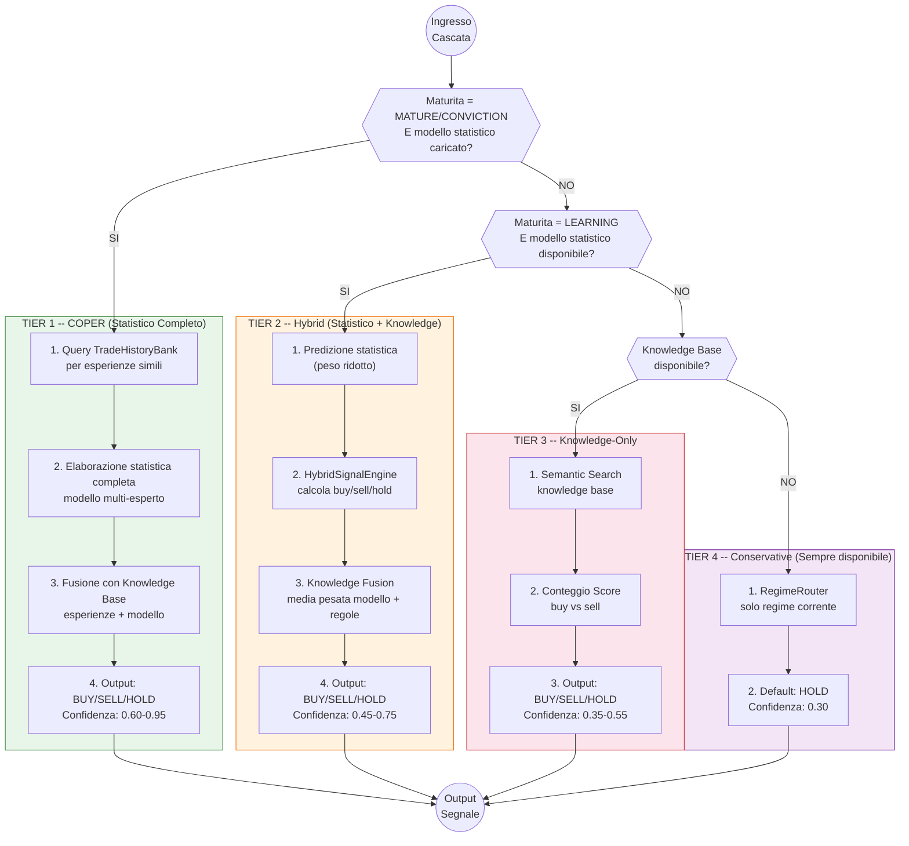
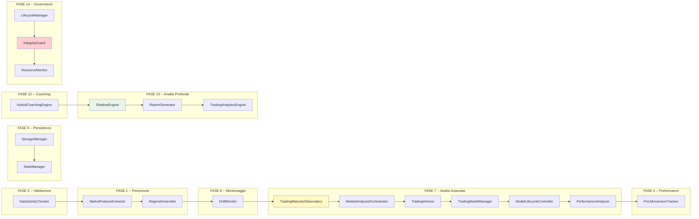
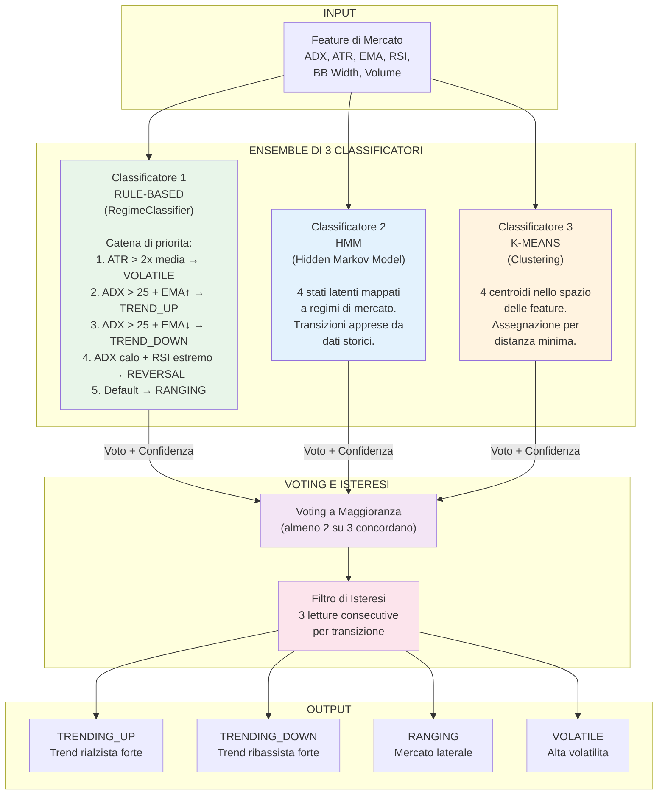
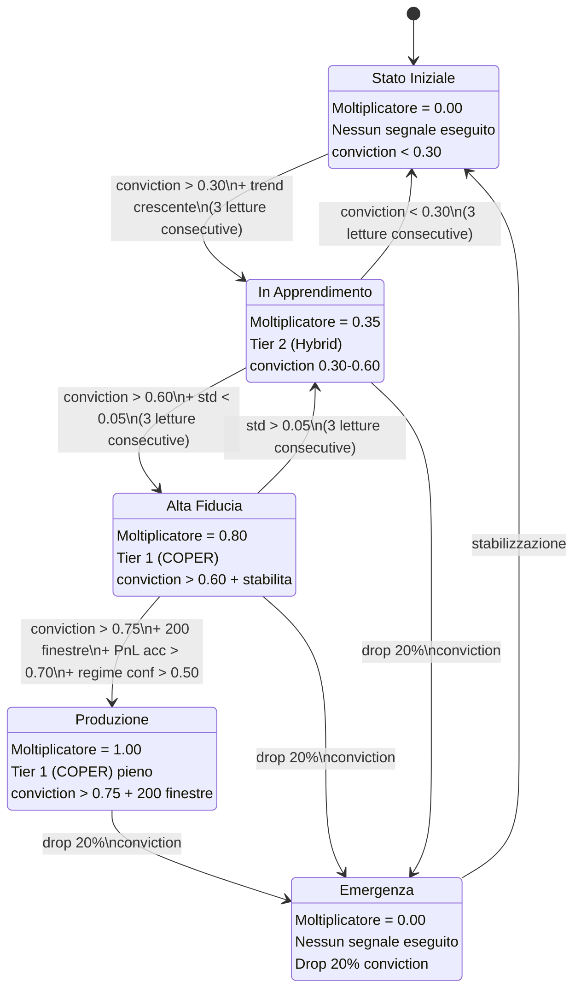
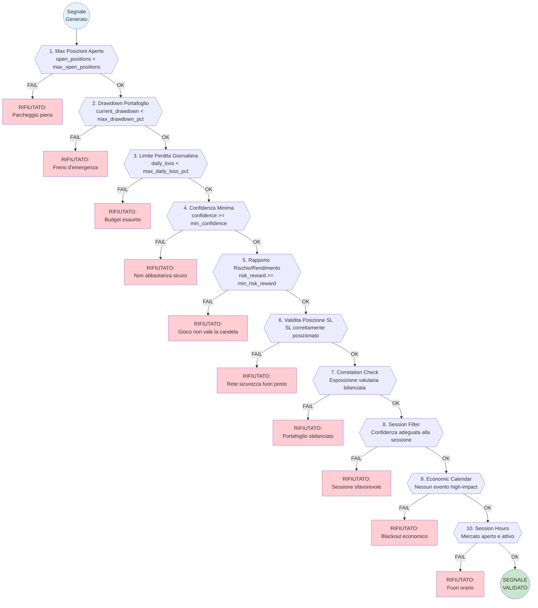

# Pipeline di Generazione Segnali

**Progetto**: MONEYMAKER Trading Ecosystem
**Autore**: Renan Augusto Macena
**Data**: 2026-02-28
**Versione**: 1.0.0

---

## Indice

1. [Overview](#1-overview)
2. [Loop di Elaborazione Principale](#2-loop-di-elaborazione-principale)
3. [Cascata a 4 Livelli (4-Tier Cascade)](#3-cascata-a-4-livelli-4-tier-cascade)
4. [20 Moduli di Intelligenza](#4-20-moduli-di-intelligenza)
5. [Rilevamento del Regime di Mercato](#5-rilevamento-del-regime-di-mercato)
6. [Maturity Gate](#6-maturity-gate)
7. [Validazione del Segnale (Checklist a 10 Punti)](#7-validazione-del-segnale-checklist-a-10-punti)

---

## 1. Overview

La pipeline di generazione segnali di MONEYMAKER funziona esattamente come un **ospedale con sistema di triage**. Ogni barra di mercato che arriva dal data ingestion service rappresenta un "paziente" che si presenta al pronto soccorso. Il sistema deve rapidamente valutare la gravita della situazione, assegnare una priorita, far passare il paziente attraverso reparti sempre piu specializzati, e alla fine -- solo se tutti gli esami sono positivi e la diagnosi e confermata -- procedere con l'intervento chirurgico, cioe l'esecuzione dell'ordine su MetaTrader 5.



Questa analogia non e casuale: come in un ospedale vero, il sistema e progettato con la filosofia del "primum non nocere" -- primo, non fare danno. Ogni stadio della pipeline agisce come un filtro progressivo, e la maggior parte delle barre di mercato viene correttamente classificata come "paziente sano" (HOLD) che non necessita di intervento. Solo le condizioni che superano ogni singolo esame diagnostico, ogni controllo di rischio, e ogni validazione di qualita raggiungono la sala operatoria dell'esecuzione.

Il flusso e completamente asincrono e basato su messaggi ZMQ (ZeroMQ) in arrivo dal data ingestion service scritto in Go. Ogni messaggio multi-part contiene i dati OHLCV (Open, High, Low, Close, Volume) per un simbolo e un timeframe specifici. La pipeline elabora ciascuna barra attraverso fino a 24 passaggi distinti, molti dei quali condizionali o periodici, garantendo che il carico computazionale rimanga gestibile anche durante i periodi di massima attivita di mercato.

La pipeline e inoltre progettata con il principio della **degradazione graziosa**: se un qualsiasi modulo opzionale non e disponibile -- che sia il modello statistico, il knowledge base, o il calendario economico -- il sistema continua a funzionare, semplicemente scendendo a un livello inferiore della cascata decisionale. Questo garantisce che MONEYMAKER non si fermi mai completamente, anche in condizioni degradate.

Un aspetto fondamentale dell'architettura e la separazione netta tra **decisione** e **esecuzione**. La pipeline di generazione segnali produce un oggetto `TradingSignal` completo di tutti i metadati necessari (prezzo di ingresso, stop-loss, take-profit, dimensione della posizione, confidenza, attribuzione causale), ma non esegue mai direttamente un ordine. L'esecuzione e delegata al MT5 Bridge attraverso una chiamata gRPC, mantenendo una separazione architetturale pulita tra il "cervello" che decide e il "braccio" che esegue.

---

## 2. Loop di Elaborazione Principale

Il cuore della pipeline e un loop che processa ogni barra di mercato attraverso 24 passaggi sequenziali. Non tutti i passaggi vengono eseguiti per ogni barra: alcuni sono condizionali (solo se la direzione e diversa da HOLD), altri sono periodici (ogni N barre), e uno e critico (il Kill Switch al passo 0 che puo interrompere immediatamente tutta l'operativita).



### Descrizione Dettagliata dei 24 Passaggi

**Passo 0 -- Kill Switch Check (CRITICAL GATE)**: Prima di qualsiasi elaborazione, il sistema verifica lo stato del Kill Switch globale. Questo e il meccanismo di emergenza definitivo: se attivato (manualmente dall'operatore o automaticamente dal sistema), NESSUN segnale viene generato, NESSUN ordine viene inviato, e il sistema entra in uno stato di protezione totale. Il Kill Switch puo essere attivato per molteplici ragioni: perdite eccessive, comportamento anomalo del mercato, problemi tecnici, o decisione dell'operatore. La sua implementazione e nel modulo `kill_switch.py` e utilizza un flag atomico thread-safe.

**Passo 1 -- ZMQ Receive Multi-Part Message**: Il sistema riceve un messaggio multi-part dal data ingestion service attraverso un socket ZMQ SUB (subscriber). Il messaggio contiene: topic (simbolo + timeframe), timestamp, e dati OHLCV serializzati. ZMQ garantisce la consegna ordinata dei messaggi e la gestione automatica della riconnessione in caso di interruzioni temporanee della comunicazione.

**Passo 2 -- Message Type Filter**: Non tutti i messaggi sono uguali. Il sistema distingue tra tick (aggiornamenti di prezzo ad alta frequenza) e barre completate (candele OHLCV chiuse). Solo le barre completate vengono processate dalla pipeline di generazione segnali. I tick possono essere utilizzati per l'aggiornamento del prezzo corrente ma non attivano il ciclo decisionale completo.

**Passo 3 -- Bar Counter Increment**: Un contatore monotonicamente crescente traccia il numero di barre processate per ciascun simbolo. Questo contatore e fondamentale per i passaggi periodici (passi 10, 13, 14, 24) che vengono eseguiti solo ogni N barre, e per il tracking della maturita del modello.

**Passo 4 -- Parse OHLCV**: I dati grezzi vengono deserializzati nei loro componenti: Open (prezzo di apertura), High (prezzo massimo), Low (prezzo minimo), Close (prezzo di chiusura), e Volume (volume degli scambi). Tutti i valori di prezzo vengono gestiti internamente come `Decimal` per evitare errori di arrotondamento float, come richiesto dal protocollo `financial-integrity.md`.

**Passo 5 -- Data Quality Check (DataQualityChecker)**: Il modulo `data_quality.py` verifica l'integrita strutturale dei dati: nessun valore NaN o Inf, tutti i prezzi positivi, High >= max(Open, Close), Low <= min(Open, Close), Volume non negativo, e timestamp valido e progressivo. Barre che falliscono questi controlli vengono scartate e registrate nel log.

**Passo 6 -- Statistical Sanity Check (DataSanityChecker)**: A differenza del controllo di qualita strutturale, il DataSanityChecker verifica la plausibilita statistica dei dati OHLCV: variazioni di prezzo entro limiti ragionevoli (non piu del 10% per una singola barra M5), spread bid-ask plausibile, e volume coerente con il profilo storico del simbolo. Questo cattura errori di dati che sono strutturalmente validi ma statisticamente impossibili.

**Passo 7 -- Multi-Timeframe Addition**: L'analizzatore multi-timeframe (`mtf_analyzer.py`) aggrega le barre M5 in timeframe superiori (M15, H1, H4, D1) mantenendo una finestra scorrevole per ciascuno. Questo permette ai moduli successivi di avere una visione a piu scale temporali del mercato, essenziale per il rilevamento di trend e regime.

**Passo 8 -- Feature Calculation**: La `FeaturePipeline.compute_features()` calcola oltre 60 feature a partire dai dati OHLCV e dai timeframe multipli. Le feature sono organizzate in tre categorie: 6 feature di prezzo (OHLCV + spread), 34 indicatori tecnici (RSI, MACD, Bollinger Bands, ADX, ATR, EMA, SMA, Stochastic, CCI, Williams %R, e derivati), e 20 feature derivate (rapporti, differenze prime, z-score, percentili). Tutte le 60 feature compongono il METADATA_DIM, il contratto universale dell'ecosistema.

**Passo 9 -- Feature Validation**: Dopo il calcolo, le feature vengono validate per assenza di valori NaN, Inf, o fuori range. Se una feature non supera la validazione, vengono utilizzate le feature dell'ultimo passo valido (con un contatore di stale che limita per quante barre consecutive e permesso usare valori vecchi).

**Passo 10 -- Feature Drift Check (PERIODICO, ogni 100 barre)**: Il `DriftMonitor` (`feature_drift.py`) controlla se la distribuzione delle feature sta cambiando significativamente rispetto alla distribuzione di riferimento. Utilizza il test di Kolmogorov-Smirnov e il Page-Hinkley test per rilevare drift graduale e brusco. Se il drift supera una soglia critica, il sistema puo declassare automaticamente il livello di maturita del modello.

**Passo 11 -- Regime Classification**: Il `RegimeEnsemble` (o `RegimeClassifier` se l'ensemble non e disponibile) classifica lo stato corrente del mercato in uno dei regimi fondamentali: TRENDING_UP, TRENDING_DOWN, RANGING, VOLATILE, o REVERSAL. La classificazione del regime e fondamentale perche determina quale esperto del sistema multi-esperto riceve piu peso nella decisione finale. Il dettaglio dell'ensemble e descritto nel Capitolo 5.

**Passo 12 -- Market Vectorization**: Il `MarketVectorizer` (`market_vectorizer.py`) comprime tutte le feature calcolate in un vettore denso a 60 dimensioni, normalizzato e pronto per essere consumato dal modello statistico. Questo vettore e il "ritratto" numerico dello stato corrente del mercato, e costituisce l'input per il motore decisionale.

**Passo 13 -- Analysis Orchestration (PERIODICO, ogni 10 barre)**: Il `MarketAnalysisOrchestrator` coordina analisi piu approfondite che non serve eseguire ad ogni barra: analisi della qualita dei segnali recenti, calcolo dei rendimenti del portafoglio, valutazione dell'efficienza del capitale, e aggiornamento del grafo di conoscenza di mercato. La periodicita di 10 barre (circa 50 minuti su M5) bilancia profondita analitica e carico computazionale.

**Passo 14 -- Maturity Update (PERIODICO, ogni 50 barre)**: Il `TradingMaturityObservatory` aggiorna lo stato di maturita del modello ogni 50 barre (circa 4 ore su M5). Questo passaggio e descritto in dettaglio nel Capitolo 6. Lo stato di maturita determina il livello della cascata a cui il sistema opera e il moltiplicatore di dimensionamento delle posizioni.

**Passo 15 -- Mode Selection e Recommendation (4-TIER CASCADE)**: Questo e il cuore decisionale della pipeline. Basandosi sullo stato di maturita, sulla disponibilita del modello statistico, e sulla qualita dei dati, il sistema seleziona il livello appropriato della cascata a 4 livelli e produce una raccomandazione (BUY, SELL, o HOLD con confidenza). Il dettaglio della cascata e nel Capitolo 3.

**Passo 16 -- Strategy Attribution**: Dopo la raccomandazione, il sistema attribuisce la decisione a una strategia specifica (momentum, mean-reversion, statistical arbitrage, o defensive). Questa attribuzione e importante per il tracking delle performance per strategia e per il miglioramento continuo del modello.

**Passo 17 -- Manipulation Detection**: Il `ManipulationDetector` (`manipulation_detector.py`) analizza i pattern di prezzo e volume recenti per identificare potenziali manipolazioni di mercato (spoofing, layering, pump-and-dump). Se viene rilevata una manipolazione con confidenza superiore alla soglia, il segnale viene annullato indipendentemente dalla sua qualita. Questo protegge il sistema da decisioni basate su dati artificiali.

**Passo 18 -- Signal Generation**: Solo se la direzione raccomandata e diversa da HOLD, il `SignalGenerator` (`generator.py`) produce un oggetto `TradingSignal` completo con: prezzo di ingresso, stop-loss (calcolato basandosi su ATR e regime), take-profit (basato su rapporto rischio/rendimento target), dimensione della posizione (basata su Kelly criterion ridotto e maturita), e tutti i metadati di attribuzione.

**Passo 19 -- Risk Validation (10 controlli)**: Il `SignalValidator` (`validator.py`) sottopone il segnale generato a 10 controlli di rischio indipendenti, descritti in dettaglio nel Capitolo 7. Questa e l'ultima linea di difesa prima dell'esecuzione.

**Passo 20 -- Rate Limiting**: Il `RateLimiter` (`rate_limiter.py`) impedisce al sistema di inviare troppi segnali in un periodo troppo breve. Limiti tipici: massimo 1 segnale per simbolo ogni 5 minuti, massimo 5 segnali totali ogni 15 minuti. Questo previene il comportamento "machine-gun" che potrebbe risultare dall'overfitting a rumore di mercato ad alta frequenza.

**Passo 21 -- Auto Kill-Switch**: Se il sistema rileva una perdita critica durante la sessione corrente (tipicamente oltre il 3% del capitale in un singolo giorno), il Kill Switch viene attivato automaticamente, fermando tutta l'operativita fino al reset manuale. Questo e il meccanismo di ultima istanza per la protezione del capitale.

**Passo 22 -- Signal Dispatch to MT5 Bridge (gRPC)**: Il segnale validato viene serializzato in formato Protocol Buffer e inviato al MT5 Bridge attraverso una chiamata gRPC. Il MT5 Bridge traduce il segnale in comandi MT5 nativi ed esegue l'ordine. La comunicazione gRPC garantisce tipizzazione forte, bassa latenza, e gestione automatica degli errori di rete.

**Passo 23 -- Trade Recording**: Indipendentemente dal risultato (segnale eseguito, rifiutato, o HOLD), la decisione viene registrata nel database (TimescaleDB) attraverso il modulo `portfolio.py` e il `PerformanceAnalyzer`. Questo crea un audit trail completo di ogni decisione del sistema, essenziale per l'analisi post-hoc e il miglioramento continuo.

**Passo 24 -- Model Lifecycle (PERIODICO, ogni 100 barre)**: Il `ModelLifecycleController` (`model_lifecycle_controller.py`) gestisce il ciclo di vita del modello statistico: verifica se e disponibile un nuovo checkpoint, controlla le metriche di performance del modello corrente, e puo triggerare una ricalibrazione se le performance degradano sotto soglie accettabili. Questo passaggio collega la pipeline di elaborazione al ciclo di calibrazione descritto nel documento 04.

---

## 3. Cascata a 4 Livelli (4-Tier Cascade)

La cascata a 4 livelli e il meccanismo che garantisce che MONEYMAKER produca sempre una raccomandazione, indipendentemente dallo stato del modello statistico o dalla disponibilita dei dati. Funziona come un sistema di fallback progressivo: il livello piu alto produce i segnali piu sofisticati e confidenti, mentre i livelli inferiori sono progressivamente piu conservativi.



### Tier 1 -- COPER (Confidence-Optimized Prediction with Experience Retrieval)

**Condizioni di ingresso**: Il sistema deve trovarsi in stato di maturita MATURE o CONVICTION, E il modello statistico deve essere caricato e funzionante. Queste sono le condizioni piu restrittive: il modello deve aver dimostrato stabilita e accuratezza predittiva per un periodo prolungato.

**Processo**:
1. **Query TradeHistoryBank**: Il sistema cerca nel banco storico le esperienze di trading piu simili alla situazione corrente, utilizzando similarita coseno sul vettore di feature a 60 dimensioni. Le esperienze piu recenti e con risultato noto hanno peso maggiore.
2. **Elaborazione Statistica Completa**: Il vettore di mercato passa attraverso l'intero pipeline di elaborazione: MarketPerception (128-dim) -> MarketMemory (256-dim hidden + 64-dim belief) -> MarketStrategy (4 esperti -> 3 logits BUY/SELL/HOLD) -> softmax -> probabilita.
3. **Knowledge Base Fusion**: Le probabilita del modello vengono fuse con le esperienze storiche recuperate, utilizzando una media pesata dove il peso del modello e proporzionale al moltiplicatore di maturita (0.80 per CONVICTION, 1.00 per MATURE).

**Output**: Segnale BUY, SELL, o HOLD con confidenza nell'intervallo 0.60-0.95. Questa e la modalita con la massima precisione e la massima confidenza.

**Trigger di fallback**: Se l'elaborazione statistica fallisce per qualsiasi motivo (errore di runtime, timeout, output anomalo), il sistema scende automaticamente al Tier 2.

### Tier 2 -- Hybrid (Statistico + Knowledge Fusion)

**Condizioni di ingresso**: Maturita LEARNING (il modello sta ancora imparando) E un modello statistico e disponibile (anche se non ancora completamente maturo).

**Processo**:
1. **Predizione Statistica con Peso Ridotto**: L'elaborazione statistica viene eseguita normalmente, ma il risultato riceve un peso ridotto (moltiplicatore 0.35 per LEARNING) nella decisione finale.
2. **HybridSignalEngine**: Il motore ibrido (`hybrid_signal_engine.py`) combina la predizione statistica con segnali derivati da regole tradizionali: incroci di medie mobili, divergenze RSI, breakout delle bande di Bollinger, e pattern di volume.
3. **Knowledge Fusion**: La fusione media i segnali del modello e quelli rule-based, con i pesi dinamicamente aggiustati in base alla performance recente di ciascuna componente.

**Output**: Segnale con confidenza 0.45-0.75. Piu conservativo del Tier 1, ma comunque in grado di catturare opportunita significative.

**Trigger di fallback**: Se il modello statistico non e disponibile (non caricato, corrotto, o rimosso), il sistema scende al Tier 3.

### Tier 3 -- Knowledge-Only (Solo Base di Conoscenza)

**Condizioni di ingresso**: Nessun modello statistico disponibile, MA la knowledge base contiene esperienze precedenti.

**Processo**:
1. **Semantic Search**: Il sistema effettua una ricerca semantica nella knowledge base utilizzando il vettore di mercato corrente come query. Recupera le 10 esperienze piu simili con i loro risultati.
2. **Score Counting**: Per ogni esperienza recuperata, il sistema conta i risultati positivi (buy score) e negativi (sell score). La direzione con il punteggio piu alto diventa la raccomandazione, con confidenza proporzionale alla differenza tra i punteggi.

**Output**: Segnale con confidenza 0.35-0.55. Questa modalita e meno precisa ma si basa su esperienze reali precedenti.

**Trigger di fallback**: Se la knowledge base e vuota o non disponibile, il sistema scende al Tier 4.

### Tier 4 -- Conservative (Sempre Disponibile)

**Condizioni di ingresso**: Nessuna. Questo livello e SEMPRE disponibile come ultima risorsa.

**Processo**:
1. **RegimeRouter**: Il sistema utilizza solo la classificazione del regime corrente per determinare se ci sono condizioni favorevoli per un trade. In pratica, in assenza di modello e knowledge base, il sistema adotta un approccio ultra-conservativo.
2. **Default HOLD**: Nella stragrande maggioranza dei casi, il Tier 4 produce un segnale HOLD con confidenza 0.30, ben al di sotto della soglia minima di validazione (tipicamente 0.65). Questo significa che il Tier 4 raramente produce segnali eseguibili.

**Output**: Segnale HOLD con confidenza 0.30. Questo tier esiste per garantire che il sistema non si blocchi mai, anche se in pratica non produce operazioni.

La bellezza di questo design e che il sistema si adatta automaticamente alle sue capacita: un sistema appena installato opera al Tier 4 (nessuna operazione), poi sale al Tier 3 quando accumula esperienze, al Tier 2 quando un modello viene calibrato, e infine al Tier 1 quando il modello raggiunge la maturita. Tutto questo senza intervento manuale.

---

## 4. 20 Moduli di Intelligenza

MONEYMAKER integra 20 moduli di intelligenza, ciascuno responsabile di un aspetto specifico dell'analisi e della decisione di trading. Ogni modulo e opzionale e progettato per la degradazione graziosa: se non e disponibile, il sistema continua a funzionare senza di esso, semplicemente con capacita ridotte.

I moduli sono organizzati in fasi (Phases) che riflettono l'ordine in cui sono stati integrati nel sistema durante lo sviluppo. La fase non corrisponde necessariamente all'ordine di esecuzione nella pipeline: ad esempio, il DataSanityChecker (Phase 3) viene eseguito prima del MarketFeatureExtractor (Phase 1) nel flusso di elaborazione.



| # | Modulo | Fase | Responsabilita | Degradazione Graziosa |
|---|--------|------|----------------|-----------------------|
| 1 | **DataSanityChecker** | 3 | Verifica la plausibilita statistica dei dati OHLCV in ingresso. Cattura anomalie come gap di prezzo irrealistici, volumi impossibili, e timestamp fuori sequenza. | Disabilitato: dati non validati statisticamente, solo quality check strutturale. |
| 2 | **MarketFeatureExtractor** | 1 | Calcola le 60+ feature tecniche dai dati OHLCV: indicatori (RSI, MACD, BB, ADX, ATR), rapporti di prezzo, z-score, e feature derivate. | Critico: senza feature non c'e analisi. |
| 3 | **RegimeEnsemble** | 1 | Classifica il regime di mercato corrente usando un ensemble di 3 classificatori con voting a maggioranza e isteresi. | Fallback a RegimeClassifier singolo (solo rule-based). |
| 4 | **DriftMonitor** | 8 | Monitora il drift delle feature rispetto alla distribuzione di riferimento. Usa test KS e Page-Hinkley. | Disabilitato: nessun allarme drift, rischio di elaborazioni su dati out-of-distribution. |
| 5 | **TradingMaturityObservatory** | 7 | Traccia la maturita del modello attraverso 5 segnali pesati. Governa il moltiplicatore di posizionamento e il livello della cascata. | Default: stato DOUBT, moltiplicatore 0.00, operativita Tier 4. |
| 6 | **TradingModelManager** | 7 | Gestisce il caricamento, la validazione, e lo swap dei modelli statistici. Supporta il versioning dei checkpoint. | Nessun modello: sistema opera in Tier 3 o 4. |
| 7 | **MarketAnalysisOrchestrator** | 7 | Coordina le analisi periodiche: qualita segnali, rendimenti portafoglio, efficienza capitale, e aggiornamento knowledge graph. | Analisi periodiche disabilitate, decisioni basate solo su dati correnti. |
| 8 | **TradingAdvisor** | 7 | Genera raccomandazioni di trading basate sull'analisi aggregata di tutti i moduli. Implementa la logica della cascata a 4 livelli. | Fallback a Tier 4 (solo regime). |
| 9 | **ModelLifecycleController** | 7 | Gestisce il ciclo di vita del modello: monitoraggio performance, trigger ricalibrazione, swap checkpoint. | Nessuna gestione automatica del lifecycle del modello. |
| 10 | **PerformanceAnalyzer** | 7 | Calcola metriche di performance: Sharpe ratio, Sortino ratio, max drawdown, win rate, profit factor, e rendimenti per strategia. | Nessun tracking performance, impossibile ottimizzare. |
| 11 | **PnLMomentumTracker** | 4 | Traccia il momentum del P&L (profit and loss) nel breve termine. Rileva sequenze di vittorie e perdite per aggiustare dinamicamente la dimensione delle posizioni. | Dimensione posizioni fissa, nessun aggiustamento dinamico. |
| 12 | **StorageManager** | 9 | Gestisce la persistenza dei dati su TimescaleDB: salvataggio barre, feature, segnali, e trade. | Nessuna persistenza, dati persi al restart. |
| 13 | **StateManager** | 9 | Gestisce lo stato in-memory dell'applicazione e la sua serializzazione per recovery dopo crash. | Nessun recovery, restart da zero. |
| 14 | **HybridCoachingEngine** | 12 | Combina feedback statistico e rule-based per migliorare le decisioni. Implementa la logica del Tier 2 della cascata. | Solo modello puro o solo regole, nessuna fusione. |
| 15 | **ShadowEngine** | 13 | Motore di elaborazione real-time. Esegue il forward pass del modello statistico su ogni barra e produce predizioni con latenza minima. | HOLD con confidenza 0.0, nessuna elaborazione statistica. |
| 16 | **ReportGenerator** | 13 | Genera report periodici di performance, analisi delle decisioni, e dashboard per Grafana. | Nessun report automatico. |
| 17 | **TradingAnalyticsEngine** | 13 | Analisi avanzate: decomposizione dei rendimenti per fattore, analisi delle correlazioni tra strategie, e stress testing. | Nessuna analisi avanzata. |
| 18 | **LifecycleManager** | 14 | Gestisce il ciclo di vita dell'applicazione: startup, shutdown graceful, health checks, e recovery. | Startup/shutdown basici senza orchestrazione. |
| 19 | **IntegrityGuard** | 14 | Verifica l'integrita dei dati e delle configurazioni a runtime. Rileva corruzioni, inconsistenze, e violazioni di invarianti. | Nessuna verifica di integrita runtime. |
| 20 | **ResourceMonitor** | 14 | Monitora l'utilizzo delle risorse: CPU, memoria, disco, e connessioni di rete. Genera allarmi se le risorse superano soglie critiche. | Nessun monitoraggio risorse, rischio di OOM o disk full. |

---

## 5. Rilevamento del Regime di Mercato

Il rilevamento del regime di mercato e uno dei passaggi piu critici della pipeline perche determina quale esperto del sistema multi-esperto riceve il peso maggiore nella decisione finale. MONEYMAKER utilizza un ensemble di tre classificatori indipendenti, ciascuno basato su un approccio diverso, le cui classificazioni vengono combinate attraverso un sistema di voting a maggioranza con isteresi.



### I Tre Classificatori

**Classificatore 1 -- Rule-Based (RegimeClassifier)**: Il classificatore basato su regole e il piu trasparente e interpretabile. Implementato in `regime.py`, utilizza una catena di priorita deterministica basata su indicatori tecnici classici. Le soglie sono calibrate su dati storici Forex:

- **VOLATILE (priorita massima)**: ATR corrente > 2 volte la media mobile dell'ATR su 50 barre. Confidenza: 0.50 + (rapporto ATR - 2) * 0.25, capped a 0.95. Questa condizione ha priorita massima perche l'alta volatilita cambia radicalmente la dinamica di qualsiasi strategia.
- **TRENDING_UP**: ADX > 25 E EMA veloce > EMA lenta. Confidenza: 0.50 + ADX/100, capped a 0.90. L'ADX alto indica forza del trend, l'allineamento delle EMA conferma la direzione.
- **TRENDING_DOWN**: ADX > 25 E EMA veloce < EMA lenta. Stessa logica di confidenza del trend rialzista.
- **REVERSAL**: ADX in calo da sopra 40 E RSI in zona estrema (> 70 o < 30). Confidenza fissa 0.55. Questo pattern indica un trend forte che sta perdendo slancio con condizioni di ipercomprato/ipervenduto.
- **RANGING (default)**: Se nessuna delle condizioni precedenti e soddisfatta. Confidenza 0.60 (0.70 se ADX < 20). Il mercato laterale e lo stato "di base" del mercato.

**Classificatore 2 -- Hidden Markov Model (HMM)**: L'HMM modella il mercato come un processo stocastico con 4 stati latenti, dove le transizioni tra stati seguono una matrice di probabilita appresa dai dati storici. L'HMM e particolarmente efficace nel catturare cambiamenti di regime graduali che il classificatore rule-based potrebbe non rilevare immediatamente. La matrice di transizione viene aggiornata periodicamente con nuovi dati.

**Classificatore 3 -- K-Means Clustering**: Il clustering K-Means opera nello spazio multidimensionale delle feature, con 4 centroidi corrispondenti ai 4 regimi. La classificazione avviene per distanza minima dal centroide. Questo approccio e complementare ai precedenti perche cattura pattern non lineari nello spazio delle feature che ne le regole ne l'HMM possono esprimere.

### Voting e Isteresi

Il **voting a maggioranza** richiede che almeno 2 dei 3 classificatori concordino su un regime per produrre una classificazione. Se tutti e 3 discordano, il sistema mantiene il regime precedente. La confidenza del risultato e la media pesata delle confidenze dei classificatori concordanti, dove il peso di ciascun classificatore e proporzionale alla sua accuratezza storica.

Il **filtro di isteresi** previene il "flickering" -- il passaggio rapido e ripetuto tra due regimi -- richiedendo 3 letture consecutive nello stesso nuovo regime prima di effettuare la transizione. Questo e critico nel trading perche i costi di cambio strategia (slippage, spread, commissioni) rendono i cambiamenti frequenti molto costosi.

### I Quattro Regimi

**TRENDING_UP**: Il mercato e in un trend rialzista confermato. Le strategie momentum long sono favorite, le strategie mean-reversion sono penalizzate. L'esperto #0 (Trend Expert) riceve il peso maggiore. Stop-loss piu larghi per evitare di essere "shakeout" dai pullback normali.

**TRENDING_DOWN**: Il mercato e in un trend ribassista confermato. Le strategie momentum short sono favorite. L'esperto #0 riceve il peso maggiore. Simmetrico al TRENDING_UP ma con asimmetrie nella gestione del rischio (i mercati scendono tipicamente piu velocemente di quanto salgano).

**RANGING**: Il mercato si muove lateralmente senza una direzione chiara. Le strategie mean-reversion sono favorite: comprare vicino al supporto, vendere vicino alla resistenza. L'esperto #1 (Range Expert) e dominante. Stop-loss piu stretti, target piu modesti.

**VOLATILE**: Il mercato mostra volatilita anormalmente alta. L'esperto #2 (Volatile Expert) gestisce questa situazione con strategie conservative: dimensioni ridotte, stop-loss piu larghi basati su ATR, e soglia di confidenza piu alta per generare segnali. In condizioni estreme, l'esperto #3 (Crisis Expert) subentra.

---

## 6. Maturity Gate

Il Maturity Gate e il meccanismo che governa la progressione del sistema dalla fase di "apprendimento" alla fase "operativa". Implementato nel `TradingMaturityObservatory` (`trading_maturity.py`), traccia la maturita del modello attraverso 5 segnali pesati e applica una macchina a stati con isteresi per prevenire transizioni premature o instabili.



### I 5 Segnali di Maturita

Il conviction index e una media pesata di 5 segnali, ciascuno normalizzato nell'intervallo [0.0, 1.0]:

| Segnale | Peso | Descrizione | Calcolo |
|---------|------|-------------|---------|
| **prediction_uncertainty** | 0.25 | Entropia di Shannon delle probabilita BUY/SELL/HOLD normalizzata. Bassa entropia = il modello e decisivo, alta entropia = il modello e incerto. | `H(p) / log(3)` dove H e l'entropia di Shannon. Il contributo al conviction index e `1 - H_normalizzata` (bassa entropia = alta maturita). |
| **regime_confidence** | 0.25 | Stabilita della classificazione del regime. Misurata come `1 - varianza_regime * 5`. Se il regime cambia frequentemente, il modello non capisce il mercato. | `max(0, 1 - variance * 5)` dove la varianza e calcolata sulle ultime 10 finestre. |
| **feature_importance_stability** | 0.20 | Stabilita dell'importanza delle feature nel tempo. Se il modello cambia continuamente quali feature considera importanti, non ha ancora convergito. | `max(0, 1 - std * 5)` dove std e la deviazione standard del conviction index sulle ultime 10 finestre. |
| **pnl_prediction_accuracy** | 0.20 | Accuratezza della predizione V(s) (valore atteso del trade) rispetto al risultato reale. Misurata come miglioramento rispetto all'errore iniziale. | `1 - (errore_corrente / errore_iniziale)`. Il miglioramento e clipped a [0, 1]. |
| **strategy_consistency** | 0.10 | Consistenza della strategia selezionata nel tempo. Se il modello oscilla tra strategie diverse senza una logica chiara, non e maturo. | `max(0, 1 - std * 5)` calcolato sul conviction index delle ultime 10 finestre. |

### Calcolo del Conviction Index

```
conviction_index = 0.25 * (1 - prediction_uncertainty)
                 + 0.25 * regime_confidence
                 + 0.20 * feature_importance_stability
                 + 0.20 * pnl_prediction_accuracy
                 + 0.10 * strategy_consistency
```

Il conviction index viene poi smussato con un EMA (Exponential Moving Average) con alpha = 0.3 per produrre il maturity_score, che e il valore utilizzato per la classificazione dello stato.

### Regole di Transizione con Isteresi

Il meccanismo di isteresi richiede **3 letture consecutive** nel nuovo stato candidato prima di effettuare la transizione. Questo previene il "flickering" tra stati causato da fluttuazioni temporanee nei segnali:

1. Se lo stato raw calcolato e diverso dallo stato corrente, diventa il "candidato".
2. Un contatore di isteresi viene incrementato per ogni lettura consecutiva nel candidato.
3. Solo quando il contatore raggiunge 3, la transizione viene effettivamente eseguita.
4. Se lo stato raw cambia prima di raggiungere 3, il contatore e il candidato vengono resettati.

La transizione a CRISIS e l'unica eccezione: viene triggerata immediatamente (senza isteresi) quando il conviction index scende del 20% rispetto al massimo recente (calcolato sulle ultime 10 finestre). Questo perche le situazioni di crisi richiedono una risposta immediata per proteggere il capitale.

### Moltiplicatori di Posizionamento

Ogni stato di maturita ha un moltiplicatore che viene applicato alla dimensione della posizione calcolata dal position sizer:

- **DOUBT**: 0.00 -- nessuna posizione aperta, il sistema e in modalita osservazione pura
- **CRISIS**: 0.00 -- come DOUBT, tutte le nuove posizioni bloccate fino alla stabilizzazione
- **LEARNING**: 0.35 -- posizioni ridotte, il sistema sta accumulando esperienza
- **CONVICTION**: 0.80 -- posizioni quasi piene, il modello ha dimostrato affidabilita
- **MATURE**: 1.00 -- posizioni piene, il modello e in piena produzione

Questo meccanismo garantisce che il sistema non rischi mai capitale significativo prima di aver dimostrato la sua competenza, esattamente come un medico in formazione non esegue interventi complessi senza supervisione.

---

## 7. Validazione del Segnale (Checklist a 10 Punti)

La validazione del segnale e l'ultima linea di difesa prima che un ordine venga inviato al MT5 Bridge per l'esecuzione. Implementata nel `SignalValidator` (`validator.py`), sottopone ogni segnale a 10 controlli indipendenti con filosofia fail-fast: il primo controllo che fallisce blocca il segnale senza eseguire i controlli successivi.



### Dettaglio dei 10 Controlli

**Controllo 1 -- Max Posizioni Aperte**: Verifica che il numero di posizioni attualmente aperte sia inferiore al massimo configurato (default: 5). Questo controllo previene la sovraccumulazione di posizioni che potrebbe portare a un'esposizione eccessiva. Il limite e configurabile per adattarsi a diversi profili di rischio e capitalizzazioni.

Soglia di default: `max_open_positions = 5`. Se il portafoglio ha gia 5 posizioni aperte, qualsiasi nuovo segnale viene rifiutato indipendentemente dalla sua qualita. Questo e un hard limit che non ammette eccezioni.

**Controllo 2 -- Drawdown del Portafoglio**: Verifica che il drawdown corrente del portafoglio (la distanza percentuale dal picco massimo di equity) sia inferiore alla soglia massima configurata. Il drawdown e il "freno d'emergenza" del portafoglio: quando le perdite si accumulano, il sistema diventa progressivamente piu restrittivo.

Soglia di default: `max_drawdown_pct = 5.0%`. Se l'equity del portafoglio e scesa del 5% o piu dal suo massimo storico, nessun nuovo trade viene aperto. Questo protegge il capitale durante periodi avversi e previene la spirale di perdite.

**Controllo 3 -- Limite Perdita Giornaliera**: Verifica che la perdita accumulata nella giornata corrente sia inferiore al budget giornaliero di rischio. Questo e un meccanismo di protezione a breve termine che impedisce al sistema di "inseguire le perdite" cercando di recuperare in una singola sessione.

Soglia di default: `max_daily_loss_pct = 2.0%`. Se il sistema ha gia perso il 2% del capitale nella giornata corrente, si ferma fino alla sessione successiva. Il contatore viene resettato alla mezzanotte UTC.

**Controllo 4 -- Confidenza Minima**: Verifica che la confidenza del segnale sia superiore alla soglia minima. Questo impedisce l'esecuzione di segnali deboli che hanno una probabilita relativamente bassa di successo. La soglia di confidenza e uno dei parametri piu importanti per il bilanciamento tra frequenza di trading e qualita dei trade.

Soglia di default: `min_confidence = 0.65`. Solo segnali con confidenza >= 65% vengono eseguiti. Considerando che il Tier 4 produce segnali con confidenza 0.30 e il Tier 3 arriva massimo a 0.55, in pratica solo i Tier 1 e 2 possono produrre segnali eseguibili.

**Controllo 5 -- Rapporto Rischio/Rendimento**: Verifica che il rapporto tra il potenziale guadagno (distanza entry-TP) e la potenziale perdita (distanza entry-SL) sia superiore al minimo configurato. Questo garantisce che ogni trade abbia un'aspettativa matematica favorevole, anche con un win rate modesto.

Soglia di default: `min_risk_reward_ratio = 1.0`. Un rapporto 1:1 significa che il potenziale guadagno deve essere almeno pari alla potenziale perdita. Con un win rate del 55%, un rapporto 1:1 produce un'aspettativa positiva.

**Controllo 6 -- Validita Posizione Stop-Loss**: Verifica che lo stop-loss sia posizionato correttamente rispetto al prezzo di ingresso: per un BUY, lo SL deve essere SOTTO il prezzo di ingresso; per un SELL, lo SL deve essere SOPRA il prezzo di ingresso. Verifica anche che lo SL non sia zero (assente). Un trade senza stop-loss e come un'auto senza freni: inaccettabile.

**Controllo 7 -- Correlation Check**: Il `CorrelationChecker` verifica che l'apertura di una nuova posizione non crei un'esposizione eccessiva a una singola valuta o a un gruppo di strumenti correlati. Ad esempio, aprire contemporaneamente BUY su EURUSD, EURGBP, e EURJPY creerebbe un'esposizione tripla all'EUR. Il checker calcola la correlazione tra lo strumento del nuovo segnale e le posizioni gia aperte, rifiutando il segnale se la correlazione media supera la soglia.

**Controllo 8 -- Session Filter**: Il `SessionClassifier` classifica la sessione di trading corrente (Asian, London, New York, Off-Hours) e aggiusta la soglia di confidenza di conseguenza. Durante la sessione Off-Hours (bassa liquidita), la soglia di confidenza viene alzata per compensare il maggiore rischio di slippage e spread piu ampi. Il "boost" di confidenza e negativo durante le Off-Hours (soglia piu alta) e positivo durante le overlap sessions (soglia piu bassa).

**Controllo 9 -- Economic Calendar**: Il `EconomicCalendarFilter` verifica se ci sono eventi economici ad alto impatto (decisioni sui tassi, NFP, CPI) previsti nei prossimi minuti per la valuta del segnale. Durante il "blackout" pre-evento (tipicamente 30 minuti prima e 15 minuti dopo), nessun nuovo trade viene aperto. I movimenti di prezzo durante questi eventi sono altamente imprevedibili e possono causare slippage significativo.

**Controllo 10 -- Session Hours**: L'ultimo controllo verifica che il mercato sia effettivamente aperto e attivo. Per il Forex, questo significa verificare che non sia il weekend (da venerdi 22:00 UTC a domenica 22:00 UTC) e che non ci siano festivita che chiudono una parte significativa del mercato. Il trading durante orari morti aumenta il rischio di gap e spread anomali.

### Filosofia Fail-Fast

Il validatore implementa una filosofia fail-fast: i controlli sono ordinati dal meno costoso (Controllo 1: un semplice confronto di interi) al piu costoso (Controllo 9: potenziale query al calendario economico). Questo ottimizza le performance evitando calcoli costosi quando un controllo economico gia fallisce. In pratica, la maggior parte dei segnali viene rifiutata ai primi 4-5 controlli, rendendo la validazione estremamente efficiente.

Il risultato della validazione e una tupla `(is_valid: bool, reason: str)`. Se il segnale e valido, la ragione e "tutti i controlli superati". Se non e valido, la ragione descrive esattamente quale controllo e fallito e perche, permettendo un'analisi post-hoc delle ragioni di rifiuto e l'eventuale tuning delle soglie.
