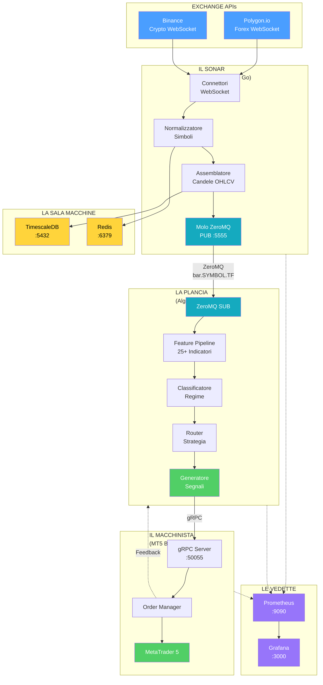
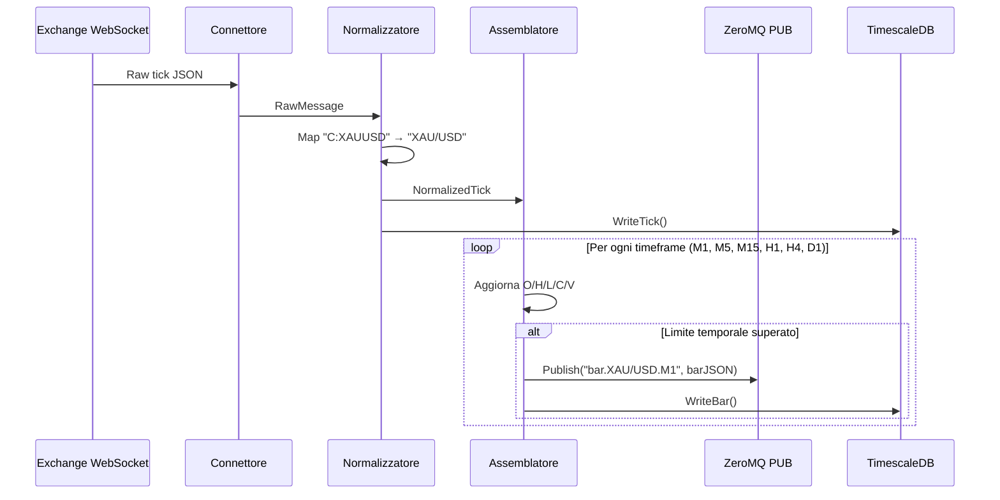
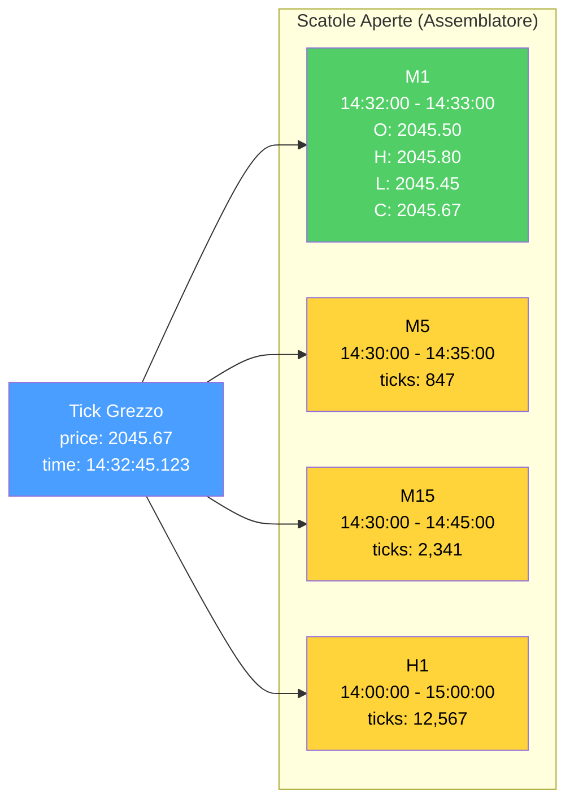
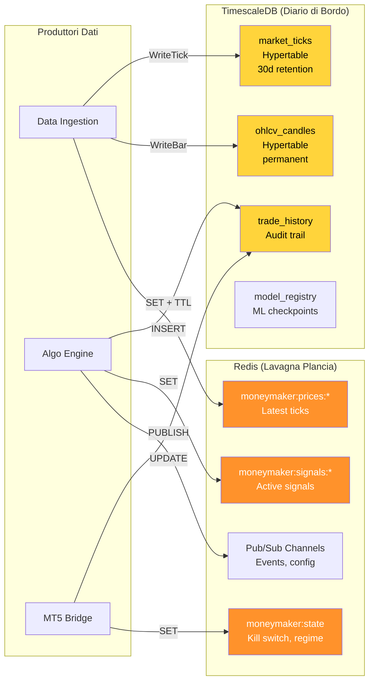
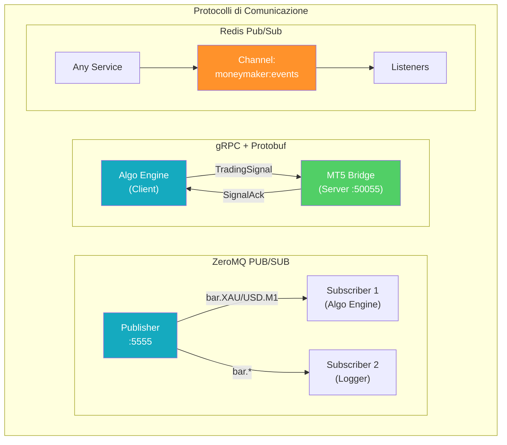
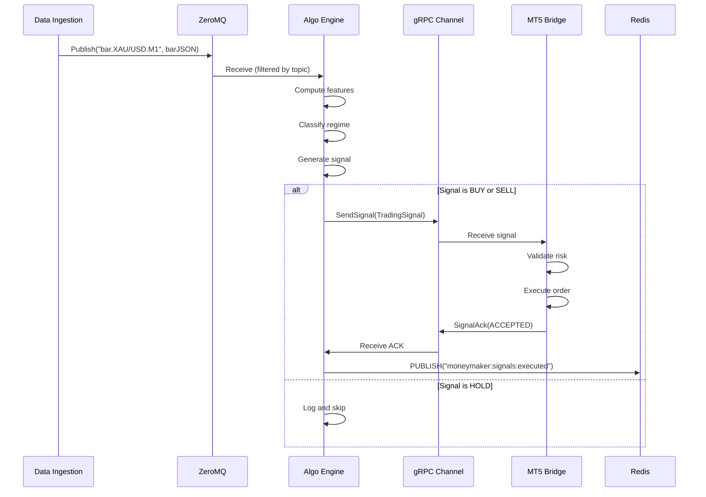
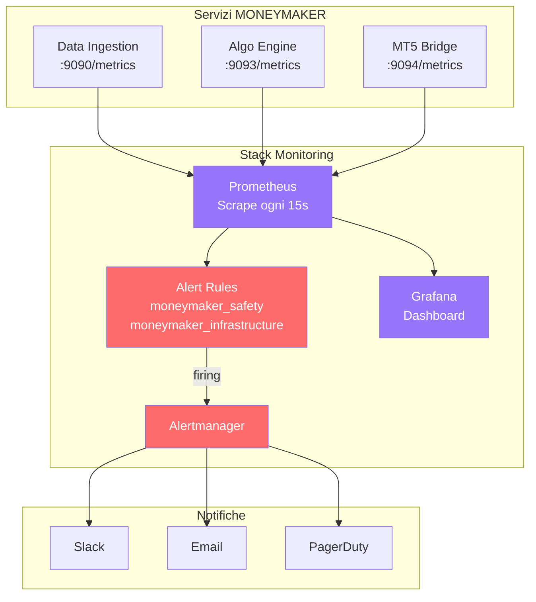

# MONEYMAKER V1 — Sistema di Trading Algoritmico

> **Argomenti:** Panoramica dell'architettura a microservizi, pipeline di acquisizione dati in tempo reale (Data Ingestion), architettura database e cache (TimescaleDB, Redis), protocolli di comunicazione inter-servizio (ZeroMQ, gRPC, Protobuf), stack di monitoraggio e alerting (Prometheus, Grafana).
>
> **Autore:** Renan Augusto Macena

---

## Indice

1. [Riepilogo Esecutivo](#1-riepilogo-esecutivo)
2. [Il Sonar: Data Ingestion](#2-il-sonar-data-ingestion)
3. [La Sala Macchine: Database e Cache](#3-la-sala-macchine-database-e-cache)
4. [La Sala Radio: Protocolli di Comunicazione](#4-la-sala-radio-protocolli-di-comunicazione)
5. [Le Vedette: Monitoring e Alerting](#5-le-vedette-monitoring-e-alerting)

---

## 1. Riepilogo Esecutivo

MONEYMAKER V1 è un **sistema di trading algoritmico basato su microservizi** progettato per operare autonomamente sui mercati finanziari (Forex, CFD, Crypto). Il sistema combina tecniche di machine learning (JEPA, reti neurali), analisi tecnica classica (25+ indicatori), classificazione di regime di mercato e gestione del rischio multi-livello in una pipeline unificata che:

1. **Scandaglia** i mercati in tempo reale tramite WebSocket, normalizzando i dati da fonti multiple.
2. **Assembla** i tick grezzi in candele OHLCV su timeframe multipli (M1, M5, M15, H1, H4, D1).
3. **Analizza** le condizioni di mercato classificando il regime (trend, range, volatilità, inversione).
4. **Genera** segnali di trading con stop-loss e take-profit basati su ATR.
5. **Valida** ogni segnale contro 11 controlli di rischio prima dell'esecuzione.
6. **Esegue** gli ordini su MetaTrader 5 con gestione delle posizioni.

Il sistema contiene **5 microservizi core** distribuiti su oltre 200 file sorgente:

| Servizio | Linguaggio | Responsabilità | Porta Principale |
| --- | --- | --- | --- |
| **Data Ingestion** | Go 1.22+ | Acquisizione e normalizzazione dati | 5555 (ZMQ) |
| **Algo Engine** | Python 3.11+ | Analisi, ML, generazione segnali | 50054 (gRPC) |
| **MT5 Bridge** | Python 3.11+ | Esecuzione ordini su broker | 50055 (gRPC) |
| **ML Training Lab** | Python 3.11+ | Addestramento modelli (GPU) | 50056 (gRPC) |
| **Monitoring** | Prometheus/Grafana | Osservabilità e alerting | 9090/3000 |

> **Analogia:** Immagina MONEYMAKER come il **Centro di Comando di una Nave Militare** moderna. Il **Sonar** (Data Ingestion) scandaglia continuamente le profondità marine alla ricerca di segnali. La **Plancia di Comando** (Algo Engine) elabora queste informazioni e decide la rotta. Il **Capo Macchinista** (MT5 Bridge) traduce gli ordini della plancia in azioni concrete dei motori. Le **Vedette** (Monitoring) scrutano l'orizzonte per avvistare pericoli. La **Sala Radio** (ZeroMQ/gRPC) coordina le comunicazioni tra tutti i reparti. Il **Diario di Bordo** (TimescaleDB) registra ogni evento per l'analisi storica. E il **Pulsante Rosso d'Emergenza** (Kill Switch) ferma tutto in caso di pericolo critico.



> **Spiegazione Diagramma:** Il flusso inizia dagli exchange (blu, input esterni) che inviano dati WebSocket al Sonar. Il Sonar normalizza e assembla i dati, poi li spedisce tramite ZeroMQ (ciano, comunicazione) alla Plancia. La Plancia analizza e genera segnali (verde, output), che vengono inviati via gRPC al Macchinista per l'esecuzione. I dati vengono persistiti nella Sala Macchine (giallo, storage). Le Vedette (viola, monitoring) osservano tutti i servizi.

---

## 2. Il Sonar: Data Ingestion

Il servizio **Data Ingestion** è il sistema sensoriale di MONEYMAKER — come il sonar di una nave che scandaglia continuamente le profondità marine alla ricerca di segnali. Scritto in Go per massimizzare le prestazioni di I/O concorrente, questo servizio:

- **Connette** a WebSocket di exchange multipli (Polygon.io per Forex, Binance per Crypto)
- **Normalizza** i formati proprietari in un formato canonico MONEYMAKER (`BASE/QUOTE`)
- **Aggrega** i tick in candele OHLCV su 6 timeframe (M1, M5, M15, H1, H4, D1)
- **Pubblica** i dati via ZeroMQ con routing basato su topic
- **Persiste** tick grezzi e barre aggregate su TimescaleDB

| Componente | File | Responsabilità |
| --- | --- | --- |
| **Connettori** | `internal/connectors/` | WebSocket clients per ogni exchange |
| **Normalizzatore** | `internal/normalizer/` | Conversione simboli e formati |
| **Assemblatore** | `internal/aggregator/` | Aggregazione tick → OHLCV |
| **Publisher** | `internal/publisher/` | ZeroMQ PUB socket |
| **DBWriter** | `internal/dbwriter/` | Persistenza TimescaleDB |

> **Analogia:** Pensa all'Assemblatore come a una **catena di montaggio con scatole di dimensioni diverse**. I tick (i pezzi grezzi) arrivano dalla linea di produzione. L'operaio (Aggregator) ha davanti 6 scatole aperte, una per ogni timeframe. Ogni tick viene "versato" in tutte le scatole. Quando il timer di una scatola scade (1 minuto per M1, 5 minuti per M5, ecc.), quella scatola viene chiusa, etichettata con Open/High/Low/Close/Volume, e spedita sul molo ZeroMQ. Una nuova scatola vuota prende il suo posto.



> **Spiegazione Diagramma:** La sequenza mostra il viaggio di un tick dall'exchange al database. Il Connettore riceve il messaggio grezzo, il Normalizzatore converte il simbolo nel formato canonico, l'Assemblatore aggiorna le candele aperte per tutti i timeframe. Quando un limite temporale viene superato, la candela completata viene pubblicata su ZeroMQ e persistita su TimescaleDB.

### 2.1 Mappatura Simboli

Il Normalizzatore converte i formati proprietari degli exchange nel formato canonico MONEYMAKER:

```
Exchange Format      →    MONEYMAKER Format
─────────────────────────────────────────
C:XAUUSD (Polygon)   →    XAU/USD
c:eurusd (Polygon)   →    EUR/USD
BTCUSDT (Binance)    →    BTC/USDT
```

### 2.2 Timeframe Supportati

| Timeframe | Durata | Uso Primario |
| --- | --- | --- |
| **M1** | 1 minuto | Scalping, segnali rapidi |
| **M5** | 5 minuti | Intraday trading |
| **M15** | 15 minuti | Conferma trend intraday |
| **H1** | 1 ora | Swing trading |
| **H4** | 4 ore | Posizionamento medio termine |
| **D1** | 1 giorno | Trend macro, filtro direzione |



> **Spiegazione Diagramma:** Un singolo tick (blu) viene distribuito simultaneamente a tutte le "scatole" aperte. M1 (verde) è la scatola che si chiude più frequentemente. Le altre (giallo) accumulano più tick prima di chiudersi.

### 2.3 Topic ZeroMQ

I topic seguono una convenzione gerarchica che permette ai subscriber di filtrare per prefisso:

```
Topic Pattern                    Esempio
───────────────────────────────────────────────
bar.{SYMBOL}.{TIMEFRAME}        bar.XAU/USD.M1
tick.{EXCHANGE}.{SYMBOL}        tick.polygon.XAU/USD
```

Un subscriber che si abbona a `bar.XAU/USD` riceverà le barre di tutti i timeframe per XAU/USD.

---

## 3. La Sala Macchine: Database e Cache

La **Sala Macchine** fornisce energia e deposito a tutta la nave. È composta da due sistemi complementari:

- **TimescaleDB** (PostgreSQL + estensione time-series): il "Diario di Bordo" che registra ogni evento
- **Redis**: la "Memoria Pronta" per accesso ultra-rapido ai dati recenti

| Sistema | Porta | Scopo | Retention |
| --- | --- | --- | --- |
| **TimescaleDB** | 5432 | Persistenza storica, query analitiche | Tick: 30 giorni, Barre: permanente |
| **Redis** | 6379 | Cache hot, pub/sub, stato corrente | Volatile (TTL-based) |

> **Analogia:** TimescaleDB è il **Diario di Bordo** della nave: ogni evento viene scritto in ordine cronologico, con inchiostro permanente. Puoi sfogliare le pagine passate per analizzare cosa è successo mesi fa. Redis è la **Lavagna della Plancia**: informazioni critiche scritte col gesso, visibili a tutti, aggiornate in tempo reale, cancellate quando non più rilevanti.



> **Spiegazione Diagramma:** I tre servizi principali scrivono su entrambi i database. TimescaleDB (giallo) contiene i dati storici organizzati in hypertable per query efficienti su serie temporali. Redis (arancione) contiene lo stato corrente e i canali pub/sub per eventi real-time.

### 3.1 Schema TimescaleDB

Le tabelle principali usano **hypertable** per partizionamento automatico per tempo:

```sql
-- Tick grezzi (30 giorni retention)
CREATE TABLE market_ticks (
    time        TIMESTAMPTZ NOT NULL,
    symbol      TEXT NOT NULL,
    bid         NUMERIC(20, 8),
    ask         NUMERIC(20, 8),
    last_price  NUMERIC(20, 8),
    volume      NUMERIC(20, 8),
    source      TEXT
);
SELECT create_hypertable('market_ticks', 'time');

-- Candele aggregate (permanent)
CREATE TABLE ohlcv_candles (
    time        TIMESTAMPTZ NOT NULL,
    symbol      TEXT NOT NULL,
    timeframe   TEXT NOT NULL,
    open        NUMERIC(20, 8),
    high        NUMERIC(20, 8),
    low         NUMERIC(20, 8),
    close       NUMERIC(20, 8),
    volume      NUMERIC(20, 8),
    tick_count  INTEGER
);
SELECT create_hypertable('ohlcv_candles', 'time');
```

### 3.2 Pattern Redis

| Chiave | Tipo | Scopo |
| --- | --- | --- |
| `moneymaker:prices:XAU/USD` | String | Ultimo prezzo per simbolo |
| `moneymaker:signals:active` | Hash | Segnali attualmente attivi |
| `moneymaker:state:kill_switch` | String | `0` o `1` |
| `moneymaker:state:regime` | String | Regime corrente |
| `moneymaker:ml:retrain_request` | Pub/Sub | Trigger per retraining |

---

## 4. La Sala Radio: Protocolli di Comunicazione

La **Sala Radio** coordina tutte le comunicazioni tra i reparti della nave. MONEYMAKER utilizza tre protocolli principali, ognuno scelto per il suo caso d'uso specifico:

| Protocollo | Uso | Caratteristiche |
| --- | --- | --- |
| **ZeroMQ PUB/SUB** | Data Ingestion → Brain | Broadcast asincrono, topic filtering |
| **gRPC + Protobuf** | Brain → MT5 Bridge | RPC sincrono, tipizzazione forte |
| **Redis Pub/Sub** | Eventi sistema-wide | Notifiche leggere, configurazione |

> **Analogia:** ZeroMQ è il **sistema di altoparlanti** della nave: un annuncio dalla plancia viene diffuso a tutti i reparti, ma ogni reparto può decidere di ascoltare solo certi tipi di messaggi (topic filtering). gRPC è la **comunicazione radio punto-a-punto** tra ufficiali: il comandante chiama direttamente il capo macchinista, si aspetta una conferma, e il messaggio è cifrato e strutturato. Redis Pub/Sub è la **bacheca degli avvisi**: chiunque può appendere un foglio, chiunque può leggerlo.



> **Spiegazione Diagramma:** I tre protocolli hanno pattern diversi. ZeroMQ (ciano) usa broadcast con filtering: un publisher, molti subscriber che filtrano per topic. gRPC (ciano/verde) usa request-response: il client invia un segnale, il server risponde con ACK. Redis Pub/Sub (arancione) usa fire-and-forget: qualsiasi servizio pubblica, tutti i listener ricevono.

### 4.1 Contratti Protobuf

I messaggi sono definiti in file `.proto` nella cartella `shared/proto/`:

**MarketTick** (`market_data.proto`):
```protobuf
message MarketTick {
  string symbol    = 1;   // "XAU/USD"
  int64  timestamp = 2;   // Unix milliseconds
  string bid       = 3;   // Decimal string
  string ask       = 4;
  string last      = 5;
  string volume    = 6;
  string source    = 7;   // "polygon", "binance"
}
```

**TradingSignal** (`trading_signal.proto`):
```protobuf
message TradingSignal {
  string signal_id      = 1;
  string symbol         = 2;
  Direction direction   = 3;   // BUY, SELL, HOLD
  string confidence     = 4;   // Decimal 0.0-1.0
  string suggested_lots = 5;
  string stop_loss      = 6;   // Price level
  string take_profit    = 7;
  string regime         = 10;  // Market regime
  string reasoning      = 12;  // Spiegazione
}
```

> **Nota:** Tutti i valori finanziari usano `string` per evitare problemi di precisione floating-point. I servizi convertono internamente in `Decimal`.

### 4.2 Flusso di Comunicazione



---

## 5. Le Vedette: Monitoring e Alerting

Le **Vedette** scrutano continuamente l'orizzonte alla ricerca di pericoli. Lo stack di monitoring è composto da:

- **Prometheus**: raccolta metriche, valutazione alert rules
- **Grafana**: visualizzazione dashboard, notifiche
- **Alert Rules**: regole automatiche per condizioni critiche

| Componente | Porta | Funzione |
| --- | --- | --- |
| Prometheus | 9090 | Scraping metriche, query PromQL |
| Grafana | 3000 | Dashboard interattive |
| Alertmanager | 9093 | Routing e deduplica alert |

> **Analogia:** Prometheus è la **vedetta con il binocolo** che scruta l'orizzonte ogni 15 secondi. Quando avvista qualcosa di sospetto (una metrica supera una soglia), suona l'allarme. Grafana è il **quadro strumenti in plancia**: mostra in tempo reale velocità, direzione, livello carburante, e stato di tutti i sistemi. Se la vedetta suona l'allarme, Alertmanager è l'**ufficiale di guardia** che decide chi svegliare e come (email, Slack, SMS).



> **Spiegazione Diagramma:** I tre servizi espongono metriche su endpoint `/metrics`. Prometheus (viola) le raccoglie ogni 15 secondi. Le Alert Rules (rosso) valutano condizioni critiche. Se una regola "fires", Alertmanager instrada la notifica ai canali configurati. Grafana (viola) visualizza tutto in dashboard interattive.

### 5.1 Alert Rules Critici

Gli alert sono divisi in due gruppi:

**moneymaker_safety** (sicurezza trading):

| Alert | Condizione | Severità | Descrizione |
| --- | --- | --- | --- |
| `KillSwitchActivated` | `kill_switch_active == 1` | Critical | Trading sospeso |
| `CriticalDrawdown` | `drawdown_pct > 5` | Critical | Kill switch imminente |
| `HighDrawdown` | `drawdown_pct > 3` per 5m | Warning | Monitorare attentamente |
| `DailyLossApproaching` | `daily_loss_pct > 1.5` | Warning | 75% del limite |
| `SpiralProtectionActive` | `consecutive_losses > 3` | Warning | Sizing ridotto |

**moneymaker_infrastructure** (salute sistema):

| Alert | Condizione | Severità | Descrizione |
| --- | --- | --- | --- |
| `NoTicksReceived` | `rate(ticks)[5m] == 0` | Critical | Data feed morto |
| `HighPipelineLatency` | `P99 > 100ms` | Warning | Rallentamento |
| `ServiceDown` | `up == 0` | Critical | Servizio non risponde |
| `BridgeUnavailable` | `bridge_available == 0` | Critical | MT5 irraggiungibile |

### 5.2 Metriche Chiave

```
# Data Ingestion
moneymaker_ticks_received_total{symbol, source}
moneymaker_bars_published_total{symbol, timeframe}
moneymaker_connection_status{exchange}

# Algo Engine
moneymaker_signals_generated_total{direction, regime}
moneymaker_signal_confidence_histogram
moneymaker_ml_prediction_latency_seconds
moneymaker_ml_fallback_total{reason}

# MT5 Bridge
moneymaker_orders_executed_total{symbol, direction}
moneymaker_positions_open_count
moneymaker_execution_latency_seconds
moneymaker_slippage_pips{symbol}

# Safety
moneymaker_kill_switch_active
moneymaker_portfolio_drawdown_pct
moneymaker_daily_loss_pct
moneymaker_spiral_consecutive_losses
```

---

## Appendice: Porte e Indirizzi

| Servizio | Host (Production) | Porte |
| --- | --- | --- |
| Data Ingestion | 10.0.1.10 | 5555 (ZMQ), 9090 (metrics), 8080 (health) |
| Database | 10.0.2.10 | 5432 (PostgreSQL), 6379 (Redis) |
| Algo Engine | 10.0.4.10 | 50054 (gRPC), 8080 (REST), 9093 (metrics) |
| MT5 Bridge | 10.0.4.11 | 50055 (gRPC), 9094 (metrics) |
| Monitoring | 10.0.5.10 | 9090 (Prometheus), 3000 (Grafana) |

---

*Continua nella Parte 2: La Plancia di Comando (Algo Engine)*
