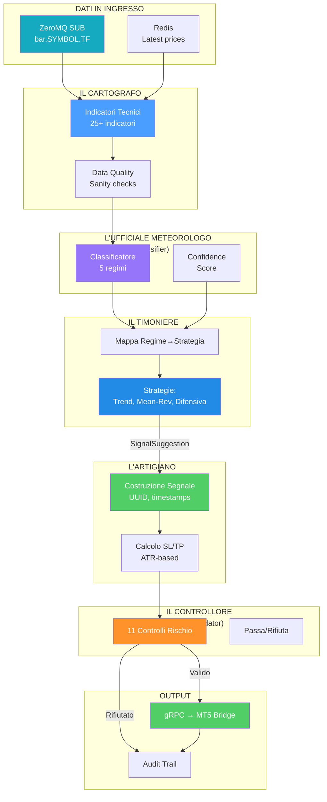
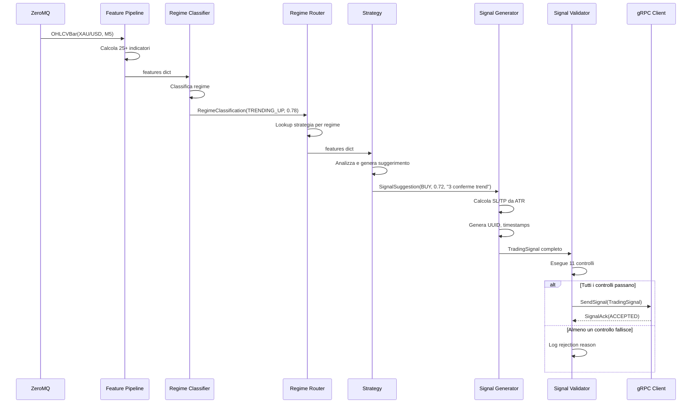
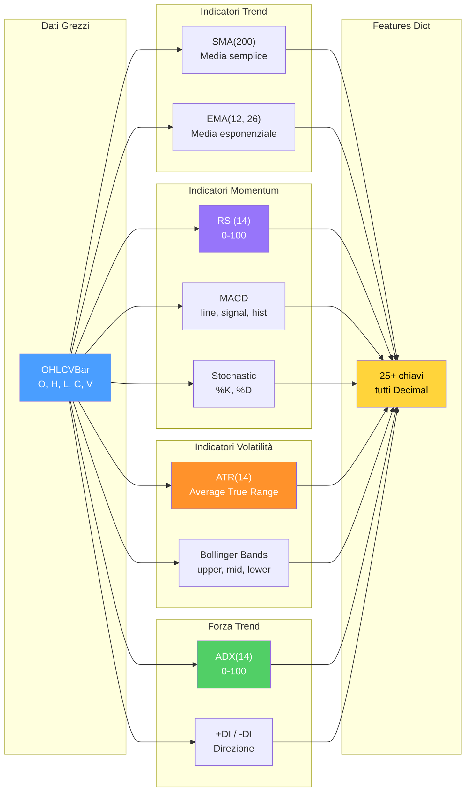
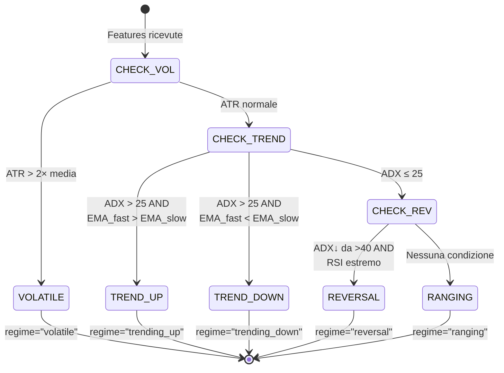
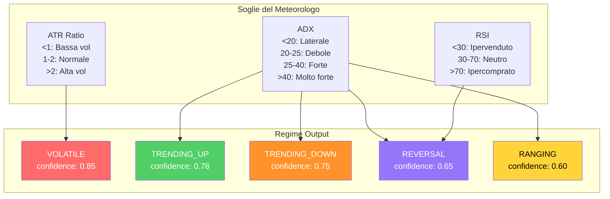
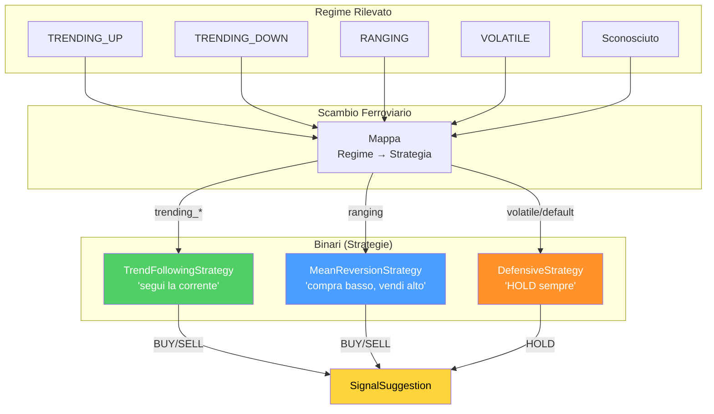
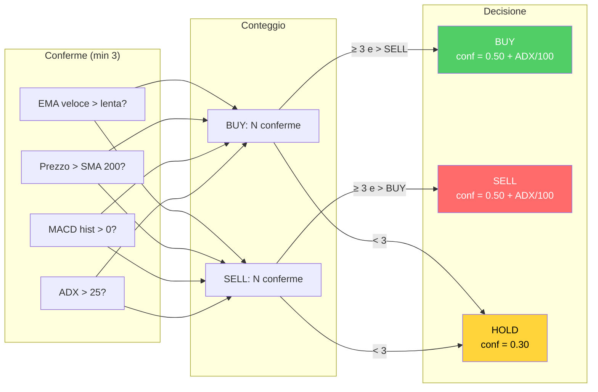
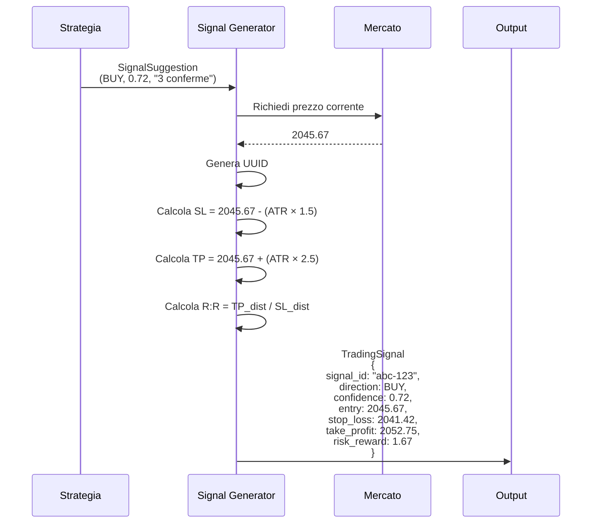
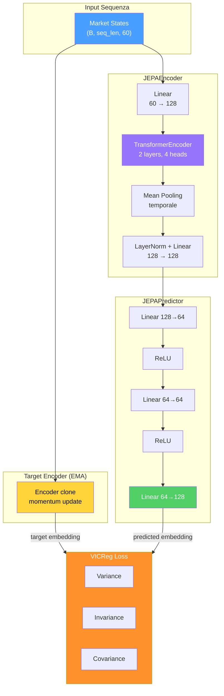
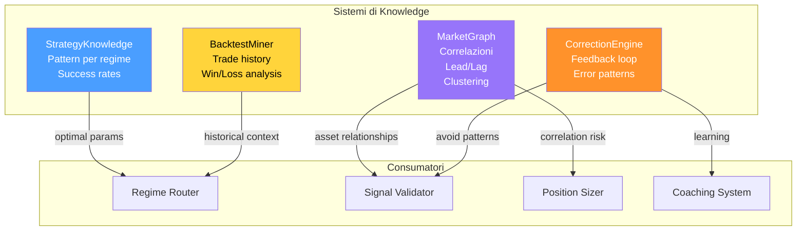

# MONEYMAKER V1 — Sistema di Trading Algoritmico

> **Argomenti:** Architettura del servizio Algo Engine, pipeline di calcolo indicatori tecnici (25+ indicatori), classificazione del regime di mercato (5 regimi), routing delle strategie di trading (trend-following, mean-reversion, difensiva), generazione segnali con stop-loss/take-profit ATR-based, architettura neurale JEPA per embedding di mercato, sistemi di knowledge e coaching.
>
> **Autore:** Renan Augusto Macena

---

## Indice

1. [Architettura Algo Engine](#1-architettura-algo-engine)
2. [Il Cartografo: Feature Engineering](#2-il-cartografo-feature-engineering)
3. [L'Ufficiale Meteorologo: Regime Classification](#3-lufficiale-meteorologo-regime-classification)
4. [Il Timoniere: Strategy Router](#4-il-timoniere-strategy-router)
5. [L'Artigiano: Signal Generator](#5-lartigiano-signal-generator)
6. [Le Reti Neurali: JEPA](#6-le-reti-neurali-jepa)
7. [L'Archivio di Bordo: Knowledge Systems](#7-larchivio-di-bordo-knowledge-systems)

---

## 1. Architettura Algo Engine

L'**Algo Engine** è la Plancia di Comando della nave MONEYMAKER — il centro decisionale dove convergono tutte le informazioni sensoriali (dati di mercato), vengono analizzate attraverso modelli matematici e di machine learning, e si generano gli ordini di trading.

Scritto in Python 3.11+ con oltre 165 file sorgente, il Brain implementa:

- **Feature Pipeline**: calcolo di 25+ indicatori tecnici con aritmetica Decimal
- **Regime Classifier**: classificazione delle condizioni di mercato in 5 regimi
- **Strategy Router**: instradamento verso la strategia appropriata per ogni regime
- **Signal Generator**: costruzione di segnali completi con SL/TP e metadati
- **Signal Validator**: validazione contro 11 controlli di rischio
- **ML Integration**: integrazione opzionale con modelli neurali (JEPA, GNN)

| Componente | Cartella | File principali | Responsabilità |
| --- | --- | --- | --- |
| **Features** | `features/` | `pipeline.py`, `technical.py`, `regime.py` | Calcolo indicatori, classificazione regime |
| **Strategies** | `strategies/` | `regime_router.py`, `trend_following.py`, `mean_reversion.py` | Logica decisionale per direzione trade |
| **Signals** | `signals/` | `generator.py`, `validator.py`, `position_sizer.py` | Costruzione e validazione segnali |
| **Neural Networks** | `nn/` | `jepa_market.py`, `model_factory.py` | Embedding e predizione ML |
| **Knowledge** | `knowledge/` | `market_graph.py`, `strategy_knowledge.py` | Memoria e apprendimento |

> **Analogia:** La Plancia di Comando di una nave moderna. Il **Cartografo** (Feature Pipeline) trasforma le letture grezze del sonar in mappe navigabili. L'**Ufficiale Meteorologo** (Regime Classifier) analizza vento, onde e pressione per classificare le condizioni meteo. Il **Timoniere** (Strategy Router) riceve gli ordini e manovra la nave nella direzione giusta. L'**Artigiano** (Signal Generator) costruisce gli ordini di manovra con tutti i dettagli. Il **Controllore Qualità** (Validator) verifica che ogni ordine sia sicuro prima dell'esecuzione. E il **Sistema di Intelligenza** (JEPA) impara dai pattern storici per anticipare le condizioni future.



> **Spiegazione Diagramma:** I dati arrivano via ZeroMQ (ciano). Il Cartografo (blu) calcola gli indicatori. Il Meteorologo (viola) classifica il regime. Il Timoniere (blu scuro) seleziona la strategia. L'Artigiano (verde) costruisce il segnale. Il Controllore (arancione) valida. Se passa, il segnale va al MT5 Bridge (verde). Tutto viene registrato nell'audit trail.

### 1.1 Flusso di Elaborazione



---

## 2. Il Cartografo: Feature Engineering

Il **Cartografo** trasforma i dati grezzi di mercato in una "mappa" di indicatori tecnici navigabili. Come un cartografo che dalle foto satellitari crea mappe con contorni, strade e punti di interesse, questo componente calcola **25+ indicatori** che descrivono lo stato del mercato.

**VINCOLO ARCHITETTURALE:** Tutti i calcoli usano `decimal.Decimal` per evitare errori di precisione floating-point. Come un farmacista che pesa i grammi con la bilancia di precisione invece di "a occhio".

| Categoria | Indicatori | Funzione |
| --- | --- | --- |
| **Trend** | SMA(200), EMA(12), EMA(26), EMA Fast/Slow | Direzione generale del mercato |
| **Momentum** | RSI(14), MACD, Stochastic, ROC, CCI, Williams %R | Forza e velocità del movimento |
| **Volatilità** | ATR(14), Bollinger Bands, Donchian Channels | Ampiezza delle oscillazioni |
| **Forza Trend** | ADX(14), +DI, -DI | Quanto è forte il trend |
| **Volume** | OBV, Volume MA | Partecipazione al movimento |

> **Analogia:** Ogni indicatore è uno **strumento diverso** nella borsa del cartografo:
> - **SMA/EMA** sono come le curve di livello — mostrano l'altitudine media del terreno (prezzo).
> - **RSI** è il termometro — misura la "febbre" del mercato (sopra 70 = surriscaldato, sotto 30 = ipotermia).
> - **MACD** è il radar della velocità — due auto (EMA veloce e lenta) su una strada: quando la veloce supera la lenta, il mercato accelera.
> - **ATR** è il sismografo — misura l'ampiezza delle scosse (volatilità).
> - **ADX** è l'anemometro — misura la forza del vento (trend), non la direzione.
> - **Bollinger Bands** sono i margini della strada — il 95% del traffico (prezzo) resta all'interno.



> **Spiegazione Diagramma:** I dati OHLCV (blu) alimentano tutti gli indicatori in parallelo. Ogni categoria (trend, momentum, volatilità, forza) produce valori che confluiscono nel dizionario finale (giallo) usato dalle fasi successive.

### 2.1 Formule Chiave

**RSI (Relative Strength Index):**
```
RSI = 100 - (100 / (1 + RS))
RS  = Guadagno_medio / Perdita_media (su 14 periodi)
```

**MACD (Moving Average Convergence/Divergence):**
```
Linea MACD    = EMA(12) - EMA(26)
Linea Segnale = EMA(Linea MACD, 9)
Istogramma    = Linea MACD - Linea Segnale
```

**ATR (Average True Range):**
```
TR  = max(H-L, |H-C_prev|, |L-C_prev|)
ATR = EMA(TR, 14)
```

**ADX (Average Directional Index):**
```
+DM = H - H_prev (se positivo e > |L-L_prev|)
-DM = L_prev - L (se positivo e > +DM)
DX  = 100 * |+DI - -DI| / (+DI + -DI)
ADX = EMA(DX, 14)
```

---

## 3. L'Ufficiale Meteorologo: Regime Classification

L'**Ufficiale Meteorologo** analizza gli strumenti (indicatori) e dichiara le condizioni meteo (regime di mercato). Come un meteorologo che guarda barometro, anemometro e igrometro per dire "oggi c'è tempesta" o "oggi c'è calma piatta".

MONEYMAKER classifica il mercato in **5 regimi**, ordinati per priorità di rilevamento:

| Regime | Condizione | Analogia Meteo |
| --- | --- | --- |
| **ALTA_VOLATILITÀ** | ATR > 2× ATR_medio | Tempesta in arrivo |
| **TREND_RIALZISTA** | ADX > 25, EMA veloce > EMA lenta | Vento forte da sud |
| **TREND_RIBASSISTA** | ADX > 25, EMA veloce < EMA lenta | Vento forte da nord |
| **INVERSIONE** | ADX in calo da >40, RSI estremo | Cambio di stagione |
| **LATERALE** | ADX < 20, bande strette | Calma piatta |

> **Analogia:** Il meteorologo ha una **checklist** che segue in ordine. Prima controlla se c'è tempesta (alta volatilità) — se sì, tutti gli altri controlli diventano irrilevanti. Poi controlla la direzione del vento forte (trend). Se il vento era forte e ora sta calando con temperature estreme (RSI), è un cambio di stagione (inversione). Se nessuna condizione speciale è rilevata, è calma piatta (laterale). L'etichetta del regime guida la scelta della strategia: non usi la stessa attrezzatura per navigare nella tempesta e nella bonaccia.



> **Spiegazione Diagramma:** La macchina a stati mostra l'ordine di priorità dei controlli. Prima si verifica la volatilità (tempesta batte tutto). Poi il trend (vento forte). Poi l'inversione (cambio stagione). Il default è laterale (calma).

### 3.1 Soglie di Classificazione

| Parametro | Valore | Significato |
| --- | --- | --- |
| `ADX_TRENDING_THRESHOLD` | 25 | Sopra = trend presente |
| `ADX_STRONG_TREND` | 40 | Trend molto forte |
| `ADX_RANGING_THRESHOLD` | 20 | Sotto = mercato laterale |
| `ATR_VOLATILITY_MULTIPLIER` | 2.0 | ATR > 2× media = alta volatilità |
| `RSI_OVERBOUGHT` | 70 | Ipercomprato |
| `RSI_OVERSOLD` | 30 | Ipervenduto |



---

## 4. Il Timoniere: Strategy Router

Il **Timoniere** riceve gli ordini dalla plancia (regime classificato) e manovra la nave sul binario giusto (strategia appropriata). Come uno scambio ferroviario che indirizza i treni sui binari corretti in base alla destinazione.

| Regime | Strategia Attivata | Logica |
| --- | --- | --- |
| `trending_up` | TrendFollowingStrategy | Segui la corrente, cerca conferme BUY |
| `trending_down` | TrendFollowingStrategy | Segui la corrente, cerca conferme SELL |
| `ranging` | MeanReversionStrategy | Compra ai minimi, vendi ai massimi |
| `volatile` | DefensiveStrategy | HOLD sempre — non entrare nella tempesta |
| `default` | DefensiveStrategy | Nel dubbio, fermati |

> **Analogia:** Il capostazione della ferrovia ha una mappa che associa ogni destinazione (regime) a un binario (strategia). Quando arriva un treno (features), guarda l'etichetta della destinazione e aziona lo scambio corretto. Se l'etichetta è sconosciuta o illeggibile, manda il treno sul binario di sicurezza (difensivo) dove resta fermo finché non si chiarisce la situazione.



> **Spiegazione Diagramma:** I regimi (input) passano attraverso il Router (scambio). TrendFollowing (verde) gestisce i trend. MeanReversion (blu) gestisce i mercati laterali. Defensive (arancione) è il binario di sicurezza. Tutti producono un SignalSuggestion (giallo).

### 4.1 TrendFollowingStrategy — "Il Surfista"

Come un surfista che cavalca l'onda, questa strategia richiede **almeno 3 conferme** che il trend sia reale prima di salirci sopra.

**Indicatori di conferma:**
1. **Incrocio EMA**: EMA veloce > lenta (BUY) o < (SELL)
2. **Prezzo vs SMA(200)**: sopra (BUY) o sotto (SELL) la linea di galleggiamento
3. **Istogramma MACD**: positivo (BUY) o negativo (SELL)
4. **ADX > 25**: la forza del vento è sufficiente

**Calcolo confidenza:** `0.50 + ADX/100` (max 0.90)



---

## 5. L'Artigiano: Signal Generator

L'**Artigiano** prende il progetto dell'ingegnere (SignalSuggestion dalla strategia) e costruisce il pezzo finito (TradingSignal) con tutti i dettagli: ID univoco, timestamps, stop-loss, take-profit e metadati per l'audit trail.

| Campo | Origine | Descrizione |
| --- | --- | --- |
| `signal_id` | UUID4 | Identificatore univoco del segnale |
| `symbol` | Input | Strumento (es. "XAU/USD") |
| `direction` | Strategia | BUY, SELL, HOLD |
| `confidence` | Strategia | Decimal [0, 1] |
| `entry_price` | Mercato | Prezzo corrente al momento della generazione |
| `stop_loss` | ATR-based | entry ± ATR × 1.5 |
| `take_profit` | ATR-based | entry ± ATR × 2.5 |
| `risk_reward_ratio` | Calcolato | TP_distance / SL_distance |
| `reasoning` | Strategia | Spiegazione leggibile |
| `timestamp_ms` | Sistema | Quando è stato generato |

> **Analogia:** L'artigiano riceve uno schizzo dal progettista che dice solo "costruisci una sedia" (direzione BUY). L'artigiano aggiunge: numero di serie (UUID), data di fabbricazione (timestamp), altezza dello schienale (stop-loss basato sull'ATR — quanto volatile è il legno), profondità del sedile (take-profit), e un'etichetta che spiega perché questa sedia è stata costruita così (reasoning).



### 5.1 Calcolo Stop-Loss e Take-Profit

I livelli di protezione sono calcolati come multipli dell'ATR (Average True Range):

```
Per BUY:
  Stop-Loss  = entry_price - (ATR × SL_multiplier)  // default 1.5
  Take-Profit = entry_price + (ATR × TP_multiplier) // default 2.5

Per SELL:
  Stop-Loss  = entry_price + (ATR × SL_multiplier)
  Take-Profit = entry_price - (ATR × TP_multiplier)
```

**Esempio con XAU/USD:**
```
entry_price = 2045.67
ATR(14) = 2.83

SL_distance = 2.83 × 1.5 = 4.245
TP_distance = 2.83 × 2.5 = 7.075

Per BUY:
  stop_loss = 2045.67 - 4.245 = 2041.425
  take_profit = 2045.67 + 7.075 = 2052.745
  risk_reward = 7.075 / 4.245 = 1.67
```

---

## 6. Le Reti Neurali: JEPA

**JEPA** (Joint Embedding Predictive Architecture) è il sistema di intelligenza artificiale della nave che impara dai pattern storici per anticipare le condizioni future. A differenza dei modelli generativi che ricostruiscono i dati, JEPA predice lo **stato futuro nello spazio latente** — come un operaio esperto che prevede il prossimo stato della macchina dal suo funzionamento corrente, senza dover smontare ogni pezzo.

| Componente | Input | Output | Architettura |
| --- | --- | --- | --- |
| **JEPAEncoder** | (B, seq, 60) | (B, 128) | Linear → Transformer(2L, 4H) → Pool → Linear |
| **JEPAPredictor** | (B, 128) | (B, 128) | Linear(128→64) → ReLU → Linear(64→128) |
| **JEPAMarketModel** | Sequenza stati | Predizione stato futuro | Encoder + Target Encoder (EMA) + Predictor |

> **Analogia:** JEPA è come un **navigatore esperto** che ha visto migliaia di traversate. Non ha bisogno di analizzare ogni onda singolarmente (ricostruzione). Invece, guarda la "sensazione" generale del mare (embedding latente) e prevede come sarà tra un'ora. Ha un "gemello mentale" (target encoder) che si aggiorna lentamente per non saltare a conclusioni affrettate (EMA momentum). La loss VICReg assicura che le sue previsioni siano **variate** (non tutte uguali), **invarianti** (consistenti), e **decorrelate** (ogni dimensione cattura informazioni diverse).



> **Spiegazione Diagramma:** La sequenza di stati di mercato (blu) passa attraverso l'Encoder con Transformer (viola). Il Predictor (verde) genera l'embedding predetto. Il Target Encoder (giallo) genera l'embedding target con update EMA. La loss VICReg (arancione) confronta le due predizioni.

### 6.1 Dimensioni Architettura

| Parametro | Valore | Descrizione |
| --- | --- | --- |
| `MARKET_DIM` | 60 | Dimensione input (features di mercato) |
| `LATENT_DIM` | 128 | Dimensione spazio latente |
| `PREDICTOR_DIM` | 64 | Dimensione nascosta predictor |
| `N_HEADS` | 4 | Attention heads nel Transformer |
| `N_LAYERS` | 2 | Layer del TransformerEncoder |
| `DROPOUT` | 0.1 | Dropout per regolarizzazione |

---

## 7. L'Archivio di Bordo: Knowledge Systems

L'**Archivio di Bordo** conserva le lezioni apprese dalle battaglie passate. MONEYMAKER mantiene diversi sistemi di knowledge:

| Sistema | Scopo | Storage |
| --- | --- | --- |
| **MarketGraph** | Relazioni tra asset (correlazioni) | In-memory graph |
| **StrategyKnowledge** | Pattern che funzionano per ogni regime | SQLite |
| **BacktestMiner** | Insight estratti da trade storici | PostgreSQL |
| **CorrectionEngine** | Feedback da trade falliti | Redis |

> **Analogia:** Come l'archivio della nave che contiene:
> - **Carte nautiche** (MarketGraph): mostrano dove sono le secche (correlazioni pericolose), i canali navigabili (asset decorrelati), e le correnti (relazioni di lead/lag).
> - **Manuali di manovra** (StrategyKnowledge): "In tempesta, usa questa procedura. In bonaccia, usa quest'altra."
> - **Rapporti di missione** (BacktestMiner): cosa ha funzionato e cosa no nelle traversate passate.
> - **Note del capitano** (CorrectionEngine): errori commessi e come evitarli in futuro.



> **Spiegazione Diagramma:** I quattro sistemi di knowledge (viola, blu, giallo, arancione) alimentano diversi consumatori. Il MarketGraph informa Validator e Sizer sulle correlazioni. StrategyKnowledge guida il Router sui parametri ottimali. BacktestMiner fornisce contesto storico. CorrectionEngine chiude il loop di apprendimento.

### 7.1 MarketGraph — Relazioni tra Asset

Il MarketGraph mantiene un grafo di relazioni tra asset:

```
Nodi: Asset (XAU/USD, EUR/USD, BTC/USDT, ...)
Archi: Correlazione, Lead/Lag, Cluster membership

Esempio:
  XAU/USD --[corr: -0.65]--> USD Index
  EUR/USD --[leads: 2 bars]--> GBP/USD
  BTC/USDT --[cluster: crypto]--> ETH/USDT
```

**Uso:** Prima di aprire una posizione su EUR/USD, il validator controlla se ci sono già posizioni aperte su asset altamente correlati (GBP/USD, AUD/USD) per evitare sovraesposizione.

### 7.2 Cascade Fallback

Quando il sistema deve prendere una decisione, segue una cascata di fallback:

```
1. ML Model (JEPA/GNN)     → Se disponibile e confidence > 0.7
2. Technical Strategy      → Regime-based strategies
3. Knowledge Base          → Pattern storici
4. Conservative Default    → HOLD
```

---

*Continua nella Parte 3: Sicurezza ed Esecuzione (Safety & Execution)*
