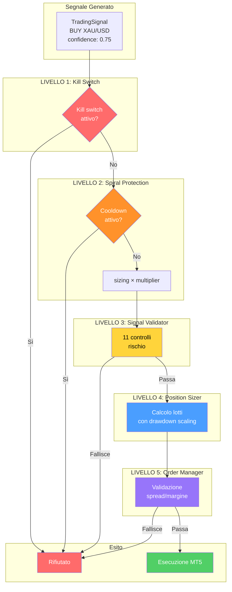
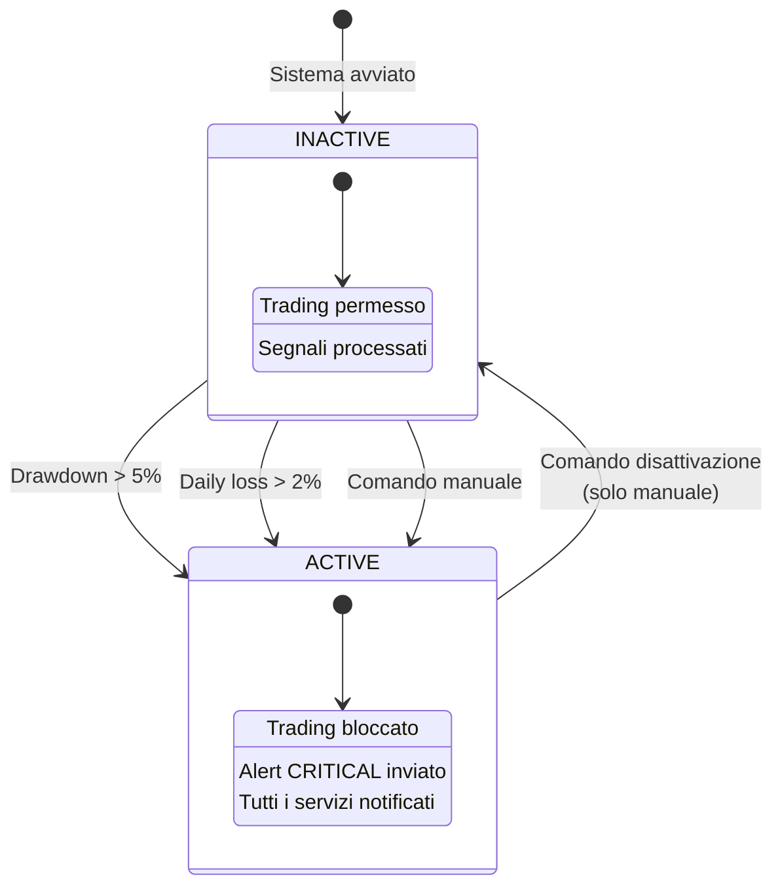
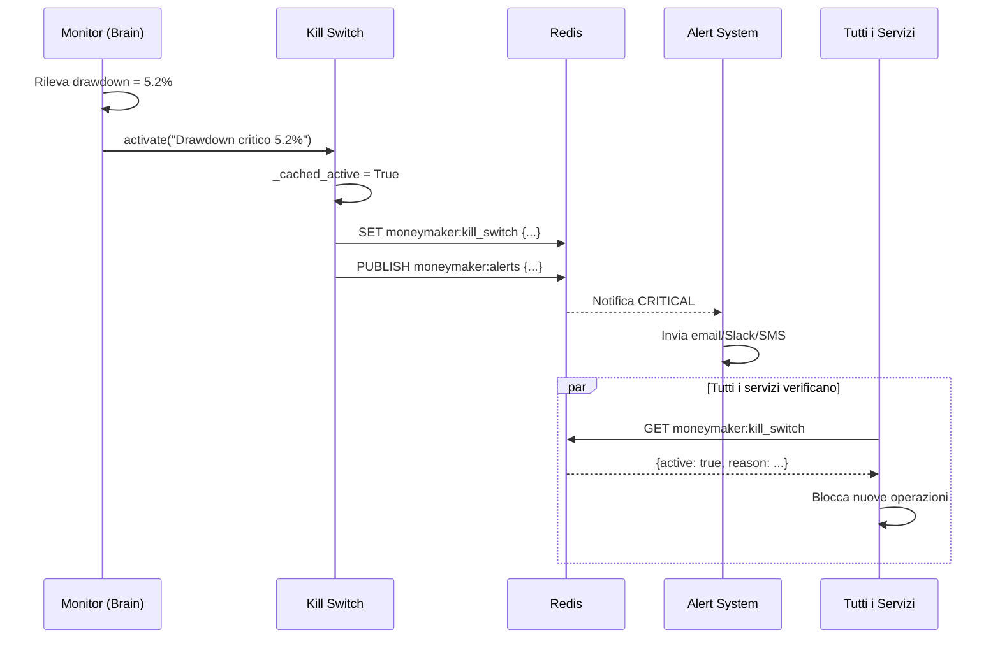
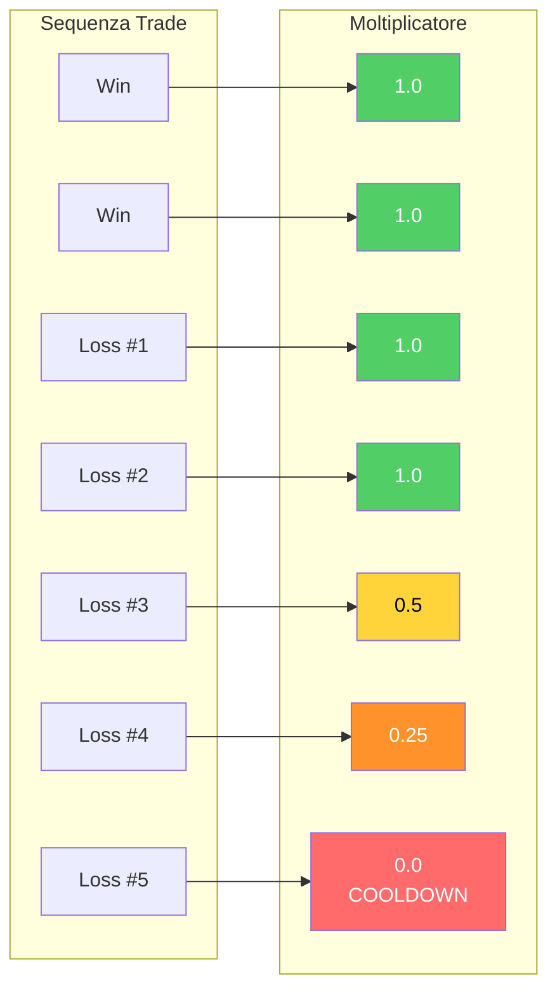
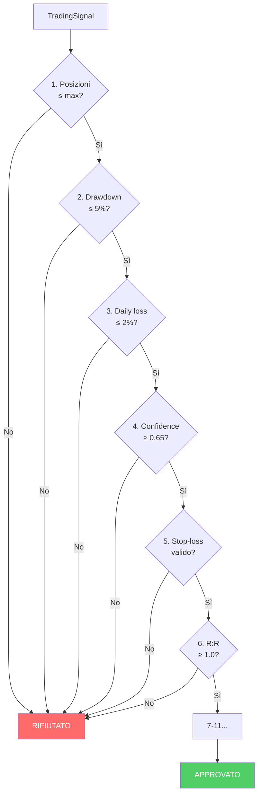
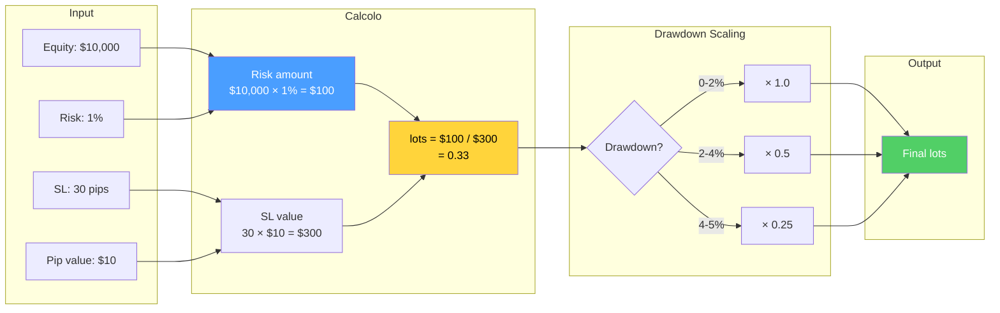
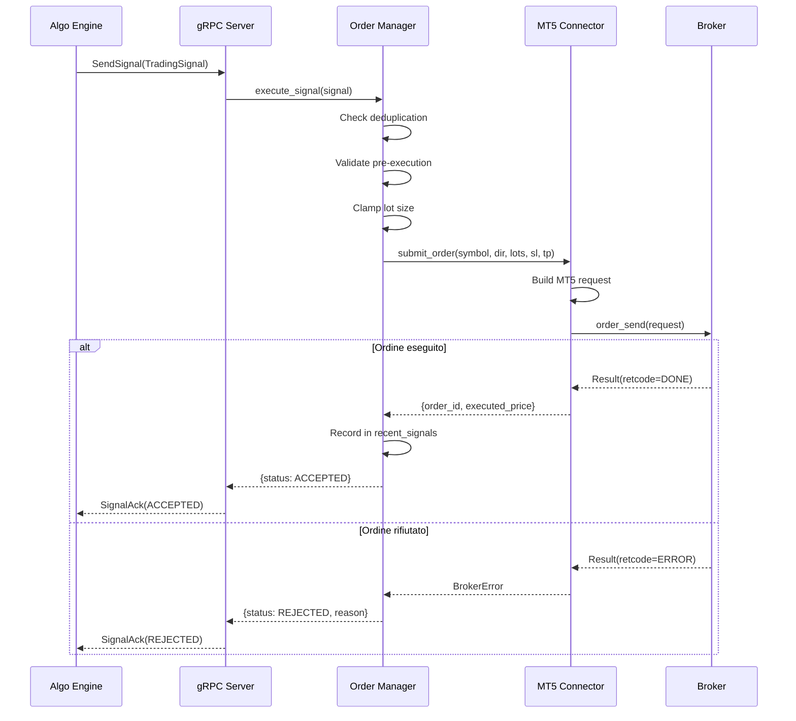
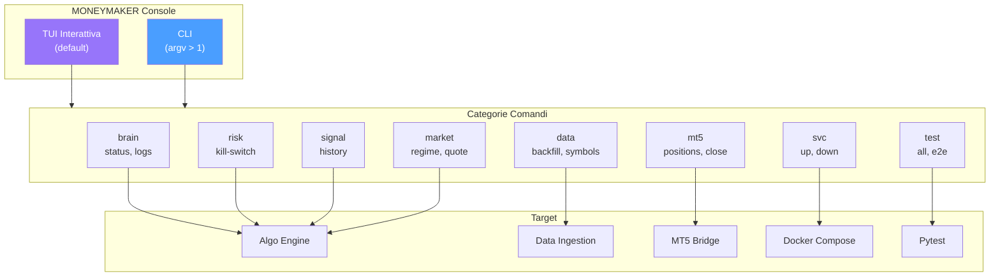
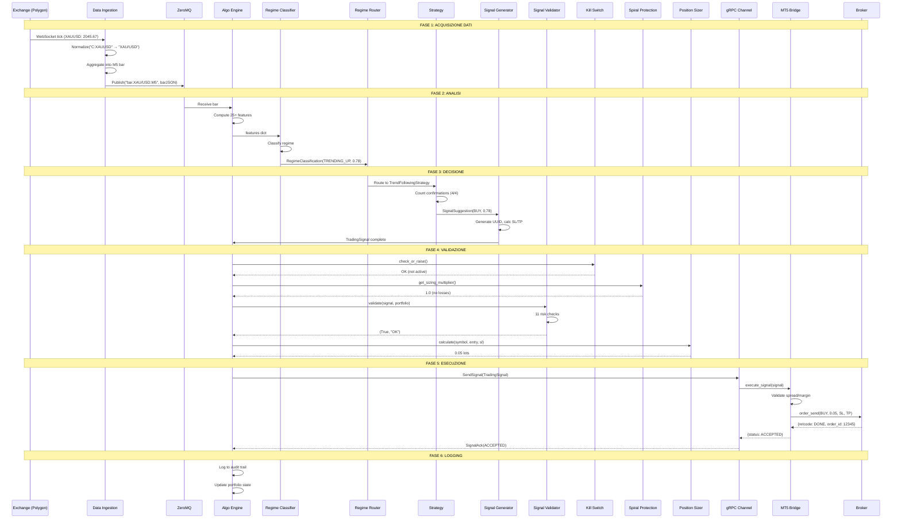

# MONEYMAKER V1 — Sistema di Trading Algoritmico

> **Argomenti:** Architettura di sicurezza multi-livello, kill switch globale con Redis, spiral protection per perdite consecutive, validazione segnali (11 controlli di rischio), position sizing dinamico con drawdown scaling, MT5 Bridge per esecuzione ordini, MONEYMAKER Console per controllo operativo, scenario end-to-end dal tick al trade.
>
> **Autore:** Renan Augusto Macena

---

## Indice

1. [Safety Overview](#1-safety-overview)
2. [Il Pulsante Rosso: Kill Switch](#2-il-pulsante-rosso-kill-switch)
3. [Il Paracadute: Spiral Protection](#3-il-paracadute-spiral-protection)
4. [Il Controllore Qualità: Signal Validator](#4-il-controllore-qualità-signal-validator)
5. [L'Ingegnere Strutturale: Position Sizing](#5-lingegnere-strutturale-position-sizing)
6. [Il Capo Macchinista: MT5 Bridge](#6-il-capo-macchinista-mt5-bridge)
7. [La Plancia dell'Ammiraglio: Console](#7-la-plancia-dellammiraglio-console)
8. [Scenario E2E: Dal Tick al Trade](#8-scenario-e2e-dal-tick-al-trade)

---

## 1. Safety Overview

La sicurezza in MONEYMAKER segue il principio della **Defense in Depth** — come una nave da guerra con più strati di protezione: scafo esterno, compartimenti stagni, sistemi antincendio, e scialuppe di salvataggio. Se uno strato fallisce, quello successivo protegge.

**Filosofia fondamentale:** *Nel dubbio, HOLD.* Meglio perdere un'opportunità che perdere capitale.

| Livello | Sistema | Trigger | Azione |
| --- | --- | --- | --- |
| **L1** | Kill Switch | Drawdown > 5%, Daily loss > 2% | Blocca tutto il trading |
| **L2** | Spiral Protection | 3+ loss consecutive | Riduce sizing progressivamente |
| **L3** | Signal Validator | 11 controlli rischio | Rifiuta segnali non conformi |
| **L4** | Position Sizer | Drawdown corrente | Scala il sizing dinamicamente |
| **L5** | Order Manager | Spread, margine | Rifiuta ordini non eseguibili |

> **Analogia:** Il **Codice di Navigazione** della nave — un insieme di regole non negoziabili che nessun marinaio può violare senza conseguenze. L'ordine di attivazione è gerarchico: se il Pulsante Rosso (L1) è premuto, tutti gli altri controlli diventano irrilevanti. Se non è premuto, si passa alla Spiral (L2), poi al Validatore (L3), e così via. Ogni livello può bloccare l'operazione indipendentemente.



> **Spiegazione Diagramma:** Il segnale attraversa 5 livelli di protezione. Kill Switch (rosso) e Spiral (arancione) possono bloccare immediatamente. Validator (giallo) esegue 11 controlli. Sizer (blu) calcola i lotti. Order Manager (viola) fa la validazione finale. Solo se tutto passa, il segnale viene eseguito (verde).

---

## 2. Il Pulsante Rosso: Kill Switch

Il **Kill Switch** è il pulsante rosso d'emergenza in plancia — quando viene premuto, tutti i motori si fermano. Implementato come stato condiviso via Redis, assicura che tutti i servizi MONEYMAKER vedano la stessa cosa simultaneamente.

| Aspetto | Dettaglio |
| --- | --- |
| **Storage** | Redis key: `moneymaker:kill_switch` |
| **Formato** | JSON: `{active: bool, reason: str, activated_at: timestamp}` |
| **Cache locale** | TTL 1 secondo per ridurre chiamate Redis |
| **Alert** | Pubblica su `moneymaker:alerts` con severity CRITICAL |

**Trigger di attivazione automatica:**
- Drawdown portafoglio > 5%
- Perdita giornaliera > 2%
- Errore critico infrastruttura

> **Analogia:** Come il **pulsante rosso di emergenza** in plancia che ferma tutti i motori. Quando il capitano lo preme, non importa cosa sta facendo il timoniere o il macchinista — tutto si ferma. La nave va in deriva controllata finché il capitano non decide che è sicuro ripartire. Il pulsante è collegato a tutti i reparti tramite un circuito dedicato (Redis) che non può essere interrotto.



> **Spiegazione Diagramma:** Il kill switch ha due stati: INACTIVE (trading permesso) e ACTIVE (tutto bloccato). L'attivazione è automatica (soglie superate) o manuale. La disattivazione è **solo manuale** — il sistema non si riattiva da solo per sicurezza.

### 2.1 Flusso di Attivazione



---

## 3. Il Paracadute: Spiral Protection

La **Spiral Protection** è il paracadute che si apre progressivamente — dopo ogni perdita consecutiva, il sistema riduce la dimensione dei trade per limitare i danni. Dopo troppe perdite di fila, ferma il trading per un periodo di cooldown.

| Parametro | Default | Descrizione |
| --- | --- | --- |
| `consecutive_loss_threshold` | 3 | Perdite per iniziare riduzione |
| `max_consecutive_loss` | 5 | Perdite per attivare cooldown |
| `cooldown_minutes` | 60 | Durata cooldown |
| `size_reduction_factor` | 0.5 | Riduzione per ogni livello |

**Moltiplicatore di sizing:**

| Perdite Consecutive | Moltiplicatore | Effetto |
| --- | --- | --- |
| 0-2 | 1.0 | Sizing normale |
| 3 | 0.5 | Sizing dimezzato |
| 4 | 0.25 | Sizing al 25% |
| 5+ | 0.0 | Cooldown (nessun trade) |

> **Analogia:** Come un **paracadute che si apre in stadi**. Primo stadio (3 loss): si apre il paracadute pilota, rallenta un po'. Secondo stadio (4 loss): si apre il paracadute principale, rallenta molto. Terzo stadio (5 loss): si attiva il paracadute di riserva e l'atterraggio diventa controllato — cioè niente più operazioni per un'ora, il tempo di capire cosa sta succedendo.



> **Spiegazione Diagramma:** Le prime 2 loss non cambiano nulla (verde). Alla 3° loss il sizing si dimezza (giallo). Alla 4° scende al 25% (arancione). Alla 5° si attiva il cooldown (rosso) — nessun trade per 60 minuti.

---

## 4. Il Controllore Qualità: Signal Validator

Il **Signal Validator** è il controllore qualità alla fine della catena di montaggio — ogni segnale deve superare **11 controlli di rischio** prima di essere "spedito" al broker. Usa un approccio **fail-fast**: si ferma al primo difetto trovato.

| # | Controllo | Soglia Default | Descrizione |
| --- | --- | --- | --- |
| 1 | Posizioni aperte | ≤ 5 | Non sovraccaricare il portafoglio |
| 2 | Drawdown | ≤ 5% | Freno d'emergenza perdite |
| 3 | Perdita giornaliera | ≤ 2% | Budget giornaliero di rischio |
| 4 | Confidenza minima | ≥ 0.65 | Non agire se poco sicuro |
| 5 | Stop-loss valido | price > 0 | Rete di sicurezza presente |
| 6 | Risk/Reward ratio | ≥ 1.0 | Guadagno potenziale > rischio |
| 7 | Margine sufficiente | calcolato | Soldi in garanzia disponibili |
| 8 | Correlazione esposizione | calcolata | Evita sovraesposizione valutaria |
| 9 | Sessione di trading | configurata | Evita mercati chiusi/illiquidi |
| 10 | Calendario economico | configurato | Evita news ad alto impatto |
| 11 | Signal deduplication | 5 min window | Evita ordini duplicati |

> **Analogia:** Come il **controllore qualità in fabbrica** che ispeziona ogni pezzo prima della spedizione. Ha una checklist di 11 punti. Se anche solo uno fallisce, il pezzo viene scartato — non può essere "quasi buono". Meglio rallentare la produzione che spedire prodotti difettosi ai clienti (broker).



> **Spiegazione Diagramma:** Ogni controllo è un gate passa/non-passa. Fail-fast: al primo "No" il segnale viene rifiutato. Solo se tutti i controlli passano (tutti "Sì") il segnale è approvato.

### 4.1 Output del Validator

```python
# Esempio di output
valid, reason = validator.validate(signal, portfolio_state)

# Se valido:
valid = True
reason = "Tutti i controlli superati"

# Se non valido:
valid = False
reason = "Drawdown 5.3% supera limite 5.0%"
```

---

## 5. L'Ingegnere Strutturale: Position Sizing

Il **Position Sizer** è l'ingegnere strutturale che calcola il carico massimo che il ponte (portafoglio) può sopportare — quanti lotti tradare per non rischiare più di una percentuale configurata dell'equity.

**Formula:**
```
lots = (equity × risk%) / (SL_pips × pip_value_per_lot)
```

| Parametro | Default | Descrizione |
| --- | --- | --- |
| `risk_per_trade_pct` | 1.0% | Rischio massimo per trade |
| `min_lots` | 0.01 | Dimensione minima |
| `max_lots` | 0.10 | Dimensione massima |

**Drawdown Scaling:**

| Drawdown | Moltiplicatore | Effetto |
| --- | --- | --- |
| 0-2% | 1.0 | Sizing normale |
| 2-4% | 0.5 | Sizing dimezzato |
| 4-5% | 0.25 | Sizing al 25% |
| > 5% | 0.0 | Nessun trade (kill switch imminente) |

> **Analogia:** L'ingegnere strutturale calcola quanto peso può reggere il ponte. Se il ponte è nuovo e integro (drawdown basso), può reggere il carico pieno. Se il ponte ha delle crepe (drawdown in aumento), bisogna ridurre il carico. Se il ponte sta cedendo (drawdown > 5%), nessuno può attraversarlo finché non viene riparato.



> **Spiegazione Diagramma:** Il calcolo parte da equity, rischio %, distanza SL e valore pip. Si ottiene il lot size base. Poi si applica il moltiplicatore di drawdown scaling. Il risultato viene clampato tra min e max lots.

---

## 6. Il Capo Macchinista: MT5 Bridge

Il **MT5 Bridge** è il capo macchinista che traduce gli ordini della plancia in azioni dei motori — riceve i segnali dal Brain via gRPC e li esegue sul broker MetaTrader 5.

| Componente | File | Responsabilità |
| --- | --- | --- |
| **gRPC Server** | `grpc_server.py` | Riceve TradingSignal, invia SignalAck |
| **Order Manager** | `order_manager.py` | Valida, calcola lotti, invia ordini |
| **MT5 Connector** | `connector.py` | Interfaccia con MT5 terminal API |
| **Position Tracker** | `position_tracker.py` | Traccia posizioni aperte |

| Porta | Protocollo | Funzione |
| --- | --- | --- |
| 50055 | gRPC | Ricezione segnali |
| 9094 | HTTP | Prometheus metrics |

> **Analogia:** Il capo macchinista sta nella sala macchine. Quando la plancia ordina "avanti tutta" (BUY), lui traduce l'ordine in azioni concrete: apre le valvole del carburante (calcola lotti), imposta la velocità (stop-loss/take-profit), e mette in moto i motori (invia l'ordine a MT5). Se qualcosa non va (spread troppo alto, margine insufficiente), ferma tutto e riporta alla plancia il problema.



> **Spiegazione Diagramma:** Il flusso mostra il percorso di un segnale dal Brain al broker. Order Manager fa validazione e de-duplicazione. MT5 Connector costruisce la request e la invia. Il risultato torna indietro come ACK (accettato o rifiutato).

### 6.1 Metriche Prometheus

```
# Ordini inviati per simbolo e direzione
moneymaker_mt5_orders_submitted_total{symbol="XAUUSD", direction="BUY"}

# Ordini eseguiti con successo
moneymaker_mt5_orders_filled_total{symbol="XAUUSD", direction="BUY"}

# Latenza esecuzione (istogramma)
moneymaker_mt5_order_execution_seconds_bucket{le="0.1"}
```

---

## 7. La Plancia dell'Ammiraglio: Console

La **MONEYMAKER Console** è la plancia unificata dell'ammiraglio — una TUI (Text User Interface) interattiva che permette di controllare l'intero ecosistema da un unico punto.

**Modalità:**
- **TUI** (default): Interfaccia interattiva con menu e pannelli
- **CLI**: Comandi diretti via argparse

| Categoria | Comandi | Funzione |
| --- | --- | --- |
| `brain` | status, logs, restart | Controlla Algo Engine |
| `data` | status, backfill, symbols | Controlla Data Ingestion |
| `mt5` | status, positions, close | Controlla MT5 Bridge |
| `risk` | status, kill-switch, spiral | Gestione rischio |
| `signal` | history, pending, cancel | Gestione segnali |
| `market` | regime, indicators, quote | Info mercato |
| `test` | all, unit, e2e | Esegue test suite |
| `build` | all, brain, data | Build servizi |
| `sys` | status, logs, resources | Info sistema |
| `config` | show, edit, validate | Configurazione |
| `svc` | up, down, restart | Docker Compose |
| `maint` | backup, migrate, vacuum | Manutenzione DB |
| `tool` | various | Utility varie |

> **Analogia:** La plancia dell'ammiraglio ha tutti i controlli: radar (data), timone (brain), motori (mt5), allarmi (risk), comunicazioni (signal), carte nautiche (market), e i bottoni per avviare/fermare ogni sistema. L'ammiraglio può controllare l'intera flotta da un unico punto, sia dando ordini vocali (TUI interattiva) che scrivendo dispacci (CLI).



> **Spiegazione Diagramma:** La Console ha due modalità di input (TUI, CLI). I comandi sono organizzati in categorie che mappano ai servizi target. La Console orchestra tutto attraverso chiamate dirette, gRPC o Docker Compose.

### 7.1 Comandi Kill Switch

```bash
# Attiva kill switch manualmente
python moneymaker_console.py risk kill-switch on "Manutenzione programmata"

# Disattiva kill switch
python moneymaker_console.py risk kill-switch off

# Verifica stato
python moneymaker_console.py risk status
```

---

## 8. Scenario E2E: Dal Tick al Trade

Questo scenario mostra il **percorso completo** di un dato di mercato: dal WebSocket dell'exchange fino all'esecuzione dell'ordine su MetaTrader 5.

> **Analogia:** Una **manovra navale completa**: dal rilevamento radar di un bersaglio (tick), all'analisi tattica (regime classification), alla decisione di ingaggio (strategy), all'ordine di fuoco (signal), ai controlli di sicurezza (validator), fino al lancio del siluro (order execution).



### 8.1 Tempi Tipici

| Fase | Latenza Tipica | Note |
| --- | --- | --- |
| WebSocket → Aggregator | < 10 ms | Go concurrency |
| ZMQ Publish → Receive | < 1 ms | Localhost |
| Feature calculation | 2-5 ms | 25+ indicators |
| Regime + Strategy | 1-2 ms | Rule-based |
| Signal generation | < 1 ms | Simple math |
| Validation (11 checks) | 1-3 ms | Mostly in-memory |
| gRPC → MT5 Bridge | 5-10 ms | Network + serialize |
| MT5 → Broker | 50-200 ms | Network to broker |
| **Totale** | **70-230 ms** | Tick-to-order |

---

## Appendice: Checklist di Sicurezza

Prima di andare in produzione, verificare:

- [ ] Kill switch testato (attivazione e disattivazione)
- [ ] Spiral protection testata (5 loss consecutive → cooldown)
- [ ] Tutti i 11 controlli validator configurati correttamente
- [ ] Position sizer con drawdown scaling verificato
- [ ] Alert Prometheus configurati (KillSwitchActivated, CriticalDrawdown)
- [ ] Grafana dashboard con tutti i pannelli di rischio
- [ ] Backup automatico database configurato
- [ ] Credenziali MT5 in variabili d'ambiente (non in codice)
- [ ] TLS/mTLS abilitato per comunicazioni inter-servizio
- [ ] Rate limiting configurato su MT5 Bridge
- [ ] Audit trail abilitato con hash chain SHA-256

---

*Fine della documentazione MONEYMAKER V1 — Sistema di Trading Algoritmico*
