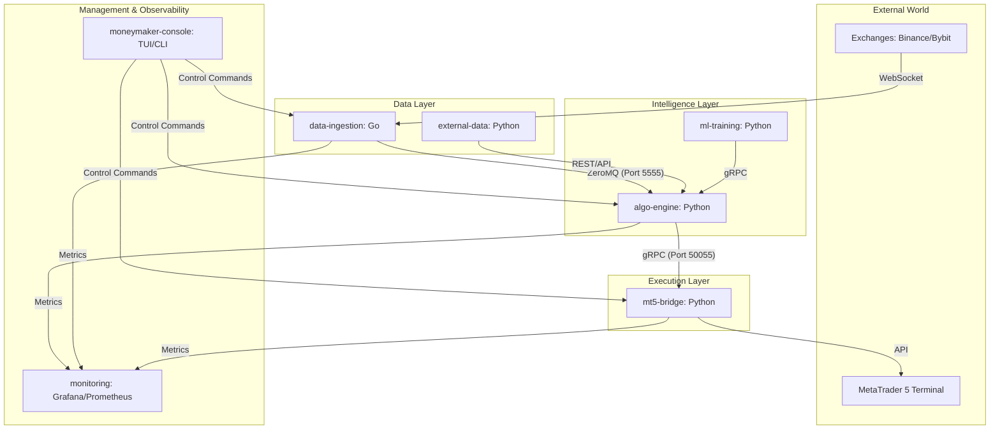

# MONEYMAKER Services Ecosystem

This directory contains the core microservices that power the MONEYMAKER trading pipeline. The architecture is designed for high-throughput market data ingestion, intelligent signal generation via a 14-phase AI pipeline, and robust trade execution with multi-layer safety systems.

---

## 🏗️ System Architecture & Data Flow

MONEYMAKER operates as a distributed event-driven system:



### Communication Protocols
- **ZeroMQ (PUB/SUB)**: Ultra-low latency broadcast of market bars from Ingestion to Brain.
- **gRPC**: High-reliability request-response for signal dispatch and cross-service queries.
- **Redis**: Shared state, kill-switch status, and real-time portfolio tracking.
- **TimescaleDB**: Long-term storage for OHLCV data, signals, and trade history.

---

## 📋 Service Catalog

| Service | Language | Port(s) | Role | Primary Responsibility |
|:---|:---:|:---:|:---|:---|
| **[algo-engine](algo-engine/)** | Python | 50052, 8082, 9092 | Intelligence | 14-phase signal generation & risk filtering. |
| **[data-ingestion](data-ingestion/)** | Go | 5555, 9090 | Data | Real-time WebSocket ingestion & bar aggregation. |
| **[mt5-bridge](mt5-bridge/)** | Python | 50055, 9094 | Execution | Order routing to MT5 & position management. |
| **[console](console/)** | Python | — | Control | Unified TUI/CLI for system-wide operations. |
| **[external-data](external-data/)** | Python | — | Insights | Macro data (FRED, CBOE, CFTC) & Econ Calendar. |
| **[ml-training](ml-training/)** | Python | — | Learning | Model training, backtesting, and JEPA inference. |
| **[monitoring](monitoring/)** | Config | 3000, 9091 | Observability | Grafana dashboards & Prometheus metrics. |

---

## 🧠 Deep Dive: Algo Engine (The Core)

The `algo-engine` is not just a strategy; it's a modular intelligence factory that evolves through 14 implementation phases:

### 14-Phase Intelligence Pipeline
The Brain executes a cascaded logic to ensure reliability even during model drift or service failures:
1. **Data Sanity**: Validates OHLCV plausibility and handles spikes.
2. **Feature Engineering**: Computes 60+ technical indicators & custom market vectors.
3. **Regime Ensemble**: Uses 3 classifiers (Rule-based, HMM, k-Means) to detect market states.
4. **Drift Monitor**: Detects if market distribution has shifted (Z-score analysis).
5. **Maturity Gating**: Reduces position sizing if the model is in a "Doubt" or "Crisis" state.
6. **Cascade Advisor**: 
   - **COPER**: High-confidence ML-primary signals.
   - **Hybrid**: Combined ML + Rule-based logic.
   - **Knowledge**: Expert-system and rule-based fallback.
   - **Conservative**: Safety-first survival mode.
7. **Risk Validator**: 10+ checks (Daily loss, Max Drawdown, Correlation, Economic Calendar).

---

## 🚀 Operational Guides

### 1. Starting the Ecosystem
The preferred way to run MONEYMAKER is via Docker Compose for production-like isolation.

```bash
# From project root
make docker-up      # Starts all services in background
make docker-status  # Check running containers
```

For **Development Mode** (Manual start):
1. Start Infrastructure: `docker-compose -f infra/docker/docker-compose.yml up redis postgres`
2. Start Data: `cd services/data-ingestion && go run cmd/server/main.go`
3. Start Brain: `cd services/algo-engine && python -m algo_engine.main`
4. Start Bridge: `cd services/mt5-bridge && python -m mt5_bridge.main`

### 2. Management via Console
The **MONEYMAKER Console** is your cockpit. Run it to monitor and control all services:

```bash
python services/console/moneymaker_console.py
```
- Use `sys status` for a health overview.
- Use `brain status` to see the current model confidence.
- Use `mt5 positions` to view live trades.
- Use `risk kill-switch` to immediately halt all trading activity.

### 3. Monitoring & Alerts
- **Grafana**: `http://localhost:3000` (User: `admin` / Pass: `admin`)
- **Prometheus**: `http://localhost:9091`
- **Telegram**: Ensure `BRAIN_TELEGRAM_BOT_TOKEN` is set for real-time trade alerts.

---

## 🛠️ Troubleshooting Guide

### 🔴 Problem: "No market data in Algo Engine"
- **Symptom**: `algo-engine` logs show no incoming bars, or Grafana "Bar Ingestion" is flat.
- **Check**:
  1. Is `data-ingestion` running? (`docker ps` or `make status`)
  2. Check ZMQ connection: `netstat -ano | findstr :5555`.
  3. Verify `data-ingestion` logs: `docker logs moneymaker-data-ingestion`. Ensure it's receiving ticks from Binance/Bybit.

### 🔴 Problem: "Signals generated but not appearing in MT5"
- **Symptom**: Brain logs show `signal_generated` but Bridge shows nothing.
- **Check**:
  1. gRPC connectivity: Ensure `mt5-bridge` is listening on port 50055.
  2. Validation Rejection: Check Brain logs for `signal_rejected`. It might be a risk limit (Max DD, Max Positions, or Economic Calendar blackout).
  3. Bridge Logs: `docker logs moneymaker-mt5-bridge` to see if gRPC requests are arriving.

### 🔴 Problem: "MT5 Bridge Connection Failed"
- **Symptom**: `MT5 Bridge not available` warning in logs.
- **Check**:
  1. **Windows**: Ensure MetaTrader 5 terminal is open and "Algo Trading" is enabled.
  2. **Docker/Linux**: Bridge runs in **Dry-Run mode**. It will simulate orders but cannot connect to a real terminal unless using a Windows-based runner or Wine-bridge.
  3. Credentials: Verify `MT5_ACCOUNT`, `MT5_PASSWORD`, and `MT5_SERVER` in `.env`.

### 🟡 Problem: "High Pipeline Latency"
- **Symptom**: Latency metrics > 500ms in Grafana.
- **Check**:
  1. CPU/RAM usage: `python moneymaker_console.py sys resources`. Algo Engine can be heavy if all 14 phases are active.
  2. Database Bloat: Check if TimescaleDB indices need reindexing (`python moneymaker_console.py maint reindex`).

---

## ⚙️ Global Configuration

Most services share common environment variables defined in `program/.env`.

| Category | Variables |
|:---|:---|
| **Database** | `POSTGRES_USER`, `POSTGRES_PASSWORD`, `MONEYMAKER_DB_URL` |
| **Cache/State** | `REDIS_URL` |
| **Exchange** | `BINANCE_API_KEY`, `BINANCE_API_SECRET` |
| **Trading** | `MT5_ACCOUNT`, `MT5_PASSWORD`, `MT5_SERVER`, `BRAIN_ML_ENABLED` |
| **Risk** | `MAX_DAILY_LOSS_PCT`, `MAX_DRAWDOWN_PCT`, `MAX_OPEN_POSITIONS` |

> **Note**: For individual service configurations, see the `README.md` and `config.py` within each service directory.
