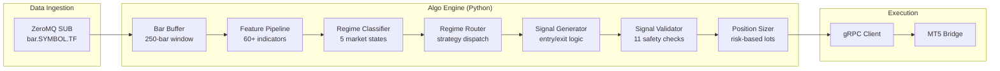

# Algo Engine Service (Intelligence Layer)

The **Algo Engine** is the core signal generation service of the MONEYMAKER ecosystem. A pure algorithmic engine written in Python, it receives real-time market data bars via ZeroMQ, computes 60+ technical indicators, classifies market regimes, routes to the appropriate strategy, and emits validated trading signals to the MT5 Bridge via gRPC.

No machine learning, no neural networks — deterministic, explainable, and auditable.

---

## How It Works: The Signal Pipeline



1. **Bar Buffer**: Accumulates OHLCV bars per symbol (250-bar sliding window, 50-bar minimum warmup).
2. **Feature Pipeline**: Computes RSI, EMA, MACD, Bollinger Bands, ATR, ADX, CCI, Stochastic, DEMA, Keltner Channels, Parabolic SAR, VWAP, CMF, Force Index, and more.
3. **Regime Classifier**: Categorizes market state into one of 5 regimes: `TRENDING_UP`, `TRENDING_DOWN`, `RANGING`, `HIGH_VOLATILITY`, `REVERSAL`. Uses hysteresis to prevent flip-flopping.
4. **Regime Router**: Dispatches to the strategy best suited for the current regime. Supports both direct routing and probabilistic (Bayesian) routing.
5. **Signal Generator**: Produces BUY/SELL signals with entry price, stop-loss, and take-profit levels.
6. **Signal Validator**: Enforces 11 safety checks — session hours, spread limits, confidence threshold, correlation exposure, economic calendar blackouts, and more.
7. **Position Sizer**: Calculates lot size from ATR-based risk, equity, and leverage constraints. Optional CVaR + Half-Kelly advanced sizer.

---

## Source Layout

```
src/algo_engine/
├── main.py                     # Async entry point (ZMQ loop, gRPC dispatch)
├── engine.py                   # Core pipeline orchestrator (optional module injection)
├── config.py                   # Environment-based settings (Pydantic)
├── kill_switch.py              # Global emergency stop (Redis-backed, fail-closed)
├── portfolio.py                # Portfolio state manager (equity, drawdown, positions)
├── maturity_gate.py            # Paper-to-live progression state machine
├── grpc_client.py              # MT5 Bridge gRPC client
├── zmq_adapter.py              # Bar buffer and ZMQ helpers
│
├── features/                   # Technical analysis and market classification
│   ├── technical.py            # 30+ indicator functions (all Decimal)
│   ├── pipeline.py             # Feature orchestration (dict of 60+ keys)
│   ├── regime.py               # Rule-based regime classifier with hysteresis
│   ├── sessions.py             # Trading session classifier (Tokyo/London/NY)
│   ├── data_quality.py         # Bar validation (gaps, spikes, stale data)
│   ├── mtf_analyzer.py         # Multi-timeframe analysis (M1/M5/M15/H1)
│   ├── mtf_confirmation.py     # Cross-timeframe agreement ratio
│   ├── feature_scorer.py       # Unified trend/momentum/volatility scoring
│   ├── belief_state.py         # EMA-smoothed temporal context accumulator
│   ├── spread_tracker.py       # Dynamic spread percentile tracking
│   ├── economic_calendar.py    # News event blackout windows
│   └── macro_features.py       # Macro data integration (VIX, rates)
│
├── strategies/                 # Trading strategies (one per market regime)
│   ├── base.py                 # Abstract strategy interface
│   ├── regime_router.py        # Regime-to-strategy dispatch + Bayesian routing
│   ├── trend_following.py      # EMA crossover + ADX confirmation
│   ├── mean_reversion.py       # Bollinger Band + RSI extremes
│   ├── breakout.py             # Donchian channel breakout
│   ├── defensive.py            # Low-exposure, tight stops (high volatility)
│   ├── adaptive_trend.py       # ATR-adaptive trend following
│   ├── multi_factor.py         # Multi-indicator confluence
│   ├── ou_mean_reversion.py    # Ornstein-Uhlenbeck statistical reversion
│   └── vol_momentum.py         # Volatility-momentum hybrid
│
├── signals/                    # Signal generation, validation, and sizing
│   ├── generator.py            # Signal construction with SL/TP calculation
│   ├── validator.py            # 11-check validation pipeline
│   ├── position_sizer.py       # ATR-based risk sizing
│   ├── advanced_sizer.py       # CVaR + Half-Kelly (optional)
│   ├── composite_confidence.py # Multi-factor calibrated confidence
│   ├── rate_limiter.py         # Max signals per hour enforcement
│   ├── spiral_protection.py    # Consecutive loss detection + cooldown
│   ├── trailing_stop.py        # 4-mode trailing stop (fixed/ATR/chandelier/percent)
│   └── correlation.py          # Currency correlation exposure check
│
├── math/                       # Advanced quantitative modules (all optional)
│   ├── bayesian.py             # Bayesian regime posteriors
│   ├── copula.py               # Tail dependency modeling
│   ├── extreme_value.py        # Generalized Pareto for tail risk
│   ├── fractal.py              # Hurst exponent and fractal dimension
│   ├── information_theory.py   # Entropy and mutual information
│   ├── ou_process.py           # Ornstein-Uhlenbeck parameter estimation
│   ├── spectral.py             # Wavelet decomposition and FFT
│   └── stochastic.py           # GBM, Merton jump-diffusion, Heston
│
├── optimization/               # Strategy optimization and validation
│   ├── walk_forward.py         # Walk-forward analysis with purged CV
│   ├── monte_carlo.py          # Monte Carlo simulation for drawdown estimation
│   └── adaptive.py             # Online parameter adaptation
│
├── analytics/                  # Performance tracking
│   ├── attribution.py          # Per-strategy win rate and P&L attribution
│   └── historical_edge.py     # Per-symbol/regime/session edge tracker
│
└── alerting/                   # Notification dispatch
    ├── dispatcher.py           # Alert routing (multi-channel)
    └── telegram.py             # Telegram bot integration
```

---

## Operational Guide

### Starting the Service

```bash
# Direct (requires moneymaker-common and moneymaker-proto installed)
python -m algo_engine.main

# Via Docker Compose (recommended)
docker compose -f infra/docker/docker-compose.yml up -d algo-engine
```

### Key Configuration (Environment Variables)

| Variable | Default | Description |
|:---|:---|:---|
| `ALGO_ZMQ_DATA_FEED` | `tcp://data-ingestion:5555` | ZMQ address to subscribe for bars |
| `ALGO_CONFIDENCE_THRESHOLD` | `0.65` | Minimum confidence to emit a signal |
| `ALGO_MAX_SIGNALS_PER_HOUR` | `10` | Rate limiter ceiling |
| `ALGO_MAX_OPEN_POSITIONS` | `5` | Maximum concurrent positions |
| `ALGO_MAX_DAILY_LOSS_PCT` | `2.0` | Kill switch trigger (daily loss) |
| `ALGO_MAX_DRAWDOWN_PCT` | `5.0` | Kill switch trigger (drawdown) |
| `ALGO_PRIMARY_TIMEFRAME` | `M5` | Primary analysis timeframe |
| `ALGO_RISK_PER_TRADE_PCT` | `1.0` | Risk per trade as % of equity |

### Dependencies

- **moneymaker-common**: Logging, metrics, health checks, config
- **moneymaker-proto**: gRPC/Protobuf contracts
- **scipy**: Advanced statistics (walk-forward, Monte Carlo)
- **PyWavelets**: Spectral decomposition
- **arch**: GARCH volatility modeling
- **redis**: Kill switch state, portfolio persistence

---

## Troubleshooting

### Problem: "No bars received after startup"

- **Cause**: ZMQ subscriber not connected to data-ingestion publisher.
- **Solution**:
  1. Verify data-ingestion is running and publishing: check its logs for tick/bar activity.
  2. Confirm `ALGO_ZMQ_DATA_FEED` points to `tcp://data-ingestion:5555` (Docker) or `tcp://localhost:5555` (local).
  3. Ensure both services share the same Docker network (`backend`).

### Problem: "Bars received but no signals generated"

- **Cause**: Engine is in the 50-bar warmup period, or all signals are rejected by the validator.
- **Solution**:
  1. Wait for warmup: each symbol needs 50 bars (~50 minutes on M1) before the engine activates.
  2. Check validator thresholds: lower `ALGO_CONFIDENCE_THRESHOLD` for testing.
  3. Review regime classification: the defensive strategy in `HIGH_VOLATILITY` mode rarely generates signals.

### Problem: "Kill switch active, pausing"

- **Cause**: Daily loss or drawdown exceeded configured limits, or Redis is unreachable (fail-closed).
- **Solution**:
  1. Check Redis connectivity: `redis-cli -h redis ping`.
  2. Inspect kill switch state: `redis-cli GET moneymaker:kill_switch`.
  3. Deactivate manually if safe: use the Console `python moneymaker_console.py kill deactivate`.

---

## Metrics & Performance

| Metric | Name | Description |
|:---|:---|:---|
| **Pipeline Latency** | `moneymaker_brain_pipeline_latency_seconds` | End-to-end time from bar receipt to signal emission |
| **Signals Generated** | `moneymaker_brain_signals_generated_total` | Counter of validated trading signals |
| **Signals Rejected** | `moneymaker_brain_signals_rejected_total` | Counter of signals blocked by validator |
| **Signal Confidence** | `moneymaker_brain_signal_confidence` | Histogram of confidence scores |
| **Errors** | `moneymaker_errors_total` | Counter of pipeline errors by type |
| **Service Up** | `moneymaker_service_up` | Gauge: 1 = running, 0 = stopped |
