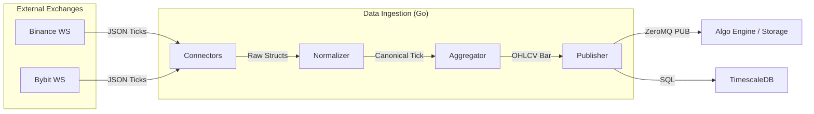

# Data Ingestion Service (Go Engine)

The **Data Ingestion** service is the high-performance entry point for all market data in the MONEYMAKER ecosystem. Written in Go, it manages real-time WebSocket connections, normalizes exchange-specific data, aggregates it into candles (bars), and broadcasts it to downstream subscribers.

---

## 🏗️ How It Works: The Data Flow

The service follows a strict pipeline to ensure low-latency data delivery:



1. **Connectors**: Manage WebSocket lifecycles with automatic exponential backoff for reconnections.
2. **Normalizer**: Maps exchange-specific symbols (e.g., `BTCUSDT`) to MONEYMAKER canonical symbols (e.g., `BTC/USDT`) and standardizes precision.
3. **Aggregator**: Buffers individual trades (ticks) into time-based bars (1m, 5m, 15m, 1h, 1d) with zero-gap assurance.
4. **Publisher**: 
   - **ZeroMQ (Port 5555)**: Broadcasts serialized bars using a high-throughput PUB/SUB pattern.
   - **TimescaleDB**: Persists bars for backtesting and historical analysis.
   - **Redis**: Updates the "Latest Price" cache for instant access by the Console.

---

## 📂 Source Layout

```
cmd/server/             # Main entrypoint and dependency injection
internal/
├── connectors/         # Exchange-specific implementations (Binance, Bybit)
├── normalizer/         # Symbol mapping logic and precision handling
├── aggregator/         # Logic for building candles from tick streams
├── publisher/          # ZeroMQ, SQL, and Redis writers
├── models/             # Canonical data structures (Tick, Bar)
└── config/             # YAML and Env-based configuration
```

---

## 🚀 Operational Guide

### 1. Starting the Service
Ensure `timescaledb` and `redis` are available.

```bash
# Build and run
go build -o bin/data-ingestion ./cmd/server/
./bin/data-ingestion

# Run via Docker
docker run -p 5555:5555 moneymaker-data-ingestion
```

### 2. Adding New Symbols
To add a new symbol to the feed:
1. Update `config.yaml` or set the `MONEYMAKER_SYMBOLS` environment variable.
2. Format: `BTC/USDT,ETH/USDT,XAU/USD`.
3. Restart the service or use the Console: `python moneymaker_console.py data add SOL/USDT`.

### 3. Monitoring Health
- **Prometheus Metrics**: `:9090/metrics`
- **Health Check**: `:8080/health` (Returns 200 OK if all connectors are active).

---

## 🛠️ Troubleshooting

### 🔴 Problem: "WebSocket Reconnection Loop"
- **Cause**: Invalid API key, network DNS failure, or IP ban (rate limiting).
- **Solution**: 
  1. Check logs for exchange-specific error codes (e.g., Binance 429).
  2. Verify system time is synchronized (NTP).
  3. Increase `reconnect_interval` in `config.yaml`.

### 🔴 Problem: "Bars not appearing in TimescaleDB"
- **Cause**: Database connection string is incorrect or TimescaleDB is out of disk space.
- **Solution**: 
  1. Verify `MONEYMAKER_DB_URL`.
  2. Run `python moneymaker_console.py sys db` to check connection status.
  3. Check `publisher` logs for SQL errors.

### 🔴 Problem: "High Aggregator Latency"
- **Cause**: Too many symbols being aggregated on a single thread or high CPU load.
- **Solution**: 
  1. Profile the service using `pprof`.
  2. Split symbols across multiple service instances.
  3. Check system CPU usage via the Console.

---

## 📊 Metrics & Performance

| Metric | Name | Description |
|:---|:---|:---|
| **Ticks Received** | `ticks_total` | Counter of raw ticks from all exchanges. |
| **Bars Published** | `bars_total` | Counter of OHLCV bars emitted via ZeroMQ. |
| **Reconnections** | `ws_reconnect_total` | Count of WebSocket disconnection events. |
| **ZMQ Backpressure** | `zmq_queue_size` | Number of messages waiting in the PUB socket. |
| **Aggregation Time** | `aggregator_latency_ms` | Time taken to finalize and publish a bar. |
