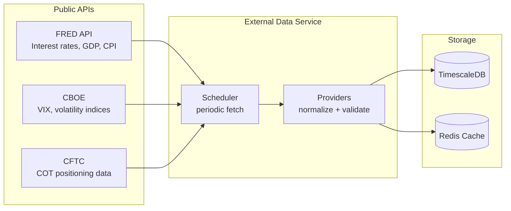

# External Data Service (Macro Intelligence)

The **External Data** service enriches the MONEYMAKER ecosystem with macroeconomic data from public APIs. It periodically fetches indicators from FRED, CBOE, and CFTC, stores them in TimescaleDB, and caches recent values in Redis for fast access by the Algo Engine and Dashboard.

---

## How It Works



1. **Scheduler**: Triggers data fetches on configurable intervals (default: hourly for FRED, daily for CFTC).
2. **Providers**: Each data source has a dedicated provider that handles API authentication, response parsing, and error handling.
3. **Storage**: Raw data persisted to TimescaleDB for historical analysis; recent values cached in Redis for sub-millisecond access.

---

## Source Layout

```text
src/external_data/
├── main.py              # Async entry point (FastAPI + scheduler)
├── config.py            # Environment-based settings
├── scheduler.py         # Periodic fetch orchestration
└── providers/
    ├── fred.py          # Federal Reserve Economic Data
    ├── cboe.py          # CBOE VIX and volatility data
    └── cftc.py          # CFTC Commitments of Traders
```

---

## Operational Guide

### Starting the Service

```bash
# Via Docker Compose (recommended)
docker compose -f infra/docker/docker-compose.yml up -d external-data

# Direct
python -m external_data.main
```

### Configuration

| Variable | Default | Description |
|:---|:---|:---|
| `FRED_API_KEY` | _(empty)_ | API key from fred.stlouisfed.org (free, improves rate limits) |
| `MONEYMAKER_DB_HOST` | `localhost` | PostgreSQL/TimescaleDB host |
| `MONEYMAKER_REDIS_HOST` | `localhost` | Redis host for caching |

### Health & Metrics

- **Health check**: `http://localhost:9095/health`
- **Prometheus metrics**: `http://localhost:9095/metrics`

---

## Troubleshooting

### Problem: "FRED API rate limited"

- **Cause**: Default rate limit is 120 requests/minute without an API key.
- **Solution**: Set `FRED_API_KEY` in `.env` (free registration at fred.stlouisfed.org).

### Problem: "CFTC data not updating"

- **Cause**: CFTC releases COT reports weekly (Friday). Data may appear stale between releases.
- **Solution**: Check the scheduler logs for the last successful fetch timestamp.

### Problem: "Database connection refused"

- **Cause**: PostgreSQL is not running or `MONEYMAKER_DB_HOST` is misconfigured.
- **Solution**: Verify database connectivity with `docker compose logs postgres`.
