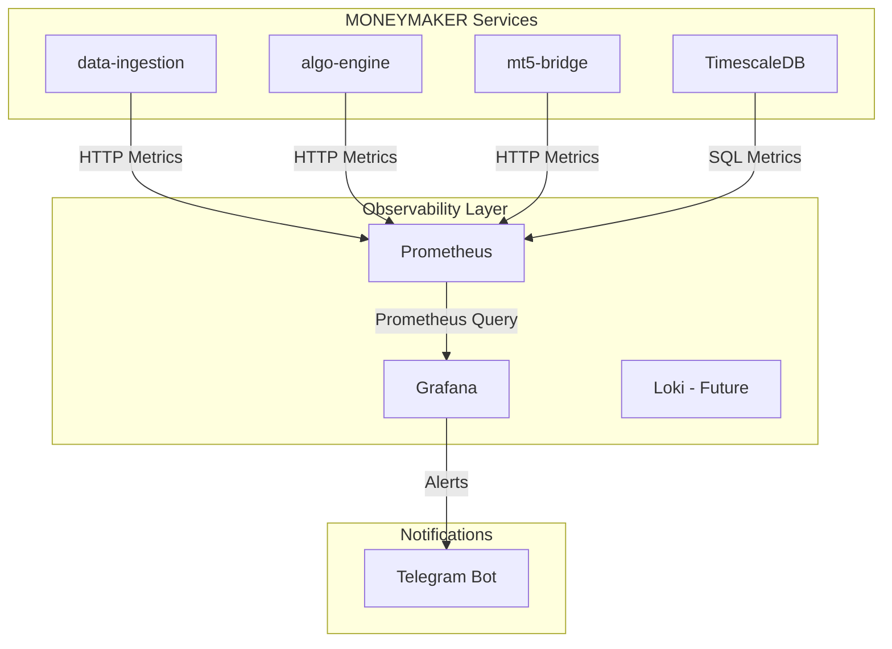

# Monitoring & Observability Stack

The **Monitoring Stack** is the "Eye of Sauron" for the MONEYMAKER ecosystem. It is responsible for collecting, storing, and visualizing metrics from all microservices, as well as managing alerting for critical system failures.

---

## 🏗️ How It Works: The Observability Architecture

MONEYMAKER uses a standard cloud-native stack for maximum reliability and flexibility:



1. **Prometheus**: Polls each service's `/metrics` endpoint every 15 seconds to collect time-series data.
2. **Grafana**: Provides high-quality dashboards for real-time visualization of latency, confidence, and system health.
3. **AlertManager**: Evaluates rules (e.g., "Daily Loss > 2%") and dispatches notifications via Telegram.

---

## 📂 Source Layout

```
grafana/
├── provisioning/      # Data sources and dashboard auto-provisioning
└── dashboards/        # JSON definitions of the "MONEYMAKER Master Dashboard"
prometheus/
├── prometheus.yml     # Scrape targets (ports 9090, 9092, 9094, etc.)
└── alerts.rules       # Alerting logic for critical system states
```

---

## 🚀 Operational Guide

### 1. Starting the Monitoring Stack
The monitoring stack is best run via Docker Compose as part of the infrastructure.

```bash
# Start Prometheus and Grafana
make docker-up

# Access the dashboards
- Grafana: http://localhost:3000 (admin/admin)
- Prometheus: http://localhost:9091
```

### 2. Viewing Key Dashboards
The **MONEYMAKER Master Dashboard** is divided into 4 key sections:
1. **Pipeline Latency**: End-to-end time from Tick to Trade.
2. **Strategy Performance**: Win rates, PnL per regime, and signal confidence.
3. **Risk & Safety**: Current Drawdown, Daily Loss, and Kill-Switch status.
4. **Hardware Resources**: CPU, RAM, and Disk usage across all nodes.

### 3. Setting Up Alerts
To receive alerts on your phone:
1. Create a Telegram Bot and get the `Token`.
2. Find your `ChatID`.
3. Update the `AlertManager` configuration in `prometheus/alertmanager.yml`.

---

## 🛠️ Troubleshooting

### 🔴 Problem: "Grafana Dashboards are Empty"
- **Cause**: Prometheus is not scraping correctly or the data source is down.
- **Solution**: 
  1. Check Prometheus Targets: `http://localhost:9091/targets`.
  2. Verify all services are up and exposing metrics.
  3. Ensure the Grafana Data Source is pointing to `http://prometheus:9090`.

### 🔴 Problem: "Metric Gaps in Dashboards"
- **Cause**: High system load or network instability is causing Prometheus to miss scrape intervals.
- **Solution**: 
  1. Increase the `scrape_interval` to 30s in `prometheus.yml`.
  2. Check `sys resources` for CPU/Network bottlenecks.

### 🔴 Problem: "Alerts are not reaching Telegram"
- **Cause**: Incorrect Bot Token or the bot is blocked by the user.
- **Solution**: 
  1. Use `/test-alert` command in the MONEYMAKER Console.
  2. Check `AlertManager` logs for dispatch errors.
  3. Ensure the bot has permissions to send messages to the chat.

---

## 📊 Key Metrics Monitored

| Category | Metric Example | Target Value |
|:---|:---|:---|
| **Speed** | `pipeline_latency_ms` | < 100ms |
| **Quality** | `signal_confidence` | > 0.65 |
| **Safety** | `current_drawdown_pct` | < 5.0% |
| **Success** | `win_rate_percentage` | > 55.0% |
| **Resource** | `process_cpu_seconds_total` | < 80% |
