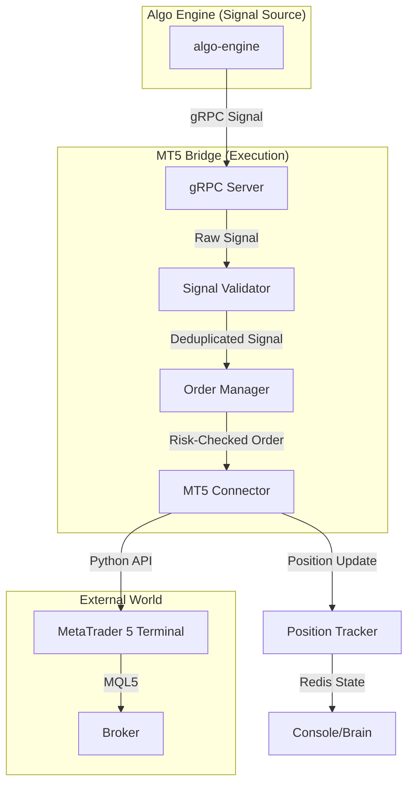

# MT5 Bridge Service (Execution Layer)

The **MT5 Bridge** is the final stage of the MONEYMAKER pipeline. It receives validated signals from the Algo Engine via gRPC, translates them into broker-specific orders, and executes them on the MetaTrader 5 terminal. It also manages position tracking, signal deduplication, and late-stage risk enforcement.

---

## 🏗️ How It Works: The Execution Pipeline



1. **gRPC Server**: Listens on port **50055** for incoming signal objects from the Brain.
2. **Signal Validation**: Rejects signals that are too old (default 30s) or duplicates within a time window (default 60s).
3. **Order Manager**: Final risk check. Enforces hard limits for max positions, lot sizes, and total drawdown.
4. **MT5 Connector**: Interfaces with the `MetaTrader5` Python library. Handles real-market execution (Windows) or simulation (Linux/Docker).
5. **Position Tracker**: Syncs real-time broker state (open positions, equity, balance) to Redis and TimescaleDB.

---

## 📂 Source Layout

```
src/mt5_bridge/
├── main.py              # Entrypoint and gRPC server initialization
├── config.py            # Environment-based settings and defaults
├── grpc_server.py       # Implementation of the TradingSignalService
├── order_manager.py     # Final risk gating, lot sizing, and signal deduplication
├── connector.py         # The interface to the MT5 Terminal API
├── position_tracker.py  # Real-time state management of open trades
└── storage/             # SQL and Redis persistence for orders and fills
```

---

## 🚀 Operational Guide

### 1. Starting the Service
**Note**: The MetaTrader 5 terminal must be open and "Algo Trading" must be enabled (Green icon).

```bash
# Windows (Native)
cd services/mt5-bridge
python -m mt5_bridge.main

# Docker/Linux (Dry-Run Mode)
docker run -p 50055:50055 moneymaker-mt5-bridge
```

### 2. Manual Emergency Control
The Bridge respects the **Global Kill Switch** in Redis.
- To stop all execution: `python moneymaker_console.py risk kill-switch`.
- To resume: `python moneymaker_console.py risk resume`.

### 3. Connection Setup
Configure your `.env` with the following:
- `MT5_ACCOUNT`: Your MT5 login number.
- `MT5_PASSWORD`: Your MT5 master password.
- `MT5_SERVER`: Your broker's server name (e.g., `ICMarkets-Demo`).

---

## 🛠️ Troubleshooting

### 🔴 Problem: "MT5 Connector: Initialization Failed"
- **Cause**: MetaTrader 5 terminal is not installed, not open, or on a non-Windows OS.
- **Solution**: 
  1. Ensure the MT5 terminal is running on the host machine.
  2. Check `Terminal -> Options -> Community` to ensure you are logged into the MQL5 account.
  3. On Linux/Docker, this is expected behavior; the bridge will run in **Dry-Run Mode**.

### 🔴 Problem: "Signal Rejected: Stale Signal"
- **Cause**: The network latency between the Brain and the Bridge is too high, or the Brain is processing bars too slowly.
- **Solution**: 
  1. Check `SIGNAL_MAX_AGE_SEC` in config (default 30s).
  2. Monitor pipeline latency in Grafana.
  3. Ensure system clocks are synchronized via NTP.

### 🔴 Problem: "Order Rejected by Broker (Error 10018)"
- **Cause**: "Market is closed" or "Invalid Volume."
- **Solution**: 
  1. Check the trading hours for the specific symbol.
  2. Verify your `MAX_LOT_SIZE` and `brain_risk_per_trade_pct` settings.
  3. Ensure the symbol name matches exactly (e.g., `XAUUSD.m` vs `XAUUSD`).

---

## 📊 Metrics & Monitoring

| Metric | Name | Description |
|:---|:---|:---|
| **Signals Received** | `signals_received_total` | Total signals received via gRPC. |
| **Orders Executed** | `orders_executed_total` | Count of successfully filled orders. |
| **Orders Rejected** | `orders_rejected_total` | Signals that failed validation or risk checks. |
| **Bridge Health** | `bridge_status` | Status of connection to MT5 (1 = OK, 0 = ERR). |
| **Execution Latency** | `execution_latency_ms` | Time from gRPC receipt to broker confirmation. |
